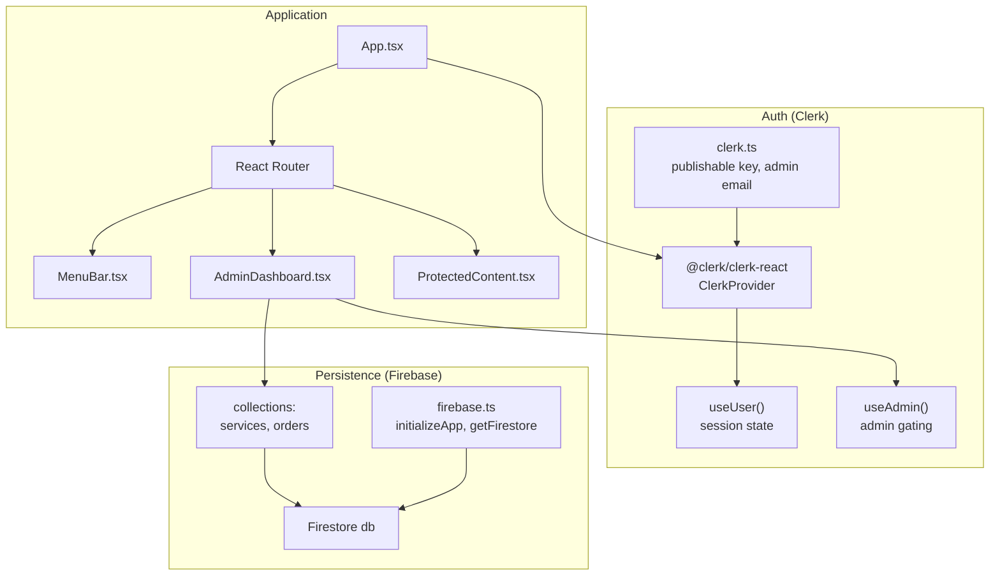
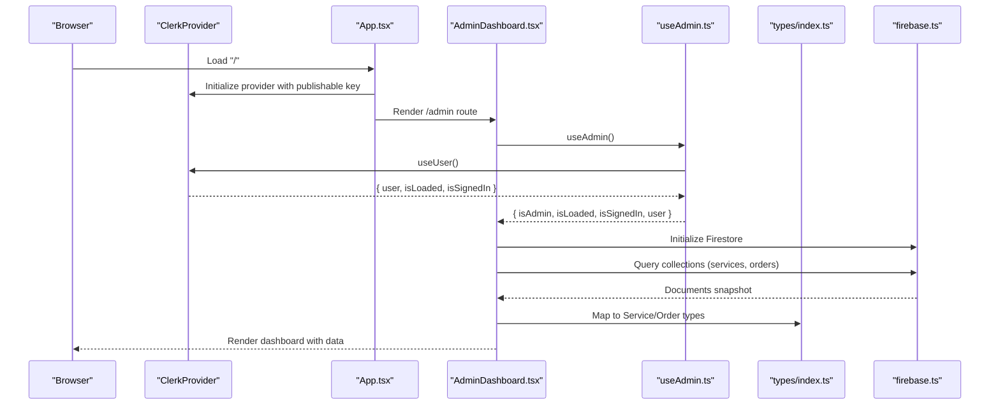
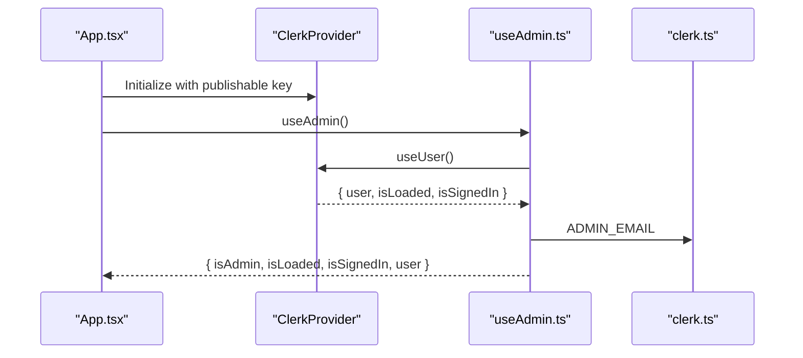
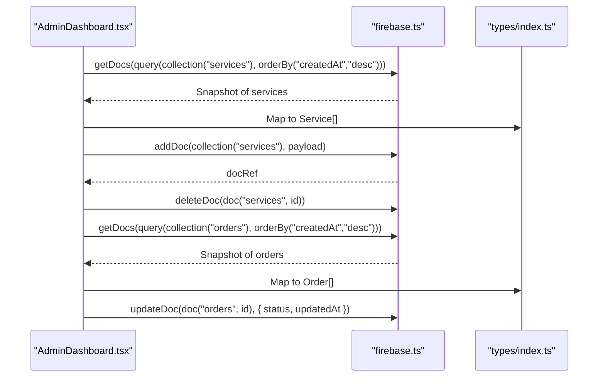
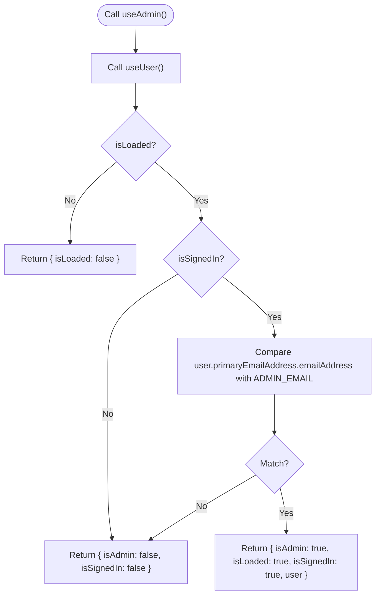
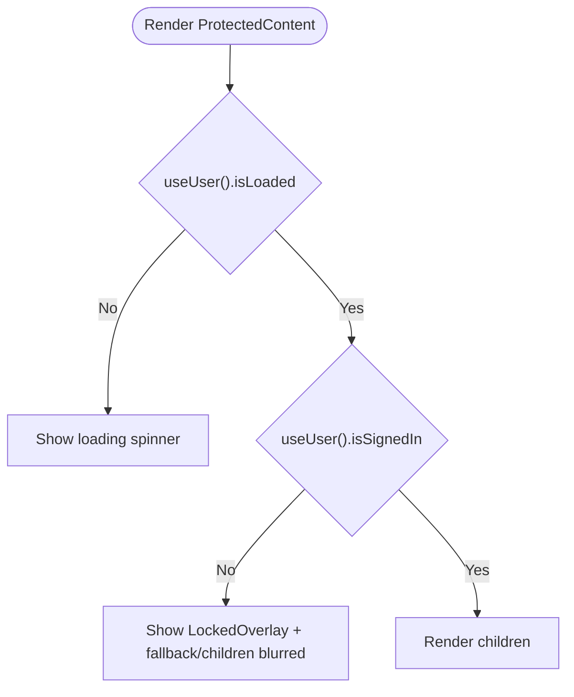
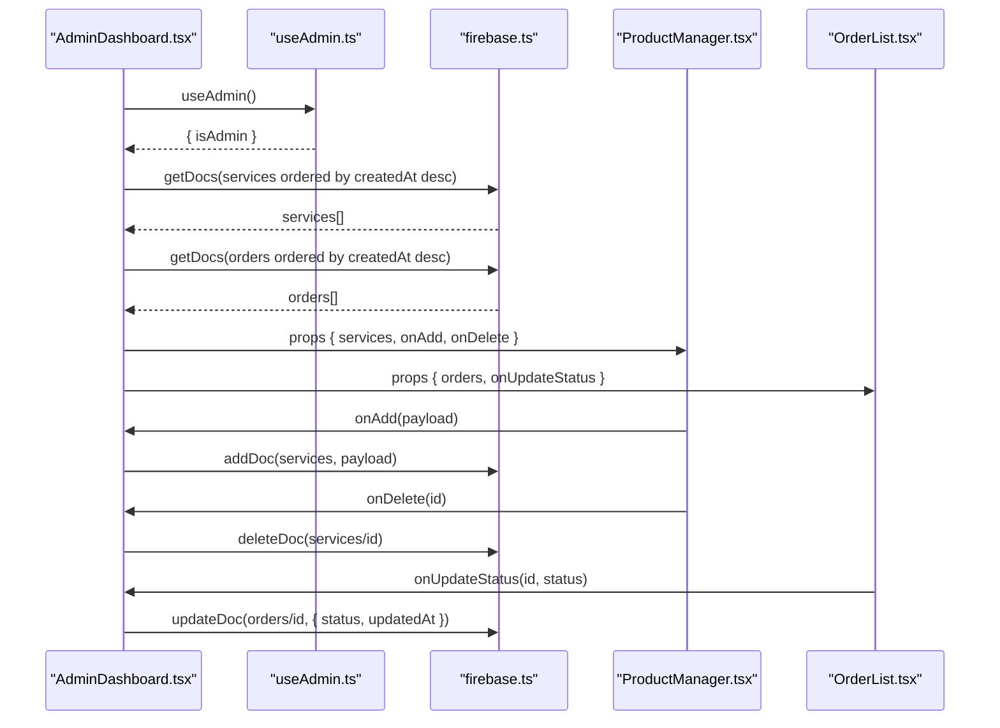
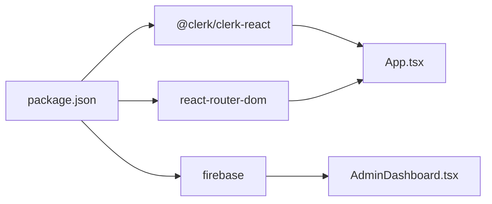

# API Reference

<cite>
**Referenced Files in This Document**
- [App.tsx](file://src/App.tsx)
- [clerk.ts](file://src/config/clerk.ts)
- [firebase.ts](file://src/config/firebase.ts)
- [useAdmin.ts](file://src/hooks/useAdmin.ts)
- [ProtectedContent.tsx](file://src/components/auth/ProtectedContent.tsx)
- [LockedOverlay.tsx](file://src/components/auth/LockedOverlay.tsx)
- [AdminDashboard.tsx](file://src/components/admin/AdminDashboard.tsx)
- [ProductManager.tsx](file://src/components/admin/ProductManager.tsx)
- [OrderList.tsx](file://src/components/admin/OrderList.tsx)
- [index.ts](file://src/types/index.ts)
- [package.json](file://package.json)
</cite>

## Table of Contents
1. [Introduction](#introduction)
2. [Project Structure](#project-structure)
3. [Core Components](#core-components)
4. [Architecture Overview](#architecture-overview)
5. [Detailed Component Analysis](#detailed-component-analysis)
6. [Dependency Analysis](#dependency-analysis)
7. [Performance Considerations](#performance-considerations)
8. [Troubleshooting Guide](#troubleshooting-guide)
9. [Conclusion](#conclusion)
10. [Appendices](#appendices)

## Introduction
This document provides a comprehensive API reference for DevForge’s external service integrations and internal APIs. It covers:
- Clerk Authentication API integration for user management, session handling, and role-based access control
- Firebase Firestore integration for collections, queries, and data modeling patterns
- Internal administrative APIs exposed via custom hooks and components
- Component prop interfaces, event handlers, and callback signatures
- Request/response schemas, error handling patterns, and authentication token management
- Practical examples, parameter validation, integration patterns, versioning, backward compatibility, and troubleshooting

## Project Structure
DevForge integrates Clerk for authentication and Firebase for persistence. The application bootstraps Clerk globally and routes users to protected areas. Administrative features are gated behind a custom hook that checks admin credentials.

**Diagram sources**
- [App.tsx:1-67](file://src/App.tsx#L1-L67)
- [clerk.ts:1-4](file://src/config/clerk.ts#L1-L4)
- [firebase.ts:1-19](file://src/config/firebase.ts#L1-L19)
- [useAdmin.ts:1-14](file://src/hooks/useAdmin.ts#L1-L14)
- [ProtectedContent.tsx:1-44](file://src/components/auth/ProtectedContent.tsx#L1-L44)
- [AdminDashboard.tsx:1-186](file://src/components/admin/AdminDashboard.tsx#L1-L186)

**Section sources**
- [App.tsx:1-67](file://src/App.tsx#L1-L67)
- [clerk.ts:1-4](file://src/config/clerk.ts#L1-L4)
- [firebase.ts:1-19](file://src/config/firebase.ts#L1-L19)
- [useAdmin.ts:1-14](file://src/hooks/useAdmin.ts#L1-L14)
- [ProtectedContent.tsx:1-44](file://src/components/auth/ProtectedContent.tsx#L1-L44)
- [AdminDashboard.tsx:1-186](file://src/components/admin/AdminDashboard.tsx#L1-L186)

## Core Components
- Clerk Provider and routing bootstrap
- Protected content wrapper and locked overlay
- Admin dashboard with tabs for products and orders
- Product manager form and order list controls
- Types for services and orders

**Section sources**
- [App.tsx:1-67](file://src/App.tsx#L1-L67)
- [ProtectedContent.tsx:1-44](file://src/components/auth/ProtectedContent.tsx#L1-L44)
- [LockedOverlay.tsx:1-61](file://src/components/auth/LockedOverlay.tsx#L1-L61)
- [AdminDashboard.tsx:1-186](file://src/components/admin/AdminDashboard.tsx#L1-L186)
- [ProductManager.tsx:1-221](file://src/components/admin/ProductManager.tsx#L1-L221)
- [OrderList.tsx:1-91](file://src/components/admin/OrderList.tsx#L1-L91)
- [index.ts:1-40](file://src/types/index.ts#L1-L40)

## Architecture Overview
The system orchestrates Clerk-managed sessions and Firebase-managed data. Clerk handles authentication state and admin checks, while Firebase Firestore stores services and orders. The admin dashboard coordinates CRUD operations and status updates.

**Diagram sources**
- [App.tsx:1-67](file://src/App.tsx#L1-L67)
- [useAdmin.ts:1-14](file://src/hooks/useAdmin.ts#L1-L14)
- [AdminDashboard.tsx:1-186](file://src/components/admin/AdminDashboard.tsx#L1-L186)
- [firebase.ts:1-19](file://src/config/firebase.ts#L1-L19)
- [index.ts:1-40](file://src/types/index.ts#L1-L40)

## Detailed Component Analysis

### Clerk Authentication API
Clerk is configured at the application root and exposes session state and navigation helpers. Admin access is determined by comparing the signed-in user’s primary email address against a configured admin email.

- Configuration
  - Publishable key loaded from environment
  - Admin email loaded from environment
- Session handling
  - useUser() provides isLoaded, isSignedIn, and user metadata
  - Router helpers routerPush/routerReplace integrate with React Router
- Role-based access control
  - useAdmin() computes isAdmin based on loaded session and email match

**Diagram sources**
- [App.tsx:1-67](file://src/App.tsx#L1-L67)
- [useAdmin.ts:1-14](file://src/hooks/useAdmin.ts#L1-L14)
- [clerk.ts:1-4](file://src/config/clerk.ts#L1-L4)

**Section sources**
- [App.tsx:1-67](file://src/App.tsx#L1-L67)
- [clerk.ts:1-4](file://src/config/clerk.ts#L1-L4)
- [useAdmin.ts:1-14](file://src/hooks/useAdmin.ts#L1-L14)

### Firebase Firestore API Integration
Firestore is initialized from environment-backed configuration. The admin dashboard performs reads and writes to services and orders collections.

- Initialization
  - Environment variables supply Firebase config
  - Firestore and Storage instances exported
- Collections and operations
  - services: read (ordered by creation date), write (add, delete)
  - orders: read (ordered by creation date), write (update status)
- Data modeling
  - Service and Order types define field sets and enumerations

**Diagram sources**
- [AdminDashboard.tsx:1-186](file://src/components/admin/AdminDashboard.tsx#L1-L186)
- [firebase.ts:1-19](file://src/config/firebase.ts#L1-L19)
- [index.ts:1-40](file://src/types/index.ts#L1-L40)

**Section sources**
- [firebase.ts:1-19](file://src/config/firebase.ts#L1-L19)
- [AdminDashboard.tsx:1-186](file://src/components/admin/AdminDashboard.tsx#L1-L186)
- [index.ts:1-40](file://src/types/index.ts#L1-L40)

### Custom useAdmin Hook API
- Purpose: Provide admin gating based on Clerk session state and configured admin email
- Inputs: None (uses Clerk and environment)
- Outputs: { isAdmin, isLoaded, isSignedIn, user }

**Diagram sources**
- [useAdmin.ts:1-14](file://src/hooks/useAdmin.ts#L1-L14)
- [clerk.ts:1-4](file://src/config/clerk.ts#L1-L4)

**Section sources**
- [useAdmin.ts:1-14](file://src/hooks/useAdmin.ts#L1-L14)
- [clerk.ts:1-4](file://src/config/clerk.ts#L1-L4)

### Protected Content Wrapper
- Purpose: Gate access to content until Clerk reports a loaded, signed-in state; otherwise show a locked overlay
- Props:
  - children: ReactNode
  - fallback?: ReactNode
- Behavior:
  - While loading: spinner
  - Not signed in: locked overlay with navigation to sign-in
  - Signed in: render children

**Diagram sources**
- [ProtectedContent.tsx:1-44](file://src/components/auth/ProtectedContent.tsx#L1-L44)
- [LockedOverlay.tsx:1-61](file://src/components/auth/LockedOverlay.tsx#L1-L61)

**Section sources**
- [ProtectedContent.tsx:1-44](file://src/components/auth/ProtectedContent.tsx#L1-L44)
- [LockedOverlay.tsx:1-61](file://src/components/auth/LockedOverlay.tsx#L1-L61)

### Admin Dashboard API
- Tabs: products, orders
- Data loading: fetch services and orders on admin load
- Product management:
  - Add service: submit form payload mapped to Service
  - Delete service: delete by id
- Order management:
  - Update status: select new status to apply

**Diagram sources**
- [AdminDashboard.tsx:1-186](file://src/components/admin/AdminDashboard.tsx#L1-L186)
- [useAdmin.ts:1-14](file://src/hooks/useAdmin.ts#L1-L14)
- [ProductManager.tsx:1-221](file://src/components/admin/ProductManager.tsx#L1-L221)
- [OrderList.tsx:1-91](file://src/components/admin/OrderList.tsx#L1-L91)
- [firebase.ts:1-19](file://src/config/firebase.ts#L1-L19)

**Section sources**
- [AdminDashboard.tsx:1-186](file://src/components/admin/AdminDashboard.tsx#L1-L186)
- [ProductManager.tsx:1-221](file://src/components/admin/ProductManager.tsx#L1-L221)
- [OrderList.tsx:1-91](file://src/components/admin/OrderList.tsx#L1-L91)

### Component Prop Interfaces and Callbacks

- ProtectedContentProps
  - children: ReactNode
  - fallback?: ReactNode

- ProductManagerProps
  - services: Service[]
  - onAdd: (service: Omit<Service, 'id' | 'createdAt'>) => Promise<void>
  - onDelete: (id: string) => Promise<void>

- OrderListProps
  - orders: Order[]
  - onUpdateStatus: (id: string, status: Order['status']) => Promise<void>

- Service type fields
  - id: string
  - title: string
  - description: string
  - price: number
  - priceLabel: string
  - icon: string
  - category: 'digital' | 'local' | 'custom'
  - features: string[]
  - isActive: boolean
  - createdAt: Date

- Order type fields
  - id: string
  - serviceId: string
  - serviceTitle: string
  - userId: string
  - userEmail: string
  - userName: string
  - status: 'pending' | 'processing' | 'completed' | 'cancelled'
  - fileName?: string
  - fileType?: string
  - notes?: string
  - createdAt: Date
  - updatedAt: Date

**Section sources**
- [ProtectedContent.tsx:5-8](file://src/components/auth/ProtectedContent.tsx#L5-L8)
- [ProductManager.tsx:4-8](file://src/components/admin/ProductManager.tsx#L4-L8)
- [OrderList.tsx:3-6](file://src/components/admin/OrderList.tsx#L3-L6)
- [index.ts:1-40](file://src/types/index.ts#L1-L40)

### Request/Response Schemas and Validation

- Clerk Authentication
  - Inputs: publishable key (environment), router helpers (navigation)
  - Outputs: useUser() returns { user, isLoaded, isSignedIn }
  - Admin gating: compare user.primaryEmailAddress.emailAddress with ADMIN_EMAIL

- Firestore Operations
  - Services
    - Read: query(collection("services"), orderBy("createdAt","desc"))
    - Write: addDoc(collection("services"), payload with createdAt)
    - Delete: deleteDoc(doc("services", id))
  - Orders
    - Read: query(collection("orders"), orderBy("createdAt","desc"))
    - Update: updateDoc(doc("orders", id), { status, updatedAt })

- Parameter Validation
  - Service form: required fields validated via HTML5 required attributes
  - Feature list: newline-separated entries converted to array
  - Status selection: enum options constrained to predefined values

**Section sources**
- [clerk.ts:1-4](file://src/config/clerk.ts#L1-L4)
- [useAdmin.ts:1-14](file://src/hooks/useAdmin.ts#L1-L14)
- [AdminDashboard.tsx:25-72](file://src/components/admin/AdminDashboard.tsx#L25-L72)
- [ProductManager.tsx:35-52](file://src/components/admin/ProductManager.tsx#L35-L52)
- [OrderList.tsx:66-85](file://src/components/admin/OrderList.tsx#L66-L85)

### Integration Patterns
- Global Clerk initialization with router integration
- Admin-only rendering guarded by useAdmin hook
- Protected content rendering with LockedOverlay fallback
- Firestore CRUD operations coordinated in AdminDashboard and delegated to child components

**Section sources**
- [App.tsx:26-58](file://src/App.tsx#L26-L58)
- [useAdmin.ts:1-14](file://src/hooks/useAdmin.ts#L1-L14)
- [ProtectedContent.tsx:10-43](file://src/components/auth/ProtectedContent.tsx#L10-L43)
- [AdminDashboard.tsx:18-185](file://src/components/admin/AdminDashboard.tsx#L18-L185)

## Dependency Analysis
External dependencies and their roles:
- @clerk/clerk-react: Provides ClerkProvider, useUser, and admin gating
- firebase: Provides Firestore and Storage clients
- react-router-dom: Routing and navigation helpers

**Diagram sources**
- [package.json:12-18](file://package.json#L12-L18)
- [App.tsx:1-67](file://src/App.tsx#L1-L67)
- [AdminDashboard.tsx:1-186](file://src/components/admin/AdminDashboard.tsx#L1-L186)

**Section sources**
- [package.json:12-18](file://package.json#L12-L18)
- [App.tsx:1-67](file://src/App.tsx#L1-L67)

## Performance Considerations
- Firestore queries use ordering by creation timestamps to optimize UI refreshes
- Batch operations should be considered for frequent updates to reduce network overhead
- Client-side caching of small datasets can improve perceived performance
- Debounce or throttle rapid UI updates to minimize re-renders

## Troubleshooting Guide
- Clerk not initializing
  - Verify publishable key environment variable is set
  - Confirm ClerkProvider wraps the application routes
- Admin access denied
  - Ensure ADMIN_EMAIL matches the signed-in user’s primary email
  - Check that useUser() reports isLoaded and isSignedIn
- Firestore errors
  - Confirm Firestore rules permit read/write for authenticated users
  - Validate collection names and document IDs
- Protected content not rendering
  - Ensure useUser() is called within ClerkProvider
  - Check fallback rendering and LockedOverlay behavior

**Section sources**
- [clerk.ts:1-4](file://src/config/clerk.ts#L1-L4)
- [useAdmin.ts:1-14](file://src/hooks/useAdmin.ts#L1-L14)
- [ProtectedContent.tsx:10-43](file://src/components/auth/ProtectedContent.tsx#L10-L43)
- [AdminDashboard.tsx:74-110](file://src/components/admin/AdminDashboard.tsx#L74-L110)

## Conclusion
DevForge integrates Clerk for robust authentication and admin gating, and Firebase Firestore for data operations. The useAdmin hook centralizes role checks, while ProtectedContent ensures appropriate UX during authentication transitions. The admin dashboard demonstrates practical CRUD patterns and status updates, with clear separation of concerns across components and configuration modules.

## Appendices

### API Versioning and Backward Compatibility
- Clerk SDK versions are managed via package.json; upgrade with caution and test session state behavior
- Firestore client versions are managed via package.json; verify breaking changes in major releases
- Maintain stable prop interfaces for components to preserve compatibility

### Migration Guides
- Clerk
  - Review router helpers (routerPush/routerReplace) after SDK upgrades
  - Validate useUser() shape and availability of primaryEmailAddress
- Firebase
  - Update import paths if modular SDK evolves
  - Adjust query syntax if orderBy or collection APIs change

### Rate Limiting and Error Codes
- Clerk
  - Exceeding Clerk API quotas may cause session retrieval delays; implement retry with exponential backoff
- Firestore
  - Read/write limits depend on project configuration; implement optimistic UI with conflict resolution
  - Catch and log Firestore errors for visibility; surface user-friendly messages