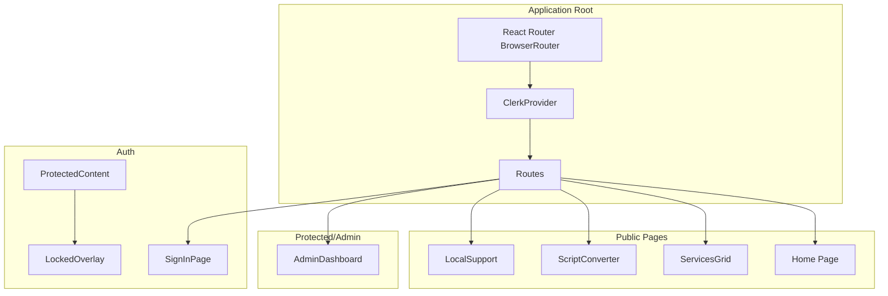
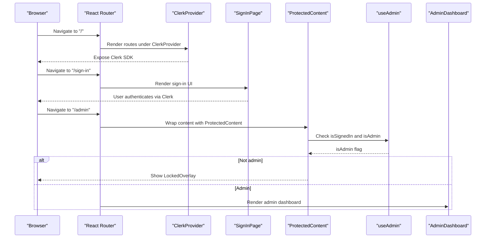
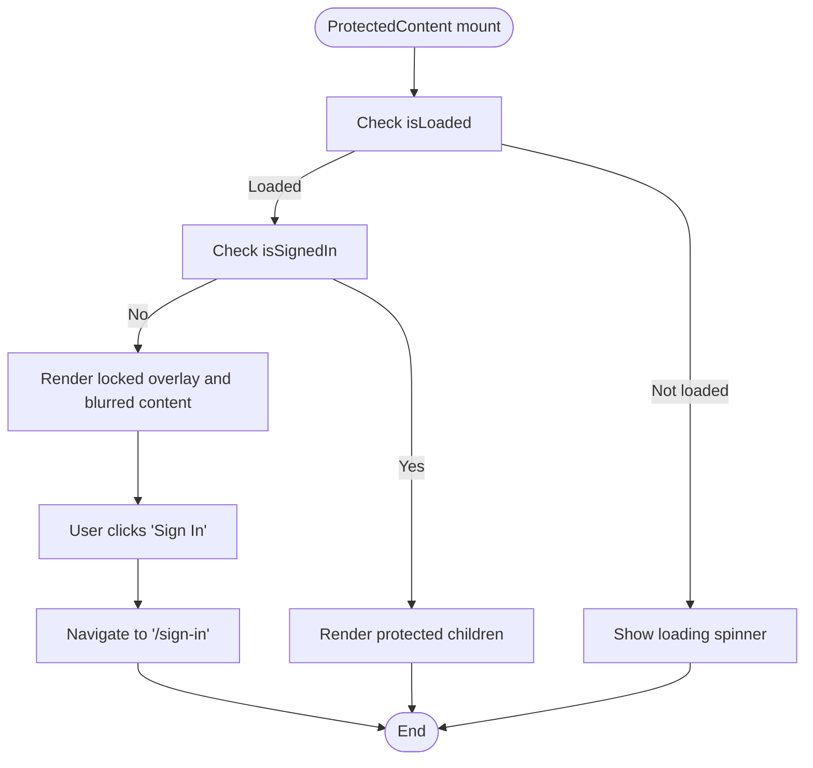
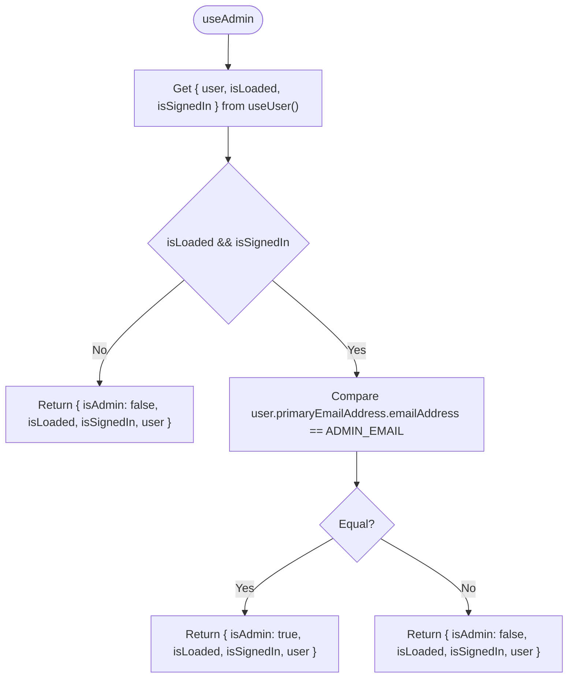
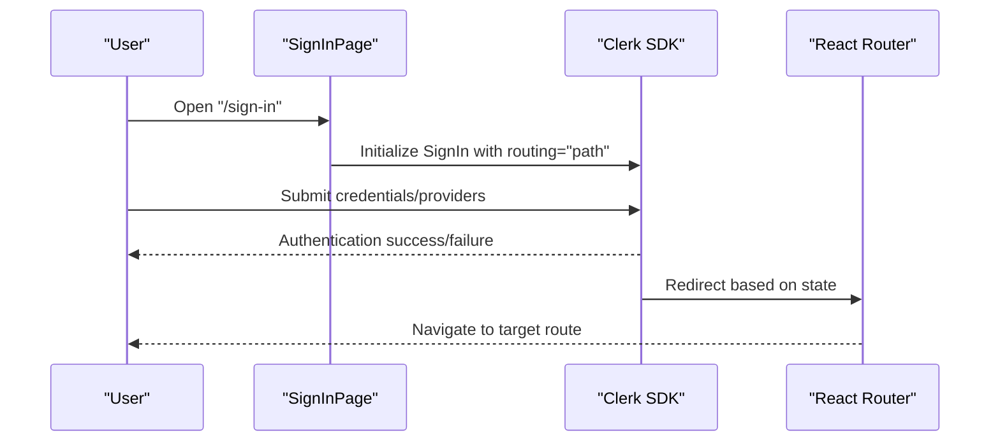
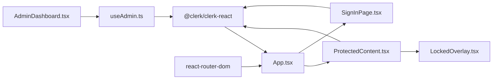

# Clerk Authentication API

<cite>
**Referenced Files in This Document**
- [App.tsx](file://src/App.tsx)
- [clerk.ts](file://src/config/clerk.ts)
- [useAdmin.ts](file://src/hooks/useAdmin.ts)
- [ProtectedContent.tsx](file://src/components/auth/ProtectedContent.tsx)
- [LockedOverlay.tsx](file://src/components/auth/LockedOverlay.tsx)
- [SignInPage.tsx](file://src/components/auth/SignInPage.tsx)
- [AdminDashboard.tsx](file://src/components/admin/AdminDashboard.tsx)
- [package.json](file://package.json)
- [vite.config.ts](file://vite.config.ts)
</cite>

## Table of Contents
1. [Introduction](#introduction)
2. [Project Structure](#project-structure)
3. [Core Components](#core-components)
4. [Architecture Overview](#architecture-overview)
5. [Detailed Component Analysis](#detailed-component-analysis)
6. [Dependency Analysis](#dependency-analysis)
7. [Performance Considerations](#performance-considerations)
8. [Troubleshooting Guide](#troubleshooting-guide)
9. [Conclusion](#conclusion)

## Introduction
This document provides comprehensive API documentation for Clerk Authentication integration in DevForge. It covers ClerkProvider setup, authentication state management, user session handling, environment configuration, admin email management, and the useAdmin hook for role-based access control. It also documents protected content rendering, sign-in/sign-up flows, session persistence, and token handling via Clerk’s SDK. Practical examples include authentication guards, protected content rendering, and user profile management. Finally, it includes troubleshooting guidance and production security considerations.

## Project Structure
The Clerk integration is centered around a single provider wrapper that initializes Clerk for the entire application, along with supporting hooks and components for authentication guards and admin-only access.

**Diagram sources**
- [App.tsx:26-58](file://src/App.tsx#L26-L58)
- [ProtectedContent.tsx:10-43](file://src/components/auth/ProtectedContent.tsx#L10-L43)
- [LockedOverlay.tsx:3-60](file://src/components/auth/LockedOverlay.tsx#L3-L60)
- [SignInPage.tsx:4-251](file://src/components/auth/SignInPage.tsx#L4-L251)

**Section sources**
- [App.tsx:1-67](file://src/App.tsx#L1-L67)
- [vite.config.ts:1-22](file://vite.config.ts#L1-L22)

## Core Components
- ClerkProvider initialization and routing integration
- Environment configuration for publishable key and admin email
- Authentication state guard for protected content
- Admin role checker using primary email address
- Clerk sign-in page with custom appearance

**Section sources**
- [App.tsx:26-58](file://src/App.tsx#L26-L58)
- [clerk.ts:1-4](file://src/config/clerk.ts#L1-L4)
- [ProtectedContent.tsx:10-43](file://src/components/auth/ProtectedContent.tsx#L10-L43)
- [useAdmin.ts:4-13](file://src/hooks/useAdmin.ts#L4-L13)
- [SignInPage.tsx:157-221](file://src/components/auth/SignInPage.tsx#L157-L221)

## Architecture Overview
ClerkProvider wraps the application and exposes Clerk’s SDK to all routes. The provider is configured with the publishable key and custom navigation callbacks to integrate with React Router. Public routes render without authentication requirements, while protected routes and admin-only routes gate access based on authentication and admin status.

**Diagram sources**
- [App.tsx:26-58](file://src/App.tsx#L26-L58)
- [SignInPage.tsx:157-221](file://src/components/auth/SignInPage.tsx#L157-L221)
- [ProtectedContent.tsx:10-43](file://src/components/auth/ProtectedContent.tsx#L10-L43)
- [useAdmin.ts:4-13](file://src/hooks/useAdmin.ts#L4-L13)
- [AdminDashboard.tsx:18-44](file://src/components/admin/AdminDashboard.tsx#L18-L44)

## Detailed Component Analysis

### ClerkProvider Setup
- Initializes Clerk with the publishable key from environment variables.
- Integrates with React Router by providing routerPush and routerReplace callbacks.
- Wraps all routes so Clerk SDK is globally available.

Implementation highlights:
- Publishable key injection from environment configuration.
- Navigation callbacks for seamless client-side routing.

**Section sources**
- [App.tsx:26-58](file://src/App.tsx#L26-L58)
- [clerk.ts:1](file://src/config/clerk.ts#L1)

### Environment Variables and Configuration
- Publishable key: VITE_CLERK_PUBLISHABLE_KEY
- Admin email: VITE_ADMIN_EMAIL (defaults to a placeholder if unset)
- WhatsApp number: VITE_WHATSAPP_NUMBER (used for support/contact)

Environment handling:
- ClerkProvider reads the publishable key from import.meta.env.
- Admin email is imported and used by the useAdmin hook.

**Section sources**
- [clerk.ts:1-4](file://src/config/clerk.ts#L1-L4)
- [vite.config.ts:1-22](file://vite.config.ts#L1-L22)

### Authentication State Management
- useUser from @clerk/clerk-react provides isLoaded, isSignedIn, and user.
- ProtectedContent uses these signals to either render children or overlay a lock screen.
- LockedOverlay navigates to the sign-in route when clicked.

**Diagram sources**
- [ProtectedContent.tsx:10-43](file://src/components/auth/ProtectedContent.tsx#L10-L43)
- [LockedOverlay.tsx:3-60](file://src/components/auth/LockedOverlay.tsx#L3-L60)

**Section sources**
- [ProtectedContent.tsx:10-43](file://src/components/auth/ProtectedContent.tsx#L10-L43)
- [LockedOverlay.tsx:3-60](file://src/components/auth/LockedOverlay.tsx#L3-L60)

### Admin Role-Based Access Control
- useAdmin composes useUser and compares the authenticated user’s primary email against the configured admin email.
- Returns isAdmin, isLoaded, isSignedIn, and user for downstream components.

**Diagram sources**
- [useAdmin.ts:4-13](file://src/hooks/useAdmin.ts#L4-L13)
- [clerk.ts:2](file://src/config/clerk.ts#L2)

**Section sources**
- [useAdmin.ts:4-13](file://src/hooks/useAdmin.ts#L4-L13)
- [clerk.ts:2](file://src/config/clerk.ts#L2)

### Protected Route Implementation
- AdminDashboard conditionally loads data only when isAdmin is true.
- This pattern ensures admin-only routes remain protected even if navigation bypasses UI guards.

**Section sources**
- [AdminDashboard.tsx:18-44](file://src/components/admin/AdminDashboard.tsx#L18-L44)

### Clerk Sign-In/Sign-Up Flow
- SignInPage renders Clerk’s SignIn component with routing="path" and a custom path "/sign-in".
- Appearance customization is applied for dark theme and brand colors.
- After successful sign-in, Clerk updates authentication state and redirects accordingly.

**Diagram sources**
- [SignInPage.tsx:157-221](file://src/components/auth/SignInPage.tsx#L157-L221)
- [App.tsx:37-37](file://src/App.tsx#L37-L37)

**Section sources**
- [SignInPage.tsx:157-221](file://src/components/auth/SignInPage.tsx#L157-L221)
- [App.tsx:37-37](file://src/App.tsx#L37-L37)

### Session Persistence and Token Handling
- Clerk manages session persistence and tokens internally.
- The application relies on Clerk’s SDK to keep authentication state synchronized across components.
- ProtectedContent and useAdmin depend on Clerk’s isLoaded and isSignedIn flags.

**Section sources**
- [ProtectedContent.tsx:10-43](file://src/components/auth/ProtectedContent.tsx#L10-L43)
- [useAdmin.ts:4-13](file://src/hooks/useAdmin.ts#L4-L13)

### User Profile Management
- The authenticated user object is exposed via useUser and includes primary email address used for admin checks.
- Additional user attributes can be accessed through the returned user object for profile rendering and management.

**Section sources**
- [useAdmin.ts:4-13](file://src/hooks/useAdmin.ts#L4-L13)

### Practical Examples

- Authentication Guards
  - Use ProtectedContent to wrap sensitive content. It shows a lock overlay and navigates to the sign-in route when the user is not authenticated.
  - Reference: [ProtectedContent.tsx:10-43](file://src/components/auth/ProtectedContent.tsx#L10-L43), [LockedOverlay.tsx:3-60](file://src/components/auth/LockedOverlay.tsx#L3-L60)

- Protected Content Rendering
  - Render children only when the user is signed in; otherwise show a loading state until Clerk confirms authentication status.
  - Reference: [ProtectedContent.tsx:10-43](file://src/components/auth/ProtectedContent.tsx#L10-L43)

- Admin-Only Access
  - Use useAdmin to gate admin routes. AdminDashboard conditionally loads data only when isAdmin is true.
  - References: [useAdmin.ts:4-13](file://src/hooks/useAdmin.ts#L4-L13), [AdminDashboard.tsx:18-44](file://src/components/admin/AdminDashboard.tsx#L18-L44)

- User Profile Management
  - Access user data from useUser for displaying profile information and performing admin checks.
  - Reference: [useAdmin.ts:4-13](file://src/hooks/useAdmin.ts#L4-L13)

## Dependency Analysis
- Clerk SDK: @clerk/clerk-react is used for provider setup, sign-in UI, and authentication state.
- React Router: Used for routing and navigation integration with Clerk.
- Environment variables: Vite’s import.meta.env exposes runtime configuration.

**Diagram sources**
- [package.json:12-17](file://package.json#L12-L17)
- [App.tsx:1-12](file://src/App.tsx#L1-L12)
- [ProtectedContent.tsx:1-3](file://src/components/auth/ProtectedContent.tsx#L1-L3)
- [LockedOverlay.tsx:1](file://src/components/auth/LockedOverlay.tsx#L1)
- [SignInPage.tsx:1](file://src/components/auth/SignInPage.tsx#L1)
- [useAdmin.ts:1](file://src/hooks/useAdmin.ts#L1)
- [AdminDashboard.tsx:1-16](file://src/components/admin/AdminDashboard.tsx#L1-L16)

**Section sources**
- [package.json:12-17](file://package.json#L12-L17)
- [App.tsx:1-12](file://src/App.tsx#L1-L12)

## Performance Considerations
- Keep authentication checks lightweight by relying on Clerk’s isLoaded and isSignedIn flags.
- Avoid unnecessary re-renders by memoizing derived values from useUser and useAdmin.
- Use Suspense-like patterns (loading overlays) to prevent blocking UI during authentication resolution.
- Minimize heavy computations inside admin-only routes until isAdmin is confirmed.

## Troubleshooting Guide
Common issues and resolutions:
- Publishable key not set
  - Symptom: Authentication does not initialize.
  - Resolution: Ensure VITE_CLERK_PUBLISHABLE_KEY is present in the environment.
  - Reference: [clerk.ts:1](file://src/config/clerk.ts#L1)

- Admin email mismatch
  - Symptom: Admin routes remain inaccessible.
  - Resolution: Verify VITE_ADMIN_EMAIL matches the authenticated user’s primary email address.
  - Reference: [clerk.ts:2](file://src/config/clerk.ts#L2), [useAdmin.ts:10](file://src/hooks/useAdmin.ts#L10)

- Sign-in page not rendering
  - Symptom: Navigating to /sign-in yields a blank page.
  - Resolution: Confirm ClerkProvider is wrapping the route and SignInPage is mounted at /sign-in.
  - References: [App.tsx:37-37](file://src/App.tsx#L37-L37), [SignInPage.tsx:4](file://src/components/auth/SignInPage.tsx#L4)

- Protected content not unlocking
  - Symptom: Lock overlay persists despite being signed in.
  - Resolution: Ensure ProtectedContent receives isSignedIn from useUser and that Clerk is initialized.
  - Reference: [ProtectedContent.tsx:10-43](file://src/components/auth/ProtectedContent.tsx#L10-L43)

- Navigation not updating after sign-in
  - Symptom: Stays on sign-in page after authentication.
  - Resolution: Verify routerPush/routerReplace callbacks are passed to ClerkProvider.
  - Reference: [App.tsx:30-34](file://src/App.tsx#L30-L34)

Security considerations for production:
- Use Clerk’s publishable key in client-side code; never expose the secret key.
- Enforce admin checks on both client and server sides for critical operations.
- Validate user roles server-side before granting access to sensitive data or APIs.
- Monitor and log authentication events for suspicious activity.
- Keep Clerk SDK updated to benefit from security patches.

## Conclusion
DevForge integrates Clerk authentication through a centralized ClerkProvider, robust environment configuration, and simple guard components. The useAdmin hook enables role-based access control using the primary email address, while ProtectedContent and LockedOverlay provide a seamless user experience for authentication flows. By following the outlined patterns and troubleshooting steps, teams can maintain secure, reliable authentication and admin access controls in production.