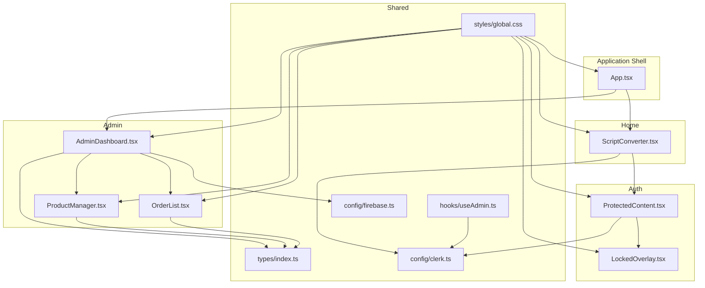
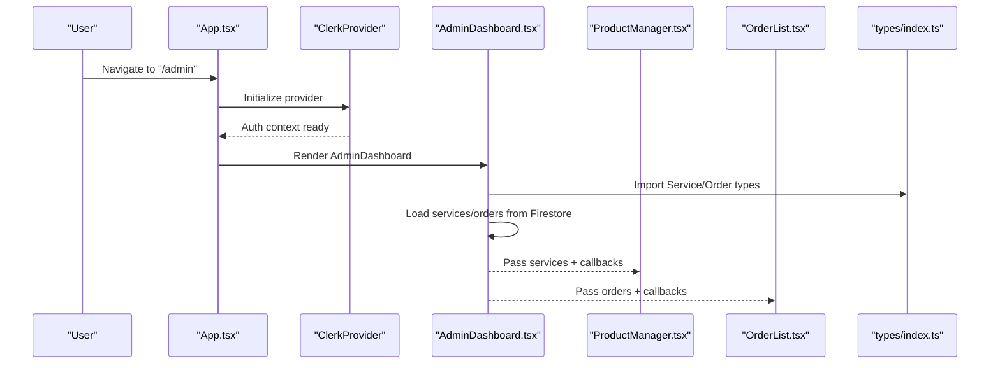
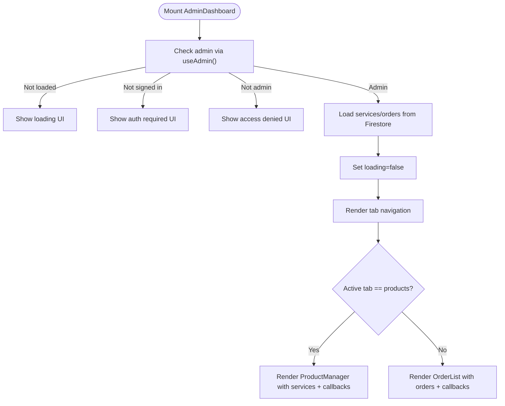
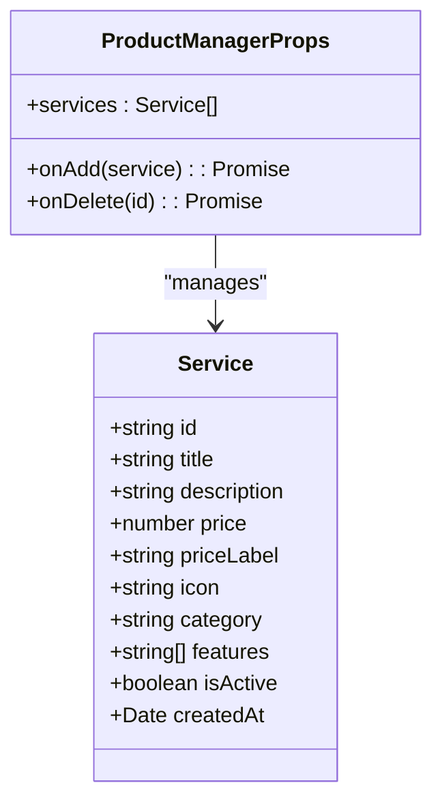
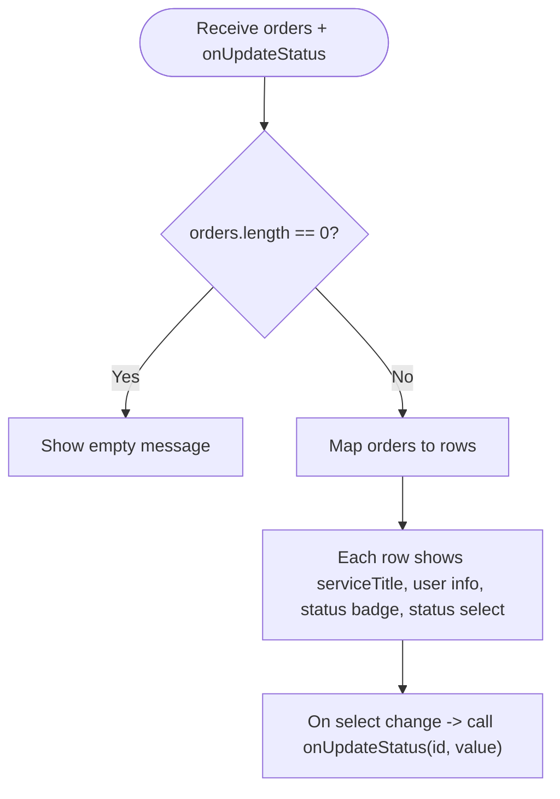
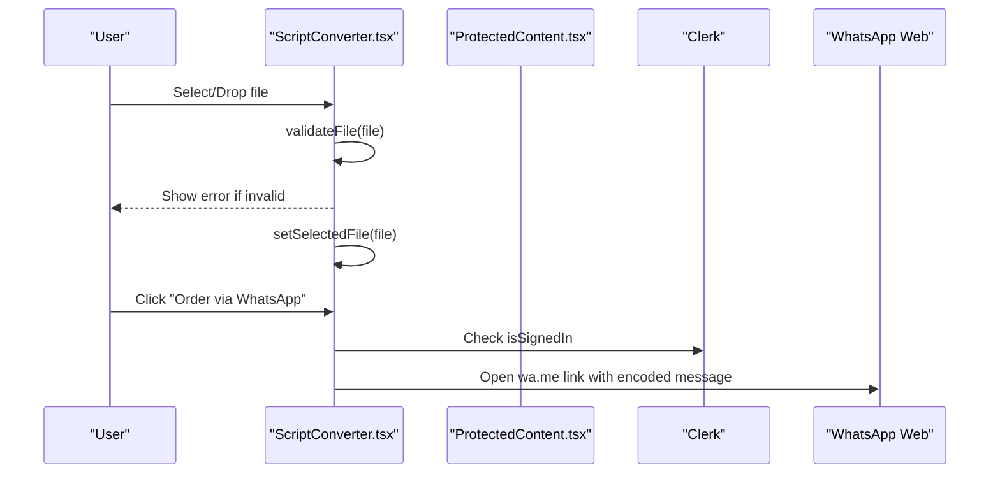
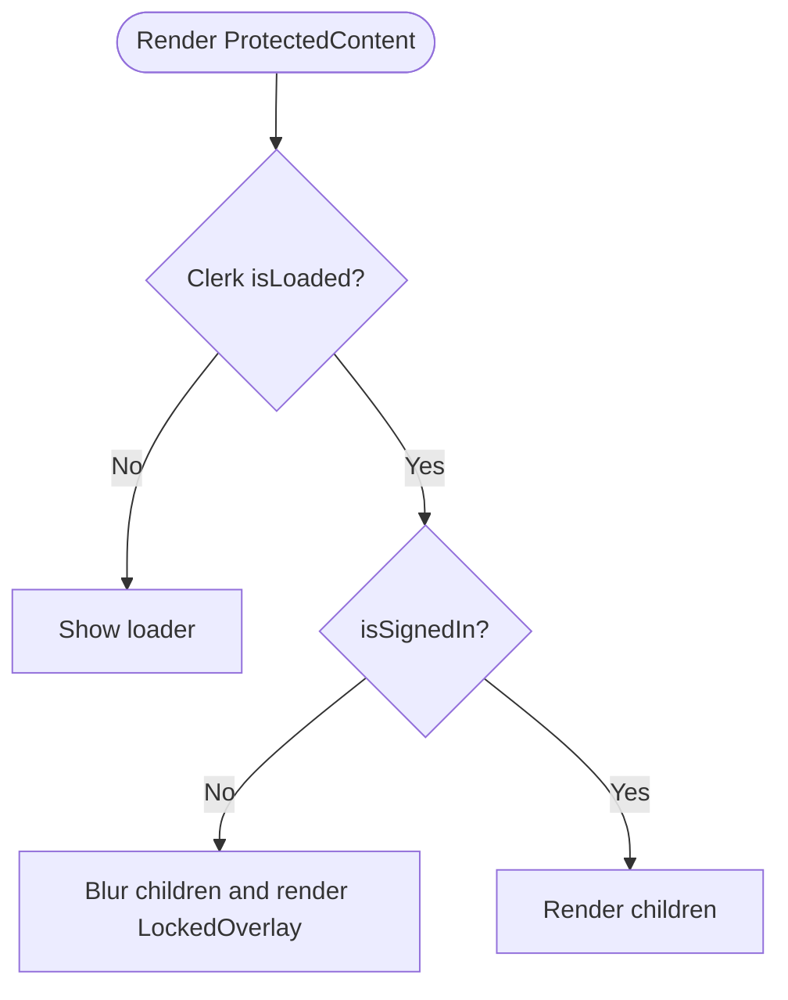
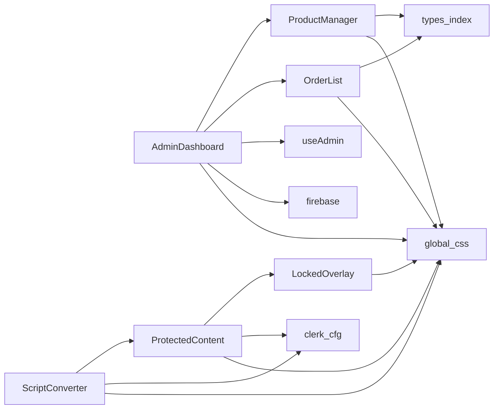

# Component APIs

<cite>
**Referenced Files in This Document**
- [AdminDashboard.tsx](file://src/components/admin/AdminDashboard.tsx)
- [ProductManager.tsx](file://src/components/admin/ProductManager.tsx)
- [OrderList.tsx](file://src/components/admin/OrderList.tsx)
- [ScriptConverter.tsx](file://src/components/home/ScriptConverter.tsx)
- [ProtectedContent.tsx](file://src/components/auth/ProtectedContent.tsx)
- [LockedOverlay.tsx](file://src/components/auth/LockedOverlay.tsx)
- [index.ts](file://src/types/index.ts)
- [useAdmin.ts](file://src/hooks/useAdmin.ts)
- [clerk.ts](file://src/config/clerk.ts)
- [firebase.ts](file://src/config/firebase.ts)
- [App.tsx](file://src/App.tsx)
- [global.css](file://src/styles/global.css)
</cite>

## Table of Contents
1. [Introduction](#introduction)
2. [Project Structure](#project-structure)
3. [Core Components](#core-components)
4. [Architecture Overview](#architecture-overview)
5. [Detailed Component Analysis](#detailed-component-analysis)
6. [Dependency Analysis](#dependency-analysis)
7. [Performance Considerations](#performance-considerations)
8. [Troubleshooting Guide](#troubleshooting-guide)
9. [Conclusion](#conclusion)
10. [Appendices](#appendices)

## Introduction
This document provides comprehensive component API documentation for DevForge’s React components focused on administration and user-facing services. It covers AdminDashboard, ProductManager, OrderList, ScriptConverter, and ProtectedContent. For each component, we detail props, TypeScript interfaces, lifecycle and event handling, composition patterns, styling APIs, responsive design, testing strategies, and troubleshooting guidance. The goal is to enable developers to integrate, extend, and maintain these components effectively while ensuring accessibility and performance.

## Project Structure
The components are organized by domain:
- Admin domain: AdminDashboard, ProductManager, OrderList
- Home domain: ScriptConverter and related services
- Auth domain: ProtectedContent and LockedOverlay
- Shared types and hooks: types/index.ts, hooks/useAdmin.ts
- Configuration: config/clerk.ts, config/firebase.ts
- Application shell: App.tsx
- Styling: styles/global.css (Tailwind CSS integration and custom CSS variables/utilities)

**Diagram sources**
- [App.tsx:14-67](file://src/App.tsx#L14-L67)
- [AdminDashboard.tsx:18-186](file://src/components/admin/AdminDashboard.tsx#L18-L186)
- [ProductManager.tsx:22-221](file://src/components/admin/ProductManager.tsx#L22-L221)
- [OrderList.tsx:15-91](file://src/components/admin/OrderList.tsx#L15-L91)
- [ScriptConverter.tsx:9-188](file://src/components/home/ScriptConverter.tsx#L9-L188)
- [ProtectedContent.tsx:10-44](file://src/components/auth/ProtectedContent.tsx#L10-L44)
- [LockedOverlay.tsx:3-61](file://src/components/auth/LockedOverlay.tsx#L3-L61)
- [index.ts:1-40](file://src/types/index.ts#L1-L40)
- [useAdmin.ts:4-14](file://src/hooks/useAdmin.ts#L4-L14)
- [clerk.ts:1-4](file://src/config/clerk.ts#L1-L4)
- [firebase.ts:1-19](file://src/config/firebase.ts#L1-L19)
- [global.css:1-383](file://src/styles/global.css#L1-L383)

**Section sources**
- [App.tsx:14-67](file://src/App.tsx#L14-L67)
- [global.css:1-383](file://src/styles/global.css#L1-L383)

## Core Components
This section summarizes the primary components and their roles:
- AdminDashboard: Orchestrates admin tabs, loads services/orders from Firestore, and delegates actions to child components.
- ProductManager: Manages product creation and deletion via a form and list UI.
- OrderList: Displays orders and updates statuses via a dropdown selector.
- ScriptConverter: Handles file upload (drag-and-drop or click), validates file types/sizes, and initiates WhatsApp ordering.
- ProtectedContent: Guards child content with authentication checks and overlays a locked UI when unauthenticated.

**Section sources**
- [AdminDashboard.tsx:18-186](file://src/components/admin/AdminDashboard.tsx#L18-L186)
- [ProductManager.tsx:22-221](file://src/components/admin/ProductManager.tsx#L22-L221)
- [OrderList.tsx:15-91](file://src/components/admin/OrderList.tsx#L15-L91)
- [ScriptConverter.tsx:9-188](file://src/components/home/ScriptConverter.tsx#L9-L188)
- [ProtectedContent.tsx:10-44](file://src/components/auth/ProtectedContent.tsx#L10-L44)

## Architecture Overview
The admin and home features are integrated under a Clerk-protected routing layer. AdminDashboard fetches data from Firestore and passes typed props to child components. ScriptConverter integrates Clerk user state and opens external WhatsApp links. ProtectedContent wraps sensitive content and renders LockedOverlay when needed.

**Diagram sources**
- [App.tsx:26-58](file://src/App.tsx#L26-L58)
- [AdminDashboard.tsx:25-52](file://src/components/admin/AdminDashboard.tsx#L25-L52)
- [ProductManager.tsx:4-8](file://src/components/admin/ProductManager.tsx#L4-L8)
- [OrderList.tsx:3-6](file://src/components/admin/OrderList.tsx#L3-L6)
- [index.ts:1-40](file://src/types/index.ts#L1-L40)

## Detailed Component Analysis

### AdminDashboard
- Purpose: Admin portal to manage services/products and orders.
- Props: None (owns state and data).
- State and lifecycle:
  - Uses Clerk-based admin detection via useAdmin hook.
  - Loads services and orders on mount when admin is verified.
  - Handles loading states and guards unauthorized access.
- Callbacks:
  - handleAddService: Adds a new service to Firestore and updates local state.
  - handleDeleteService: Deletes a service and updates local state.
  - handleUpdateOrder: Updates order status and timestamps in Firestore and state.
- Composition:
  - Renders tabs for products and orders.
  - Delegates rendering to ProductManager and OrderList.
- Styling:
  - Uses CSS variables and glass panel utilities from global.css.
  - Responsive layout with max widths and centered content.
- Accessibility:
  - Uses semantic headings and labels; focusable buttons.
- Error handling:
  - Catches Firestore errors during load/update and logs to console.

**Diagram sources**
- [AdminDashboard.tsx:18-186](file://src/components/admin/AdminDashboard.tsx#L18-L186)
- [useAdmin.ts:4-14](file://src/hooks/useAdmin.ts#L4-L14)

**Section sources**
- [AdminDashboard.tsx:18-186](file://src/components/admin/AdminDashboard.tsx#L18-L186)
- [useAdmin.ts:4-14](file://src/hooks/useAdmin.ts#L4-L14)
- [firebase.ts:1-19](file://src/config/firebase.ts#L1-L19)
- [global.css:92-116](file://src/styles/global.css#L92-L116)

### ProductManager
- Purpose: CRUD-like management for services/products.
- Props:
  - services: Service[]
  - onAdd: (service: Omit<Service, 'id' | 'createdAt'>) => Promise<void>
  - onDelete: (id: string) => Promise<void>
- State:
  - showForm: toggles form visibility.
  - formData: Tracks form inputs for creating a new service.
- Events:
  - Form submission triggers onAdd with normalized features (split by newline).
  - Delete button triggers onDelete with the selected service id.
- Composition:
  - Conditionally renders a form and a list of services.
  - Uses CSS variables and glass panels for styling.
- Validation:
  - Feature list is split into array items on submit.
- Styling:
  - Grid layout for form; consistent typography and spacing via CSS variables.

**Diagram sources**
- [ProductManager.tsx:4-8](file://src/components/admin/ProductManager.tsx#L4-L8)
- [index.ts:1-12](file://src/types/index.ts#L1-L12)

**Section sources**
- [ProductManager.tsx:22-221](file://src/components/admin/ProductManager.tsx#L22-L221)
- [index.ts:1-12](file://src/types/index.ts#L1-L12)
- [global.css:92-116](file://src/styles/global.css#L92-L116)

### OrderList
- Purpose: Displays customer orders and allows status updates.
- Props:
  - orders: Order[]
  - onUpdateStatus: (id: string, status: Order['status']) => Promise<void>
- Behavior:
  - Renders a list of orders with status badges and a select dropdown.
  - Status badge color mapping is defined via a lookup table.
- Styling:
  - Grid layout for each order row; consistent color tokens and borders.

**Diagram sources**
- [OrderList.tsx:15-91](file://src/components/admin/OrderList.tsx#L15-L91)
- [index.ts:14-27](file://src/types/index.ts#L14-L27)

**Section sources**
- [OrderList.tsx:15-91](file://src/components/admin/OrderList.tsx#L15-L91)
- [index.ts:14-27](file://src/types/index.ts#L14-L27)
- [global.css:92-116](file://src/styles/global.css#L92-L116)

### ScriptConverter
- Purpose: Allows authenticated users to upload scripts and initiate WhatsApp orders.
- Props: None (owns state and interacts with Clerk).
- State and events:
  - selectedFile: currently selected File or null.
  - dragOver: tracks drag-and-drop hover state.
  - error: validation error message.
  - validateFile: checks extension and size.
  - handleFile: validates and sets selectedFile.
  - handleDrop: handles drag-and-drop events.
  - handleWhatsAppOrder: constructs a WhatsApp message and opens the link.
- Composition:
  - Wrapped by ProtectedContent to enforce authentication.
- Styling:
  - Uses upload zone styles and glass panels; responsive typography.

**Diagram sources**
- [ScriptConverter.tsx:9-188](file://src/components/home/ScriptConverter.tsx#L9-L188)
- [ProtectedContent.tsx:10-44](file://src/components/auth/ProtectedContent.tsx#L10-L44)
- [clerk.ts:1-4](file://src/config/clerk.ts#L1-L4)

**Section sources**
- [ScriptConverter.tsx:9-188](file://src/components/home/ScriptConverter.tsx#L9-L188)
- [ProtectedContent.tsx:10-44](file://src/components/auth/ProtectedContent.tsx#L10-L44)
- [clerk.ts:1-4](file://src/config/clerk.ts#L1-L4)
- [global.css:291-307](file://src/styles/global.css#L291-L307)

### ProtectedContent
- Purpose: Protects child content with authentication checks and displays LockedOverlay when unauthenticated.
- Props:
  - children: ReactNode
  - fallback?: ReactNode (optional)
- Behavior:
  - If Clerk is not loaded, shows a spinner.
  - If not signed in, blurs children and overlays LockedOverlay.
  - Otherwise, renders children.
- Composition:
  - Wraps ScriptConverter content to enforce access control.

**Diagram sources**
- [ProtectedContent.tsx:10-44](file://src/components/auth/ProtectedContent.tsx#L10-L44)
- [LockedOverlay.tsx:3-61](file://src/components/auth/LockedOverlay.tsx#L3-L61)

**Section sources**
- [ProtectedContent.tsx:10-44](file://src/components/auth/ProtectedContent.tsx#L10-L44)
- [LockedOverlay.tsx:3-61](file://src/components/auth/LockedOverlay.tsx#L3-L61)

## Dependency Analysis
- AdminDashboard depends on:
  - Clerk-based useAdmin hook for admin checks.
  - Firebase for Firestore queries and writes.
  - ProductManager and OrderList for rendering and actions.
- ProductManager depends on:
  - Service type for props and internal state.
  - onAdd/onDelete callbacks passed from parent.
- OrderList depends on:
  - Order type and onUpdateStatus callback.
- ScriptConverter depends on:
  - Clerk user state for authentication gating.
  - ProtectedContent for access control.
- ProtectedContent depends on:
  - Clerk user state and LockedOverlay for UI.
- Global styles define:
  - CSS variables, glass panels, buttons, animations, and responsive breakpoints.

**Diagram sources**
- [AdminDashboard.tsx:18-186](file://src/components/admin/AdminDashboard.tsx#L18-L186)
- [ProductManager.tsx:22-221](file://src/components/admin/ProductManager.tsx#L22-L221)
- [OrderList.tsx:15-91](file://src/components/admin/OrderList.tsx#L15-L91)
- [ScriptConverter.tsx:9-188](file://src/components/home/ScriptConverter.tsx#L9-L188)
- [ProtectedContent.tsx:10-44](file://src/components/auth/ProtectedContent.tsx#L10-L44)
- [LockedOverlay.tsx:3-61](file://src/components/auth/LockedOverlay.tsx#L3-L61)
- [useAdmin.ts:4-14](file://src/hooks/useAdmin.ts#L4-L14)
- [clerk.ts:1-4](file://src/config/clerk.ts#L1-L4)
- [firebase.ts:1-19](file://src/config/firebase.ts#L1-L19)
- [global.css:1-383](file://src/styles/global.css#L1-L383)

**Section sources**
- [index.ts:1-40](file://src/types/index.ts#L1-L40)
- [clerk.ts:1-4](file://src/config/clerk.ts#L1-L4)
- [firebase.ts:1-19](file://src/config/firebase.ts#L1-L19)
- [global.css:1-383](file://src/styles/global.css#L1-L383)

## Performance Considerations
- Memoization:
  - Use useMemo/useCallback for expensive computations and event handlers in ScriptConverter to avoid unnecessary re-renders.
- Data fetching:
  - AdminDashboard loads data once on mount; consider caching and optimistic updates for smoother UX.
- Rendering:
  - Keep lists virtualized for large datasets (orders/services).
- Styling:
  - Prefer CSS custom properties and utility classes for consistent performance; avoid excessive inline styles.
- Accessibility:
  - Ensure focus management and keyboard navigation for interactive controls (buttons, selects).
- Bundle size:
  - Lazy-load heavy routes/pages if needed; Clerk provider is initialized globally.

## Troubleshooting Guide
- Admin access denied:
  - Verify ADMIN_EMAIL environment variable and Clerk user primary email match.
- Firestore permission errors:
  - Confirm Firestore rules allow reads/writes for admin operations.
- Protected content not unlocking:
  - Ensure Clerk is properly initialized and user state is loaded.
- File upload issues:
  - Confirm allowed extensions and size limits; check browser drag-and-drop support.
- Styling inconsistencies:
  - Ensure global.css is imported and Tailwind utilities are available.

**Section sources**
- [useAdmin.ts:4-14](file://src/hooks/useAdmin.ts#L4-L14)
- [clerk.ts:1-4](file://src/config/clerk.ts#L1-L4)
- [firebase.ts:1-19](file://src/config/firebase.ts#L1-L19)
- [global.css:1-383](file://src/styles/global.css#L1-L383)

## Conclusion
These components form a cohesive admin and service experience with strong typing, authentication protection, and consistent styling. By adhering to the documented APIs, composition patterns, and best practices, teams can extend functionality reliably while maintaining performance and accessibility.

## Appendices

### Component APIs Reference

- AdminDashboard
  - Props: None
  - State: activeTab, services[], orders[], loading
  - Callbacks: handleAddService, handleDeleteService, handleUpdateOrder
  - Events: Tab switching, form submissions, order status changes
  - Styling: CSS variables, glass panels, responsive widths

- ProductManager
  - Props: services: Service[], onAdd, onDelete
  - State: showForm, formData
  - Events: Form submit, delete button click
  - Styling: grid form, glass panels

- OrderList
  - Props: orders: Order[], onUpdateStatus
  - Events: Select change
  - Styling: grid rows, status badges

- ScriptConverter
  - Props: None
  - State: selectedFile, dragOver, error
  - Events: File selection/drop, order button click
  - Styling: upload zone, glass panels

- ProtectedContent
  - Props: children: ReactNode, fallback?: ReactNode
  - Events: Navigation to sign-in on lock overlay action

**Section sources**
- [AdminDashboard.tsx:18-186](file://src/components/admin/AdminDashboard.tsx#L18-L186)
- [ProductManager.tsx:22-221](file://src/components/admin/ProductManager.tsx#L22-L221)
- [OrderList.tsx:15-91](file://src/components/admin/OrderList.tsx#L15-L91)
- [ScriptConverter.tsx:9-188](file://src/components/home/ScriptConverter.tsx#L9-L188)
- [ProtectedContent.tsx:10-44](file://src/components/auth/ProtectedContent.tsx#L10-L44)

### TypeScript Definitions
- Service
  - Fields: id, title, description, price, priceLabel, icon, category, features[], isActive, createdAt
- Order
  - Fields: id, serviceId, serviceTitle, userId, userEmail, userName, status, fileName?, fileType?, notes?, createdAt, updatedAt
- ServiceCardData
  - Fields: id, title, subtitle, price, icon, description, features[], ctaText, ctaAction

**Section sources**
- [index.ts:1-40](file://src/types/index.ts#L1-L40)

### Styling and Responsive Patterns
- CSS variables for theme tokens (colors, fonts, shadows).
- Glass morphism utilities (.glass-panel, .glass-panel-strong).
- Button variants (.btn-primary, .btn-secondary).
- Upload zone and locked overlay styles.
- Responsive breakpoints and clamp-based typography.

**Section sources**
- [global.css:1-383](file://src/styles/global.css#L1-L383)

### Testing Strategies
- Unit tests:
  - Mock Clerk user state and Firestore SDK for AdminDashboard/ProductManager/OrderList.
  - Test validation logic in ScriptConverter (file type/size).
- Integration tests:
  - Simulate Clerk initialization and route transitions in App.tsx.
  - Verify ProtectedContent behavior with mocked user states.
- Mock data patterns:
  - Use realistic Service and Order fixtures; simulate Firestore query snapshots.
- Accessibility tests:
  - Verify keyboard navigation, focus traps, and screen reader announcements.

[No sources needed since this section provides general guidance]