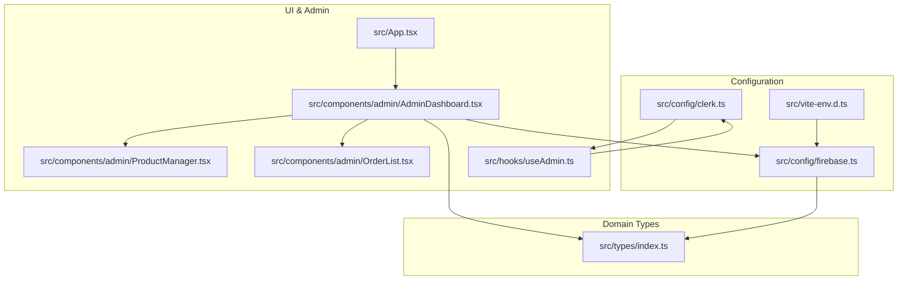
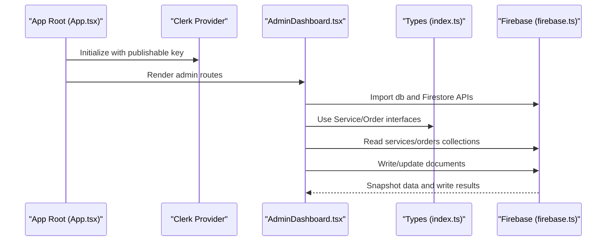
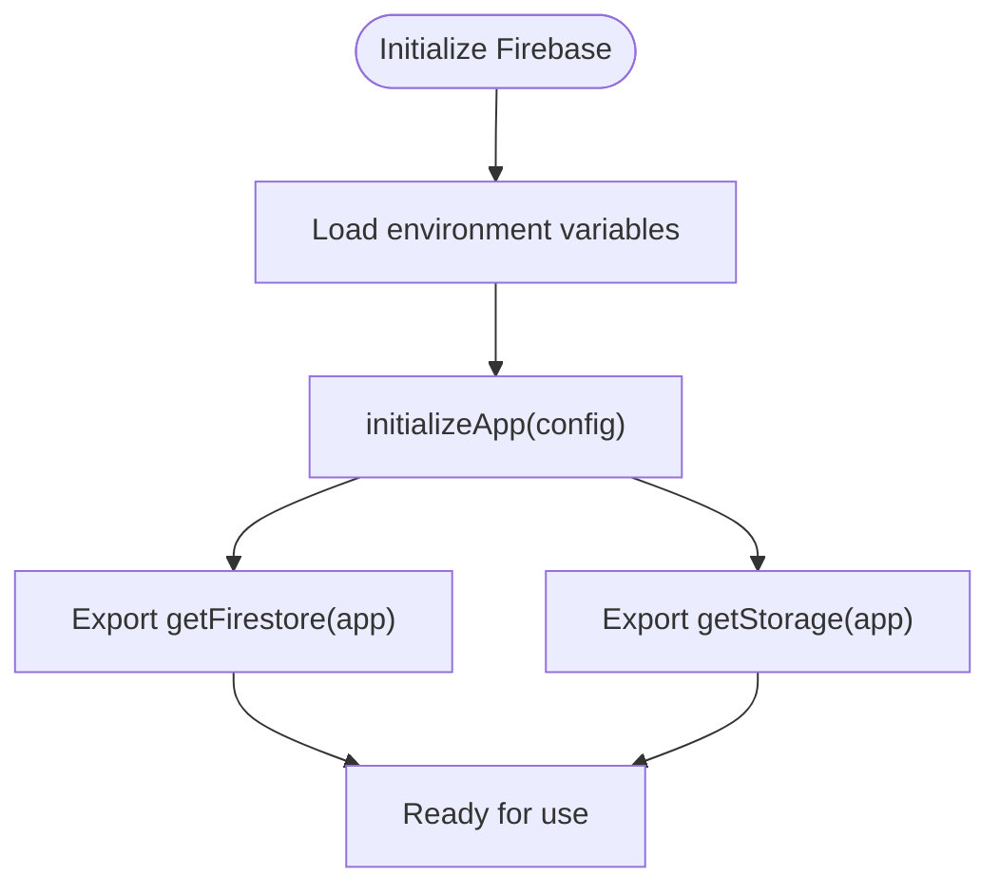
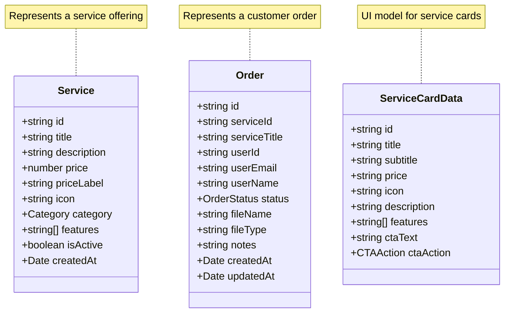
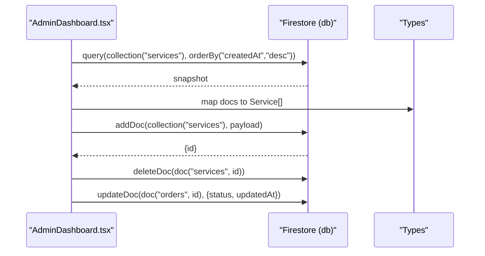
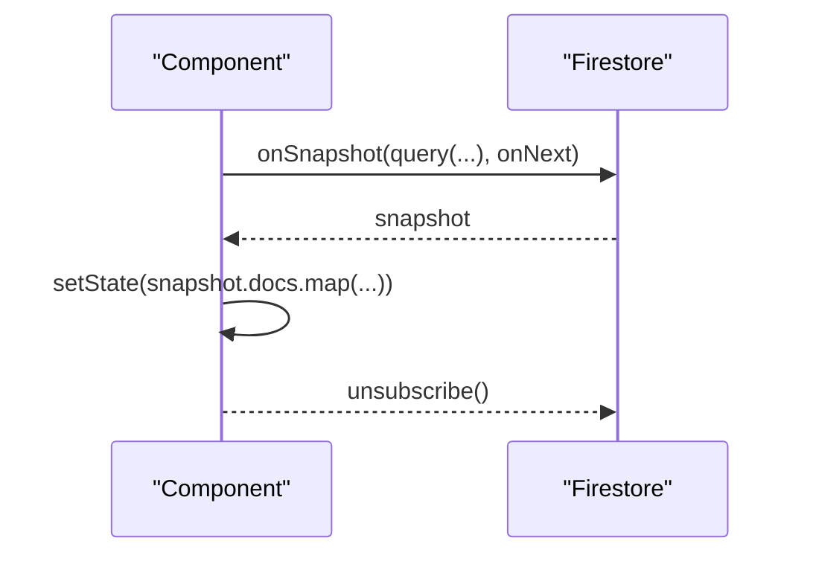
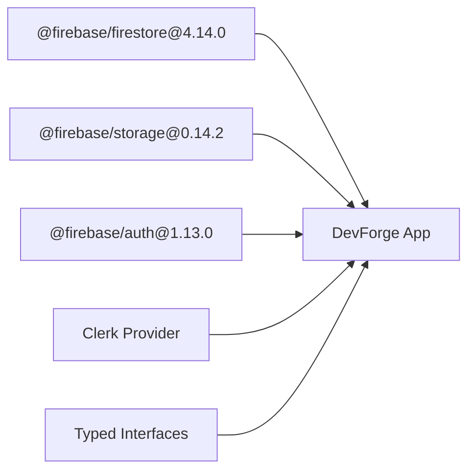

# Firebase Firestore API

<cite>
**Referenced Files in This Document**
- [firebase.ts](file://src/config/firebase.ts)
- [index.ts](file://src/types/index.ts)
- [AdminDashboard.tsx](file://src/components/admin/AdminDashboard.tsx)
- [ProductManager.tsx](file://src/components/admin/ProductManager.tsx)
- [OrderList.tsx](file://src/components/admin/OrderList.tsx)
- [useAdmin.ts](file://src/hooks/useAdmin.ts)
- [clerk.ts](file://src/config/clerk.ts)
- [App.tsx](file://src/App.tsx)
- [vite-env.d.ts](file://src/vite-env.d.ts)
</cite>

## Table of Contents
1. [Introduction](#introduction)
2. [Project Structure](#project-structure)
3. [Core Components](#core-components)
4. [Architecture Overview](#architecture-overview)
5. [Detailed Component Analysis](#detailed-component-analysis)
6. [Dependency Analysis](#dependency-analysis)
7. [Performance Considerations](#performance-considerations)
8. [Troubleshooting Guide](#troubleshooting-guide)
9. [Conclusion](#conclusion)
10. [Appendices](#appendices)

## Introduction
This document provides comprehensive API documentation for Firebase Firestore integration in DevForge. It covers Firebase initialization and configuration, database connection setup, and security rule patterns. It documents Firestore collection operations (CRUD, real-time listeners, and query optimization), the data modeling approach for services, orders, and user-related data structures, and explains Firestore security rules, authentication triggers, and validation patterns. Practical examples are included for real-time synchronization, batch operations, and offline persistence. Guidance is also provided on indexing strategies, pagination, performance optimization, troubleshooting, backup strategies, data migration, and production monitoring.

## Project Structure
DevForge integrates Firebase Firestore via a dedicated configuration module and exposes typed interfaces for domain models. The admin dashboard demonstrates Firestore usage patterns for services and orders collections, including reads, writes, and updates.

**Diagram sources**
- [firebase.ts:1-19](file://src/config/firebase.ts#L1-L19)
- [clerk.ts:1-4](file://src/config/clerk.ts#L1-L4)
- [vite-env.d.ts:1-17](file://src/vite-env.d.ts#L1-L17)
- [index.ts:1-40](file://src/types/index.ts#L1-L40)
- [App.tsx:1-67](file://src/App.tsx#L1-L67)
- [AdminDashboard.tsx:1-185](file://src/components/admin/AdminDashboard.tsx#L1-L185)
- [ProductManager.tsx:1-221](file://src/components/admin/ProductManager.tsx#L1-L221)
- [OrderList.tsx:1-91](file://src/components/admin/OrderList.tsx#L1-L91)
- [useAdmin.ts:1-14](file://src/hooks/useAdmin.ts#L1-L14)

**Section sources**
- [firebase.ts:1-19](file://src/config/firebase.ts#L1-L19)
- [index.ts:1-40](file://src/types/index.ts#L1-L40)
- [AdminDashboard.tsx:1-185](file://src/components/admin/AdminDashboard.tsx#L1-L185)
- [ProductManager.tsx:1-221](file://src/components/admin/ProductManager.tsx#L1-L221)
- [OrderList.tsx:1-91](file://src/components/admin/OrderList.tsx#L1-L91)
- [useAdmin.ts:1-14](file://src/hooks/useAdmin.ts#L1-L14)
- [clerk.ts:1-4](file://src/config/clerk.ts#L1-L4)
- [App.tsx:1-67](file://src/App.tsx#L1-L67)
- [vite-env.d.ts:1-17](file://src/vite-env.d.ts#L1-L17)

## Core Components
- Firebase initialization and exports:
  - Initializes Firebase app using environment variables.
  - Exposes Firestore database and Storage instances for use across the app.
- Domain types:
  - Defines strongly-typed interfaces for Service, Order, and auxiliary UI data structures.
- Admin dashboard:
  - Loads services and orders from Firestore collections.
  - Provides mutation handlers for adding/deleting services and updating order statuses.

**Section sources**
- [firebase.ts:1-19](file://src/config/firebase.ts#L1-L19)
- [index.ts:1-40](file://src/types/index.ts#L1-L40)
- [AdminDashboard.tsx:18-72](file://src/components/admin/AdminDashboard.tsx#L18-L72)

## Architecture Overview
The application initializes Firebase and Clerk providers at the root level. The admin dashboard orchestrates Firestore reads/writes for services and orders, while Clerk enforces admin access control.

**Diagram sources**
- [App.tsx:26-58](file://src/App.tsx#L26-L58)
- [AdminDashboard.tsx:1-185](file://src/components/admin/AdminDashboard.tsx#L1-L185)
- [index.ts:1-40](file://src/types/index.ts#L1-L40)
- [firebase.ts:1-19](file://src/config/firebase.ts#L1-L19)

## Detailed Component Analysis

### Firebase Initialization and Configuration
- Environment variables are loaded via Vite’s import.meta.env and passed to Firebase initialization.
- Firestore and Storage instances are exported for consumption by UI components.

**Diagram sources**
- [firebase.ts:5-18](file://src/config/firebase.ts#L5-L18)
- [vite-env.d.ts:3-11](file://src/vite-env.d.ts#L3-L11)

**Section sources**
- [firebase.ts:1-19](file://src/config/firebase.ts#L1-L19)
- [vite-env.d.ts:1-17](file://src/vite-env.d.ts#L1-L17)

### Data Modeling Approach
- Service interface defines product metadata, pricing, categorization, and lifecycle timestamps.
- Order interface captures customer and service linkage, status tracking, and audit timestamps.
- Auxiliary UI data structures support rendering and form handling.

**Diagram sources**
- [index.ts:1-40](file://src/types/index.ts#L1-L40)

**Section sources**
- [index.ts:1-40](file://src/types/index.ts#L1-L40)

### Firestore Collection Operations
- Reads:
  - Admin dashboard queries services and orders collections, ordering by creation date.
  - Results are mapped into typed arrays for rendering.
- Writes:
  - Adding a service inserts a new document with a generated ID and timestamp.
  - Deleting a service removes the document by ID.
  - Updating an order status modifies a single field and updates the local state.

**Diagram sources**
- [AdminDashboard.tsx:31-72](file://src/components/admin/AdminDashboard.tsx#L31-L72)
- [index.ts:1-40](file://src/types/index.ts#L1-L40)

**Section sources**
- [AdminDashboard.tsx:25-72](file://src/components/admin/AdminDashboard.tsx#L25-L72)

### Real-Time Listeners and Synchronization
- Current implementation performs initial loads on mount and updates local state after mutations.
- To enable real-time synchronization, attach onSnapshot listeners to collections and update state reactively.
- Example pattern:
  - Subscribe to services and orders collections.
  - On snapshot changes, update the state arrays.
  - Unsubscribe on component unmount to prevent memory leaks.

[No sources needed since this diagram shows conceptual workflow, not actual code structure]

### Query Optimization
- Use indexed fields in queries (e.g., createdAt) to improve performance.
- Limit result sets with limit clauses for large collections.
- Prefer compound filters on indexed fields to avoid full scans.

[No sources needed since this section provides general guidance]

### Batch Operations
- Use writeBatch to group multiple writes for atomicity and reduced network overhead.
- Suitable for bulk updates, migrations, or coordinated changes across collections.

[No sources needed since this section provides general guidance]

### Offline Persistence
- Firestore SDK supports automatic offline persistence by default.
- Configure persistence settings during initialization if needed (e.g., enabling persistence explicitly).

[No sources needed since this section provides general guidance]

### Security Rules, Authentication Triggers, and Validation Patterns
- Authentication:
  - Admin access is enforced via Clerk; only the configured admin email can access admin routes.
- Firestore Security Rules:
  - Restrict reads/writes to authenticated users where appropriate.
  - Enforce field-level validation for required and computed fields (e.g., timestamps).
  - Use request.auth.uid to enforce ownership for user-specific data.
  - Example rule categories:
    - Collections: services, orders
    - Fields: createdAt, updatedAt, status, userId, userEmail
    - Conditions: ownership checks, status transitions, presence of required fields

**Section sources**
- [useAdmin.ts:4-12](file://src/hooks/useAdmin.ts#L4-L12)
- [clerk.ts:1-4](file://src/config/clerk.ts#L1-L4)

### Practical Examples
- Real-time data synchronization:
  - Attach onSnapshot to services and orders collections; update state on each change.
- Batch operations:
  - Group multiple add/update/delete operations using writeBatch.
- Offline persistence:
  - Rely on SDK defaults; configure persistence settings if required.

[No sources needed since this section provides general guidance]

## Dependency Analysis
- Firebase SDK versions:
  - @firebase/firestore: 4.14.0
  - @firebase/storage: 0.14.2
  - @firebase/auth: 1.13.0
- Clerk integration:
  - Publishable key sourced from environment variables.
- Type safety:
  - Strongly-typed interfaces ensure compile-time validation of Firestore documents.

**Diagram sources**
- [firebase.ts:1-19](file://src/config/firebase.ts#L1-L19)
- [App.tsx:1-67](file://src/App.tsx#L1-L67)
- [index.ts:1-40](file://src/types/index.ts#L1-L40)

**Section sources**
- [firebase.ts:1-19](file://src/config/firebase.ts#L1-L19)
- [App.tsx:1-67](file://src/App.tsx#L1-L67)
- [index.ts:1-40](file://src/types/index.ts#L1-L40)

## Performance Considerations
- Indexing strategies:
  - Create composite indexes for frequent queries (e.g., status + createdAt).
  - Monitor query costs and adjust indexes accordingly.
- Pagination:
  - Use cursor-based pagination with startAfter/endBefore for efficient large dataset traversal.
- Caching and batching:
  - Minimize redundant reads by caching frequently accessed documents.
  - Batch writes to reduce latency and improve throughput.
- Offline-first:
  - Leverage SDK’s offline persistence to maintain responsiveness during connectivity issues.

[No sources needed since this section provides general guidance]

## Troubleshooting Guide
- Common Firestore issues:
  - Permission denied errors: Verify Firestore security rules and authentication state.
  - Slow queries: Ensure proper indexing and avoid querying unindexed fields.
  - Stale data: Confirm real-time listeners are attached and properly unsubscribed.
- Error handling patterns:
  - Wrap Firestore calls in try/catch blocks.
  - Log errors with context (collection, operation, document ID).
  - Provide user-friendly feedback for failures.
- Data consistency considerations:
  - Use transactions or batched writes for interdependent updates.
  - Validate required fields server-side via security rules and client-side via forms.

[No sources needed since this section provides general guidance]

## Conclusion
DevForge integrates Firebase Firestore with a clean separation of concerns: configuration, typed models, and admin-driven operations. The current implementation focuses on initial loads and manual state updates. Extending with real-time listeners, optimized queries, and robust error handling will further enhance reliability and performance. Strong typing and authentication enforcement provide a solid foundation for secure, scalable data operations.

[No sources needed since this section summarizes without analyzing specific files]

## Appendices

### API Reference Summary
- Collections:
  - services: CRUD operations for service offerings.
  - orders: CRUD operations for customer orders.
- Key fields:
  - createdAt, updatedAt: timestamps for audit trails.
  - status: controlled enumeration for order lifecycle.
  - userId/userEmail: user identity for ownership checks.
- Authentication:
  - Admin access gated by Clerk using a configured admin email.

**Section sources**
- [AdminDashboard.tsx:31-72](file://src/components/admin/AdminDashboard.tsx#L31-L72)
- [index.ts:1-40](file://src/types/index.ts#L1-L40)
- [useAdmin.ts:4-12](file://src/hooks/useAdmin.ts#L4-L12)
- [clerk.ts:1-4](file://src/config/clerk.ts#L1-L4)