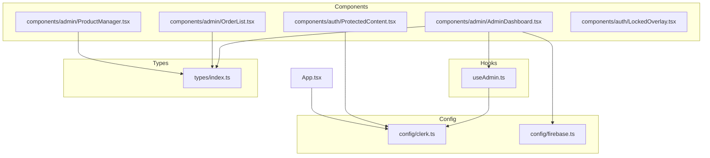
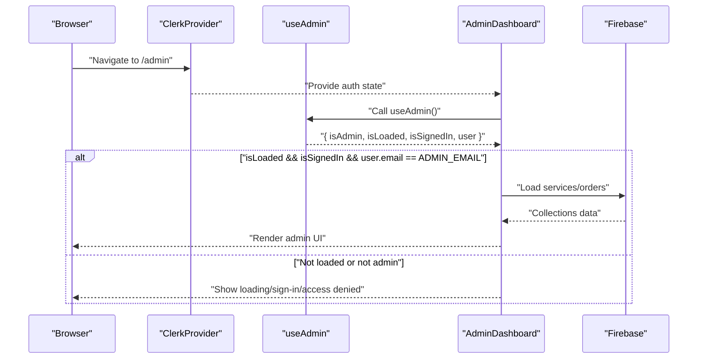
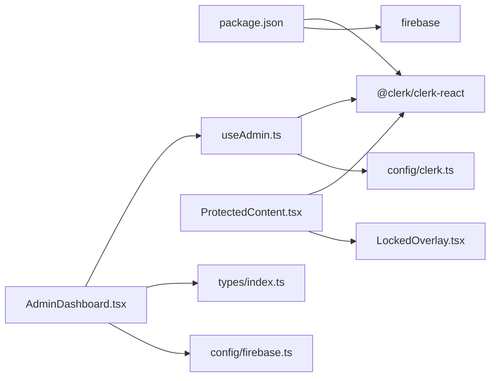
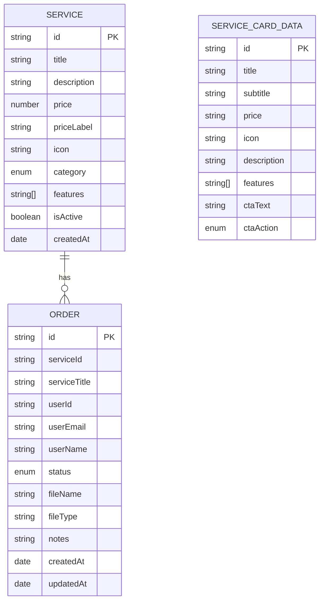

# Utility Hooks API

<cite>
**Referenced Files in This Document**
- [useAdmin.ts](file://src/hooks/useAdmin.ts)
- [index.ts](file://src/types/index.ts)
- [clerk.ts](file://src/config/clerk.ts)
- [firebase.ts](file://src/config/firebase.ts)
- [AdminDashboard.tsx](file://src/components/admin/AdminDashboard.tsx)
- [OrderList.tsx](file://src/components/admin/OrderList.tsx)
- [ProductManager.tsx](file://src/components/admin/ProductManager.tsx)
- [ProtectedContent.tsx](file://src/components/auth/ProtectedContent.tsx)
- [LockedOverlay.tsx](file://src/components/auth/LockedOverlay.tsx)
- [App.tsx](file://src/App.tsx)
- [package.json](file://package.json)
</cite>

## Table of Contents
1. [Introduction](#introduction)
2. [Project Structure](#project-structure)
3. [Core Components](#core-components)
4. [Architecture Overview](#architecture-overview)
5. [Detailed Component Analysis](#detailed-component-analysis)
6. [Dependency Analysis](#dependency-analysis)
7. [Performance Considerations](#performance-considerations)
8. [Troubleshooting Guide](#troubleshooting-guide)
9. [Conclusion](#conclusion)
10. [Appendices](#appendices)

## Introduction
This document provides comprehensive API documentation for DevForge’s custom utility hooks and TypeScript interfaces. It focuses on the administrative access control hook useAdmin, the TypeScript interfaces for services, orders, and related UI data, and the composition patterns used to enforce access control and manage application state. Practical usage examples, prop interfaces, return value handling, and guidelines for extending hooks and maintaining type safety are included. Testing strategies, mock implementations, and integration patterns are also covered.

## Project Structure
DevForge organizes shared logic and types under dedicated folders:
- Hooks: src/hooks (contains useAdmin)
- Types: src/types (contains Service, Order, and ServiceCardData)
- Config: src/config (contains Clerk and Firebase configuration)
- Components: src/components (admin dashboards, order/product lists, protected content overlays)
- Application bootstrap: src/App.tsx (Clerk provider wiring and routing)

**Diagram sources**
- [useAdmin.ts:1-14](file://src/hooks/useAdmin.ts#L1-L14)
- [index.ts:1-40](file://src/types/index.ts#L1-L40)
- [clerk.ts:1-4](file://src/config/clerk.ts#L1-L4)
- [firebase.ts:1-19](file://src/config/firebase.ts#L1-L19)
- [AdminDashboard.tsx:1-186](file://src/components/admin/AdminDashboard.tsx#L1-L186)
- [OrderList.tsx:1-91](file://src/components/admin/OrderList.tsx#L1-L91)
- [ProductManager.tsx:1-221](file://src/components/admin/ProductManager.tsx#L1-L221)
- [ProtectedContent.tsx:1-44](file://src/components/auth/ProtectedContent.tsx#L1-L44)
- [LockedOverlay.tsx:1-61](file://src/components/auth/LockedOverlay.tsx#L1-L61)
- [App.tsx:1-67](file://src/App.tsx#L1-L67)

**Section sources**
- [useAdmin.ts:1-14](file://src/hooks/useAdmin.ts#L1-L14)
- [index.ts:1-40](file://src/types/index.ts#L1-L40)
- [clerk.ts:1-4](file://src/config/clerk.ts#L1-L4)
- [firebase.ts:1-19](file://src/config/firebase.ts#L1-L19)
- [AdminDashboard.tsx:1-186](file://src/components/admin/AdminDashboard.tsx#L1-L186)
- [OrderList.tsx:1-91](file://src/components/admin/OrderList.tsx#L1-L91)
- [ProductManager.tsx:1-221](file://src/components/admin/ProductManager.tsx#L1-L221)
- [ProtectedContent.tsx:1-44](file://src/components/auth/ProtectedContent.tsx#L1-L44)
- [LockedOverlay.tsx:1-61](file://src/components/auth/LockedOverlay.tsx#L1-L61)
- [App.tsx:1-67](file://src/App.tsx#L1-L67)

## Core Components
- useAdmin hook: Provides administrative access control by validating the signed-in user against a configured admin email. Returns booleans for loading/signed-in state and the current user object.
- Types: Service, Order, and ServiceCardData define the shape of data exchanged between components and Firebase.

Key responsibilities:
- Access control enforcement in AdminDashboard
- Prop interfaces for ProductManager and OrderList
- ProtectedContent overlay for locked content

**Section sources**
- [useAdmin.ts:1-14](file://src/hooks/useAdmin.ts#L1-L14)
- [index.ts:1-40](file://src/types/index.ts#L1-L40)
- [AdminDashboard.tsx:18-110](file://src/components/admin/AdminDashboard.tsx#L18-L110)
- [ProductManager.tsx:4-8](file://src/components/admin/ProductManager.tsx#L4-L8)
- [OrderList.tsx:3-6](file://src/components/admin/OrderList.tsx#L3-L6)
- [ProtectedContent.tsx:5-8](file://src/components/auth/ProtectedContent.tsx#L5-L8)

## Architecture Overview
The admin workflow integrates Clerk for authentication and Firebase for persistence. The useAdmin hook centralizes admin checks, while AdminDashboard orchestrates data fetching and mutation. ProtectedContent wraps routes/components to lock down premium content until sign-in.

**Diagram sources**
- [App.tsx:26-58](file://src/App.tsx#L26-L58)
- [useAdmin.ts:4-13](file://src/hooks/useAdmin.ts#L4-L13)
- [AdminDashboard.tsx:19-52](file://src/components/admin/AdminDashboard.tsx#L19-L52)
- [clerk.ts:1-4](file://src/config/clerk.ts#L1-L4)
- [firebase.ts:16-18](file://src/config/firebase.ts#L16-L18)

## Detailed Component Analysis

### useAdmin Hook API
Purpose:
- Centralized admin access control using Clerk user state and a configured admin email.

Inputs:
- None (relies on @clerk/clerk-react useUser and ADMIN_EMAIL from config).

Returns:
- Object with:
  - isAdmin: boolean indicating admin privilege
  - isLoaded: boolean indicating if Clerk user state is ready
  - isSignedIn: boolean indicating if a user is signed in
  - user: Clerk user object (nullable until loaded)

Behavior:
- Computes isAdmin only after isLoaded and isSignedIn are true and the user’s primary email matches ADMIN_EMAIL.

Usage pattern:
- Destructure return values and gate rendering or data operations accordingly.

Example usage locations:
- AdminDashboard checks isAdmin to decide whether to render content or show access denial.
- ProtectedContent uses Clerk’s isLoaded/isSignedIn to conditionally show overlays.

Testing strategy:
- Mock @clerk/clerk-react useUser to simulate user states.
- Provide a test ADMIN_EMAIL via environment variable or re-export from a test config module.
- Assert computed isAdmin across combinations of isLoaded, isSignedIn, and email equality.

**Section sources**
- [useAdmin.ts:1-14](file://src/hooks/useAdmin.ts#L1-L14)
- [clerk.ts:1-4](file://src/config/clerk.ts#L1-L4)
- [AdminDashboard.tsx:19-110](file://src/components/admin/AdminDashboard.tsx#L19-L110)
- [ProtectedContent.tsx:10-43](file://src/components/auth/ProtectedContent.tsx#L10-L43)

### TypeScript Interfaces

#### Service
- Purpose: Defines the structure of a service offered by the platform.
- Fields:
  - id: string
  - title: string
  - description: string
  - price: number
  - priceLabel: string
  - icon: string
  - category: union of 'digital' | 'local' | 'custom'
  - features: string[]
  - isActive: boolean
  - createdAt: Date

Complexity:
- Flat interface; suitable for rendering and CRUD operations.

**Section sources**
- [index.ts:1-12](file://src/types/index.ts#L1-L12)

#### Order
- Purpose: Defines customer order records linked to services and users.
- Fields:
  - id: string
  - serviceId: string
  - serviceTitle: string
  - userId: string
  - userEmail: string
  - userName: string
  - status: union of 'pending' | 'processing' | 'completed' | 'cancelled'
  - fileName?: string
  - fileType?: string
  - notes?: string
  - createdAt: Date
  - updatedAt: Date

Complexity:
- Flat interface; supports status transitions and metadata.

**Section sources**
- [index.ts:14-27](file://src/types/index.ts#L14-L27)

#### ServiceCardData
- Purpose: UI-focused representation for service cards.
- Fields:
  - id: string
  - title: string
  - subtitle: string
  - price: string
  - icon: string
  - description: string
  - features: string[]
  - ctaText: string
  - ctaAction: union of 'whatsapp' | 'upload' | 'contact'

Complexity:
- Flat interface; optimized for rendering service cards.

**Section sources**
- [index.ts:29-39](file://src/types/index.ts#L29-L39)

### Hook Composition Patterns and State Management
- useAdmin composition:
  - Composes Clerk’s useUser with environment-configured ADMIN_EMAIL.
  - Returns derived state (isAdmin) alongside raw Clerk booleans for robust UI decisions.

- AdminDashboard state management:
  - Uses local state for active tab, services, orders, and loading indicator.
  - Fetches data from Firestore on admin readiness and updates state immutably.

- ProtectedContent composition:
  - Wraps children with a locked overlay when not signed in.
  - Uses Clerk’s isLoaded/isSignedIn to avoid flickering UI.

Integration points:
- ClerkProvider in App.tsx supplies auth context to all components.
- Firebase initialization in config/firebase.ts exposes db and storage.

**Section sources**
- [useAdmin.ts:4-13](file://src/hooks/useAdmin.ts#L4-L13)
- [AdminDashboard.tsx:19-52](file://src/components/admin/AdminDashboard.tsx#L19-L52)
- [ProtectedContent.tsx:10-43](file://src/components/auth/ProtectedContent.tsx#L10-L43)
- [App.tsx:26-58](file://src/App.tsx#L26-L58)
- [firebase.ts:16-18](file://src/config/firebase.ts#L16-L18)

### Prop Interfaces and Return Value Handling

#### AdminDashboard props and state
- Props: none
- State:
  - activeTab: 'products' | 'orders'
  - services: Service[]
  - orders: Order[]
  - loading: boolean
- Returns:
  - Renders loading, sign-in prompt, access denied, or admin tabs based on useAdmin return values.

**Section sources**
- [AdminDashboard.tsx:18-186](file://src/components/admin/AdminDashboard.tsx#L18-L186)

#### OrderList props and behavior
- Props:
  - orders: Order[]
  - onUpdateStatus: (id: string, status: Order['status']) => Promise<void>
- Behavior:
  - Renders a list of orders with status badges and a dropdown to change status.
  - Calls onUpdateStatus when the selection changes.

**Section sources**
- [OrderList.tsx:3-6](file://src/components/admin/OrderList.tsx#L3-L6)
- [OrderList.tsx:15-91](file://src/components/admin/OrderList.tsx#L15-L91)

#### ProductManager props and behavior
- Props:
  - services: Service[]
  - onAdd: (service: Omit<Service, 'id' | 'createdAt'>) => Promise<void>
  - onDelete: (id: string) => Promise<void>
- Behavior:
  - Manages form state for adding services.
  - Splits features by newline and filters empty lines before invoking onAdd.
  - Renders a list of existing services with a delete action.

**Section sources**
- [ProductManager.tsx:4-8](file://src/components/admin/ProductManager.tsx#L4-L8)
- [ProductManager.tsx:22-52](file://src/components/admin/ProductManager.tsx#L22-L52)
- [ProductManager.tsx:168-221](file://src/components/admin/ProductManager.tsx#L168-L221)

#### ProtectedContent props and behavior
- Props:
  - children: ReactNode
  - fallback?: ReactNode
- Behavior:
  - If not loaded, renders a spinner.
  - If not signed in, blurs children and overlays LockedOverlay.
  - Otherwise renders children.

**Section sources**
- [ProtectedContent.tsx:5-8](file://src/components/auth/ProtectedContent.tsx#L5-L8)
- [ProtectedContent.tsx:10-43](file://src/components/auth/ProtectedContent.tsx#L10-L43)
- [LockedOverlay.tsx:3-61](file://src/components/auth/LockedOverlay.tsx#L3-L61)

### Utility Functions and Formatting
- Feature normalization in ProductManager:
  - Converts multiline features to an array by splitting on newline and filtering empty entries.
- Status badge mapping in OrderList:
  - Maps order statuses to color tokens for consistent UI.

These utilities keep data transformation close to where it is consumed, reducing duplication and preserving type safety.

**Section sources**
- [ProductManager.tsx:37-40](file://src/components/admin/ProductManager.tsx#L37-L40)
- [OrderList.tsx:8-13](file://src/components/admin/OrderList.tsx#L8-L13)

### Hook Testing Strategies and Mock Implementations
Recommended approach:
- Test useAdmin:
  - Mock @clerk/clerk-react to return { user, isLoaded, isSignedIn }.
  - Provide a test ADMIN_EMAIL via a dedicated test config module.
  - Verify isAdmin is true only when isLoaded && isSignedIn && user.primaryEmailAddress.emailAddress === ADMIN_EMAIL.
- Test ProtectedContent:
  - Render ProtectedContent with children and assert overlay appears when not signed in.
  - Assert children render when signed in.
- Integration tests:
  - Compose AdminDashboard with a test router and mock Clerk/Firebase to validate tab switching and data loading flows.

Mock libraries:
- @testing-library/react, jest, vitest
- For Clerk, mock @clerk/clerk-react exports.
- For Firebase, mock Firestore methods (getDocs, addDoc, deleteDoc, updateDoc) using library-specific mocks.

**Section sources**
- [useAdmin.ts:1-14](file://src/hooks/useAdmin.ts#L1-L14)
- [ProtectedContent.tsx:10-43](file://src/components/auth/ProtectedContent.tsx#L10-L43)
- [AdminDashboard.tsx:25-52](file://src/components/admin/AdminDashboard.tsx#L25-L52)

### Extending Hooks and Maintaining Type Safety
Guidelines:
- Keep hooks pure and deterministic; derive state from external providers (Clerk, Firebase).
- Export minimal return interfaces; avoid leaking provider internals.
- Use TypeScript enums/unions for constrained fields (e.g., category, status).
- Prefer Omit for mutation inputs to prevent accidental ID/createdAt propagation.
- Centralize configuration (ADMIN_EMAIL, Firebase keys) in config modules and export constants for tests.

Examples of extension points:
- Add a useAdminRole hook that augments useAdmin with additional roles if needed.
- Introduce typed selectors for Firestore collections to encapsulate queries and transforms.

**Section sources**
- [index.ts:8](file://src/types/index.ts#L8)
- [index.ts:21](file://src/types/index.ts#L21)
- [ProductManager.tsx:6](file://src/components/admin/ProductManager.tsx#L6)
- [clerk.ts:2](file://src/config/clerk.ts#L2)
- [firebase.ts:5-18](file://src/config/firebase.ts#L5-L18)

## Dependency Analysis
External dependencies:
- @clerk/clerk-react: Provides authentication state and user context.
- firebase: Provides Firestore and Storage clients initialized from environment variables.

Internal dependencies:
- useAdmin depends on Clerk config (ADMIN_EMAIL).
- AdminDashboard depends on useAdmin, types, and Firebase db.
- ProtectedContent depends on Clerk user state and LockedOverlay.

**Diagram sources**
- [package.json:12-18](file://package.json#L12-L18)
- [useAdmin.ts:1-2](file://src/hooks/useAdmin.ts#L1-L2)
- [clerk.ts:1-4](file://src/config/clerk.ts#L1-L4)
- [AdminDashboard.tsx:1-16](file://src/components/admin/AdminDashboard.tsx#L1-L16)
- [ProtectedContent.tsx:1-3](file://src/components/auth/ProtectedContent.tsx#L1-L3)
- [LockedOverlay.tsx:1-61](file://src/components/auth/LockedOverlay.tsx#L1-L61)
- [index.ts:1-40](file://src/types/index.ts#L1-L40)
- [firebase.ts:1-19](file://src/config/firebase.ts#L1-L19)

**Section sources**
- [package.json:12-18](file://package.json#L12-L18)
- [useAdmin.ts:1-14](file://src/hooks/useAdmin.ts#L1-L14)
- [AdminDashboard.tsx:1-186](file://src/components/admin/AdminDashboard.tsx#L1-L186)
- [ProtectedContent.tsx:1-44](file://src/components/auth/ProtectedContent.tsx#L1-L44)
- [index.ts:1-40](file://src/types/index.ts#L1-L40)
- [clerk.ts:1-4](file://src/config/clerk.ts#L1-L4)
- [firebase.ts:1-19](file://src/config/firebase.ts#L1-L19)

## Performance Considerations
- Memoization:
  - Compute isAdmin once per render and pass the result to child components to avoid recomputation.
- Conditional fetching:
  - AdminDashboard fetches data only when isAdmin is true to minimize unnecessary network calls.
- UI responsiveness:
  - Use local loading state during Firestore operations to keep the UI responsive.
- Rendering:
  - Render skeletons/spinners for unauthenticated or unauthorized states to avoid heavy computations.

[No sources needed since this section provides general guidance]

## Troubleshooting Guide
Common issues and resolutions:
- Admin access not recognized:
  - Ensure ADMIN_EMAIL is set in environment variables and matches the signed-in user’s primary email.
  - Confirm Clerk is loaded and user is signed in before checking isAdmin.
- Blank or stale admin data:
  - Verify Firestore initialization and that collections exist.
  - Check that AdminDashboard’s effect runs only when isAdmin is true.
- Protected content flicker:
  - Use isLoaded to guard UI rendering until Clerk provides reliable state.
- Order status updates fail:
  - Confirm Firestore rules allow write access for the admin account.
  - Validate that the status value is one of the allowed union literals.

**Section sources**
- [clerk.ts:2](file://src/config/clerk.ts#L2)
- [AdminDashboard.tsx:25-52](file://src/components/admin/AdminDashboard.tsx#L25-L52)
- [ProtectedContent.tsx:13-29](file://src/components/auth/ProtectedContent.tsx#L13-L29)
- [OrderList.tsx:66-85](file://src/components/admin/OrderList.tsx#L66-L85)

## Conclusion
DevForge’s useAdmin hook provides a concise, composable foundation for admin access control, integrated with Clerk and Firebase. The TypeScript interfaces ensure strong typing across services, orders, and UI data. By following the composition patterns and testing strategies outlined here, teams can safely extend hooks, maintain type safety, and optimize performance.

[No sources needed since this section summarizes without analyzing specific files]

## Appendices

### API Reference: useAdmin
- Inputs: none
- Returns: { isAdmin: boolean, isLoaded: boolean, isSignedIn: boolean, user: User | null }
- Typical usage: Gate admin UI and data operations; render fallbacks for loading/signed-out states.

**Section sources**
- [useAdmin.ts:4-13](file://src/hooks/useAdmin.ts#L4-L13)
- [AdminDashboard.tsx:19-110](file://src/components/admin/AdminDashboard.tsx#L19-L110)
- [ProtectedContent.tsx:10-43](file://src/components/auth/ProtectedContent.tsx#L10-L43)

### Data Model Diagram

**Diagram sources**
- [index.ts:1-39](file://src/types/index.ts#L1-L39)