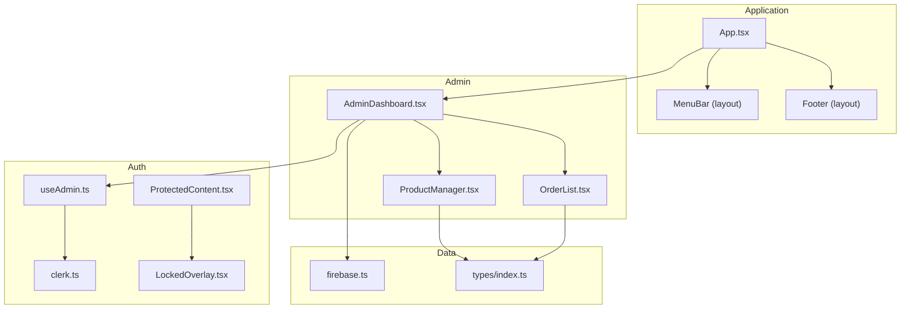
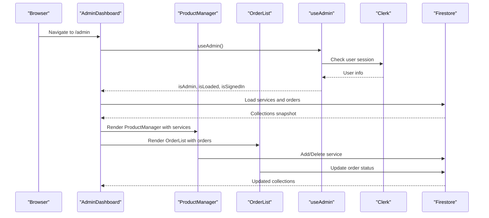
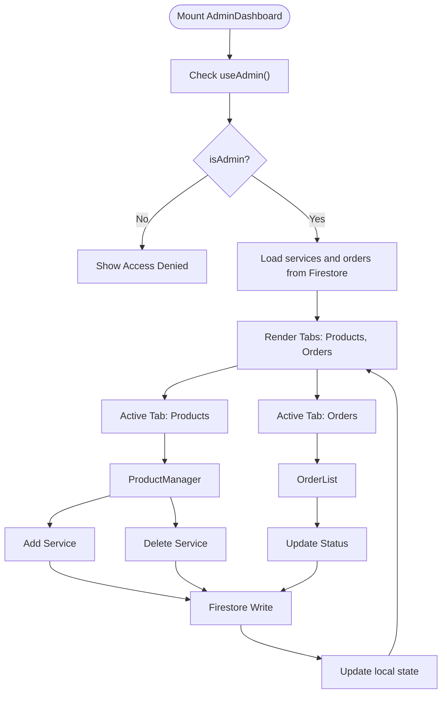
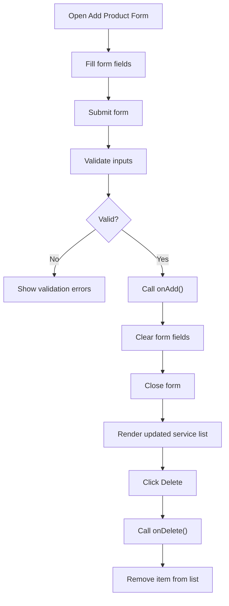
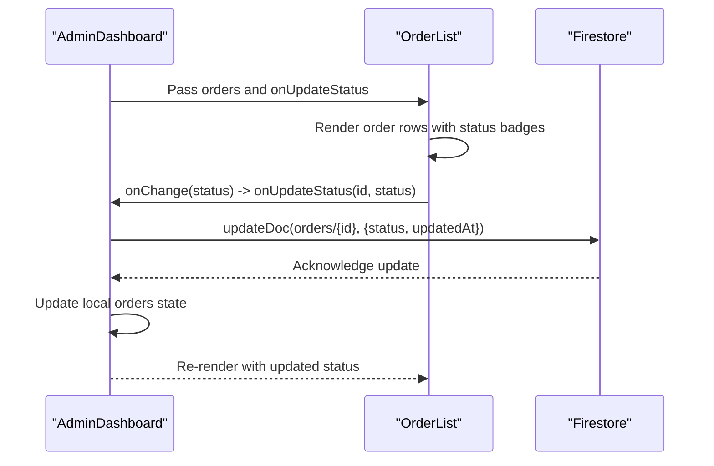
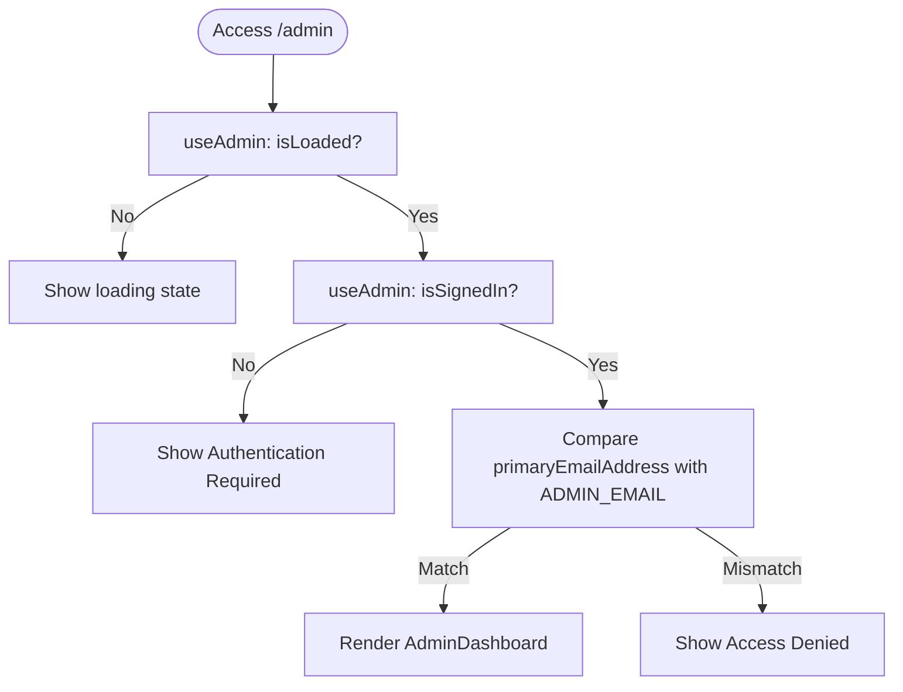
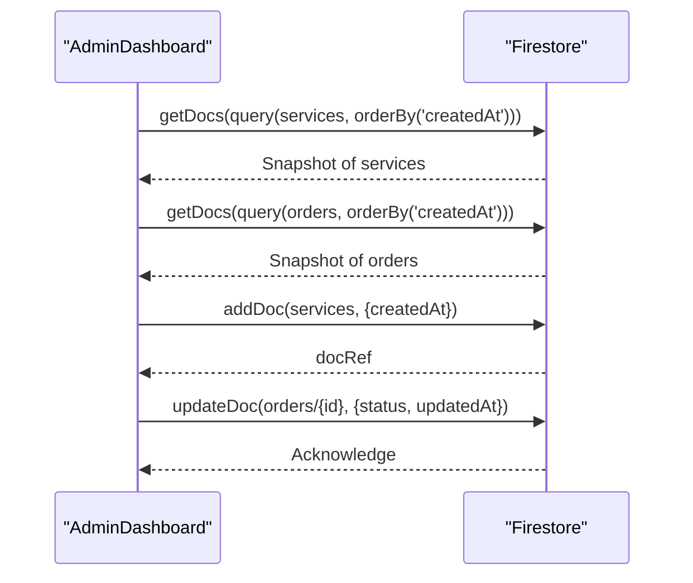
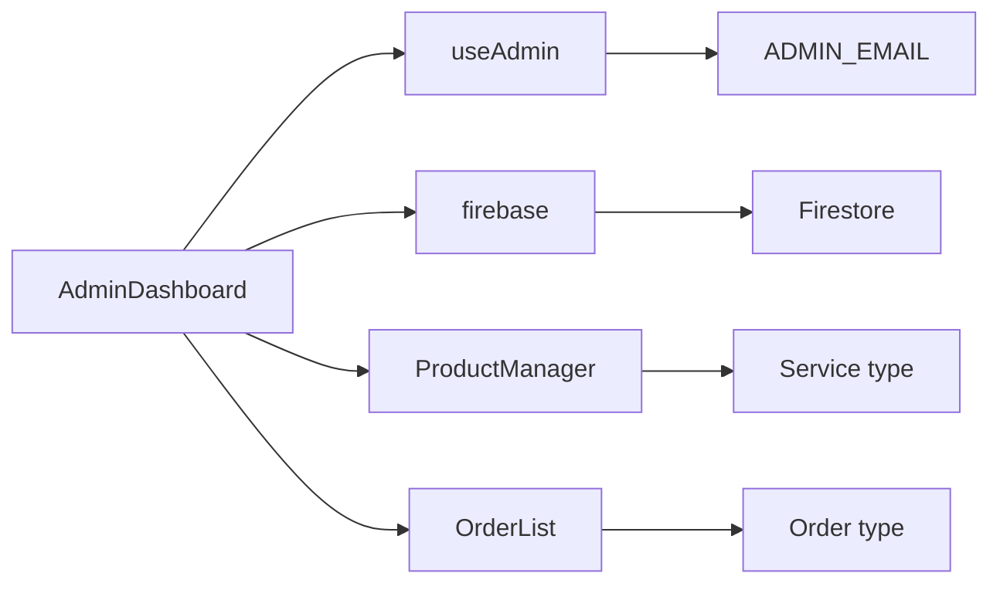

# Administrative Dashboard

<cite>
**Referenced Files in This Document**
- [AdminDashboard.tsx](file://src/components/admin/AdminDashboard.tsx)
- [ProductManager.tsx](file://src/components/admin/ProductManager.tsx)
- [OrderList.tsx](file://src/components/admin/OrderList.tsx)
- [useAdmin.ts](file://src/hooks/useAdmin.ts)
- [firebase.ts](file://src/config/firebase.ts)
- [clerk.ts](file://src/config/clerk.ts)
- [index.ts](file://src/types/index.ts)
- [App.tsx](file://src/App.tsx)
- [global.css](file://src/styles/global.css)
- [LockedOverlay.tsx](file://src/components/auth/LockedOverlay.tsx)
- [ProtectedContent.tsx](file://src/components/auth/ProtectedContent.tsx)
</cite>

## Table of Contents
1. [Introduction](#introduction)
2. [Project Structure](#project-structure)
3. [Core Components](#core-components)
4. [Architecture Overview](#architecture-overview)
5. [Detailed Component Analysis](#detailed-component-analysis)
6. [Dependency Analysis](#dependency-analysis)
7. [Performance Considerations](#performance-considerations)
8. [Troubleshooting Guide](#troubleshooting-guide)
9. [Conclusion](#conclusion)
10. [Appendices](#appendices)

## Introduction
This document provides comprehensive administrative dashboard documentation for DevForge’s admin interface. It explains the AdminDashboard component architecture with tabbed navigation, the ProductManager component for service catalog management (including CRUD operations, pricing updates, and availability controls), and the OrderList component for order tracking, status management, and customer communication workflows. It also documents administrative access control mechanisms, security considerations, and data synchronization with Firebase Firestore for real-time updates across admin panels. Finally, it offers practical guidance for extending the admin system with new features, customizing dashboard layouts, and enhancing product management capabilities.

## Project Structure
The admin dashboard is organized under the admin folder and integrates with authentication and configuration modules. The main application routes to the admin dashboard at the /admin path and uses Clerk for authentication and Firebase for data persistence.

**Diagram sources**
- [App.tsx:26-58](file://src/App.tsx#L26-L58)
- [AdminDashboard.tsx:18-186](file://src/components/admin/AdminDashboard.tsx#L18-L186)
- [ProductManager.tsx:22-221](file://src/components/admin/ProductManager.tsx#L22-L221)
- [OrderList.tsx:15-91](file://src/components/admin/OrderList.tsx#L15-L91)
- [useAdmin.ts:4-13](file://src/hooks/useAdmin.ts#L4-L13)
- [clerk.ts:1-4](file://src/config/clerk.ts#L1-L4)
- [firebase.ts:1-19](file://src/config/firebase.ts#L1-L19)
- [index.ts:1-40](file://src/types/index.ts#L1-L40)
- [ProtectedContent.tsx:10-43](file://src/components/auth/ProtectedContent.tsx#L10-L43)
- [LockedOverlay.tsx:3-60](file://src/components/auth/LockedOverlay.tsx#L3-L60)

**Section sources**
- [App.tsx:26-58](file://src/App.tsx#L26-L58)
- [AdminDashboard.tsx:18-186](file://src/components/admin/AdminDashboard.tsx#L18-L186)

## Core Components
- AdminDashboard: Central admin panel with tabbed navigation between Products and Orders. Handles loading data from Firestore, managing CRUD operations for services, and updating order statuses.
- ProductManager: Provides a form to add new services and displays the current service catalog with delete actions.
- OrderList: Lists orders with status badges and a dropdown to update order statuses.
- useAdmin: Hook that checks if the signed-in user is the administrator based on a configured email address.
- firebase configuration: Initializes Firestore and Storage for data persistence and retrieval.
- types: Defines Service and Order interfaces used across admin components.

**Section sources**
- [AdminDashboard.tsx:18-186](file://src/components/admin/AdminDashboard.tsx#L18-L186)
- [ProductManager.tsx:22-221](file://src/components/admin/ProductManager.tsx#L22-L221)
- [OrderList.tsx:15-91](file://src/components/admin/OrderList.tsx#L15-L91)
- [useAdmin.ts:4-13](file://src/hooks/useAdmin.ts#L4-L13)
- [firebase.ts:1-19](file://src/config/firebase.ts#L1-L19)
- [index.ts:1-40](file://src/types/index.ts#L1-L40)

## Architecture Overview
The admin dashboard architecture follows a layered design:
- Presentation Layer: AdminDashboard renders tabs and delegates to ProductManager and OrderList.
- Business Logic Layer: Handlers manage CRUD operations for services and order status updates.
- Data Layer: Firestore is used for real-time data access and updates.
- Authentication Layer: Clerk handles user sessions; useAdmin enforces admin-only access.

**Diagram sources**
- [AdminDashboard.tsx:25-52](file://src/components/admin/AdminDashboard.tsx#L25-L52)
- [AdminDashboard.tsx:54-72](file://src/components/admin/AdminDashboard.tsx#L54-L72)
- [ProductManager.tsx:35-52](file://src/components/admin/ProductManager.tsx#L35-L52)
- [OrderList.tsx:66-85](file://src/components/admin/OrderList.tsx#L66-L85)
- [useAdmin.ts:4-13](file://src/hooks/useAdmin.ts#L4-L13)

## Detailed Component Analysis

### AdminDashboard Component
- Responsibilities:
  - Enforce admin-only access using useAdmin.
  - Load services and orders from Firestore on mount.
  - Provide tabbed navigation between Products and Orders.
  - Handle service creation and deletion.
  - Handle order status updates.
- Data Flow:
  - Loads collections using Firestore queries ordered by creation date.
  - Updates local state immediately after write operations to reflect UI changes instantly.
- UI/UX:
  - Uses a glass-morphism theme with neon accents.
  - Displays loading states and empty states for both tabs.
  - Shows counts for each tab based on loaded items.

**Diagram sources**
- [AdminDashboard.tsx:18-186](file://src/components/admin/AdminDashboard.tsx#L18-L186)
- [ProductManager.tsx:35-52](file://src/components/admin/ProductManager.tsx#L35-L52)
- [OrderList.tsx:66-85](file://src/components/admin/OrderList.tsx#L66-L85)

**Section sources**
- [AdminDashboard.tsx:18-186](file://src/components/admin/AdminDashboard.tsx#L18-L186)

### ProductManager Component
- Responsibilities:
  - Provide a form to add new services with fields for title, description, price, price label, icon, category, features, and active status.
  - Display existing services with delete actions.
- Data Handling:
  - Converts multiline features into an array of strings.
  - Calls onAdd and onDelete callbacks passed from AdminDashboard.
- UX:
  - Collapsible form with a grid layout for inputs.
  - Glass panels for list items and form container.
  - Empty state when no services exist.

**Diagram sources**
- [ProductManager.tsx:22-221](file://src/components/admin/ProductManager.tsx#L22-L221)

**Section sources**
- [ProductManager.tsx:22-221](file://src/components/admin/ProductManager.tsx#L22-L221)
- [index.ts:1-12](file://src/types/index.ts#L1-L12)

### OrderList Component
- Responsibilities:
  - Display orders with service title, customer name/email, optional file info, and status badge.
  - Allow changing order status via a select dropdown.
- Data Handling:
  - Uses a status-to-color mapping for visual indicators.
  - Calls onUpdateStatus callback with the selected status.
- UX:
  - Grid layout for each order row.
  - Status badges with consistent colors and borders.
  - Empty state when no orders exist.

**Diagram sources**
- [OrderList.tsx:15-91](file://src/components/admin/OrderList.tsx#L15-L91)
- [AdminDashboard.tsx:67-72](file://src/components/admin/AdminDashboard.tsx#L67-L72)

**Section sources**
- [OrderList.tsx:15-91](file://src/components/admin/OrderList.tsx#L15-L91)
- [index.ts:14-27](file://src/types/index.ts#L14-L27)

### Access Control and Security
- Admin-only enforcement:
  - useAdmin hook checks if the user is loaded, signed in, and matches the configured ADMIN_EMAIL.
  - AdminDashboard conditionally renders authentication-required or access-denied messages.
- Authentication provider:
  - Clerk is initialized in App.tsx with a publishable key and routing helpers.
- Additional protection:
  - ProtectedContent and LockedOverlay components demonstrate a pattern for protecting premium content with overlays and navigation prompts.

**Diagram sources**
- [useAdmin.ts:4-13](file://src/hooks/useAdmin.ts#L4-L13)
- [AdminDashboard.tsx:74-110](file://src/components/admin/AdminDashboard.tsx#L74-L110)
- [clerk.ts:1-4](file://src/config/clerk.ts#L1-L4)

**Section sources**
- [useAdmin.ts:4-13](file://src/hooks/useAdmin.ts#L4-L13)
- [AdminDashboard.tsx:74-110](file://src/components/admin/AdminDashboard.tsx#L74-L110)
- [clerk.ts:1-4](file://src/config/clerk.ts#L1-L4)
- [App.tsx:30-34](file://src/App.tsx#L30-L34)

### Data Synchronization with Firebase Firestore
- Initialization:
  - Firebase app is initialized with environment variables and exports Firestore and Storage instances.
- Queries:
  - AdminDashboard loads services and orders using Firestore queries ordered by createdAt.
- Writes:
  - Adds services with createdAt timestamps.
  - Updates orders with status and updatedAt timestamps.
- Real-time behavior:
  - Current implementation performs initial loads and subsequent writes; it does not subscribe to real-time listeners. To enable real-time updates, add Firestore listeners in AdminDashboard and update state accordingly.

**Diagram sources**
- [AdminDashboard.tsx:25-52](file://src/components/admin/AdminDashboard.tsx#L25-L52)
- [AdminDashboard.tsx:54-72](file://src/components/admin/AdminDashboard.tsx#L54-L72)
- [firebase.ts:1-19](file://src/config/firebase.ts#L1-L19)

**Section sources**
- [AdminDashboard.tsx:25-52](file://src/components/admin/AdminDashboard.tsx#L25-L52)
- [AdminDashboard.tsx:54-72](file://src/components/admin/AdminDashboard.tsx#L54-L72)
- [firebase.ts:1-19](file://src/config/firebase.ts#L1-L19)

## Dependency Analysis
- Component dependencies:
  - AdminDashboard depends on useAdmin, firebase, and child components ProductManager and OrderList.
  - ProductManager depends on Service type and external props for CRUD operations.
  - OrderList depends on Order type and a status-to-color mapping.
- External libraries:
  - Clerk for authentication.
  - Firebase for data persistence.
  - React Router for routing.

**Diagram sources**
- [AdminDashboard.tsx:18-186](file://src/components/admin/AdminDashboard.tsx#L18-L186)
- [ProductManager.tsx:22-221](file://src/components/admin/ProductManager.tsx#L22-L221)
- [OrderList.tsx:15-91](file://src/components/admin/OrderList.tsx#L15-L91)
- [useAdmin.ts:4-13](file://src/hooks/useAdmin.ts#L4-L13)
- [clerk.ts:1-4](file://src/config/clerk.ts#L1-L4)
- [firebase.ts:1-19](file://src/config/firebase.ts#L1-L19)
- [index.ts:1-40](file://src/types/index.ts#L1-L40)

**Section sources**
- [AdminDashboard.tsx:18-186](file://src/components/admin/AdminDashboard.tsx#L18-L186)
- [ProductManager.tsx:22-221](file://src/components/admin/ProductManager.tsx#L22-L221)
- [OrderList.tsx:15-91](file://src/components/admin/OrderList.tsx#L15-L91)
- [useAdmin.ts:4-13](file://src/hooks/useAdmin.ts#L4-L13)
- [clerk.ts:1-4](file://src/config/clerk.ts#L1-L4)
- [firebase.ts:1-19](file://src/config/firebase.ts#L1-L19)
- [index.ts:1-40](file://src/types/index.ts#L1-L40)

## Performance Considerations
- Initial load optimization:
  - Firestore queries currently load all documents; consider pagination or server-side filtering for large datasets.
- Real-time updates:
  - Add Firestore listeners to keep the UI synchronized without manual refreshes.
- Rendering:
  - Memoize lists and avoid unnecessary re-renders by passing stable callbacks and keys.
- Network efficiency:
  - Batch updates where possible and debounce frequent UI interactions.

[No sources needed since this section provides general guidance]

## Troubleshooting Guide
- Admin access denied:
  - Verify ADMIN_EMAIL environment variable and ensure the signed-in user’s primary email matches.
- Authentication required:
  - Confirm Clerk is initialized with a valid publishable key and that the user is signed in.
- Firestore connection issues:
  - Check Firebase configuration environment variables and network connectivity.
- Data not loading:
  - Inspect Firestore rules and ensure collections exist and are readable.
- Order status not updating:
  - Confirm the Firestore write operation succeeds and the local state updates accordingly.

**Section sources**
- [useAdmin.ts:4-13](file://src/hooks/useAdmin.ts#L4-L13)
- [clerk.ts:1-4](file://src/config/clerk.ts#L1-L4)
- [firebase.ts:1-19](file://src/config/firebase.ts#L1-L19)
- [AdminDashboard.tsx:25-52](file://src/components/admin/AdminDashboard.tsx#L25-L52)
- [AdminDashboard.tsx:67-72](file://src/components/admin/AdminDashboard.tsx#L67-L72)

## Conclusion
The DevForge admin dashboard provides a focused, secure, and extensible foundation for managing services and orders. It leverages Clerk for robust authentication and Firebase for reliable data access. The modular component architecture allows straightforward extension for additional administrative features, while the styling system ensures a cohesive user experience.

[No sources needed since this section summarizes without analyzing specific files]

## Appendices

### Implementation Examples

- Adding a new administrative feature:
  - Create a new component under src/components/admin/ and integrate it into AdminDashboard with a new tab.
  - Define any required types in src/types/index.ts.
  - Use Firestore operations via src/config/firebase.ts to persist data.
  - Example reference paths:
    - [AdminDashboard.tsx:18-186](file://src/components/admin/AdminDashboard.tsx#L18-L186)
    - [index.ts:1-40](file://src/types/index.ts#L1-L40)
    - [firebase.ts:1-19](file://src/config/firebase.ts#L1-L19)

- Customizing dashboard layouts:
  - Adjust the tab navigation and content area in AdminDashboard to accommodate new sections.
  - Example reference path:
    - [AdminDashboard.tsx:132-182](file://src/components/admin/AdminDashboard.tsx#L132-L182)

- Extending product management capabilities:
  - Add new fields to the Service interface and update ProductManager form accordingly.
  - Example reference paths:
    - [index.ts:1-12](file://src/types/index.ts#L1-L12)
    - [ProductManager.tsx:22-221](file://src/components/admin/ProductManager.tsx#L22-L221)

- Admin user experience considerations:
  - Provide loading states, empty states, and clear feedback for actions.
  - Example reference paths:
    - [AdminDashboard.tsx:74-110](file://src/components/admin/AdminDashboard.tsx#L74-L110)
    - [ProductManager.tsx:168-176](file://src/components/admin/ProductManager.tsx#L168-L176)
    - [OrderList.tsx:16-24](file://src/components/admin/OrderList.tsx#L16-L24)

- Bulk operations and reporting features:
  - Implement bulk actions in ProductManager and OrderList by adding selection checkboxes and batch handlers.
  - Example reference paths:
    - [ProductManager.tsx:22-221](file://src/components/admin/ProductManager.tsx#L22-L221)
    - [OrderList.tsx:15-91](file://src/components/admin/OrderList.tsx#L15-L91)

- System maintenance procedures:
  - Regularly review Firestore rules and indexes.
  - Monitor Clerk user sessions and admin email configuration.
  - Example reference paths:
    - [firebase.ts:1-19](file://src/config/firebase.ts#L1-L19)
    - [clerk.ts:1-4](file://src/config/clerk.ts#L1-L4)