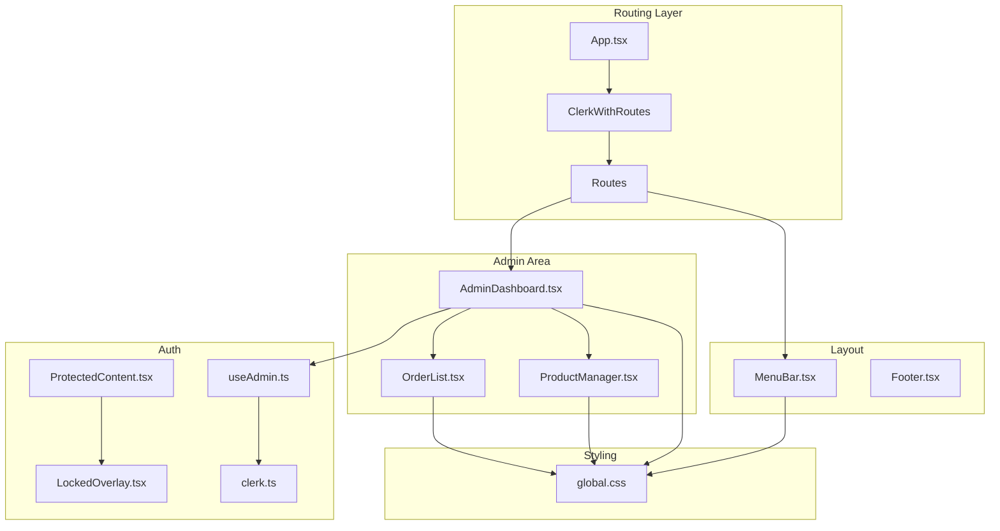
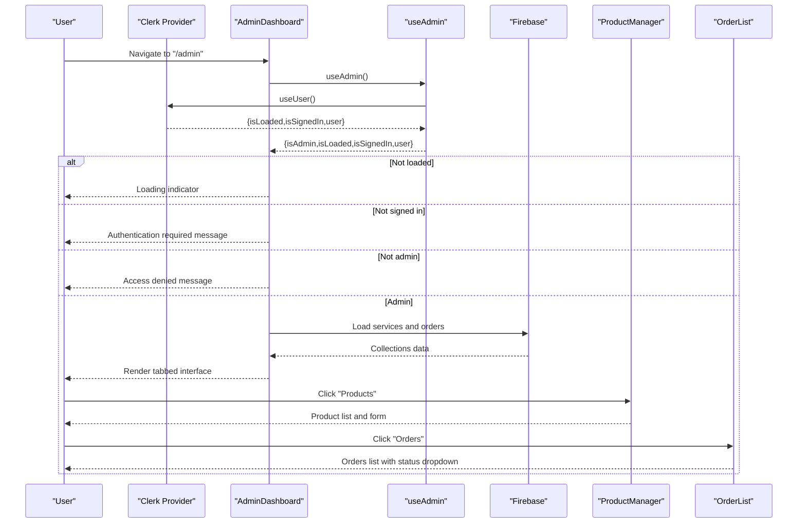
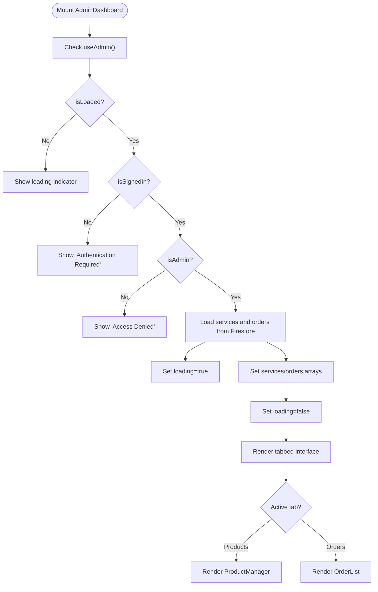
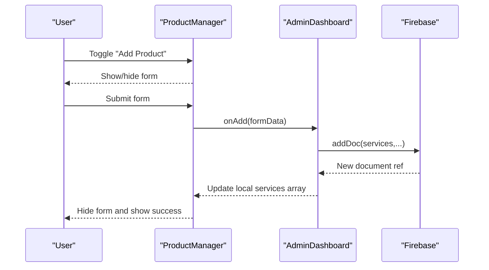
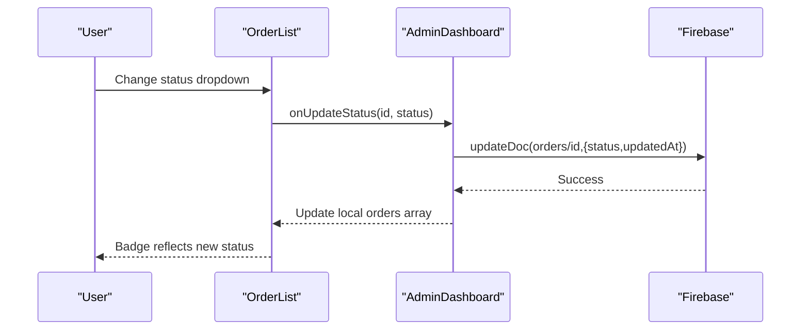
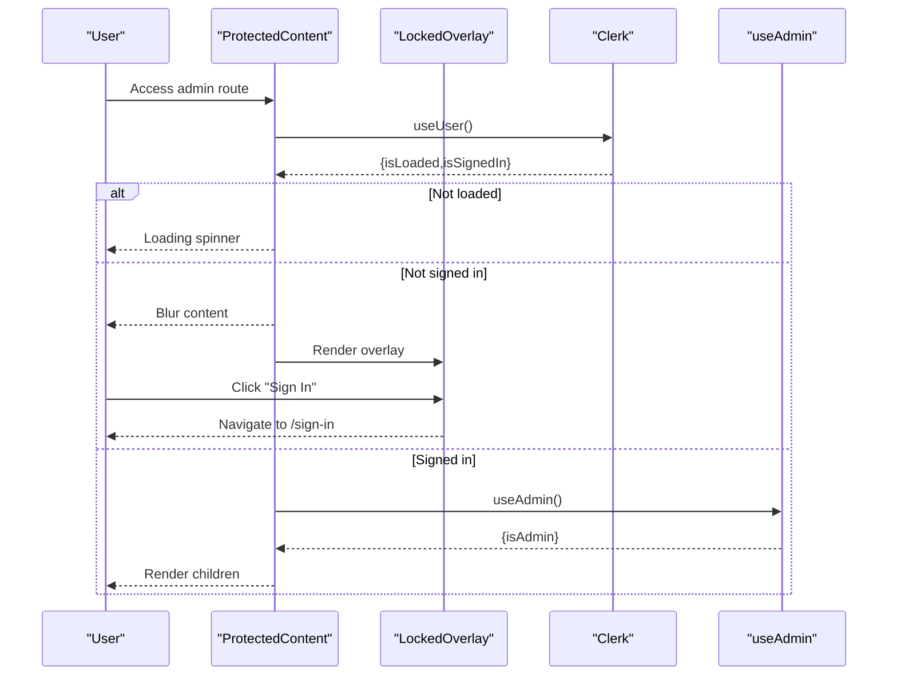
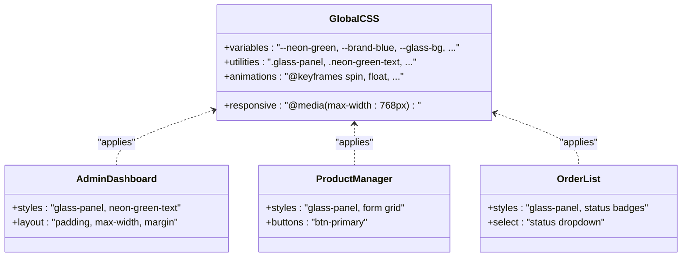
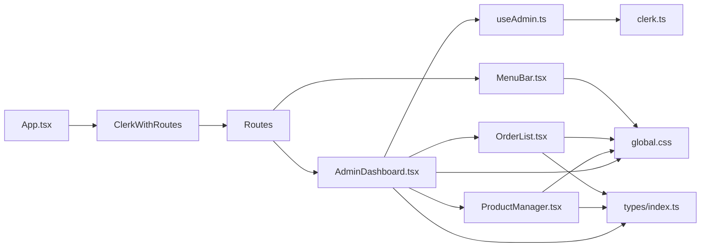

# Dashboard Navigation and Layout

<cite>
**Referenced Files in This Document**
- [AdminDashboard.tsx](file://src/components/admin/AdminDashboard.tsx)
- [ProductManager.tsx](file://src/components/admin/ProductManager.tsx)
- [OrderList.tsx](file://src/components/admin/OrderList.tsx)
- [ProtectedContent.tsx](file://src/components/auth/ProtectedContent.tsx)
- [LockedOverlay.tsx](file://src/components/auth/LockedOverlay.tsx)
- [useAdmin.ts](file://src/hooks/useAdmin.ts)
- [clerk.ts](file://src/config/clerk.ts)
- [global.css](file://src/styles/global.css)
- [index.ts](file://src/types/index.ts)
- [App.tsx](file://src/App.tsx)
- [MenuBar.tsx](file://src/components/layout/MenuBar.tsx)
- [package.json](file://package.json)
</cite>

## Table of Contents
1. [Introduction](#introduction)
2. [Project Structure](#project-structure)
3. [Core Components](#core-components)
4. [Architecture Overview](#architecture-overview)
5. [Detailed Component Analysis](#detailed-component-analysis)
6. [Dependency Analysis](#dependency-analysis)
7. [Performance Considerations](#performance-considerations)
8. [Troubleshooting Guide](#troubleshooting-guide)
9. [Conclusion](#conclusion)
10. [Appendices](#appendices)

## Introduction
This document explains the AdminDashboard navigation system and layout architecture. It covers the tabbed interface with Products and Orders tabs, state management for active tab selection and dynamic tab counts, glass morphism design elements, neon styling effects, and responsive layout patterns. It also documents the authentication flow integration that controls access to the dashboard, including loading states, error handling for unauthorized access, and user experience considerations for admin interface navigation.

## Project Structure
The AdminDashboard is part of a React application using Clerk for authentication and Firebase for data persistence. The layout integrates a fixed menu bar with glass and neon styling, while the admin area provides a tabbed interface for managing services and orders.

**Diagram sources**
- [App.tsx:26-58](file://src/App.tsx#L26-L58)
- [MenuBar.tsx:1-133](file://src/components/layout/MenuBar.tsx#L1-L133)
- [AdminDashboard.tsx:18-186](file://src/components/admin/AdminDashboard.tsx#L18-L186)
- [ProductManager.tsx:22-221](file://src/components/admin/ProductManager.tsx#L22-L221)
- [OrderList.tsx:15-91](file://src/components/admin/OrderList.tsx#L15-L91)
- [ProtectedContent.tsx:10-44](file://src/components/auth/ProtectedContent.tsx#L10-L44)
- [LockedOverlay.tsx:3-61](file://src/components/auth/LockedOverlay.tsx#L3-L61)
- [useAdmin.ts:4-13](file://src/hooks/useAdmin.ts#L4-L13)
- [clerk.ts:1-4](file://src/config/clerk.ts#L1-L4)
- [global.css:92-136](file://src/styles/global.css#L92-L136)

**Section sources**
- [App.tsx:14-67](file://src/App.tsx#L14-L67)
- [MenuBar.tsx:1-133](file://src/components/layout/MenuBar.tsx#L1-L133)
- [global.css:92-136](file://src/styles/global.css#L92-L136)

## Core Components
- AdminDashboard: Central container for the admin interface, manages tab state, loads data from Firestore, and renders tab content.
- ProductManager: Manages product CRUD operations and displays the product list with glass panels and neon accents.
- OrderList: Displays orders with status badges and a dropdown to update order statuses.
- useAdmin: Hook that checks if the signed-in user is the administrator based on email.
- ProtectedContent and LockedOverlay: Provide overlay protection and redirect behavior for unauthenticated users.
- MenuBar: Fixed header with glass panel styling, neon text, and clock display.

**Section sources**
- [AdminDashboard.tsx:18-186](file://src/components/admin/AdminDashboard.tsx#L18-L186)
- [ProductManager.tsx:22-221](file://src/components/admin/ProductManager.tsx#L22-L221)
- [OrderList.tsx:15-91](file://src/components/admin/OrderList.tsx#L15-L91)
- [useAdmin.ts:4-13](file://src/hooks/useAdmin.ts#L4-L13)
- [ProtectedContent.tsx:10-44](file://src/components/auth/ProtectedContent.tsx#L10-L44)
- [LockedOverlay.tsx:3-61](file://src/components/auth/LockedOverlay.tsx#L3-L61)
- [MenuBar.tsx:1-133](file://src/components/layout/MenuBar.tsx#L1-L133)

## Architecture Overview
The AdminDashboard orchestrates navigation and content rendering. It uses Clerk for authentication and Firebase for data. The tabbed interface dynamically updates counts based on Firestore collections. Glass morphism and neon styling are applied consistently via CSS custom properties and utility classes.

**Diagram sources**
- [AdminDashboard.tsx:19-110](file://src/components/admin/AdminDashboard.tsx#L19-L110)
- [useAdmin.ts:4-13](file://src/hooks/useAdmin.ts#L4-L13)
- [App.tsx:26-58](file://src/App.tsx#L26-L58)

## Detailed Component Analysis

### AdminDashboard: Tabbed Navigation and State Management
- Active tab state: Maintains the selected tab using a union type for strict typing.
- Dynamic tab counts: Counts are derived from the length of services and orders arrays.
- Loading state: Shows a glass panel loader while fetching data from Firestore.
- Authentication gating: Renders distinct messages for not loaded, not signed in, and not admin states.
- Tab content: Switches between ProductManager and OrderList based on active tab.

**Diagram sources**
- [AdminDashboard.tsx:19-110](file://src/components/admin/AdminDashboard.tsx#L19-L110)
- [AdminDashboard.tsx:132-182](file://src/components/admin/AdminDashboard.tsx#L132-L182)

**Section sources**
- [AdminDashboard.tsx:18-186](file://src/components/admin/AdminDashboard.tsx#L18-L186)
- [index.ts:1-40](file://src/types/index.ts#L1-L40)

### ProductManager: Product CRUD and Glass Panels
- Form state: Tracks form inputs and toggles visibility of the add form.
- Submission: Sends new product data to the parent handler and resets form.
- List rendering: Uses glass panels for each product card with delete action.
- Responsive grid: Form layout adapts to two-column grid for optimal UX.

**Diagram sources**
- [ProductManager.tsx:22-52](file://src/components/admin/ProductManager.tsx#L22-L52)
- [AdminDashboard.tsx:54-65](file://src/components/admin/AdminDashboard.tsx#L54-L65)

**Section sources**
- [ProductManager.tsx:22-221](file://src/components/admin/ProductManager.tsx#L22-L221)
- [AdminDashboard.tsx:54-65](file://src/components/admin/AdminDashboard.tsx#L54-L65)

### OrderList: Status Management and Visual Indicators
- Status badges: Color-coded labels reflect order status using a mapping table.
- Dropdown updates: Changing the select triggers an update handler in the parent.
- Empty state: Displays a glass panel message when no orders exist.

**Diagram sources**
- [OrderList.tsx:15-91](file://src/components/admin/OrderList.tsx#L15-L91)
- [AdminDashboard.tsx:67-72](file://src/components/admin/AdminDashboard.tsx#L67-L72)

**Section sources**
- [OrderList.tsx:15-91](file://src/components/admin/OrderList.tsx#L15-L91)
- [AdminDashboard.tsx:67-72](file://src/components/admin/AdminDashboard.tsx#L67-L72)

### Authentication Flow Integration
- useAdmin hook: Combines Clerk user state with a configured admin email to determine admin privileges.
- ProtectedContent: Provides a locked overlay for unauthenticated users and blurs underlying content.
- LockedOverlay: Presents a centered prompt with a sign-in button and subtle animations.

**Diagram sources**
- [ProtectedContent.tsx:10-44](file://src/components/auth/ProtectedContent.tsx#L10-L44)
- [LockedOverlay.tsx:3-61](file://src/components/auth/LockedOverlay.tsx#L3-L61)
- [useAdmin.ts:4-13](file://src/hooks/useAdmin.ts#L4-L13)

**Section sources**
- [useAdmin.ts:4-13](file://src/hooks/useAdmin.ts#L4-L13)
- [ProtectedContent.tsx:10-44](file://src/components/auth/ProtectedContent.tsx#L10-L44)
- [LockedOverlay.tsx:3-61](file://src/components/auth/LockedOverlay.tsx#L3-L61)
- [clerk.ts:1-4](file://src/config/clerk.ts#L1-L4)

### Design System: Glass Morphism and Neon Styling
- Glass panels: Consistent backdrop blur, borders, and shadows via utility classes.
- Neon effects: Text shadows and glow utilities for green and blue accents.
- Responsive patterns: Media queries adjust layout for smaller screens.

**Diagram sources**
- [global.css:92-136](file://src/styles/global.css#L92-L136)
- [global.css:377-383](file://src/styles/global.css#L377-L383)
- [AdminDashboard.tsx:121-182](file://src/components/admin/AdminDashboard.tsx#L121-L182)
- [ProductManager.tsx:67-166](file://src/components/admin/ProductManager.tsx#L67-L166)
- [OrderList.tsx:26-89](file://src/components/admin/OrderList.tsx#L26-L89)

**Section sources**
- [global.css:92-136](file://src/styles/global.css#L92-L136)
- [global.css:377-383](file://src/styles/global.css#L377-L383)
- [AdminDashboard.tsx:121-182](file://src/components/admin/AdminDashboard.tsx#L121-L182)
- [ProductManager.tsx:67-166](file://src/components/admin/ProductManager.tsx#L67-L166)
- [OrderList.tsx:26-89](file://src/components/admin/OrderList.tsx#L26-L89)

## Dependency Analysis
- Routing: App wraps routes with Clerk provider and conditionally renders MenuBar and Footer.
- Authentication: useAdmin depends on Clerk user state and a configured admin email.
- Data: AdminDashboard uses Firestore to load services and orders.
- Styling: All components rely on global CSS variables and utility classes.

**Diagram sources**
- [App.tsx:26-58](file://src/App.tsx#L26-L58)
- [useAdmin.ts:4-13](file://src/hooks/useAdmin.ts#L4-L13)
- [clerk.ts:1-4](file://src/config/clerk.ts#L1-L4)
- [index.ts:1-40](file://src/types/index.ts#L1-L40)
- [global.css:92-136](file://src/styles/global.css#L92-L136)

**Section sources**
- [App.tsx:26-58](file://src/App.tsx#L26-L58)
- [useAdmin.ts:4-13](file://src/hooks/useAdmin.ts#L4-L13)
- [clerk.ts:1-4](file://src/config/clerk.ts#L1-L4)
- [index.ts:1-40](file://src/types/index.ts#L1-L40)
- [global.css:92-136](file://src/styles/global.css#L92-L136)

## Performance Considerations
- Data fetching: AdminDashboard loads both services and orders on mount; consider pagination or lazy loading for large datasets.
- Rendering: Glass panels and neon effects are lightweight; avoid excessive re-renders by memoizing props passed to child components.
- Animations: CSS animations are efficient; keep keyframe durations reasonable to prevent jank on lower-end devices.
- Images and icons: Prefer emoji or compact SVGs for icons to reduce payload.

## Troubleshooting Guide
- Unauthorized access:
  - Symptom: Access denied screen appears.
  - Cause: Email does not match configured admin email.
  - Resolution: Verify environment variable and user’s primary email address.
- Authentication required:
  - Symptom: Authentication required message shown.
  - Cause: User not signed in.
  - Resolution: Redirect to sign-in page and ensure Clerk provider is initialized.
- Loading hangs:
  - Symptom: Persistent loading indicator.
  - Cause: Firestore permissions or network errors.
  - Resolution: Check Firestore rules and network connectivity; add error boundaries around data fetch.
- Tab count mismatch:
  - Symptom: Tab counts do not reflect actual items.
  - Cause: Delayed state updates after mutations.
  - Resolution: Ensure mutation handlers update state immediately and re-fetch data if necessary.

**Section sources**
- [AdminDashboard.tsx:74-110](file://src/components/admin/AdminDashboard.tsx#L74-L110)
- [useAdmin.ts:4-13](file://src/hooks/useAdmin.ts#L4-L13)
- [clerk.ts:1-4](file://src/config/clerk.ts#L1-L4)

## Conclusion
The AdminDashboard implements a robust, visually cohesive navigation system with tabbed content, glass morphism, and neon styling. Authentication is tightly integrated to ensure only authorized administrators can access sensitive data and actions. The modular component structure allows for easy extension and customization.

## Appendices

### Implementation Examples

- Adding a new tab:
  - Extend the tab list and state type in AdminDashboard.
  - Add a new child component and render it conditionally.
  - Update counts and data loading logic to reflect the new tab’s dataset.

- Customizing tab styling:
  - Modify the tab button styles in AdminDashboard or introduce new variants via CSS classes.
  - Adjust hover and active states using existing utility classes.

- Extending the navigation system:
  - Introduce additional routes under the main Routes wrapper.
  - Apply the same authentication gating using useAdmin or ProtectedContent.
  - Reuse glass and neon utilities for consistent design.

- Loading states:
  - Use the existing loading state in AdminDashboard to show a glass panel loader during data fetch.
  - Consider skeleton loaders for individual cards to improve perceived performance.

- Error handling:
  - Wrap data fetches in try/catch blocks and surface user-friendly messages.
  - Use Clerk’s isLoaded flag to avoid rendering partial UI until authentication state is known.

**Section sources**
- [AdminDashboard.tsx:18-186](file://src/components/admin/AdminDashboard.tsx#L18-L186)
- [global.css:92-136](file://src/styles/global.css#L92-L136)
- [App.tsx:26-58](file://src/App.tsx#L26-L58)