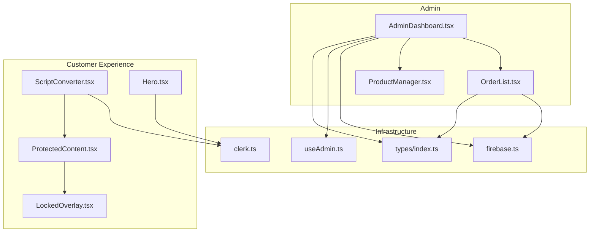
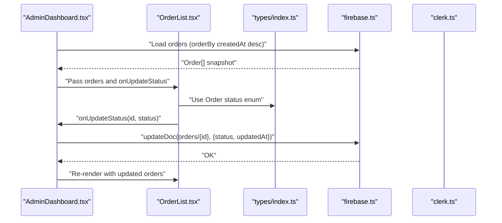
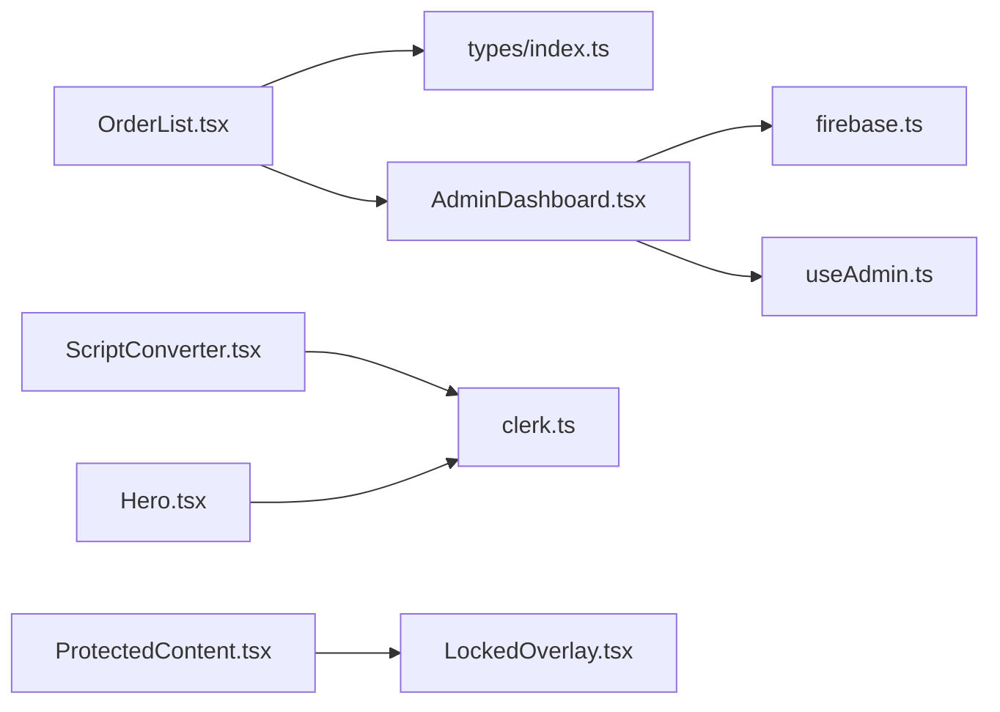
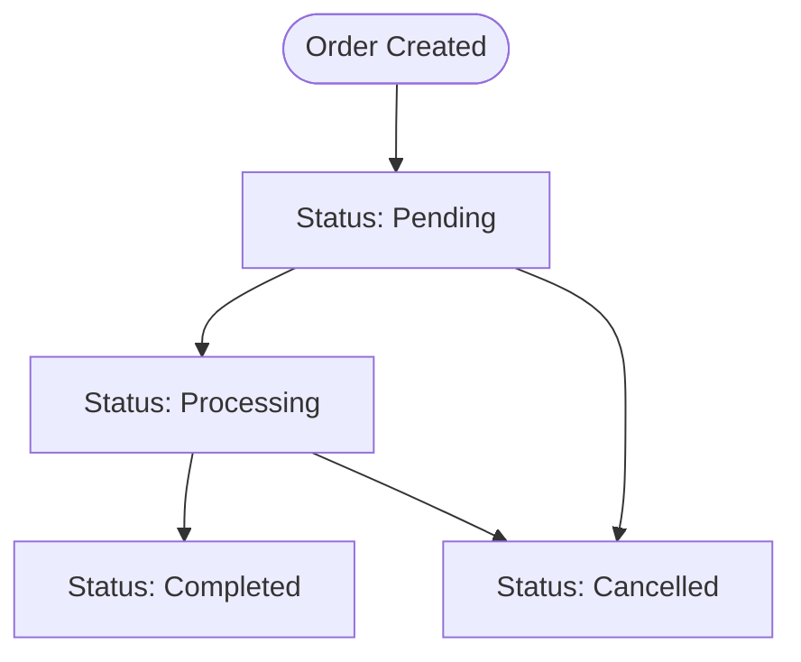

# Order Tracking and Management

<cite>
**Referenced Files in This Document**
- [OrderList.tsx](file://src/components/admin/OrderList.tsx)
- [AdminDashboard.tsx](file://src/components/admin/AdminDashboard.tsx)
- [firebase.ts](file://src/config/firebase.ts)
- [index.ts](file://src/types/index.ts)
- [clerk.ts](file://src/config/clerk.ts)
- [useAdmin.ts](file://src/hooks/useAdmin.ts)
- [ScriptConverter.tsx](file://src/components/home/ScriptConverter.tsx)
- [Hero.tsx](file://src/components/home/Hero.tsx)
- [ProductManager.tsx](file://src/components/admin/ProductManager.tsx)
- [ProtectedContent.tsx](file://src/components/auth/ProtectedContent.tsx)
- [LockedOverlay.tsx](file://src/components/auth/LockedOverlay.tsx)
</cite>

## Table of Contents
1. [Introduction](#introduction)
2. [Project Structure](#project-structure)
3. [Core Components](#core-components)
4. [Architecture Overview](#architecture-overview)
5. [Detailed Component Analysis](#detailed-component-analysis)
6. [Dependency Analysis](#dependency-analysis)
7. [Performance Considerations](#performance-considerations)
8. [Troubleshooting Guide](#troubleshooting-guide)
9. [Conclusion](#conclusion)
10. [Appendices](#appendices)

## Introduction
This document explains the OrderList component and the broader order tracking and management system. It covers the order data model, status management workflows, real-time synchronization with Firebase, filtering and sorting capabilities, customer communication via WhatsApp, order history tracking, and guidance for extending the system with analytics, reporting, payment integrations, and customer service workflows.

## Project Structure
The order management feature centers around the AdminDashboard, which loads orders from Firestore and renders the OrderList component. Customer-facing pages integrate with WhatsApp for initiating orders. The system uses Clerk for authentication and admin authorization.

**Diagram sources**
- [AdminDashboard.tsx:18-185](file://src/components/admin/AdminDashboard.tsx#L18-L185)
- [OrderList.tsx:15-90](file://src/components/admin/OrderList.tsx#L15-L90)
- [ProductManager.tsx:22-220](file://src/components/admin/ProductManager.tsx#L22-L220)
- [ScriptConverter.tsx:9-187](file://src/components/home/ScriptConverter.tsx#L9-L187)
- [Hero.tsx:1-109](file://src/components/home/Hero.tsx#L1-L109)
- [ProtectedContent.tsx:10-43](file://src/components/auth/ProtectedContent.tsx#L10-L43)
- [LockedOverlay.tsx:3-60](file://src/components/auth/LockedOverlay.tsx#L3-L60)
- [firebase.ts:1-19](file://src/config/firebase.ts#L1-L19)
- [clerk.ts:1-4](file://src/config/clerk.ts#L1-L4)
- [useAdmin.ts:4-13](file://src/hooks/useAdmin.ts#L4-L13)
- [index.ts:14-27](file://src/types/index.ts#L14-L27)

**Section sources**
- [AdminDashboard.tsx:18-185](file://src/components/admin/AdminDashboard.tsx#L18-L185)
- [OrderList.tsx:15-90](file://src/components/admin/OrderList.tsx#L15-L90)
- [firebase.ts:1-19](file://src/config/firebase.ts#L1-L19)
- [index.ts:14-27](file://src/types/index.ts#L14-L27)

## Core Components
- OrderList: Renders a list of orders with status badges and a dropdown to update status. It receives orders and an update handler from AdminDashboard.
- AdminDashboard: Loads services and orders from Firestore, exposes tabs for products and orders, and handles order status updates.
- Types: Defines the Order interface and related enums used across components.
- Firebase: Initializes Firestore and exports db for persistence.
- Clerk + useAdmin: Provides admin authorization and integrates with WhatsApp number configuration.

Key responsibilities:
- OrderList displays order metadata and status, and triggers updates via props.
- AdminDashboard orchestrates data loading, admin checks, and status updates.
- Types define the canonical order shape and status values.
- Firebase provides the backend for real-time-like updates via client-side reads/writes.
- Clerk controls who can access the admin area and supplies the WhatsApp number for customer communication.

**Section sources**
- [OrderList.tsx:15-90](file://src/components/admin/OrderList.tsx#L15-L90)
- [AdminDashboard.tsx:25-72](file://src/components/admin/AdminDashboard.tsx#L25-L72)
- [index.ts:14-27](file://src/types/index.ts#L14-L27)
- [firebase.ts:14-18](file://src/config/firebase.ts#L14-L18)
- [useAdmin.ts:4-13](file://src/hooks/useAdmin.ts#L4-L13)
- [clerk.ts:1-4](file://src/config/clerk.ts#L1-L4)

## Architecture Overview
The order management architecture is client-driven with Firestore as the persistence layer. AdminDashboard loads orders and services, then passes them down to OrderList. Status updates are persisted to Firestore and reflected immediately in the UI.

**Diagram sources**
- [AdminDashboard.tsx:25-72](file://src/components/admin/AdminDashboard.tsx#L25-L72)
- [OrderList.tsx:15-90](file://src/components/admin/OrderList.tsx#L15-L90)
- [index.ts:14-27](file://src/types/index.ts#L14-L27)
- [firebase.ts:14-18](file://src/config/firebase.ts#L14-L18)
- [clerk.ts:1-4](file://src/config/clerk.ts#L1-L4)

## Detailed Component Analysis

### OrderList Component
Purpose:
- Render a grid of orders with service title, customer info, file metadata (optional), status badge, and a status selector.

Behavior:
- Displays a message when there are no orders.
- Renders a row per order with:
  - Service title
  - Customer name and email
  - Optional file name
  - Status badge with color-coded styling
  - Dropdown to change status among pending, processing, completed, cancelled
- Calls onUpdateStatus with the order id and selected status when changed.

Status management:
- Uses a color map for status values.
- Enforces the allowed status values via the select options.

Real-time updates:
- The parent AdminDashboard updates the local state after a successful Firestore write, reflecting changes instantly.

Accessibility and UX:
- Uses monospace font for technical labels.
- Responsive grid layout with glass panel styling.

**Section sources**
- [OrderList.tsx:15-90](file://src/components/admin/OrderList.tsx#L15-L90)
- [index.ts:21](file://src/types/index.ts#L21)

### AdminDashboard Component
Responsibilities:
- Admin authorization via useAdmin hook.
- Load services and orders from Firestore using orderBy queries.
- Provide tabs to switch between products and orders.
- Manage loading states and render appropriate UI when not signed in or not authorized.
- Handle order status updates by writing to Firestore and updating local state.

Order loading:
- Queries the orders collection sorted by createdAt descending.

Order updates:
- Writes status and updatedAt to Firestore.
- Updates the local orders array to reflect the change immediately.

Product management:
- Delegates to ProductManager for CRUD operations on services.

**Section sources**
- [AdminDashboard.tsx:18-185](file://src/components/admin/AdminDashboard.tsx#L18-L185)
- [useAdmin.ts:4-13](file://src/hooks/useAdmin.ts#L4-L13)
- [ProductManager.tsx:22-220](file://src/components/admin/ProductManager.tsx#L22-L220)

### Order Data Model
The Order interface defines the canonical structure for orders stored in Firestore.

Fields:
- id: Unique identifier
- serviceId, serviceTitle: Link to the service ordered
- userId, userEmail, userName: Customer identity
- status: One of pending, processing, completed, cancelled
- fileName, fileType: Optional file metadata for upload-based services
- notes: Optional free-form notes
- createdAt, updatedAt: Timestamps for creation and last update

Constraints:
- Status is an enum with four allowed values.
- Optional fields support file-based orders.

**Section sources**
- [index.ts:14-27](file://src/types/index.ts#L14-L27)

### Real-Time Synchronization with Firebase
Current implementation:
- AdminDashboard loads orders and services on mount and on admin status changes.
- Order status updates are persisted via updateDoc and reflected locally.

Limitations:
- There is no real-time listener attached to the orders collection in the current code.
- Changes made by other clients or admins may not be reflected until the page reloads or the component remounts.

Recommendations:
- Add a Firestore listener (onSnapshot) to orders collection to receive real-time updates.
- Debounce or batch updates to avoid excessive re-renders.
- Handle connection errors and offline scenarios gracefully.

**Section sources**
- [AdminDashboard.tsx:25-52](file://src/components/admin/AdminDashboard.tsx#L25-L52)
- [AdminDashboard.tsx:67-72](file://src/components/admin/AdminDashboard.tsx#L67-L72)
- [firebase.ts:14-18](file://src/config/firebase.ts#L14-L18)

### Filtering and Sorting Capabilities
Sorting:
- AdminDashboard sorts orders by createdAt descending using orderBy.

Filtering:
- The current implementation does not apply filters on the frontend.
- Filtering can be added by:
  - Adding filter controls (status, date range, customer name)
  - Applying filters to the orders array before rendering
  - Or, using Firestore queries with where clauses for server-side filtering

Bulk Operations:
- Not implemented in the current code.
- Can be implemented by:
  - Selecting multiple orders
  - Providing actions (e.g., bulk status update)
  - Performing batch writes to Firestore

**Section sources**
- [AdminDashboard.tsx:38-43](file://src/components/admin/AdminDashboard.tsx#L38-L43)
- [OrderList.tsx:66-85](file://src/components/admin/OrderList.tsx#L66-L85)

### Customer Communication via WhatsApp
Integration points:
- ScriptConverter constructs a pre-filled WhatsApp message with file metadata and opens wa.me with the message text.
- Hero provides a quick WhatsApp order button using the configured WhatsApp number.
- Clerk configuration provides WHATSAPP_NUMBER for use across components.

Workflow:
- Customer selects a file and clicks “Order via WhatsApp.”
- The app composes a message with file details and opens the WhatsApp app/web client.
- Admin receives the order request and can manage it via the AdminDashboard.

**Section sources**
- [ScriptConverter.tsx:49-55](file://src/components/home/ScriptConverter.tsx#L49-L55)
- [Hero.tsx:9-14](file://src/components/home/Hero.tsx#L9-L14)
- [clerk.ts:3](file://src/config/clerk.ts#L3)

### Order History Tracking
Current state:
- Orders are loaded with createdAt descending, so the latest appear first.
- Each order stores createdAt and updatedAt timestamps.

Enhancement ideas:
- Add a dedicated “History” tab or view to show completed/cancelled orders with additional filters.
- Persist additional audit logs (who changed status, when) if needed.

**Section sources**
- [AdminDashboard.tsx:38-43](file://src/components/admin/AdminDashboard.tsx#L38-L43)
- [index.ts:24-26](file://src/types/index.ts#L24-L26)

### Notes and Customization
Notes field:
- The Order interface includes an optional notes field.
- The current OrderList does not display notes.
- To add notes display:
  - Extend the OrderList row to show notes below customer info.
  - Provide an inline editor or modal to edit notes.

Custom statuses:
- The current status values are fixed in the select options.
- To add custom statuses:
  - Extend the Order.status union type.
  - Update the select options and status color map.
  - Ensure AdminDashboard and Firestore rules accommodate the new status.

**Section sources**
- [index.ts:24](file://src/types/index.ts#L24)
- [OrderList.tsx:8-13](file://src/components/admin/OrderList.tsx#L8-L13)
- [OrderList.tsx:81-84](file://src/components/admin/OrderList.tsx#L81-L84)

### Bulk Order Operations
Not implemented in the current codebase. Implementation approach:
- Add selection checkboxes to rows in OrderList.
- Provide a toolbar with actions (e.g., “Set Status to Processing”).
- On action, iterate selected orders and perform batch updates to Firestore.
- Show progress and error feedback.

**Section sources**
- [OrderList.tsx:28-87](file://src/components/admin/OrderList.tsx#L28-L87)

### Analytics and Reporting
Not implemented in the current codebase. Suggested approach:
- Add a new tab in AdminDashboard for analytics.
- Compute metrics client-side from loaded orders (e.g., counts by status, revenue if applicable).
- Integrate with external analytics services or export CSV for external reporting.

**Section sources**
- [AdminDashboard.tsx:132-165](file://src/components/admin/AdminDashboard.tsx#L132-L165)

### Payment Systems Integration
Not implemented in the current codebase. Suggested approach:
- Add a payment status field to the Order interface.
- Integrate with a payment provider SDK (e.g., Stripe) to collect payments.
- Update order status upon payment confirmation.
- Store payment metadata (e.g., transactionId) in the order record.

**Section sources**
- [index.ts:14-27](file://src/types/index.ts#L14-L27)

### Disputes, Cancellations, and Customer Service Workflows
Not implemented in the current codebase. Suggested approach:
- Add dispute and cancellation reasons to the Order interface.
- Provide admin actions to escalate or resolve disputes.
- Track resolution timestamps and outcomes.
- Send automated notifications via WhatsApp or email when statuses change.

**Section sources**
- [index.ts:14-27](file://src/types/index.ts#L14-L27)

## Dependency Analysis
High-level dependencies:
- AdminDashboard depends on Clerk for admin checks and Firebase for data.
- OrderList depends on types for status values and on AdminDashboard for data and callbacks.
- Customer-facing components depend on Clerk configuration for WhatsApp number.

**Diagram sources**
- [OrderList.tsx:15-90](file://src/components/admin/OrderList.tsx#L15-L90)
- [AdminDashboard.tsx:18-185](file://src/components/admin/AdminDashboard.tsx#L18-L185)
- [firebase.ts:14-18](file://src/config/firebase.ts#L14-L18)
- [useAdmin.ts:4-13](file://src/hooks/useAdmin.ts#L4-L13)
- [ScriptConverter.tsx:3](file://src/components/home/ScriptConverter.tsx#L3)
- [Hero.tsx:3](file://src/components/home/Hero.tsx#L3)
- [ProtectedContent.tsx:10-43](file://src/components/auth/ProtectedContent.tsx#L10-L43)
- [LockedOverlay.tsx:3-60](file://src/components/auth/LockedOverlay.tsx#L3-L60)
- [clerk.ts:1-4](file://src/config/clerk.ts#L1-L4)
- [index.ts:14-27](file://src/types/index.ts#L14-L27)

**Section sources**
- [OrderList.tsx:15-90](file://src/components/admin/OrderList.tsx#L15-L90)
- [AdminDashboard.tsx:18-185](file://src/components/admin/AdminDashboard.tsx#L18-L185)
- [firebase.ts:14-18](file://src/config/firebase.ts#L14-L18)
- [useAdmin.ts:4-13](file://src/hooks/useAdmin.ts#L4-L13)
- [ScriptConverter.tsx:3](file://src/components/home/ScriptConverter.tsx#L3)
- [Hero.tsx:3](file://src/components/home/Hero.tsx#L3)
- [ProtectedContent.tsx:10-43](file://src/components/auth/ProtectedContent.tsx#L10-L43)
- [LockedOverlay.tsx:3-60](file://src/components/auth/LockedOverlay.tsx#L3-L60)
- [clerk.ts:1-4](file://src/config/clerk.ts#L1-L4)
- [index.ts:14-27](file://src/types/index.ts#L14-L27)

## Performance Considerations
- Current loading uses getDocs on mount; consider pagination or lazy loading for large datasets.
- Avoid unnecessary re-renders by memoizing order lists and using stable references for handlers.
- Debounce status updates to reduce Firestore writes during rapid changes.
- Consider virtualized lists for long order histories.

## Troubleshooting Guide
Common issues and resolutions:
- Admin access denied:
  - Ensure the signed-in user’s primary email matches the configured ADMIN_EMAIL.
- Orders not appearing:
  - Verify Firestore has documents under the orders collection.
  - Confirm orderBy queries are executed and no errors occur during load.
- Status updates not reflected:
  - Check that updateDoc completes successfully and local state is updated.
  - Consider adding a real-time listener for immediate updates.
- WhatsApp links not opening:
  - Confirm WHATSAPP_NUMBER is configured and accessible in the environment.
  - Ensure the message composition logic is invoked only when a file is selected and the user is signed in.

**Section sources**
- [useAdmin.ts:7-10](file://src/hooks/useAdmin.ts#L7-L10)
- [AdminDashboard.tsx:44-49](file://src/components/admin/AdminDashboard.tsx#L44-L49)
- [AdminDashboard.tsx:67-72](file://src/components/admin/AdminDashboard.tsx#L67-L72)
- [clerk.ts:2-3](file://src/config/clerk.ts#L2-L3)
- [ScriptConverter.tsx:49-55](file://src/components/home/ScriptConverter.tsx#L49-L55)
- [ProtectedContent.tsx:31-42](file://src/components/auth/ProtectedContent.tsx#L31-L42)

## Conclusion
The OrderList component provides a focused interface for managing order statuses, backed by Firestore for persistence. The AdminDashboard centralizes data loading and updates, while Clerk governs access and integrates with WhatsApp for customer communication. Extending the system involves adding real-time listeners, filters/sorting, bulk operations, analytics/reporting, payment integration, and structured workflows for disputes and cancellations.

## Appendices

### Order Status Flow

[No sources needed since this diagram shows conceptual workflow, not actual code structure]