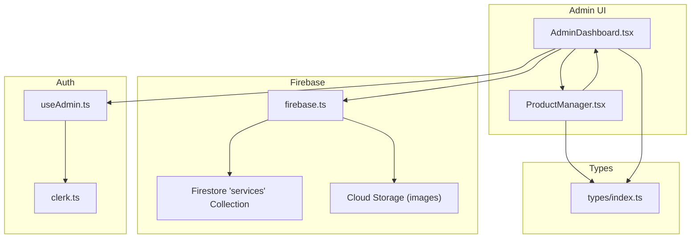
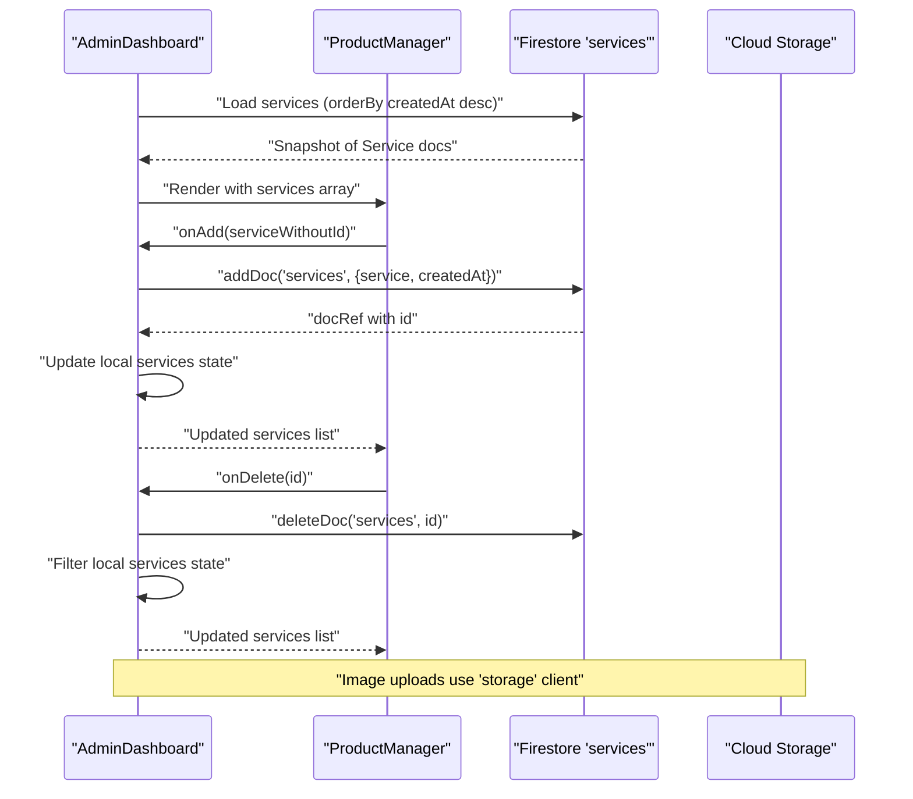
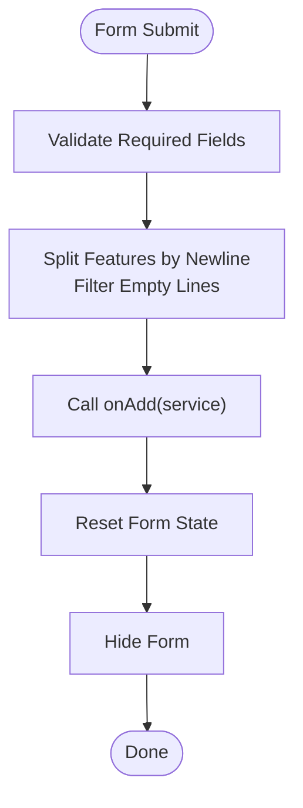
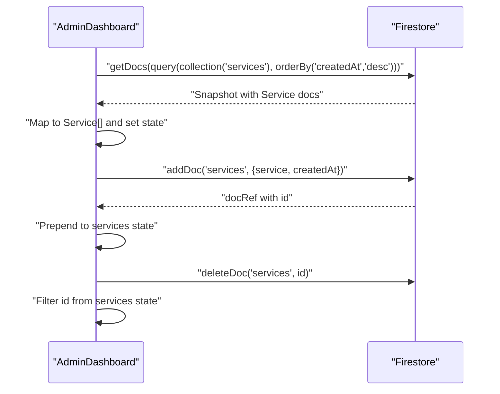
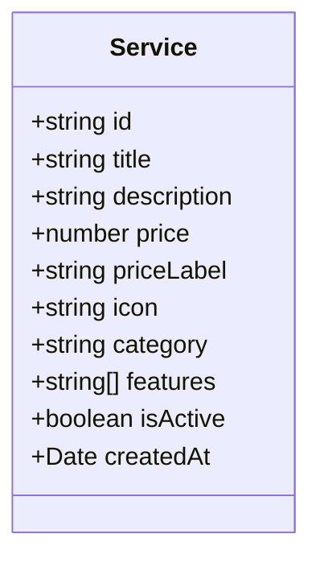
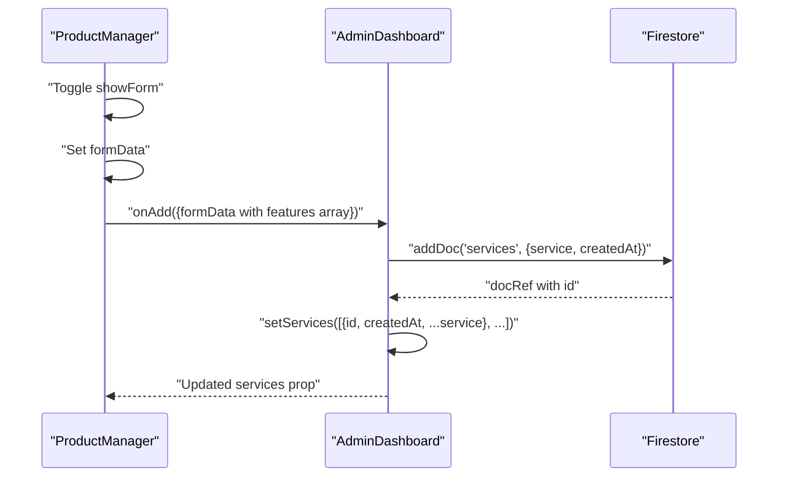
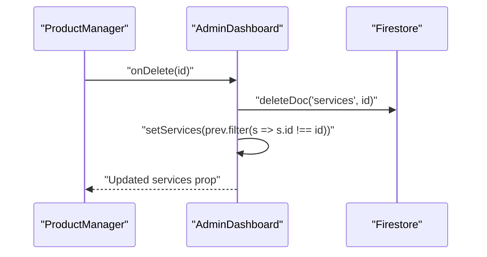
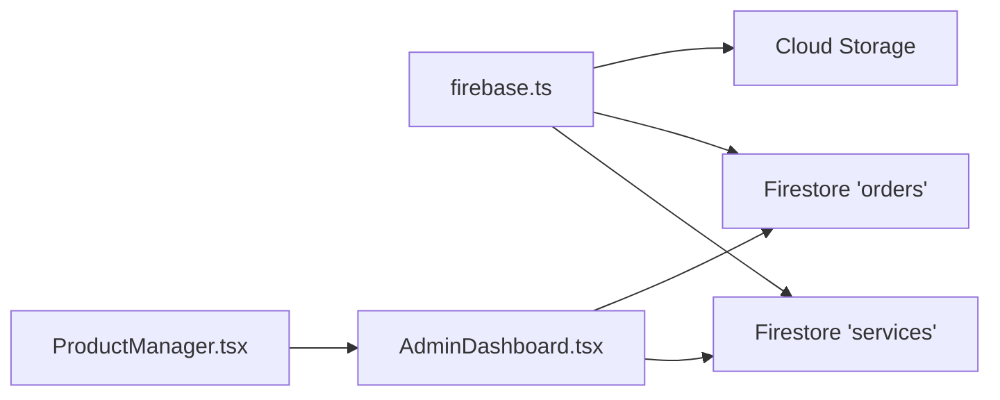
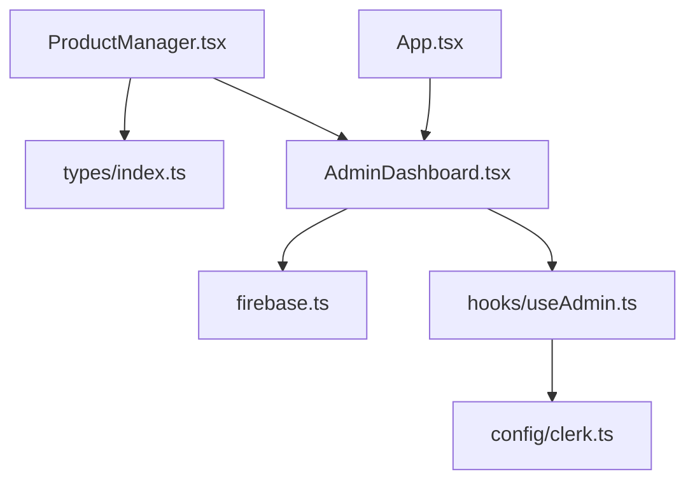

# Product Management System

<cite>
**Referenced Files in This Document**
- [ProductManager.tsx](file://src/components/admin/ProductManager.tsx)
- [AdminDashboard.tsx](file://src/components/admin/AdminDashboard.tsx)
- [firebase.ts](file://src/config/firebase.ts)
- [index.ts](file://src/types/index.ts)
- [useAdmin.ts](file://src/hooks/useAdmin.ts)
- [clerk.ts](file://src/config/clerk.ts)
- [App.tsx](file://src/App.tsx)
</cite>

## Table of Contents
1. [Introduction](#introduction)
2. [Project Structure](#project-structure)
3. [Core Components](#core-components)
4. [Architecture Overview](#architecture-overview)
5. [Detailed Component Analysis](#detailed-component-analysis)
6. [Dependency Analysis](#dependency-analysis)
7. [Performance Considerations](#performance-considerations)
8. [Troubleshooting Guide](#troubleshooting-guide)
9. [Conclusion](#conclusion)

## Introduction
This document provides comprehensive documentation for the ProductManager component responsible for service catalog management. It covers CRUD operations for service creation, editing, and deletion, integration with Firebase Firestore for real-time data synchronization, the service data model, validation requirements, form handling patterns, and practical guidance for extending the system with new service types, categories, bulk operations, search/filtering, image uploads, and availability management. It also includes troubleshooting guidance for common product management issues and data consistency problems.

## Project Structure
The product management system is organized around a dedicated admin dashboard that integrates with Firebase Firestore for persistence. The ProductManager component manages the service catalog UI and form interactions, while the AdminDashboard orchestrates data loading, updates, and deletion operations. Firebase configuration is centralized, and TypeScript types define the service model.

**Diagram sources**
- [AdminDashboard.tsx:1-185](file://src/components/admin/AdminDashboard.tsx#L1-L185)
- [ProductManager.tsx:1-221](file://src/components/admin/ProductManager.tsx#L1-L221)
- [firebase.ts:1-19](file://src/config/firebase.ts#L1-L19)
- [index.ts:1-40](file://src/types/index.ts#L1-L40)
- [useAdmin.ts:1-14](file://src/hooks/useAdmin.ts#L1-L14)
- [clerk.ts:1-4](file://src/config/clerk.ts#L1-L4)

**Section sources**
- [AdminDashboard.tsx:1-185](file://src/components/admin/AdminDashboard.tsx#L1-L185)
- [ProductManager.tsx:1-221](file://src/components/admin/ProductManager.tsx#L1-L221)
- [firebase.ts:1-19](file://src/config/firebase.ts#L1-L19)
- [index.ts:1-40](file://src/types/index.ts#L1-L40)
- [useAdmin.ts:1-14](file://src/hooks/useAdmin.ts#L1-L14)
- [clerk.ts:1-4](file://src/config/clerk.ts#L1-L4)

## Core Components
- ProductManager: Renders the service catalog UI, manages the add-service form, and delegates CRUD actions via props.
- AdminDashboard: Loads services from Firestore, exposes handlers for add/delete/update, and renders ProductManager.
- Firebase Config: Initializes Firestore and Cloud Storage clients.
- Types: Defines the Service interface and related models.
- Authentication: Admin access control using Clerk and a dedicated admin email configuration.

Key responsibilities:
- Service creation: Validates form inputs, splits multiline features, and persists to Firestore.
- Service deletion: Removes documents and updates local state.
- Data synchronization: Firestore queries populate the UI; local state mirrors remote changes.
- Form handling: Controlled components with structured state updates.

**Section sources**
- [ProductManager.tsx:22-52](file://src/components/admin/ProductManager.tsx#L22-L52)
- [AdminDashboard.tsx:25-72](file://src/components/admin/AdminDashboard.tsx#L25-L72)
- [firebase.ts:1-19](file://src/config/firebase.ts#L1-L19)
- [index.ts:1-12](file://src/types/index.ts#L1-L12)
- [useAdmin.ts:4-12](file://src/hooks/useAdmin.ts#L4-L12)
- [clerk.ts:1-4](file://src/config/clerk.ts#L1-L4)

## Architecture Overview
The system follows a client-driven architecture:
- AdminDashboard initializes Firebase and loads data on mount.
- ProductManager renders the form and list, delegating persistence to AdminDashboard handlers.
- Firestore collections store services and orders; Cloud Storage is available for images.
- Clerk enforces admin-only access.

**Diagram sources**
- [AdminDashboard.tsx:25-72](file://src/components/admin/AdminDashboard.tsx#L25-L72)
- [ProductManager.tsx:22-52](file://src/components/admin/ProductManager.tsx#L22-L52)
- [firebase.ts:16-17](file://src/config/firebase.ts#L16-L17)

## Detailed Component Analysis

### ProductManager Component
Responsibilities:
- Toggle add-service form visibility.
- Manage form state for title, description, price, price label, icon, category, features, and active flag.
- Submit handler transforms multiline features into an array and invokes the parent's add handler.
- Render a list of existing services with delete buttons.

Implementation highlights:
- Controlled form inputs with a single state object.
- Features input expects one feature per line; submitted features are split and filtered.
- Category dropdown supports three predefined values.
- Delete action triggers the parent's onDelete handler.

**Diagram sources**
- [ProductManager.tsx:35-52](file://src/components/admin/ProductManager.tsx#L35-L52)

**Section sources**
- [ProductManager.tsx:22-52](file://src/components/admin/ProductManager.tsx#L22-L52)
- [ProductManager.tsx:176-216](file://src/components/admin/ProductManager.tsx#L176-L216)

### AdminDashboard Component
Responsibilities:
- Load services and orders from Firestore on admin initialization.
- Expose handlers for add, delete, and order status updates.
- Maintain local state synchronized with Firestore operations.

Firestore operations:
- Services: Query with ordering by creation date.
- Orders: Query with ordering by creation date.
- Add/Delete/Update: Direct document mutations.

**Diagram sources**
- [AdminDashboard.tsx:25-72](file://src/components/admin/AdminDashboard.tsx#L25-L72)

**Section sources**
- [AdminDashboard.tsx:18-72](file://src/components/admin/AdminDashboard.tsx#L18-L72)

### Service Data Model
The Service interface defines the canonical shape for service records stored in Firestore.

**Diagram sources**
- [index.ts:1-12](file://src/types/index.ts#L1-L12)

Validation and constraints:
- Required fields: title, description, priceLabel, description.
- Numeric field: price must be a number.
- Category enum: digital | local | custom.
- Features: array of strings; empty lines are removed during submission.
- isActive: boolean flag indicating availability.
- createdAt: server-side timestamp managed by Firestore.

**Section sources**
- [index.ts:1-12](file://src/types/index.ts#L1-L12)
- [ProductManager.tsx:37-40](file://src/components/admin/ProductManager.tsx#L37-L40)

### Form Handling Patterns
Patterns used in ProductManager:
- Controlled components: Each input updates a single state object.
- Multiline feature parsing: Newline-separated features become an array.
- Category selection: Enum-based select mapped to the Service category type.
- Required fields: HTML5 required attributes complement client-side validation.

Best practices:
- Normalize feature input by splitting and filtering.
- Keep form state flat and consistent with the Service interface.
- Use explicit types for category and numeric fields.

**Section sources**
- [ProductManager.tsx:24-52](file://src/components/admin/ProductManager.tsx#L24-L52)

### CRUD Workflows

#### Service Creation
- Trigger: Clicking the "Add Product" button toggles the form.
- Input: Fill title, price label, price, icon, category, description, features.
- Processing: Submit handler constructs the payload and calls onAdd.
- Persistence: AdminDashboard adds a document to the 'services' collection with createdAt.
- UI: Prepend the new service to the top of the list.

**Diagram sources**
- [ProductManager.tsx:35-52](file://src/components/admin/ProductManager.tsx#L35-L52)
- [AdminDashboard.tsx:54-60](file://src/components/admin/AdminDashboard.tsx#L54-L60)

**Section sources**
- [ProductManager.tsx:35-52](file://src/components/admin/ProductManager.tsx#L35-L52)
- [AdminDashboard.tsx:54-60](file://src/components/admin/AdminDashboard.tsx#L54-L60)

#### Service Deletion
- Trigger: Clicking the "Delete" button on a service item.
- Processing: Parent passes the service id to onDelete.
- Persistence: AdminDashboard deletes the document from 'services'.
- UI: Filter out the deleted service from local state.

**Diagram sources**
- [ProductManager.tsx:199-213](file://src/components/admin/ProductManager.tsx#L199-L213)
- [AdminDashboard.tsx:62-65](file://src/components/admin/AdminDashboard.tsx#L62-L65)

**Section sources**
- [ProductManager.tsx:199-213](file://src/components/admin/ProductManager.tsx#L199-L213)
- [AdminDashboard.tsx:62-65](file://src/components/admin/AdminDashboard.tsx#L62-L65)

#### Service Editing
Current implementation:
- The ProductManager does not expose an edit form.
- To support editing, extend ProductManager with:
  - An edit mode toggle.
  - A form pre-populated with selected service data.
  - A handler that calls an update function passed as a prop.

Firestore update pattern:
- Use updateDoc on the service document reference.
- Update only changed fields to minimize conflicts.

Note: The current AdminDashboard focuses on add and delete operations. Extending it to support updates would involve:
- Adding an onUpdate handler prop to ProductManager.
- Implementing a handler in AdminDashboard similar to handleAddService and handleDeleteService.

**Section sources**
- [ProductManager.tsx:4-8](file://src/components/admin/ProductManager.tsx#L4-L8)
- [AdminDashboard.tsx:54-72](file://src/components/admin/AdminDashboard.tsx#L54-L72)

### Integration with Firebase Firestore
- Initialization: Firebase app initialized with environment variables.
- Clients: Firestore db and Cloud Storage storage exported for use.
- Collections: 'services' for service catalog, 'orders' for order management.
- Queries: Ordered by createdAt descending for consistent display.
- Mutations: addDoc, deleteDoc, updateDoc for CRUD operations.

**Diagram sources**
- [firebase.ts:1-19](file://src/config/firebase.ts#L1-L19)
- [AdminDashboard.tsx:3-13](file://src/components/admin/AdminDashboard.tsx#L3-L13)
- [ProductManager.tsx:22-52](file://src/components/admin/ProductManager.tsx#L22-L52)

**Section sources**
- [firebase.ts:1-19](file://src/config/firebase.ts#L1-L19)
- [AdminDashboard.tsx:25-72](file://src/components/admin/AdminDashboard.tsx#L25-L72)

### Service Categories and Types
Supported categories:
- digital: Online/deliverable services.
- local: On-site or location-based services.
- custom: Tailored services requiring consultation.

Extending categories:
- Add new category values to the Service.category union type.
- Update the ProductManager category select options.
- Ensure AdminDashboard handlers and UI accommodate the new category consistently.

**Section sources**
- [index.ts:8-8](file://src/types/index.ts#L8-L8)
- [ProductManager.tsx:128-136](file://src/components/admin/ProductManager.tsx#L128-L136)

### Bulk Operations
Current implementation:
- No built-in bulk actions in ProductManager.

Recommended approach:
- Add a bulk selection mechanism (checkboxes) in the service list.
- Implement batch handlers for:
  - Delete selected items (loop deleteDoc and update state).
  - Update category/status in bulk (loop updateDoc and update state).
- Use transaction or batch writes for atomicity when available.

Note: Firestore SDK supports write batches; integrate with AdminDashboard handlers to apply bulk updates.

**Section sources**
- [AdminDashboard.tsx:62-72](file://src/components/admin/AdminDashboard.tsx#L62-L72)

### Search and Filtering
Current implementation:
- No search or filter UI in ProductManager.

Recommended approach:
- Add a filter bar with category and keyword filters.
- Apply filters client-side on the services array.
- For large datasets, consider server-side filtering with Firestore queries.

Example filters:
- Category dropdown: digital | local | custom | all.
- Keyword search: match against title, description, features.

**Section sources**
- [ProductManager.tsx:176-216](file://src/components/admin/ProductManager.tsx#L176-L216)

### Image Upload Integration
Current implementation:
- Cloud Storage client is available but not used in ProductManager.

Recommended approach:
- Add an image upload field to the service form.
- Upload to Cloud Storage and store the download URL in the service document.
- Update the Service interface to include imageUrl if needed.

Integration points:
- Use the storage client exported from firebase.ts.
- Update AdminDashboard handlers to persist image URLs alongside service data.

**Section sources**
- [firebase.ts:16-17](file://src/config/firebase.ts#L16-L17)
- [AdminDashboard.tsx:54-60](file://src/components/admin/AdminDashboard.tsx#L54-L60)

### Service Availability Management
Current implementation:
- isActive flag exists in the Service interface.
- ProductManager form includes isActive but does not expose it in the list.

Recommended approach:
- Add availability toggle in ProductManager list items.
- Persist isActive updates via updateDoc in AdminDashboard.
- Filter services by isActive when rendering the public catalog.

**Section sources**
- [index.ts:10-10](file://src/types/index.ts#L10-L10)
- [ProductManager.tsx:24-33](file://src/components/admin/ProductManager.tsx#L24-L33)

## Dependency Analysis
Component and module relationships:
- ProductManager depends on Service type and receives CRUD handlers via props.
- AdminDashboard depends on Firebase clients, Clerk hooks, and manages Firestore operations.
- useAdmin determines admin access using Clerk user info and a configured admin email.
- firebase.ts centralizes Firebase initialization and exports clients.

**Diagram sources**
- [ProductManager.tsx:1-8](file://src/components/admin/ProductManager.tsx#L1-L8)
- [AdminDashboard.tsx:1-16](file://src/components/admin/AdminDashboard.tsx#L1-L16)
- [firebase.ts:1-19](file://src/config/firebase.ts#L1-L19)
- [useAdmin.ts:1-14](file://src/hooks/useAdmin.ts#L1-L14)
- [clerk.ts:1-4](file://src/config/clerk.ts#L1-L4)
- [App.tsx:11-11](file://src/App.tsx#L11-L11)

**Section sources**
- [ProductManager.tsx:1-8](file://src/components/admin/ProductManager.tsx#L1-L8)
- [AdminDashboard.tsx:1-16](file://src/components/admin/AdminDashboard.tsx#L1-L16)
- [firebase.ts:1-19](file://src/config/firebase.ts#L1-L19)
- [useAdmin.ts:1-14](file://src/hooks/useAdmin.ts#L1-L14)
- [clerk.ts:1-4](file://src/config/clerk.ts#L1-L4)
- [App.tsx:11-11](file://src/App.tsx#L11-L11)

## Performance Considerations
- Firestore queries: Use orderBy and limit where appropriate to reduce payload size.
- Client-side rendering: For large catalogs, consider pagination or virtualization.
- State updates: Batch UI updates after Firestore writes to avoid excessive re-renders.
- Images: Lazy-load images and use thumbnails to improve perceived performance.
- Admin access checks: Ensure useAdmin runs efficiently and avoids unnecessary re-renders.

## Troubleshooting Guide
Common issues and resolutions:
- Admin access denied:
  - Verify ADMIN_EMAIL environment variable matches the admin's primary email.
  - Confirm Clerk user is signed in and identity is loaded.
- Firestore permission errors:
  - Check Firestore rules allow read/write for admin operations.
  - Ensure collection names match 'services' and 'orders'.
- Feature parsing issues:
  - Ensure features are entered one per line; empty lines are ignored.
- Price input errors:
  - Confirm price is numeric; invalid entries will cause Number conversion issues.
- Duplicate or missing createdAt:
  - AdminDashboard sets createdAt on add; verify the field is present in snapshots.
- Real-time sync inconsistencies:
  - Firestore reads are immediate; ensure UI updates occur after successful write operations.
- Image upload failures:
  - Confirm storage bucket permissions and network connectivity.
  - Verify upload paths and filenames are valid.

**Section sources**
- [useAdmin.ts:7-10](file://src/hooks/useAdmin.ts#L7-L10)
- [clerk.ts:2-2](file://src/config/clerk.ts#L2-L2)
- [AdminDashboard.tsx:54-60](file://src/components/admin/AdminDashboard.tsx#L54-L60)
- [ProductManager.tsx:37-40](file://src/components/admin/ProductManager.tsx#L37-L40)

## Conclusion
The ProductManager component provides a focused UI for service catalog management, integrating seamlessly with Firestore for persistence and Clerk for admin access control. While the current implementation emphasizes add and delete operations, extending it with editing, bulk actions, search/filtering, image uploads, and availability controls is straightforward. By leveraging the established patterns for form handling, state updates, and Firestore operations, teams can evolve the system to meet advanced product management needs while maintaining data consistency and a responsive user experience.