# Application Architecture

<cite>
**Referenced Files in This Document**
- [App.tsx](file://src/App.tsx)
- [main.tsx](file://src/main.tsx)
- [MenuBar.tsx](file://src/components/layout/MenuBar.tsx)
- [Footer.tsx](file://src/components/layout/Footer.tsx)
- [Hero.tsx](file://src/components/home/Hero.tsx)
- [ServicesGrid.tsx](file://src/components/home/ServicesGrid.tsx)
- [ScriptConverter.tsx](file://src/components/home/ScriptConverter.tsx)
- [LocalSupport.tsx](file://src/components/home/LocalSupport.tsx)
- [AdminDashboard.tsx](file://src/components/admin/AdminDashboard.tsx)
- [ProtectedContent.tsx](file://src/components/auth/ProtectedContent.tsx)
- [LockedOverlay.tsx](file://src/components/auth/LockedOverlay.tsx)
- [useAdmin.ts](file://src/hooks/useAdmin.ts)
- [clerk.ts](file://src/config/clerk.ts)
- [firebase.ts](file://src/config/firebase.ts)
- [index.ts](file://src/types/index.ts)
- [package.json](file://package.json)
</cite>

## Table of Contents
1. [Introduction](#introduction)
2. [Project Structure](#project-structure)
3. [Core Components](#core-components)
4. [Architecture Overview](#architecture-overview)
5. [Detailed Component Analysis](#detailed-component-analysis)
6. [Dependency Analysis](#dependency-analysis)
7. [Performance Considerations](#performance-considerations)
8. [Troubleshooting Guide](#troubleshooting-guide)
9. [Conclusion](#conclusion)

## Introduction
This document describes DevForge’s component-based architecture, focusing on:
- Provider Pattern for authentication state management via Clerk
- Component Composition for modular UI structure
- Hook Pattern for encapsulating business logic
- Routing architecture with protected routes and authentication guards
- Component hierarchy from the App root to feature components
- State management combining React hooks with external services (Clerk and Firebase)
- System boundaries between frontend components, authentication providers, and external integrations
- Data flow, event handling, and inter-component communication strategies
- Cross-cutting concerns: error handling, loading states, and performance optimization

## Project Structure
DevForge follows a feature-based component organization under src/components, with dedicated folders for layout, home, admin, and auth. Configuration for Clerk and Firebase lives under src/config, shared types under src/types, and a custom hook for admin checks under src/hooks. The application bootstraps in main.tsx and renders App.tsx, which wires routing, layout, and feature pages.

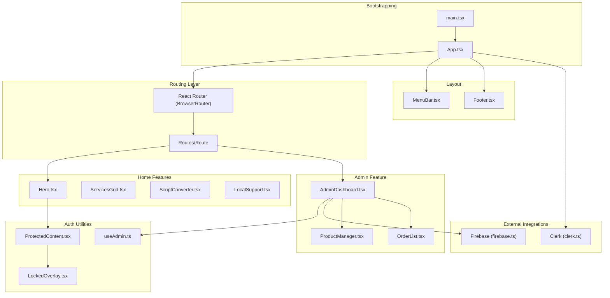

**Diagram sources**
- [main.tsx:1-11](file://src/main.tsx#L1-L11)
- [App.tsx:1-39](file://src/App.tsx#L1-L39)
- [MenuBar.tsx:1-132](file://src/components/layout/MenuBar.tsx#L1-L132)
- [Hero.tsx:1-108](file://src/components/home/Hero.tsx#L1-L108)
- [AdminDashboard.tsx:1-186](file://src/components/admin/AdminDashboard.tsx#L1-L186)
- [ProtectedContent.tsx:1-44](file://src/components/auth/ProtectedContent.tsx#L1-L44)
- [LockedOverlay.tsx:1-57](file://src/components/auth/LockedOverlay.tsx#L1-L57)
- [useAdmin.ts:1-14](file://src/hooks/useAdmin.ts#L1-L14)
- [clerk.ts:1-4](file://src/config/clerk.ts#L1-L4)
- [firebase.ts:1-19](file://src/config/firebase.ts#L1-L19)

**Section sources**
- [main.tsx:1-11](file://src/main.tsx#L1-L11)
- [App.tsx:1-39](file://src/App.tsx#L1-L39)

## Core Components
- App shell and routing: Provides the root provider for Clerk and wraps the application with React Router. Defines top-level routes for home and admin.
- Layout components: MenuBar displays navigation, clock, and authentication controls; Footer is present but minimal in current structure.
- Home feature components: Hero, ServicesGrid, ScriptConverter, LocalSupport compose the landing page experience.
- Admin feature: AdminDashboard orchestrates admin-only data fetching and editing, delegating to ProductManager and OrderList.
- Auth utilities: ProtectedContent conditionally renders children or overlays a lock screen; LockedOverlay presents a sign-in prompt.
- Hook pattern: useAdmin encapsulates Clerk user state and admin email comparison logic.
- External integrations: Clerk for authentication state and Firebase for Firestore and Storage.

**Section sources**
- [App.tsx:1-39](file://src/App.tsx#L1-L39)
- [MenuBar.tsx:1-132](file://src/components/layout/MenuBar.tsx#L1-L132)
- [Hero.tsx:1-108](file://src/components/home/Hero.tsx#L1-L108)
- [AdminDashboard.tsx:1-186](file://src/components/admin/AdminDashboard.tsx#L1-L186)
- [ProtectedContent.tsx:1-44](file://src/components/auth/ProtectedContent.tsx#L1-L44)
- [LockedOverlay.tsx:1-57](file://src/components/auth/LockedOverlay.tsx#L1-L57)
- [useAdmin.ts:1-14](file://src/hooks/useAdmin.ts#L1-L14)
- [clerk.ts:1-4](file://src/config/clerk.ts#L1-L4)
- [firebase.ts:1-19](file://src/config/firebase.ts#L1-L19)

## Architecture Overview
DevForge employs a layered architecture:
- Presentation Layer: React components organized by feature and layout.
- Business Logic Layer: Hooks encapsulate domain logic (e.g., admin checks).
- Integration Layer: Clerk and Firebase provide authentication and persistence.
- Routing and Guards: React Router manages navigation; Clerk-managed state drives route-sensitive rendering.

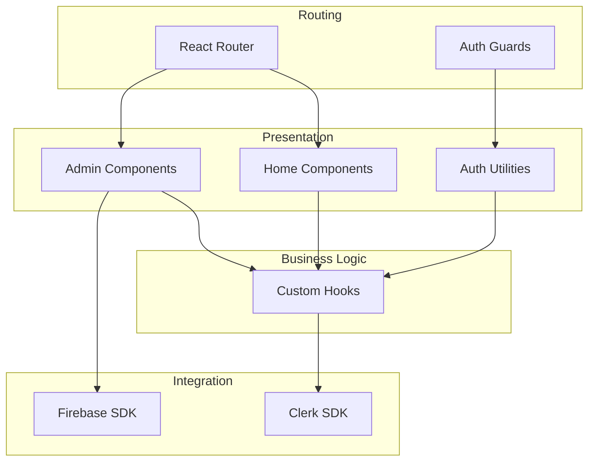

**Diagram sources**
- [App.tsx:1-39](file://src/App.tsx#L1-L39)
- [ProtectedContent.tsx:1-44](file://src/components/auth/ProtectedContent.tsx#L1-L44)
- [useAdmin.ts:1-14](file://src/hooks/useAdmin.ts#L1-L14)
- [clerk.ts:1-4](file://src/config/clerk.ts#L1-L4)
- [firebase.ts:1-19](file://src/config/firebase.ts#L1-L19)

## Detailed Component Analysis

### Provider Pattern: Authentication State Management
- App.tsx wraps the application with ClerkProvider, passing the publishable key from environment configuration.
- Components consume Clerk state via Clerk-provided hooks (e.g., useUser) to render authenticated UI and drive guards.
- The admin guard leverages a custom hook that composes Clerk user state with a configured admin email.

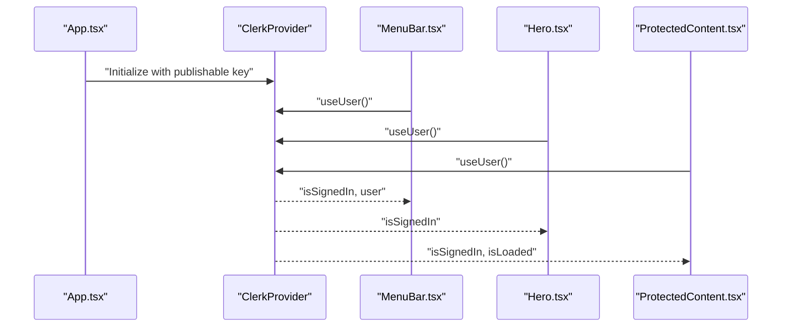

**Diagram sources**
- [App.tsx:23-38](file://src/App.tsx#L23-L38)
- [MenuBar.tsx:1-132](file://src/components/layout/MenuBar.tsx#L1-L132)
- [Hero.tsx:1-108](file://src/components/home/Hero.tsx#L1-L108)
- [ProtectedContent.tsx:1-44](file://src/components/auth/ProtectedContent.tsx#L1-L44)

**Section sources**
- [App.tsx:23-38](file://src/App.tsx#L23-L38)
- [clerk.ts:1-4](file://src/config/clerk.ts#L1-L4)
- [MenuBar.tsx:1-132](file://src/components/layout/MenuBar.tsx#L1-L132)
- [Hero.tsx:1-108](file://src/components/home/Hero.tsx#L1-L108)
- [ProtectedContent.tsx:1-44](file://src/components/auth/ProtectedContent.tsx#L1-L44)

### Component Composition: Modular UI Structure
- App.tsx composes layout and feature components into a cohesive page.
- Home page groups multiple feature components (Hero, ServicesGrid, ScriptConverter, LocalSupport) into a single route.
- AdminDashboard composes tabs and child components (ProductManager, OrderList) to manage services and orders.

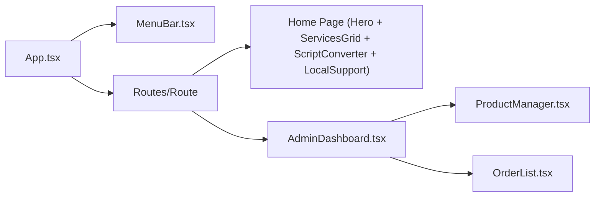

**Diagram sources**
- [App.tsx:12-31](file://src/App.tsx#L12-L31)
- [AdminDashboard.tsx:15-182](file://src/components/admin/AdminDashboard.tsx#L15-L182)

**Section sources**
- [App.tsx:12-31](file://src/App.tsx#L12-L31)
- [AdminDashboard.tsx:15-182](file://src/components/admin/AdminDashboard.tsx#L15-L182)

### Hook Pattern: Business Logic Encapsulation
- useAdmin encapsulates Clerk user state and admin email verification, returning a normalized shape for consumers.
- AdminDashboard uses useAdmin to gate access and orchestrate Firestore data loading and updates.

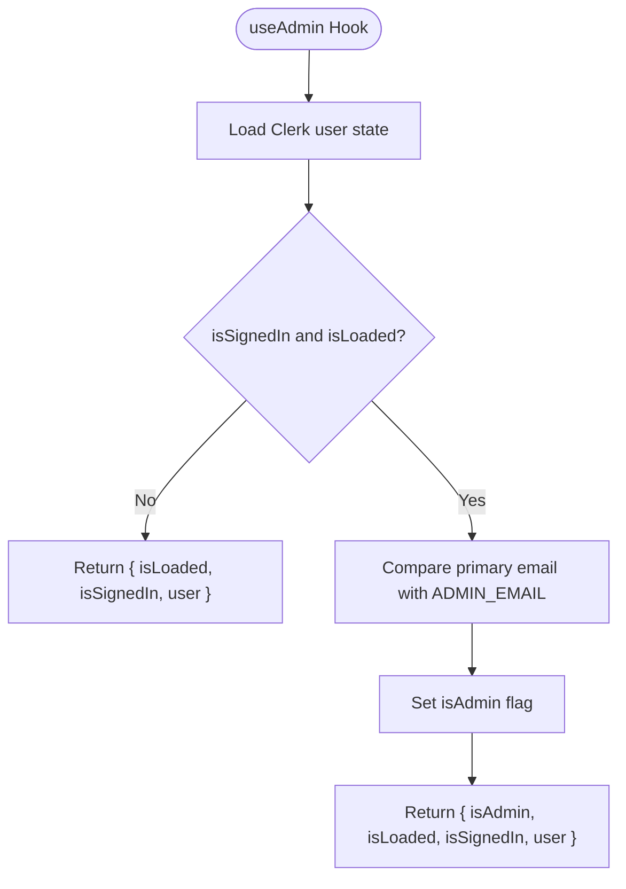

**Diagram sources**
- [useAdmin.ts:1-14](file://src/hooks/useAdmin.ts#L1-L14)
- [clerk.ts:1-4](file://src/config/clerk.ts#L1-L4)

**Section sources**
- [useAdmin.ts:1-14](file://src/hooks/useAdmin.ts#L1-L14)
- [clerk.ts:1-4](file://src/config/clerk.ts#L1-L4)
- [AdminDashboard.tsx:18-52](file://src/components/admin/AdminDashboard.tsx#L18-L52)

### Routing Architecture: Protected Routes and Navigation Flow
- BrowserRouter provides routing; Routes define "/" for the home page and "/admin" for AdminDashboard.
- ProtectedContent acts as a render-time guard: if the user is not loaded, it shows a loader; if signed out, it overlays a lock screen; otherwise it renders children.
- AdminDashboard performs runtime checks for signed-in and admin status, rendering appropriate messages if access is denied.

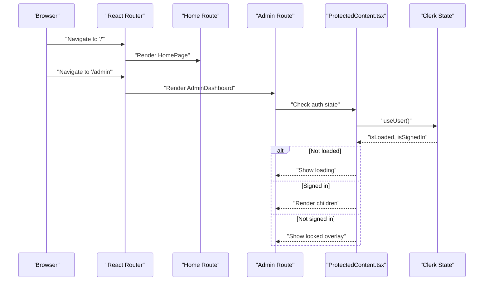

**Diagram sources**
- [App.tsx:29-32](file://src/App.tsx#L29-L32)
- [ProtectedContent.tsx:10-43](file://src/components/auth/ProtectedContent.tsx#L10-L43)
- [AdminDashboard.tsx:74-110](file://src/components/admin/AdminDashboard.tsx#L74-L110)

**Section sources**
- [App.tsx:29-32](file://src/App.tsx#L29-L32)
- [ProtectedContent.tsx:10-43](file://src/components/auth/ProtectedContent.tsx#L10-L43)
- [AdminDashboard.tsx:74-110](file://src/components/admin/AdminDashboard.tsx#L74-L110)

### Component Hierarchy: From App Root to Feature Components
- Root: main.tsx renders App.
- App: wraps with ClerkProvider and BrowserRouter, renders MenuBar, defines Routes, and renders Footer.
- Home: HomePage composes Hero, ServicesGrid, ScriptConverter, LocalSupport.
- Admin: AdminDashboard composes ProductManager and OrderList; uses useAdmin and Firebase.

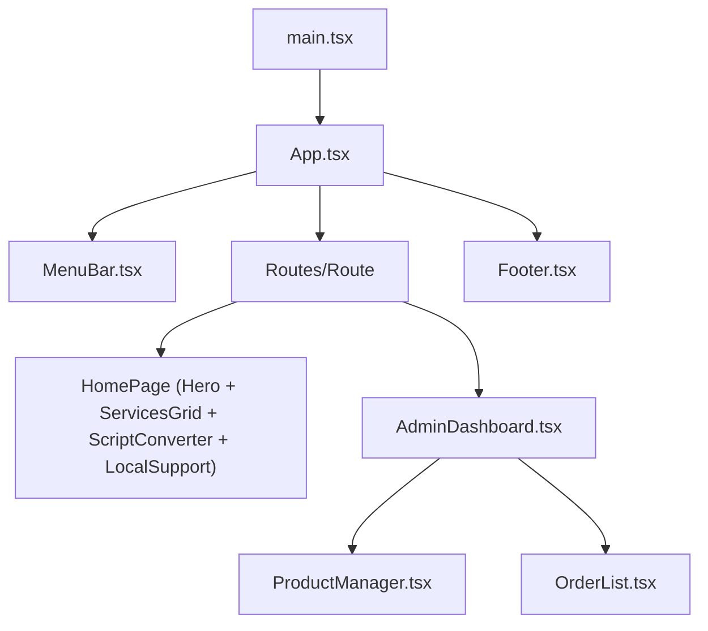

**Diagram sources**
- [main.tsx:6-10](file://src/main.tsx#L6-L10)
- [App.tsx:23-38](file://src/App.tsx#L23-L38)
- [App.tsx:12-21](file://src/App.tsx#L12-L21)
- [AdminDashboard.tsx:15-182](file://src/components/admin/AdminDashboard.tsx#L15-L182)

**Section sources**
- [main.tsx:6-10](file://src/main.tsx#L6-L10)
- [App.tsx:12-38](file://src/App.tsx#L12-L38)
- [AdminDashboard.tsx:15-182](file://src/components/admin/AdminDashboard.tsx#L15-L182)

### State Management: React Hooks + External Services
- Authentication state: Provided by Clerk; consumed via useUser in MenuBar, Hero, ProtectedContent, and useAdmin.
- UI state: Managed locally with useState in components (e.g., AdminDashboard tabs, form visibility).
- External data: AdminDashboard fetches and updates Firestore collections via Firebase SDK; state updates are reflected immediately in UI.

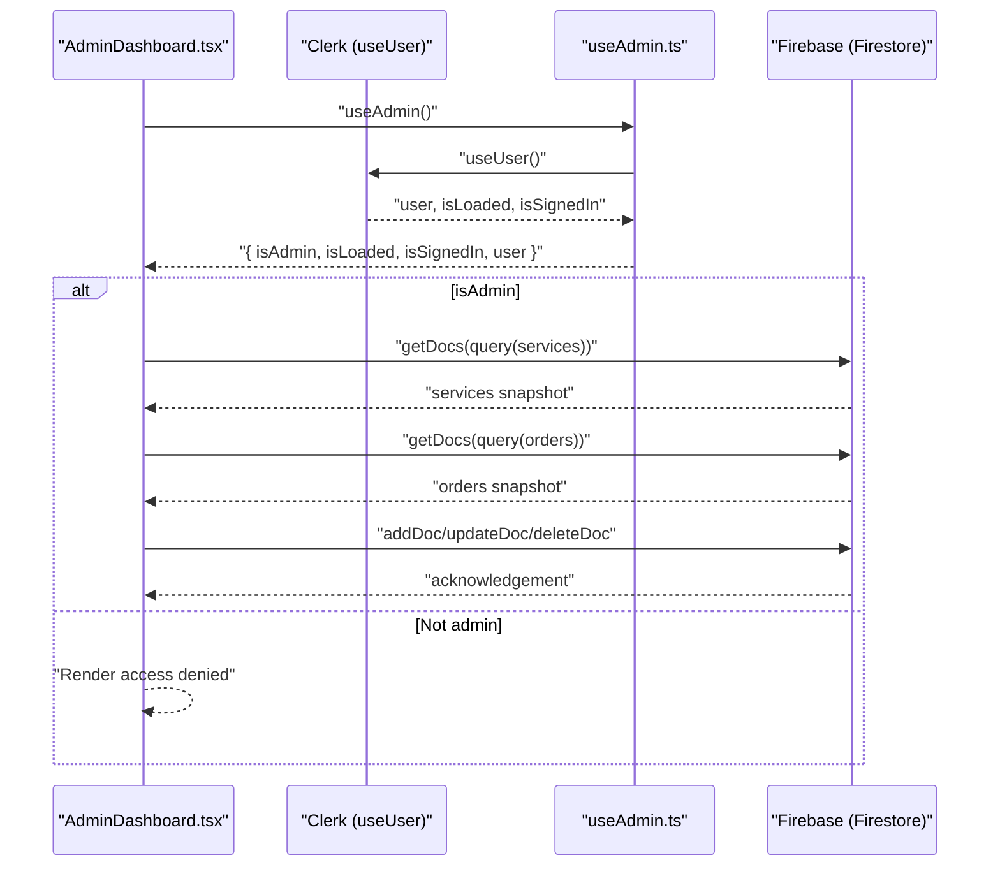

**Diagram sources**
- [AdminDashboard.tsx:18-72](file://src/components/admin/AdminDashboard.tsx#L18-L72)
- [useAdmin.ts:4-13](file://src/hooks/useAdmin.ts#L4-L13)
- [firebase.ts:16-18](file://src/config/firebase.ts#L16-L18)

**Section sources**
- [AdminDashboard.tsx:18-72](file://src/components/admin/AdminDashboard.tsx#L18-L72)
- [useAdmin.ts:4-13](file://src/hooks/useAdmin.ts#L4-L13)
- [firebase.ts:16-18](file://src/config/firebase.ts#L16-L18)

### Data Flow Patterns and Inter-Component Communication
- Props-driven composition: AdminDashboard passes services/orders and callbacks to ProductManager and OrderList.
- Event handling: Click handlers update local state; form submissions trigger Firestore mutations; select changes update order statuses.
- External data flow: Firestore queries populate component state; subsequent writes update UI immediately.

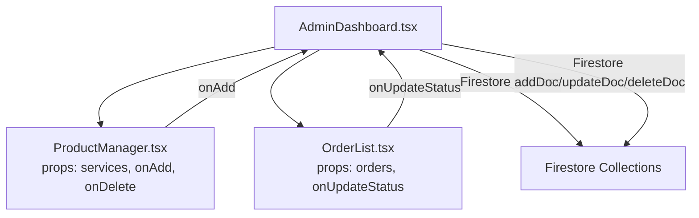

**Diagram sources**
- [AdminDashboard.tsx:15-182](file://src/components/admin/AdminDashboard.tsx#L15-L182)
- [ProductManager.tsx:22-52](file://src/components/admin/ProductManager.tsx#L22-L52)
- [OrderList.tsx:15-89](file://src/components/admin/OrderList.tsx#L15-L89)

**Section sources**
- [AdminDashboard.tsx:15-182](file://src/components/admin/AdminDashboard.tsx#L15-L182)
- [ProductManager.tsx:22-52](file://src/components/admin/ProductManager.tsx#L22-L52)
- [OrderList.tsx:15-89](file://src/components/admin/OrderList.tsx#L15-L89)

### System Boundaries and External Integrations
- Frontend boundary: Components depend on Clerk and Firebase through typed configuration and hooks.
- Authentication boundary: Clerk manages identity; useAdmin enforces admin-only access.
- Persistence boundary: Firebase Firestore and Storage are initialized centrally and accessed via typed queries and mutations.

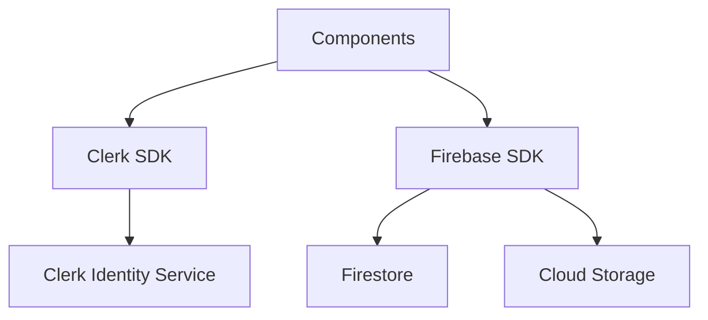

**Diagram sources**
- [clerk.ts:1-4](file://src/config/clerk.ts#L1-L4)
- [firebase.ts:1-19](file://src/config/firebase.ts#L1-L19)

**Section sources**
- [clerk.ts:1-4](file://src/config/clerk.ts#L1-L4)
- [firebase.ts:1-19](file://src/config/firebase.ts#L1-L19)

## Dependency Analysis
- Runtime dependencies include React, React Router, Clerk React SDK, and Firebase.
- Clerk and Firebase are initialized in configuration files and consumed by components and hooks.

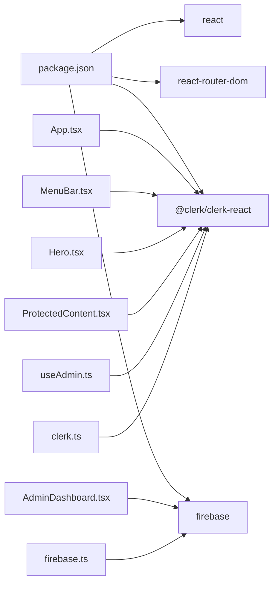

**Diagram sources**
- [package.json:12-17](file://package.json#L12-L17)
- [App.tsx:1-3](file://src/App.tsx#L1-L3)
- [MenuBar.tsx:1-2](file://src/components/layout/MenuBar.tsx#L1-L2)
- [Hero.tsx:1-2](file://src/components/home/Hero.tsx#L1-L2)
- [ProtectedContent.tsx:1](file://src/components/auth/ProtectedContent.tsx#L1)
- [useAdmin.ts:1](file://src/hooks/useAdmin.ts#L1)
- [AdminDashboard.tsx:2-3](file://src/components/admin/AdminDashboard.tsx#L2-L3)
- [firebase.ts:1-3](file://src/config/firebase.ts#L1-L3)
- [clerk.ts:1](file://src/config/clerk.ts#L1)

**Section sources**
- [package.json:12-17](file://package.json#L12-L17)
- [App.tsx:1-3](file://src/App.tsx#L1-L3)
- [MenuBar.tsx:1-2](file://src/components/layout/MenuBar.tsx#L1-L2)
- [Hero.tsx:1-2](file://src/components/home/Hero.tsx#L1-L2)
- [ProtectedContent.tsx:1](file://src/components/auth/ProtectedContent.tsx#L1)
- [useAdmin.ts:1](file://src/hooks/useAdmin.ts#L1)
- [AdminDashboard.tsx:2-3](file://src/components/admin/AdminDashboard.tsx#L2-L3)
- [firebase.ts:1-3](file://src/config/firebase.ts#L1-L3)
- [clerk.ts:1](file://src/config/clerk.ts#L1)

## Performance Considerations
- Minimize re-renders by keeping auth checks in dedicated hooks and passing derived props to child components.
- Defer heavy Firestore reads/writes to user actions and avoid unnecessary subscriptions.
- Use local state sparingly for transient UI; persist long-lived data in Firestore.
- Lazy-load feature components if the route count grows; current structure keeps components inline for simplicity.
- Avoid blocking the main thread with synchronous operations; keep UI responsive during network-bound operations.

## Troubleshooting Guide
- Authentication not loading: Verify the publishable key environment variable and Clerk initialization in App.tsx and configuration.
- Admin access denied: Confirm the ADMIN_EMAIL environment variable matches the admin account’s primary email.
- Firestore errors: Inspect query permissions and collection names; wrap data operations in try/catch blocks and log errors.
- Protected content flicker: Ensure isLoaded is checked before rendering sensitive content; ProtectedContent handles this by showing a loader until Clerk confirms state.
- Navigation issues: Confirm routes are defined in App.tsx and that Clerk state changes propagate to guards.

**Section sources**
- [clerk.ts:1-4](file://src/config/clerk.ts#L1-L4)
- [App.tsx:23-38](file://src/App.tsx#L23-L38)
- [ProtectedContent.tsx:13-29](file://src/components/auth/ProtectedContent.tsx#L13-L29)
- [AdminDashboard.tsx:44-48](file://src/components/admin/AdminDashboard.tsx#L44-L48)

## Conclusion
DevForge’s architecture cleanly separates presentation, business logic, and integration concerns. The Provider Pattern with Clerk centralizes authentication state, while the Hook Pattern encapsulates admin checks. Component Composition delivers a modular UI, and React Router coordinates navigation with runtime guards. Firestore integrates seamlessly for admin data operations. The design emphasizes clarity, maintainability, and scalability for future enhancements.