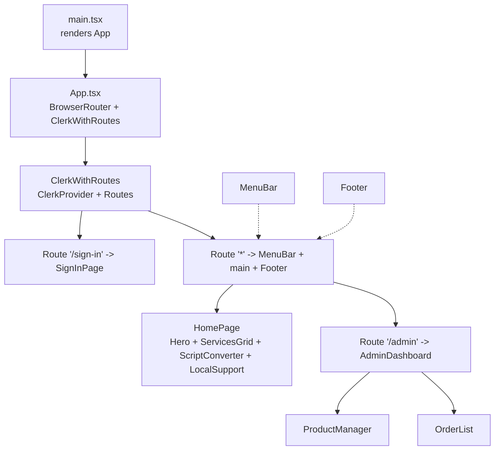
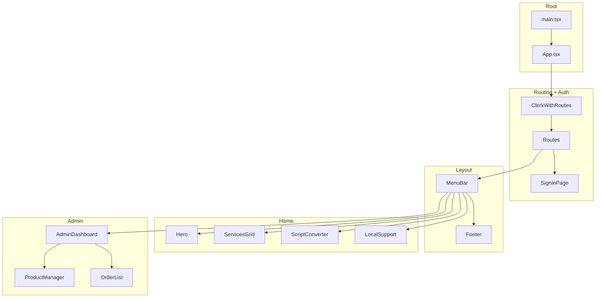
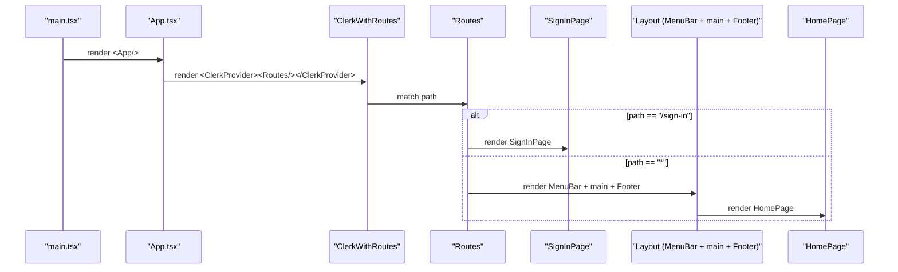
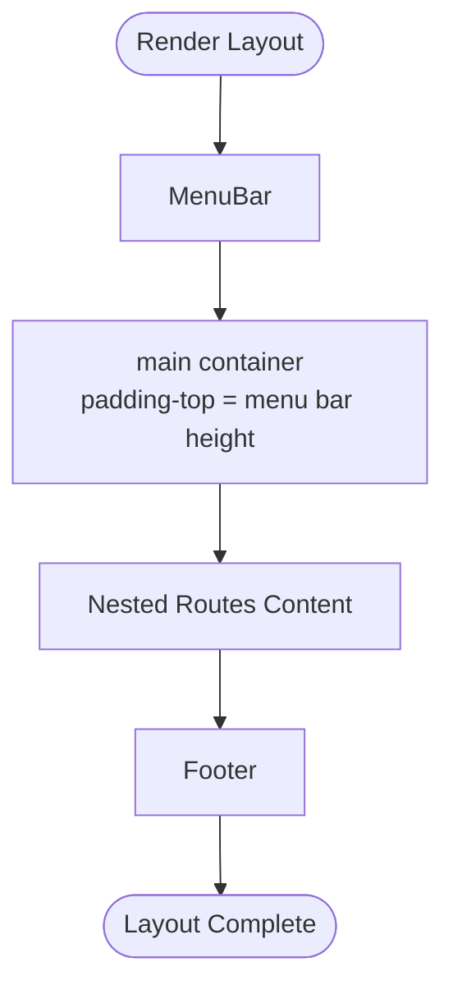
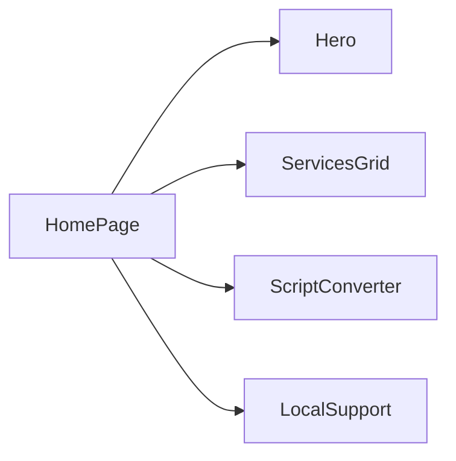
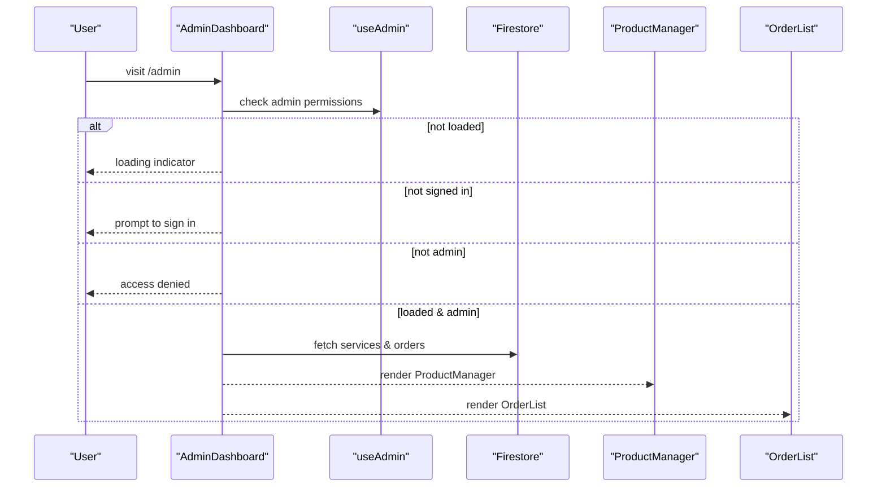
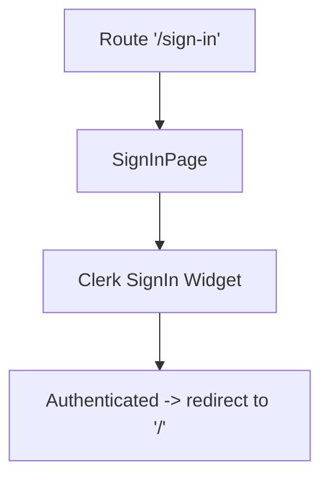
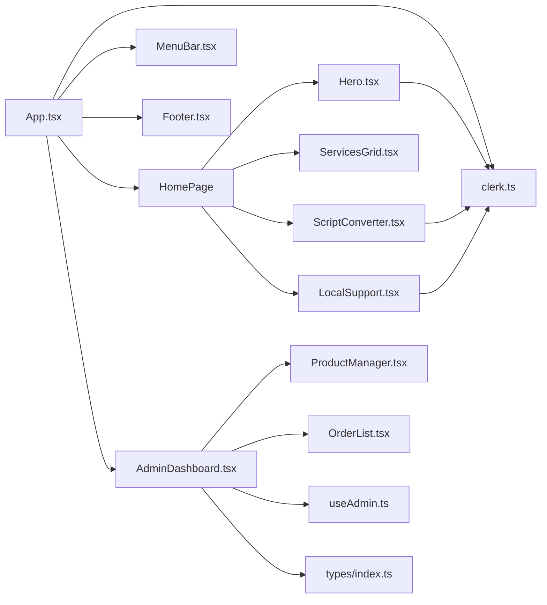

# Component Hierarchy

<cite>
**Referenced Files in This Document**
- [App.tsx](file://src/App.tsx)
- [main.tsx](file://src/main.tsx)
- [MenuBar.tsx](file://src/components/layout/MenuBar.tsx)
- [Footer.tsx](file://src/components/layout/Footer.tsx)
- [Hero.tsx](file://src/components/home/Hero.tsx)
- [ServicesGrid.tsx](file://src/components/home/ServicesGrid.tsx)
- [ScriptConverter.tsx](file://src/components/home/ScriptConverter.tsx)
- [LocalSupport.tsx](file://src/components/home/LocalSupport.tsx)
- [AdminDashboard.tsx](file://src/components/admin/AdminDashboard.tsx)
- [SignInPage.tsx](file://src/components/auth/SignInPage.tsx)
- [useAdmin.ts](file://src/hooks/useAdmin.ts)
- [clerk.ts](file://src/config/clerk.ts)
- [index.ts](file://src/types/index.ts)
</cite>

## Table of Contents
1. [Introduction](#introduction)
2. [Project Structure](#project-structure)
3. [Core Components](#core-components)
4. [Architecture Overview](#architecture-overview)
5. [Detailed Component Analysis](#detailed-component-analysis)
6. [Dependency Analysis](#dependency-analysis)
7. [Performance Considerations](#performance-considerations)
8. [Troubleshooting Guide](#troubleshooting-guide)
9. [Conclusion](#conclusion)

## Introduction
This document explains DevForge’s component hierarchy and composition patterns. It traces the root App component down to leaf components, detailing how ClerkProvider and BrowserRouter orchestrate routing and authentication, how MenuBar and Footer wrap the main content area, and how feature-based components are organized under src/components/. It also covers parent-child relationships, prop passing, and communication patterns, along with the rationale for the chosen architecture.

## Project Structure
DevForge follows a feature-based component organization:
- Root entry renders App inside a strict React root.
- App composes routing, authentication, and shared layout.
- Layout components (MenuBar, Footer) are reused across routes.
- Feature areas:
  - Home: Hero, ServicesGrid, ScriptConverter, LocalSupport
  - Admin: AdminDashboard, ProductManager, OrderList
  - Auth: SignInPage
- Shared configuration and types define environment variables and data contracts.

**Diagram sources**
- [main.tsx:1-11](file://src/main.tsx#L1-L11)
- [App.tsx:60-67](file://src/App.tsx#L60-L67)
- [App.tsx:26-58](file://src/App.tsx#L26-L58)
- [App.tsx:14-24](file://src/App.tsx#L14-L24)
- [App.tsx:40-54](file://src/App.tsx#L40-L54)
- [AdminDashboard.tsx:18-185](file://src/components/admin/AdminDashboard.tsx#L18-L185)
- [MenuBar.tsx:1-133](file://src/components/layout/MenuBar.tsx#L1-L133)
- [Footer.tsx:1-174](file://src/components/layout/Footer.tsx#L1-L174)

**Section sources**
- [main.tsx:1-11](file://src/main.tsx#L1-L11)
- [App.tsx:60-67](file://src/App.tsx#L60-L67)
- [App.tsx:26-58](file://src/App.tsx#L26-L58)

## Core Components
- App: Wraps the app in BrowserRouter and defines routing. It delegates authentication to ClerkWithRoutes and renders either a full-screen sign-in route or the main layout with MenuBar, main content, and Footer.
- ClerkWithRoutes: Provides ClerkProvider with router integration and defines two route groups: sign-in and the rest of the app.
- HomePage: Composes the home page content by rendering Hero, ServicesGrid, ScriptConverter, and LocalSupport.
- AdminDashboard: Central admin view that loads data and switches between tabs for managing products and orders.
- MenuBar and Footer: Shared layout components that frame the main content area.
- SignInPage: Full-screen authentication page using Clerk’s SignIn widget.

**Section sources**
- [App.tsx:14-24](file://src/App.tsx#L14-L24)
- [App.tsx:26-58](file://src/App.tsx#L26-L58)
- [App.tsx:60-67](file://src/App.tsx#L60-L67)
- [AdminDashboard.tsx:18-185](file://src/components/admin/AdminDashboard.tsx#L18-L185)
- [MenuBar.tsx:1-133](file://src/components/layout/MenuBar.tsx#L1-L133)
- [Footer.tsx:1-174](file://src/components/layout/Footer.tsx#L1-L174)
- [SignInPage.tsx:1-251](file://src/components/auth/SignInPage.tsx#L1-L251)

## Architecture Overview
The architecture centers on:
- Root container: App wraps everything in BrowserRouter.
- Authentication boundary: ClerkWithRoutes sets up ClerkProvider and routes.
- Layout boundary: MenuBar and Footer surround the main content area.
- Feature boundaries: Home and Admin features are separate route targets.
- Data contracts: Types define Service, Order, and ServiceCardData shapes.

**Diagram sources**
- [main.tsx:1-11](file://src/main.tsx#L1-L11)
- [App.tsx:26-58](file://src/App.tsx#L26-L58)
- [App.tsx:40-54](file://src/App.tsx#L40-L54)
- [MenuBar.tsx:1-133](file://src/components/layout/MenuBar.tsx#L1-L133)
- [Footer.tsx:1-174](file://src/components/layout/Footer.tsx#L1-L174)
- [Hero.tsx:1-110](file://src/components/home/Hero.tsx#L1-L110)
- [ServicesGrid.tsx:1-167](file://src/components/home/ServicesGrid.tsx#L1-L167)
- [ScriptConverter.tsx:1-188](file://src/components/home/ScriptConverter.tsx#L1-L188)
- [LocalSupport.tsx:1-181](file://src/components/home/LocalSupport.tsx#L1-L181)
- [AdminDashboard.tsx:18-185](file://src/components/admin/AdminDashboard.tsx#L18-L185)
- [ProductManager.tsx:22-221](file://src/components/admin/ProductManager.tsx#L22-L221)
- [OrderList.tsx:15-91](file://src/components/admin/OrderList.tsx#L15-L91)

## Detailed Component Analysis

### App and Routing Orchestration
- App wraps the entire app in BrowserRouter and renders ClerkWithRoutes.
- ClerkWithRoutes:
  - Initializes ClerkProvider with publishable key and router push/replace adapters.
  - Defines two route groups:
    - "/sign-in" renders SignInPage without layout.
    - "*" renders MenuBar, main content area, and Footer around nested Routes.
- HomePage composes home page sections.

**Diagram sources**
- [main.tsx:6-10](file://src/main.tsx#L6-L10)
- [App.tsx:60-67](file://src/App.tsx#L60-L67)
- [App.tsx:26-58](file://src/App.tsx#L26-L58)
- [App.tsx:36-54](file://src/App.tsx#L36-L54)
- [App.tsx:14-24](file://src/App.tsx#L14-L24)

**Section sources**
- [main.tsx:1-11](file://src/main.tsx#L1-L11)
- [App.tsx:26-58](file://src/App.tsx#L26-L58)
- [App.tsx:60-67](file://src/App.tsx#L60-L67)

### Layout Composition: MenuBar, main, Footer
- MenuBar displays branding, navigation links, clock, and authentication controls. It uses Clerk hooks to detect signed-in state and navigates to sign-in when needed.
- Footer is a reusable component that renders brand info, address, and social links.
- The main content area is a flex container with a fixed MenuBar height offset to avoid overlap.

**Diagram sources**
- [MenuBar.tsx:1-133](file://src/components/layout/MenuBar.tsx#L1-L133)
- [App.tsx:44-51](file://src/App.tsx#L44-L51)
- [Footer.tsx:1-174](file://src/components/layout/Footer.tsx#L1-L174)

**Section sources**
- [MenuBar.tsx:1-133](file://src/components/layout/MenuBar.tsx#L1-L133)
- [App.tsx:44-51](file://src/App.tsx#L44-L51)
- [Footer.tsx:1-174](file://src/components/layout/Footer.tsx#L1-L174)

### Home Feature Components
- Hero: Displays headline, tagline, and CTA buttons. Uses Clerk user state to conditionally enable actions and navigate to sign-in when unauthenticated.
- ServicesGrid: Renders a grid of ServiceCard items. Uses Clerk user state to pass authentication status to cards.
- ScriptConverter: File upload zone with drag-and-drop and validation. Integrates with ProtectedContent to restrict access until authenticated. Sends pre-filled WhatsApp messages for orders.
- LocalSupport: Lists local services with pricing and contact actions via WhatsApp.

**Diagram sources**
- [App.tsx:14-24](file://src/App.tsx#L14-L24)
- [Hero.tsx:1-110](file://src/components/home/Hero.tsx#L1-L110)
- [ServicesGrid.tsx:116-167](file://src/components/home/ServicesGrid.tsx#L116-L167)
- [ScriptConverter.tsx:1-188](file://src/components/home/ScriptConverter.tsx#L1-L188)
- [LocalSupport.tsx:1-181](file://src/components/home/LocalSupport.tsx#L1-L181)

**Section sources**
- [Hero.tsx:1-110](file://src/components/home/Hero.tsx#L1-L110)
- [ServicesGrid.tsx:116-167](file://src/components/home/ServicesGrid.tsx#L116-L167)
- [ScriptConverter.tsx:1-188](file://src/components/home/ScriptConverter.tsx#L1-L188)
- [LocalSupport.tsx:1-181](file://src/components/home/LocalSupport.tsx#L1-L181)

### Admin Feature Components
- AdminDashboard:
  - Loads services and orders from Firestore.
  - Uses useAdmin hook to enforce admin-only access.
  - Tabs switch between ProductManager and OrderList.
  - Handles loading, authentication, and access-denied states.
- ProductManager:
  - Accepts services array and callbacks to add/delete services.
  - Provides a form to add new services and a list to delete existing ones.
- OrderList:
  - Accepts orders array and callback to update order status.
  - Renders status badges and a dropdown to change status.

**Diagram sources**
- [AdminDashboard.tsx:18-185](file://src/components/admin/AdminDashboard.tsx#L18-L185)
- [useAdmin.ts:4-13](file://src/hooks/useAdmin.ts#L4-L13)
- [ProductManager.tsx:22-221](file://src/components/admin/ProductManager.tsx#L22-L221)
- [OrderList.tsx:15-91](file://src/components/admin/OrderList.tsx#L15-L91)

**Section sources**
- [AdminDashboard.tsx:18-185](file://src/components/admin/AdminDashboard.tsx#L18-L185)
- [useAdmin.ts:4-13](file://src/hooks/useAdmin.ts#L4-L13)
- [ProductManager.tsx:22-221](file://src/components/admin/ProductManager.tsx#L22-L221)
- [OrderList.tsx:15-91](file://src/components/admin/OrderList.tsx#L15-L91)

### Authentication Boundary: SignInPage
- SignInPage is rendered exclusively for the "/sign-in" route and does not include MenuBar or Footer.
- It uses Clerk’s SignIn component with a custom appearance and displays decorative code visuals.

**Diagram sources**
- [App.tsx:36-37](file://src/App.tsx#L36-L37)
- [SignInPage.tsx:157-221](file://src/components/auth/SignInPage.tsx#L157-L221)

**Section sources**
- [App.tsx:36-37](file://src/App.tsx#L36-L37)
- [SignInPage.tsx:1-251](file://src/components/auth/SignInPage.tsx#L1-L251)

### Component Composition Patterns and Prop Drilling
- Composition pattern:
  - App composes ClerkWithRoutes, which composes Routes and layout wrappers.
  - HomePage composes multiple feature components.
  - AdminDashboard composes ProductManager and OrderList.
- Prop passing:
  - AdminDashboard passes services and callbacks to ProductManager and OrderList.
  - ServicesGrid passes authentication state to ServiceCard.
  - ScriptConverter passes ProtectedContent to wrap sensitive UI.
- Communication:
  - Clerk hooks (useUser, useNavigate) are used directly in components for authentication and navigation.
  - useAdmin centralizes admin permission checks.
- Rationale:
  - Feature-based organization keeps related components together.
  - Composition over inheritance simplifies testing and reuse.
  - Minimal prop drilling by placing shared logic in hooks and higher-order wrappers.

**Section sources**
- [App.tsx:14-24](file://src/App.tsx#L14-L24)
- [AdminDashboard.tsx:174-182](file://src/components/admin/AdminDashboard.tsx#L174-L182)
- [ServicesGrid.tsx:156-162](file://src/components/home/ServicesGrid.tsx#L156-L162)
- [ScriptConverter.tsx:184](file://src/components/home/ScriptConverter.tsx#L184)
- [useAdmin.ts:4-13](file://src/hooks/useAdmin.ts#L4-L13)

## Dependency Analysis
- Runtime dependencies:
  - ClerkProvider and Clerk SignIn components drive authentication.
  - react-router-dom handles routing and navigation.
  - Firebase Firestore is used by AdminDashboard for data persistence.
- Internal dependencies:
  - App depends on Clerk config constants and layout components.
  - AdminDashboard depends on useAdmin and Firestore SDK.
  - Home components depend on Clerk user state and environment variables.
- Types:
  - Service, Order, and ServiceCardData define cross-component contracts.

**Diagram sources**
- [App.tsx:1-12](file://src/App.tsx#L1-L12)
- [clerk.ts:1-4](file://src/config/clerk.ts#L1-L4)
- [MenuBar.tsx:1-133](file://src/components/layout/MenuBar.tsx#L1-L133)
- [Footer.tsx:1-174](file://src/components/layout/Footer.tsx#L1-L174)
- [Hero.tsx:1-110](file://src/components/home/Hero.tsx#L1-L110)
- [ServicesGrid.tsx:1-167](file://src/components/home/ServicesGrid.tsx#L1-L167)
- [ScriptConverter.tsx:1-188](file://src/components/home/ScriptConverter.tsx#L1-L188)
- [LocalSupport.tsx:1-181](file://src/components/home/LocalSupport.tsx#L1-L181)
- [AdminDashboard.tsx:18-185](file://src/components/admin/AdminDashboard.tsx#L18-L185)
- [ProductManager.tsx:22-221](file://src/components/admin/ProductManager.tsx#L22-L221)
- [OrderList.tsx:15-91](file://src/components/admin/OrderList.tsx#L15-L91)
- [useAdmin.ts:4-13](file://src/hooks/useAdmin.ts#L4-L13)
- [index.ts:1-40](file://src/types/index.ts#L1-L40)

**Section sources**
- [clerk.ts:1-4](file://src/config/clerk.ts#L1-L4)
- [index.ts:1-40](file://src/types/index.ts#L1-L40)

## Performance Considerations
- Minimize re-renders by keeping heavy computations in hooks and memoizing callbacks in leaf components (e.g., validation and handlers in ScriptConverter).
- Defer Firestore reads to when admin permissions are confirmed in AdminDashboard.
- Use CSS containment and efficient grid layouts in ServicesGrid and LocalSupport to reduce layout thrashing.
- Keep Clerk hooks usage localized to components that need them to avoid unnecessary provider overhead.

## Troubleshooting Guide
- Authentication issues:
  - Verify publishable key and admin email environment variables.
  - Confirm useAdmin returns loaded and signed-in state before rendering admin UI.
- Routing issues:
  - Ensure Clerk router adapters are configured so navigation works inside ClerkProvider.
- Admin data not loading:
  - Check Firestore rules and collection names used by AdminDashboard.
- Protected content not appearing:
  - Confirm ProtectedContent wraps sensitive sections and that authentication state is reflected in child components.

**Section sources**
- [clerk.ts:1-4](file://src/config/clerk.ts#L1-L4)
- [useAdmin.ts:4-13](file://src/hooks/useAdmin.ts#L4-L13)
- [AdminDashboard.tsx:25-52](file://src/components/admin/AdminDashboard.tsx#L25-L52)

## Conclusion
DevForge’s component hierarchy emphasizes a clear separation of concerns: App orchestrates routing and authentication, MenuBar and Footer provide consistent layout, and feature-based components encapsulate domain logic. The composition pattern favors small, focused components with minimal prop drilling, while hooks centralize cross-cutting concerns like authentication and admin permissions. This structure supports maintainability, scalability, and a consistent user experience across home and admin features.