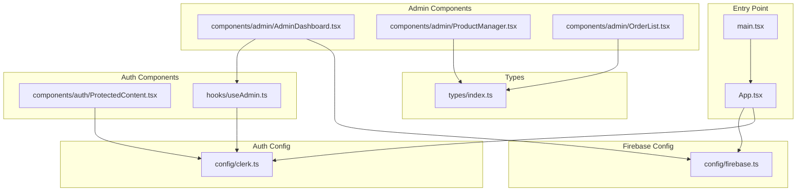
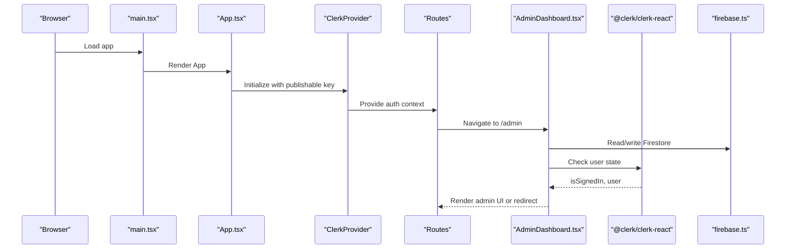
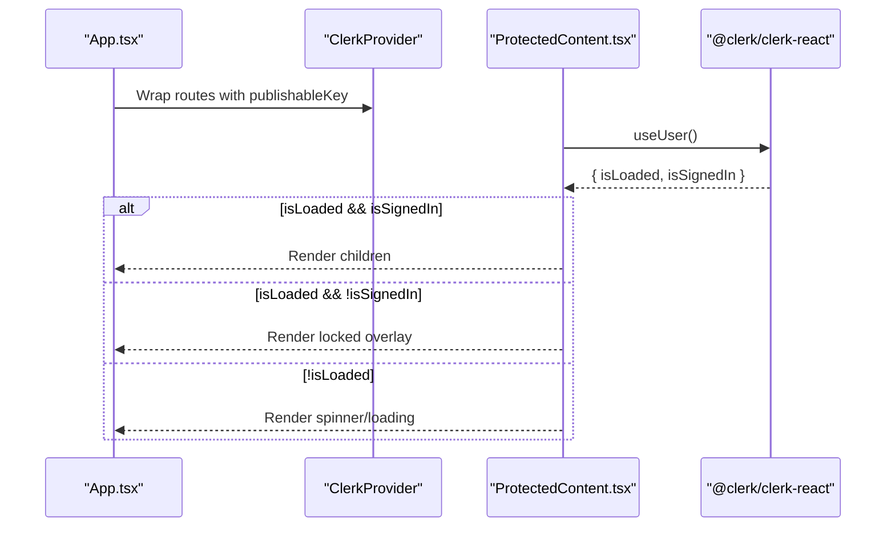
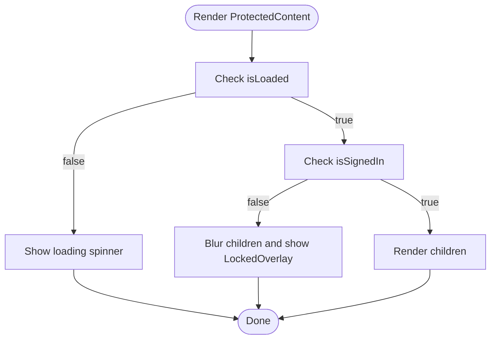
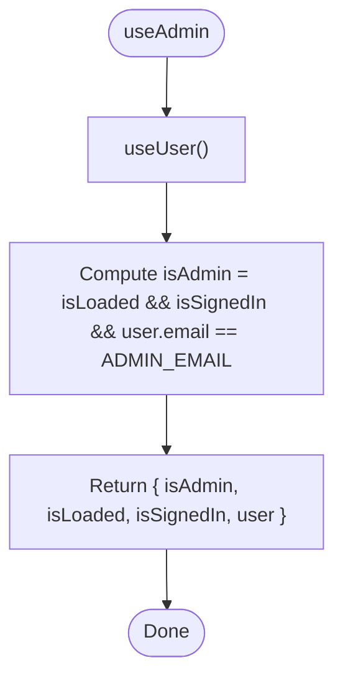
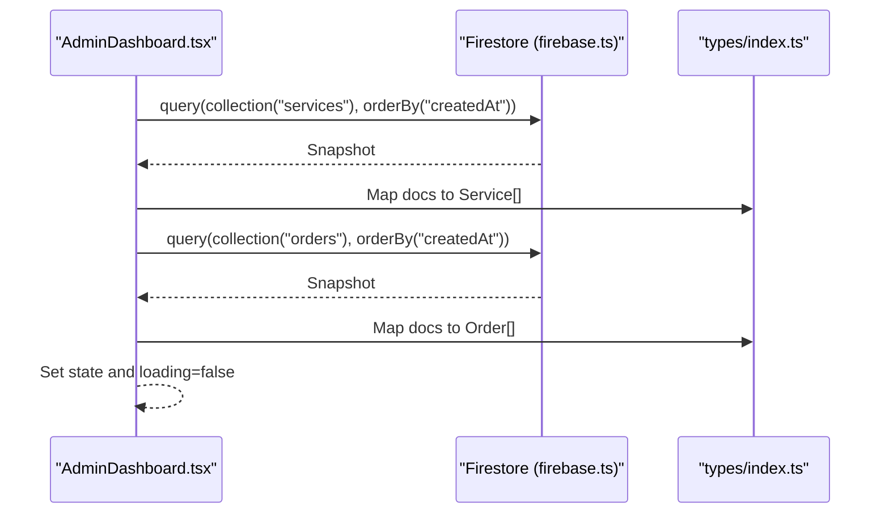
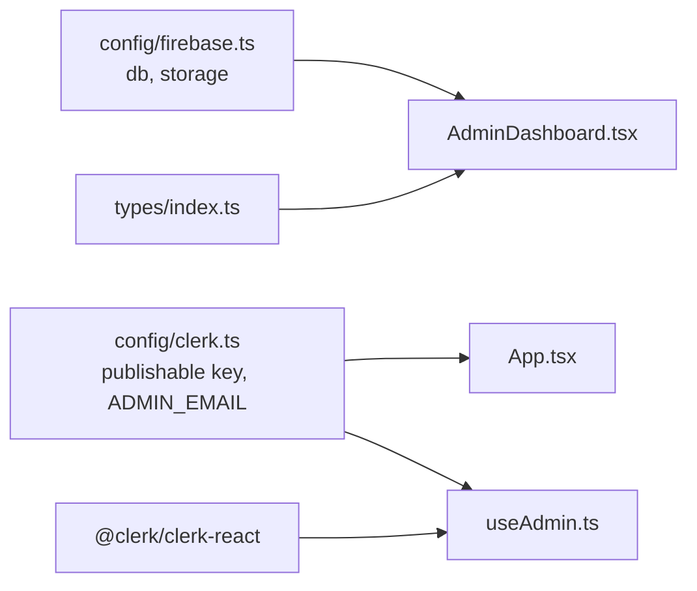
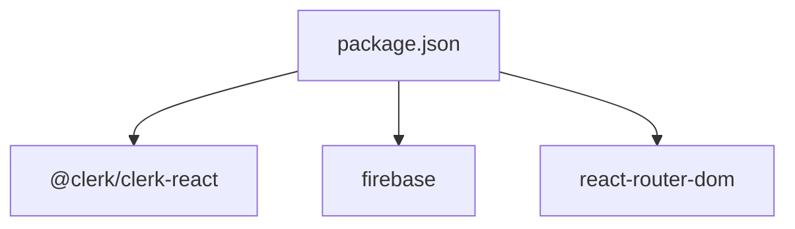

# Integration Patterns

<cite>
**Referenced Files in This Document**
- [clerk.ts](file://src/config/clerk.ts)
- [firebase.ts](file://src/config/firebase.ts)
- [ProtectedContent.tsx](file://src/components/auth/ProtectedContent.tsx)
- [useAdmin.ts](file://src/hooks/useAdmin.ts)
- [App.tsx](file://src/App.tsx)
- [AdminDashboard.tsx](file://src/components/admin/AdminDashboard.tsx)
- [ProductManager.tsx](file://src/components/admin/ProductManager.tsx)
- [OrderList.tsx](file://src/components/admin/OrderList.tsx)
- [index.ts](file://src/types/index.ts)
- [main.tsx](file://src/main.tsx)
- [vite.config.ts](file://vite.config.ts)
- [tsconfig.json](file://tsconfig.json)
- [tsconfig.app.json](file://tsconfig.app.json)
- [tsconfig.node.json](file://tsconfig.node.json)
- [vite-env.d.ts](file://src/vite-env.d.ts)
- [package.json](file://package.json)
</cite>

## Table of Contents
1. [Introduction](#introduction)
2. [Project Structure](#project-structure)
3. [Core Components](#core-components)
4. [Architecture Overview](#architecture-overview)
5. [Detailed Component Analysis](#detailed-component-analysis)
6. [Dependency Analysis](#dependency-analysis)
7. [Performance Considerations](#performance-considerations)
8. [Security Considerations](#security-considerations)
9. [Troubleshooting Guide](#troubleshooting-guide)
10. [Conclusion](#conclusion)

## Introduction
This document explains DevForge’s integration patterns with external services and third-party libraries, focusing on:
- Clerk authentication provider integration and publishable key configuration
- Firebase integration for Firestore and storage, including initialization and data access patterns
- Role-based access control via a ProtectedContent component pattern and an admin hook
- Environment variable management and configuration
- Dependency injection patterns and how components consume external services
- Security considerations and best practices for multi-service React applications

## Project Structure
DevForge organizes integrations into dedicated configuration modules and feature-driven components:
- Configuration modules expose initialized SDK clients and environment-backed constants
- Feature components consume these clients and Clerk hooks to implement authentication and admin workflows
- Type definitions standardize data shapes for Firestore collections

**Diagram sources**
- [main.tsx:1-11](file://src/main.tsx#L1-L11)
- [App.tsx:1-67](file://src/App.tsx#L1-L67)
- [clerk.ts:1-4](file://src/config/clerk.ts#L1-L4)
- [firebase.ts:1-19](file://src/config/firebase.ts#L1-L19)
- [ProtectedContent.tsx:1-44](file://src/components/auth/ProtectedContent.tsx#L1-L44)
- [useAdmin.ts:1-14](file://src/hooks/useAdmin.ts#L1-L14)
- [AdminDashboard.tsx:1-186](file://src/components/admin/AdminDashboard.tsx#L1-L186)
- [ProductManager.tsx:1-221](file://src/components/admin/ProductManager.tsx#L1-L221)
- [OrderList.tsx:1-91](file://src/components/admin/OrderList.tsx#L1-L91)
- [index.ts:1-40](file://src/types/index.ts#L1-L40)

**Section sources**
- [main.tsx:1-11](file://src/main.tsx#L1-L11)
- [App.tsx:1-67](file://src/App.tsx#L1-L67)
- [clerk.ts:1-4](file://src/config/clerk.ts#L1-L4)
- [firebase.ts:1-19](file://src/config/firebase.ts#L1-L19)
- [ProtectedContent.tsx:1-44](file://src/components/auth/ProtectedContent.tsx#L1-L44)
- [useAdmin.ts:1-14](file://src/hooks/useAdmin.ts#L1-L14)
- [AdminDashboard.tsx:1-186](file://src/components/admin/AdminDashboard.tsx#L1-L186)
- [ProductManager.tsx:1-221](file://src/components/admin/ProductManager.tsx#L1-L221)
- [OrderList.tsx:1-91](file://src/components/admin/OrderList.tsx#L1-L91)
- [index.ts:1-40](file://src/types/index.ts#L1-L40)

## Core Components
- Clerk configuration module exports the publishable key and admin email constant, consumed by the provider wrapper and admin hook
- Firebase configuration initializes the app and exposes Firestore and Storage clients
- ProtectedContent enforces authentication at render time using Clerk’s user state
- useAdmin encapsulates admin permission checks based on signed-in state and email equality
- AdminDashboard orchestrates Firestore reads/writes and admin UI rendering
- ProductManager and OrderList present CRUD surfaces backed by Firestore

**Section sources**
- [clerk.ts:1-4](file://src/config/clerk.ts#L1-L4)
- [firebase.ts:1-19](file://src/config/firebase.ts#L1-L19)
- [ProtectedContent.tsx:1-44](file://src/components/auth/ProtectedContent.tsx#L1-L44)
- [useAdmin.ts:1-14](file://src/hooks/useAdmin.ts#L1-L14)
- [AdminDashboard.tsx:1-186](file://src/components/admin/AdminDashboard.tsx#L1-L186)
- [ProductManager.tsx:1-221](file://src/components/admin/ProductManager.tsx#L1-L221)
- [OrderList.tsx:1-91](file://src/components/admin/OrderList.tsx#L1-L91)

## Architecture Overview
DevForge composes external services through:
- Provider pattern for Clerk: wrap the routing tree with a ClerkProvider configured via the publishable key
- Dependency injection pattern for Firebase: export initialized clients from a single module; components import and use them directly
- Hook-based composition for authentication and permissions: useAdmin builds on Clerk’s useUser to derive admin state
- Type-safe data access: Firestore documents are mapped to TypeScript interfaces

**Diagram sources**
- [main.tsx:1-11](file://src/main.tsx#L1-L11)
- [App.tsx:1-67](file://src/App.tsx#L1-L67)
- [AdminDashboard.tsx:1-186](file://src/components/admin/AdminDashboard.tsx#L1-L186)
- [firebase.ts:1-19](file://src/config/firebase.ts#L1-L19)
- [clerk.ts:1-4](file://src/config/clerk.ts#L1-L4)

## Detailed Component Analysis

### Clerk Authentication Provider Pattern
- Publishable key configuration: loaded from environment variables and passed to ClerkProvider
- Routing integration: routerPush/routerReplace callbacks ensure Clerk-managed navigation aligns with React Router
- Authentication state management: ProtectedContent renders a loading state while user state is unready, overlays a lock when signed out, and renders children when signed in

**Diagram sources**
- [App.tsx:26-58](file://src/App.tsx#L26-L58)
- [ProtectedContent.tsx:10-43](file://src/components/auth/ProtectedContent.tsx#L10-L43)
- [clerk.ts:1-4](file://src/config/clerk.ts#L1-L4)

**Section sources**
- [App.tsx:1-67](file://src/App.tsx#L1-L67)
- [ProtectedContent.tsx:1-44](file://src/components/auth/ProtectedContent.tsx#L1-L44)
- [clerk.ts:1-4](file://src/config/clerk.ts#L1-L4)

### Role-Based Access Control with ProtectedContent
- ProtectedContent enforces authentication at render time using Clerk’s user state
- It supports a fallback slot to render alternative content when locked
- The component handles loading and signed-out states explicitly, ensuring consistent UX

**Diagram sources**
- [ProtectedContent.tsx:10-43](file://src/components/auth/ProtectedContent.tsx#L10-L43)

**Section sources**
- [ProtectedContent.tsx:1-44](file://src/components/auth/ProtectedContent.tsx#L1-L44)

### Admin Permission Hook (useAdmin)
- Builds on Clerk’s useUser to compute admin status based on signed-in state and primary email address equality against a configured admin email
- Returns a tuple-like object with admin flag and user metadata for downstream UI decisions

**Diagram sources**
- [useAdmin.ts:4-12](file://src/hooks/useAdmin.ts#L4-L12)
- [clerk.ts:2](file://src/config/clerk.ts#L2)

**Section sources**
- [useAdmin.ts:1-14](file://src/hooks/useAdmin.ts#L1-L14)
- [clerk.ts:1-4](file://src/config/clerk.ts#L1-L4)

### Firebase Integration Patterns (Firestore and Storage)
- Initialization: Firebase app is initialized once using environment-backed configuration; Firestore and Storage clients are exported for consumption
- Data access patterns:
  - AdminDashboard loads services and orders via queries ordered by creation date
  - CRUD operations update local state after successful Firestore mutations
  - ProductManager and OrderList accept handlers to trigger writes and updates
- Error handling: AdminDashboard logs errors during data load and sets loading states appropriately

**Diagram sources**
- [AdminDashboard.tsx:25-52](file://src/components/admin/AdminDashboard.tsx#L25-L52)
- [index.ts:1-40](file://src/types/index.ts#L1-L40)
- [firebase.ts:16-17](file://src/config/firebase.ts#L16-L17)

**Section sources**
- [firebase.ts:1-19](file://src/config/firebase.ts#L1-L19)
- [AdminDashboard.tsx:1-186](file://src/components/admin/AdminDashboard.tsx#L1-L186)
- [ProductManager.tsx:1-221](file://src/components/admin/ProductManager.tsx#L1-L221)
- [OrderList.tsx:1-91](file://src/components/admin/OrderList.tsx#L1-L91)
- [index.ts:1-40](file://src/types/index.ts#L1-L40)

### Dependency Injection and Consumption
- Firebase clients are injected into components by importing from the Firebase configuration module
- AdminDashboard depends on Firestore for data and on useAdmin for permissions
- ProtectedContent depends on Clerk for authentication state

**Diagram sources**
- [firebase.ts:1-19](file://src/config/firebase.ts#L1-L19)
- [clerk.ts:1-4](file://src/config/clerk.ts#L1-L4)
- [App.tsx:1-67](file://src/App.tsx#L1-L67)
- [useAdmin.ts:1-14](file://src/hooks/useAdmin.ts#L1-L14)
- [AdminDashboard.tsx:1-186](file://src/components/admin/AdminDashboard.tsx#L1-L186)
- [index.ts:1-40](file://src/types/index.ts#L1-L40)

**Section sources**
- [firebase.ts:1-19](file://src/config/firebase.ts#L1-L19)
- [clerk.ts:1-4](file://src/config/clerk.ts#L1-L4)
- [App.tsx:1-67](file://src/App.tsx#L1-L67)
- [useAdmin.ts:1-14](file://src/hooks/useAdmin.ts#L1-L14)
- [AdminDashboard.tsx:1-186](file://src/components/admin/AdminDashboard.tsx#L1-L186)
- [index.ts:1-40](file://src/types/index.ts#L1-L40)

## Dependency Analysis
External dependencies and their roles:
- @clerk/clerk-react: Provides authentication hooks and provider for Clerk
- firebase: Provides Firestore and Storage clients
- react-router-dom: Enables routing and navigation integration with Clerk

**Diagram sources**
- [package.json:12-18](file://package.json#L12-L18)

**Section sources**
- [package.json:1-38](file://package.json#L1-38)

## Performance Considerations
- Lazy initialization: Firebase app is initialized once at module import; Firestore and Storage clients are singletons
- Minimal re-renders: ProtectedContent short-circuits rendering based on user state to avoid unnecessary work
- Efficient queries: AdminDashboard orders collections by creation date to optimize perceived freshness and reduce client-side sorting costs
- Avoid blocking UI: Loading states are shown during Firestore reads to maintain responsiveness

[No sources needed since this section provides general guidance]

## Security Considerations
- Publishable key exposure: The Clerk publishable key is exposed in client-side code; keep it scoped to your domain and rotate as needed
- Environment variables: All third-party credentials are sourced from Vite’s import.meta.env; ensure .env files are not committed and restrict access to secrets
- Admin enforcement: useAdmin verifies admin privileges server-side indirectly via Clerk; ensure backend rules still enforce access controls for write operations
- Client-side validation: Treat all client data as untrusted; always validate and sanitize inputs before writing to Firestore

**Section sources**
- [clerk.ts:1-4](file://src/config/clerk.ts#L1-L4)
- [firebase.ts:5-12](file://src/config/firebase.ts#L5-L12)
- [vite-env.d.ts:3-12](file://src/vite-env.d.ts#L3-L12)

## Troubleshooting Guide
- Clerk not initializing:
  - Verify the publishable key is present in environment variables and matches the Clerk dashboard configuration
  - Confirm ClerkProvider wraps the routing tree and routerPush/routerReplace are set
- ProtectedContent not rendering content:
  - Check that useUser resolves isLoaded and isSignedIn correctly; ensure the component is rendered inside ClerkProvider
- AdminDashboard blank or unauthorized:
  - Confirm useAdmin resolves admin status; verify ADMIN_EMAIL matches the signed-in user’s primary email
  - Ensure Firestore rules permit read access for the collections used
- Firestore errors:
  - Inspect console logs for Firestore exceptions during reads/writes
  - Validate collection names and field types match the TypeScript interfaces

**Section sources**
- [App.tsx:26-58](file://src/App.tsx#L26-L58)
- [ProtectedContent.tsx:10-43](file://src/components/auth/ProtectedContent.tsx#L10-L43)
- [useAdmin.ts:4-12](file://src/hooks/useAdmin.ts#L4-L12)
- [AdminDashboard.tsx:44-49](file://src/components/admin/AdminDashboard.tsx#L44-L49)

## Conclusion
DevForge demonstrates clean integration patterns for Clerk and Firebase:
- Clerk is configured via a provider wrapper with environment-backed keys and integrated with React Router
- Firebase is initialized once and consumed through typed interfaces for Firestore and Storage
- Authentication and authorization are handled at the component level with ProtectedContent and useAdmin
- The architecture supports scalable growth by centralizing configuration and exposing singleton clients for easy reuse

[No sources needed since this section summarizes without analyzing specific files]