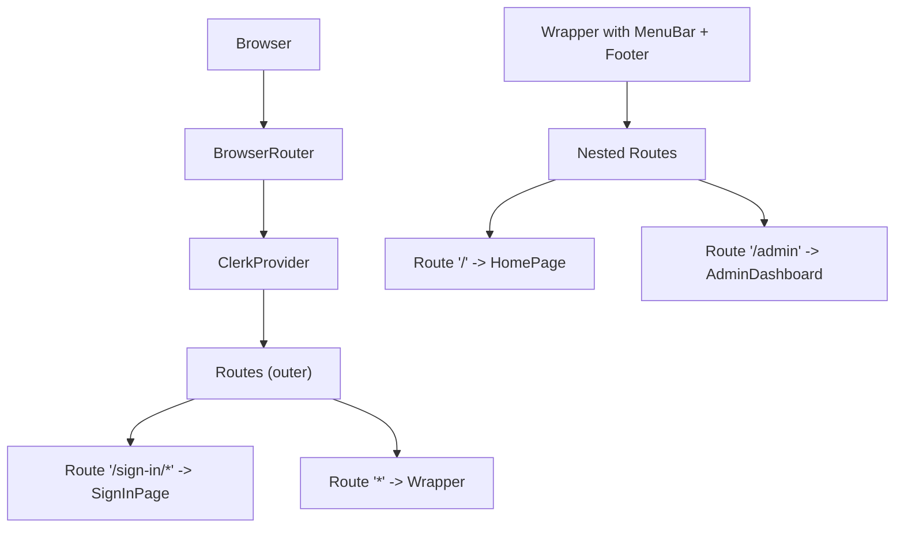
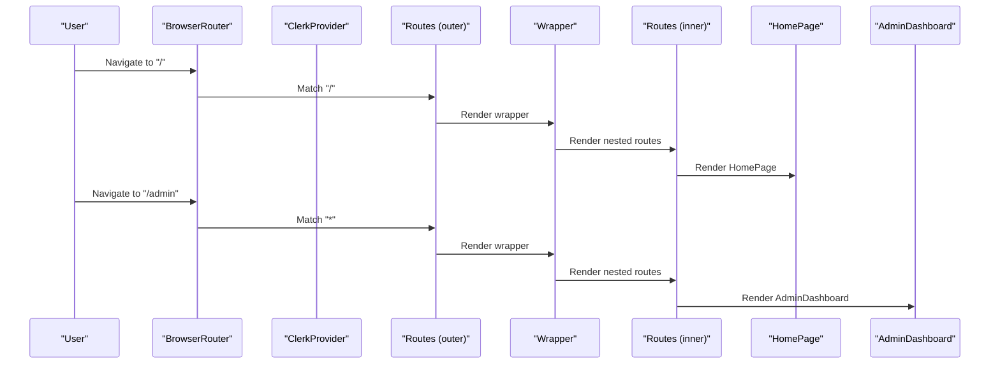
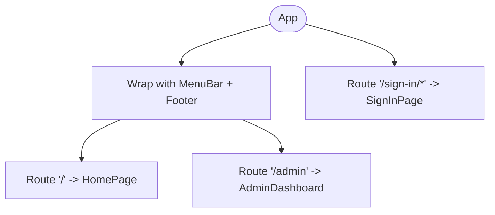
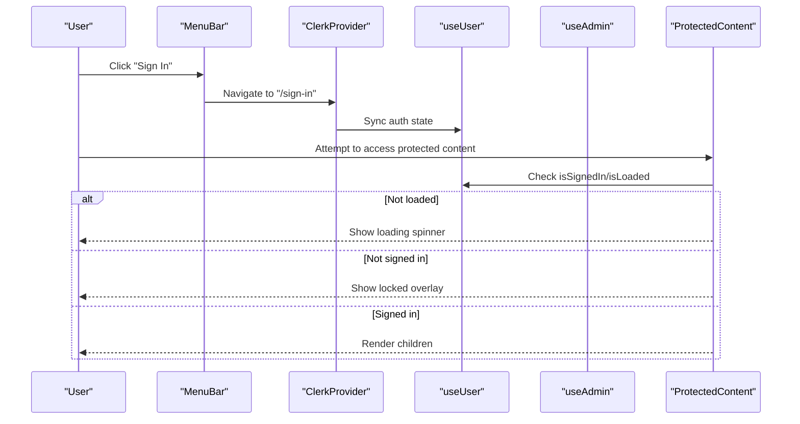
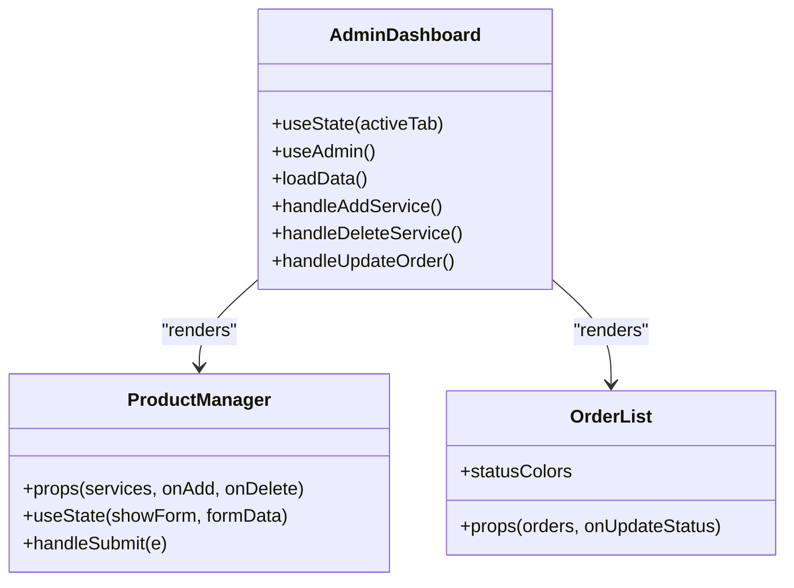
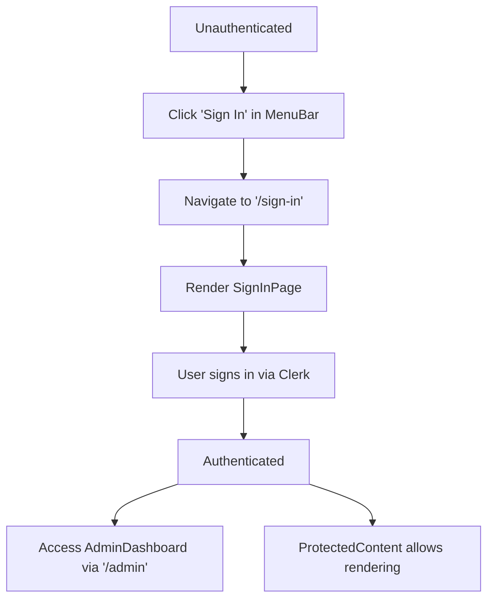
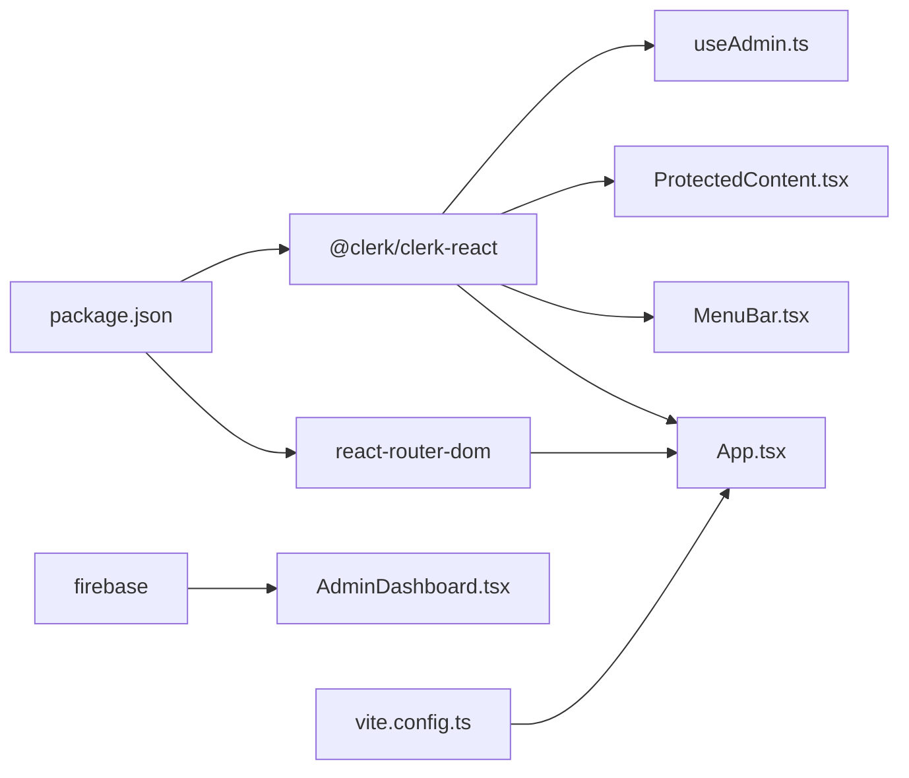

# Routing Architecture

<cite>
**Referenced Files in This Document**
- [App.tsx](file://src/App.tsx)
- [main.tsx](file://src/main.tsx)
- [MenuBar.tsx](file://src/components/layout/MenuBar.tsx)
- [ProtectedContent.tsx](file://src/components/auth/ProtectedContent.tsx)
- [SignInPage.tsx](file://src/components/auth/SignInPage.tsx)
- [AdminDashboard.tsx](file://src/components/admin/AdminDashboard.tsx)
- [ProductManager.tsx](file://src/components/admin/ProductManager.tsx)
- [OrderList.tsx](file://src/components/admin/OrderList.tsx)
- [useAdmin.ts](file://src/hooks/useAdmin.ts)
- [clerk.ts](file://src/config/clerk.ts)
- [package.json](file://package.json)
- [vite.config.ts](file://vite.config.ts)
</cite>

## Table of Contents
1. [Introduction](#introduction)
2. [Project Structure](#project-structure)
3. [Core Components](#core-components)
4. [Architecture Overview](#architecture-overview)
5. [Detailed Component Analysis](#detailed-component-analysis)
6. [Dependency Analysis](#dependency-analysis)
7. [Performance Considerations](#performance-considerations)
8. [Troubleshooting Guide](#troubleshooting-guide)
9. [Conclusion](#conclusion)

## Introduction
This document explains DevForge’s client-side routing architecture built with React Router DOM and integrated with Clerk authentication. It covers the BrowserRouter setup, the two primary routes (/ and /admin), how they map to page components, and how Clerk protects admin routes. It also documents navigation flows between authenticated and unauthenticated states, route transitions, and how the MenuBar integrates with routing for dynamic navigation. Finally, it outlines performance considerations for route-based code splitting and lazy loading strategies.

## Project Structure
The routing system centers around a single-page application with a nested route structure. The outer App wraps everything in BrowserRouter and ClerkProvider, while a dedicated route tree handles both public and protected content.

**Diagram sources**
- [App.tsx:60-67](file://src/App.tsx#L60-L67)
- [App.tsx:26-58](file://src/App.tsx#L26-L58)

**Section sources**
- [App.tsx:1-67](file://src/App.tsx#L1-L67)
- [main.tsx:1-11](file://src/main.tsx#L1-L11)

## Core Components
- BrowserRouter: Wraps the entire application to enable client-side routing.
- ClerkProvider: Integrates Clerk authentication with React Router DOM, enabling Clerk-managed navigation.
- Routes (outer): Defines top-level routes including a dedicated sign-in route and a wrapper for all other pages.
- Nested Routes: Under the wrapper, routes define the homepage and admin dashboard.
- MenuBar: Provides navigation and authentication UI, dynamically adapting to signed-in state.
- ProtectedContent: A guard component that conditionally renders content based on Clerk user state.

**Section sources**
- [App.tsx:1-67](file://src/App.tsx#L1-L67)
- [MenuBar.tsx:1-133](file://src/components/layout/MenuBar.tsx#L1-L133)
- [ProtectedContent.tsx:1-44](file://src/components/auth/ProtectedContent.tsx#L1-L44)

## Architecture Overview
The routing architecture follows a layered approach:
- Outer route layer: Handles sign-in and wraps all other pages with shared layout.
- Inner route layer: Renders the homepage and admin dashboard.
- Authentication integration: ClerkProvider bridges Clerk and React Router DOM, enabling Clerk-driven navigation and state synchronization.

**Diagram sources**
- [App.tsx:35-56](file://src/App.tsx#L35-L56)
- [App.tsx:14-24](file://src/App.tsx#L14-L24)
- [App.tsx:18-19](file://src/App.tsx#L18-L19)

## Detailed Component Analysis

### Route Configuration and Layout
- Outer Routes:
  - "/sign-in/*" maps to SignInPage, rendering a full-screen authentication interface without the shared layout.
  - "*" maps to a wrapper that includes MenuBar, a main container, and Footer, under which nested routes render.
- Nested Routes:
  - "/" renders HomePage, composed of Hero, MarqueeStrip, ServicesGrid, ScriptConverter, and LocalSupport.
  - "/admin" renders AdminDashboard.

**Diagram sources**
- [App.tsx:35-56](file://src/App.tsx#L35-L56)
- [App.tsx:14-24](file://src/App.tsx#L14-L24)

**Section sources**
- [App.tsx:26-58](file://src/App.tsx#L26-L58)
- [App.tsx:14-24](file://src/App.tsx#L14-L24)

### Authentication Integration with Clerk
- ClerkProvider:
  - Publishable key is configured from environment variables.
  - routerPush/routerReplace callbacks integrate Clerk navigation with React Router DOM.
- useAdmin hook:
  - Determines admin status by comparing the signed-in user’s primary email address against a configured admin email.
- ProtectedContent:
  - Guards content by checking Clerk user state; displays a locked overlay when unauthenticated and falls back to a child component or a provided fallback.

**Diagram sources**
- [App.tsx:30-34](file://src/App.tsx#L30-L34)
- [MenuBar.tsx:110-128](file://src/components/layout/MenuBar.tsx#L110-L128)
- [ProtectedContent.tsx:10-43](file://src/components/auth/ProtectedContent.tsx#L10-L43)
- [useAdmin.ts:4-13](file://src/hooks/useAdmin.ts#L4-L13)

**Section sources**
- [App.tsx:1-67](file://src/App.tsx#L1-L67)
- [MenuBar.tsx:1-133](file://src/components/layout/MenuBar.tsx#L1-L133)
- [ProtectedContent.tsx:1-44](file://src/components/auth/ProtectedContent.tsx#L1-L44)
- [useAdmin.ts:1-14](file://src/hooks/useAdmin.ts#L1-L14)
- [clerk.ts:1-4](file://src/config/clerk.ts#L1-L4)

### Admin Dashboard and Nested Components
- AdminDashboard:
  - Uses useAdmin to enforce admin-only access.
  - Manages tabs for Products and Orders.
  - Fetches data from Firebase and delegates editing to ProductManager and OrderList.
- ProductManager:
  - Provides forms to add and delete services.
  - Accepts callbacks from AdminDashboard to mutate Firestore.
- OrderList:
  - Displays orders and updates their status via AdminDashboard callback.

**Diagram sources**
- [AdminDashboard.tsx:18-185](file://src/components/admin/AdminDashboard.tsx#L18-L185)
- [ProductManager.tsx:22-220](file://src/components/admin/ProductManager.tsx#L22-L220)
- [OrderList.tsx:15-90](file://src/components/admin/OrderList.tsx#L15-L90)

**Section sources**
- [AdminDashboard.tsx:1-186](file://src/components/admin/AdminDashboard.tsx#L1-L186)
- [ProductManager.tsx:1-221](file://src/components/admin/ProductManager.tsx#L1-L221)
- [OrderList.tsx:1-91](file://src/components/admin/OrderList.tsx#L1-L91)

### Navigation Flow Between Authenticated and Unauthenticated States
- Unauthenticated state:
  - MenuBar shows a “Sign In” button that navigates to the Clerk sign-in route.
  - ProtectedContent overlays a locked screen when attempting to access protected content.
- Authenticated state:
  - MenuBar shows Clerk’s UserButton for profile actions.
  - useAdmin determines whether to grant access to AdminDashboard.

**Diagram sources**
- [MenuBar.tsx:110-128](file://src/components/layout/MenuBar.tsx#L110-L128)
- [SignInPage.tsx:4-250](file://src/components/auth/SignInPage.tsx#L4-L250)
- [ProtectedContent.tsx:10-43](file://src/components/auth/ProtectedContent.tsx#L10-L43)
- [AdminDashboard.tsx:18-185](file://src/components/admin/AdminDashboard.tsx#L18-L185)

**Section sources**
- [MenuBar.tsx:1-133](file://src/components/layout/MenuBar.tsx#L1-L133)
- [ProtectedContent.tsx:1-44](file://src/components/auth/ProtectedContent.tsx#L1-L44)
- [SignInPage.tsx:1-251](file://src/components/auth/SignInPage.tsx#L1-L251)

### Route Parameters and Nested Routing Patterns
- Current routes:
  - "/" for the homepage.
  - "/admin" for the admin dashboard.
- Nested routing:
  - The wrapper under "*" nests the homepage and admin routes, allowing a consistent layout across pages.
- Route parameters:
  - No explicit route parameters are defined in the current implementation. Parameters could be introduced later using React Router’s path syntax (e.g., "/admin/:id") and accessed via hooks like useParams.

**Section sources**
- [App.tsx:35-56](file://src/App.tsx#L35-L56)

### Future Expansion Possibilities
- Route parameters:
  - Introduce parameters for admin actions (e.g., "/admin/services/:id").
- Lazy loading:
  - Use React.lazy and Suspense to defer loading of heavy components like AdminDashboard until needed.
- Dynamic imports:
  - Split bundles per route to improve initial load performance.
- Nested routes:
  - Expand admin routes to include sub-routes for service management, order details, and analytics.

[No sources needed since this section provides general guidance]

## Dependency Analysis
The routing architecture depends on React Router DOM and Clerk for navigation and authentication. The build system uses Vite with React plugin and path aliases.

**Diagram sources**
- [package.json:12-17](file://package.json#L12-L17)
- [vite.config.ts:1-22](file://vite.config.ts#L1-L22)
- [App.tsx:1-67](file://src/App.tsx#L1-L67)
- [MenuBar.tsx:1-133](file://src/components/layout/MenuBar.tsx#L1-L133)
- [ProtectedContent.tsx:1-44](file://src/components/auth/ProtectedContent.tsx#L1-L44)
- [useAdmin.ts:1-14](file://src/hooks/useAdmin.ts#L1-L14)
- [AdminDashboard.tsx:1-186](file://src/components/admin/AdminDashboard.tsx#L1-L186)

**Section sources**
- [package.json:1-38](file://package.json#L1-L38)
- [vite.config.ts:1-22](file://vite.config.ts#L1-L22)

## Performance Considerations
- Route-based code splitting:
  - Use React.lazy to split AdminDashboard and other heavy components into separate chunks.
  - Wrap lazy-loaded components in Suspense to show a loading indicator during chunk download.
- Bundle optimization:
  - Leverage Vite’s build settings and keep source maps enabled for development debugging.
  - Consider dynamic imports for nested routes to reduce initial bundle size.
- Rendering performance:
  - Memoize props passed to ProductManager and OrderList to minimize re-renders.
  - Use virtualized lists for large datasets if order counts grow significantly.

[No sources needed since this section provides general guidance]

## Troubleshooting Guide
- Clerk publishable key missing:
  - Ensure the environment variable is set; otherwise, ClerkProvider will fail to initialize navigation callbacks.
- Admin access denied:
  - Verify the admin email configuration matches the signed-in user’s primary email.
- Navigation not working:
  - Confirm routerPush/routerReplace callbacks are correctly wired in ClerkProvider.
- ProtectedContent not rendering:
  - Check that isLoaded and isSignedIn states are handled before rendering children.

**Section sources**
- [App.tsx:30-34](file://src/App.tsx#L30-L34)
- [clerk.ts:1-4](file://src/config/clerk.ts#L1-L4)
- [useAdmin.ts:4-13](file://src/hooks/useAdmin.ts#L4-L13)
- [ProtectedContent.tsx:10-43](file://src/components/auth/ProtectedContent.tsx#L10-L43)

## Conclusion
DevForge’s routing architecture cleanly separates public and protected content, integrates Clerk authentication seamlessly, and maintains a consistent layout across pages. The current design supports straightforward navigation and authentication flows, with clear pathways for future enhancements such as route parameters, lazy loading, and expanded nested routes.