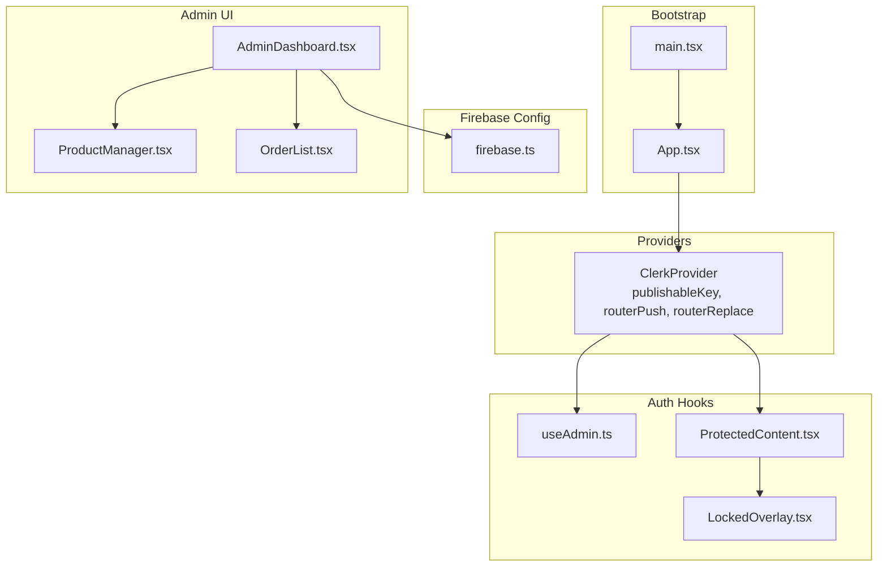
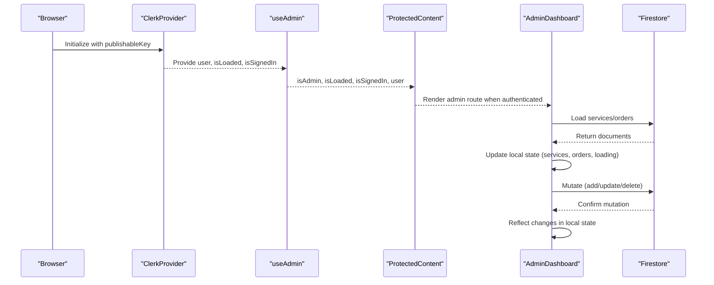
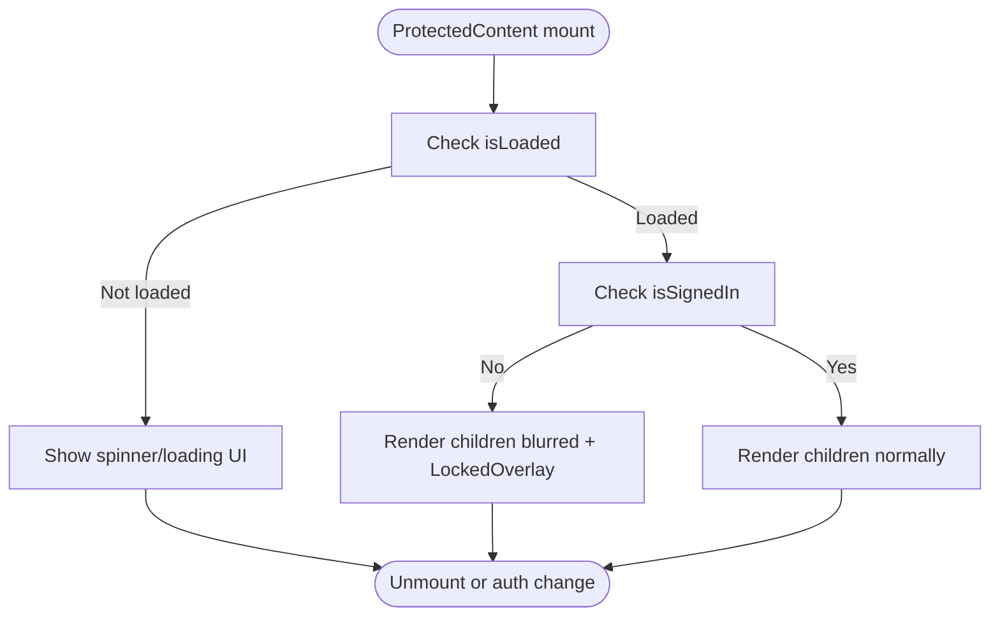
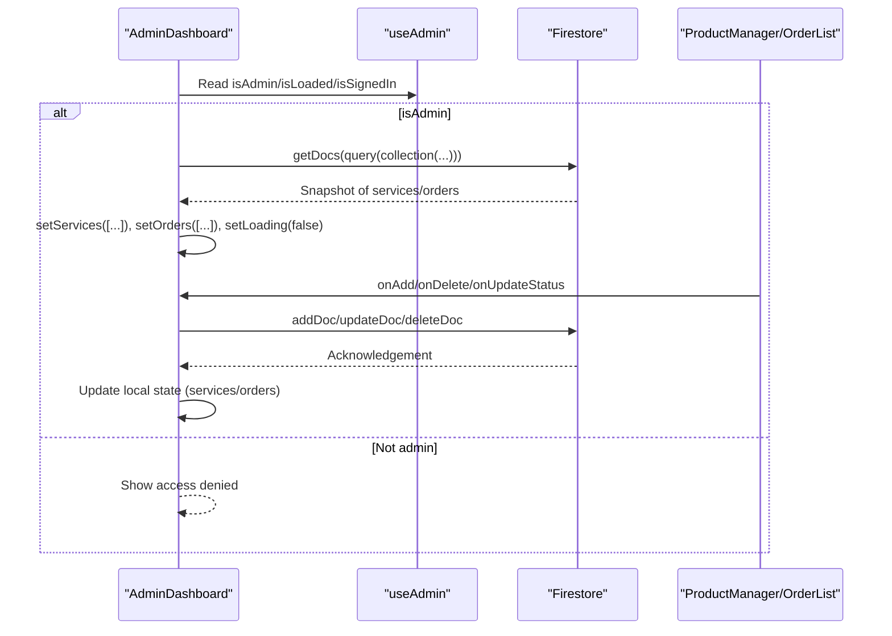
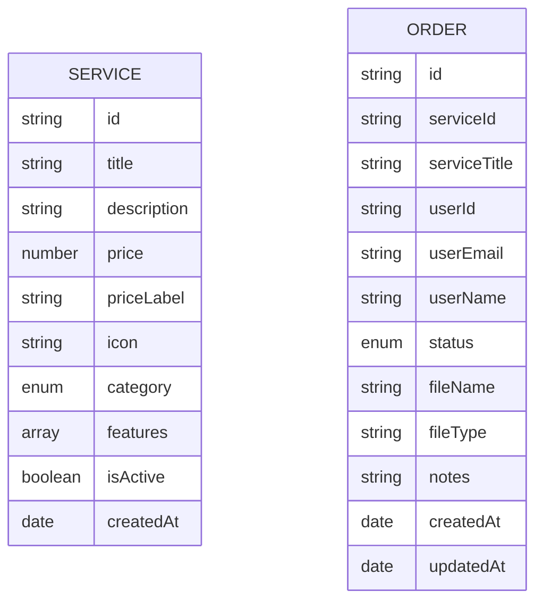
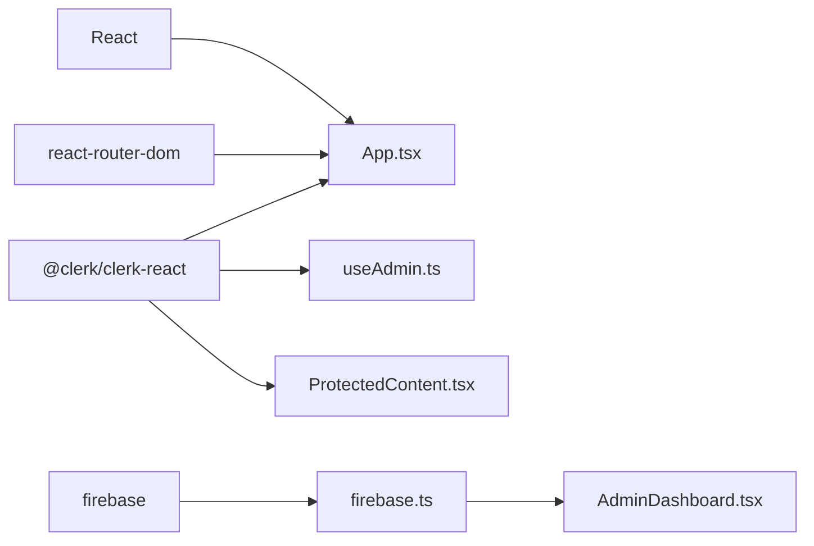

# State Management Patterns

<cite>
**Referenced Files in This Document**
- [App.tsx](file://src/App.tsx)
- [main.tsx](file://src/main.tsx)
- [clerk.ts](file://src/config/clerk.ts)
- [firebase.ts](file://src/config/firebase.ts)
- [useAdmin.ts](file://src/hooks/useAdmin.ts)
- [ProtectedContent.tsx](file://src/components/auth/ProtectedContent.tsx)
- [LockedOverlay.tsx](file://src/components/auth/LockedOverlay.tsx)
- [AdminDashboard.tsx](file://src/components/admin/AdminDashboard.tsx)
- [ProductManager.tsx](file://src/components/admin/ProductManager.tsx)
- [OrderList.tsx](file://src/components/admin/OrderList.tsx)
- [index.ts](file://src/types/index.ts)
- [package.json](file://package.json)
- [tsconfig.json](file://tsconfig.json)
- [tsconfig.app.json](file://tsconfig.app.json)
</cite>

## Table of Contents
1. [Introduction](#introduction)
2. [Project Structure](#project-structure)
3. [Core Components](#core-components)
4. [Architecture Overview](#architecture-overview)
5. [Detailed Component Analysis](#detailed-component-analysis)
6. [Dependency Analysis](#dependency-analysis)
7. [Performance Considerations](#performance-considerations)
8. [Troubleshooting Guide](#troubleshooting-guide)
9. [Conclusion](#conclusion)

## Introduction
This document explains DevForge’s state management approach that combines React hooks with external service integrations. It focuses on:
- Provider Pattern implementation with ClerkProvider for authentication state
- Custom hooks like useAdmin encapsulating business logic
- Integration patterns with Firebase for data operations
- How local component state interacts with external services
- Complete state flow from authentication providers through custom hooks to UI components, including error handling and loading states
- Examples of useState, useEffect patterns and how the app manages user session state, admin privileges, and real-time updates
- Performance optimization techniques and state persistence strategies

## Project Structure
DevForge organizes state management across three primary layers:
- Application bootstrap and routing with provider configuration
- Authentication state via Clerk hooks and custom business logic
- Data state via Firebase operations and local component state

**Diagram sources**
- [main.tsx:1-11](file://src/main.tsx#L1-L11)
- [App.tsx:26-58](file://src/App.tsx#L26-L58)
- [useAdmin.ts:1-14](file://src/hooks/useAdmin.ts#L1-L14)
- [ProtectedContent.tsx:1-44](file://src/components/auth/ProtectedContent.tsx#L1-L44)
- [LockedOverlay.tsx:1-61](file://src/components/auth/LockedOverlay.tsx#L1-L61)
- [firebase.ts:1-19](file://src/config/firebase.ts#L1-L19)
- [AdminDashboard.tsx:1-186](file://src/components/admin/AdminDashboard.tsx#L1-L186)
- [ProductManager.tsx:1-221](file://src/components/admin/ProductManager.tsx#L1-L221)
- [OrderList.tsx:1-91](file://src/components/admin/OrderList.tsx#L1-L91)

**Section sources**
- [main.tsx:1-11](file://src/main.tsx#L1-L11)
- [App.tsx:1-67](file://src/App.tsx#L1-L67)
- [firebase.ts:1-19](file://src/config/firebase.ts#L1-L19)

## Core Components
- ClerkProvider wraps routing and exposes authentication state to the app.
- useAdmin encapsulates admin privilege checks based on signed-in state and email equality against a configured admin email.
- ProtectedContent renders a locked overlay when the user is not authenticated, while still allowing the UI to render with blurred content.
- AdminDashboard orchestrates local state for tabs, services, orders, and loading states, and performs Firebase operations for CRUD actions.
- ProductManager and OrderList are presentational components receiving props for data and callbacks.
- Types define the shape of Service and Order entities.

**Section sources**
- [App.tsx:26-58](file://src/App.tsx#L26-L58)
- [useAdmin.ts:1-14](file://src/hooks/useAdmin.ts#L1-L14)
- [ProtectedContent.tsx:1-44](file://src/components/auth/ProtectedContent.tsx#L1-L44)
- [LockedOverlay.tsx:1-61](file://src/components/auth/LockedOverlay.tsx#L1-L61)
- [AdminDashboard.tsx:1-186](file://src/components/admin/AdminDashboard.tsx#L1-L186)
- [ProductManager.tsx:1-221](file://src/components/admin/ProductManager.tsx#L1-L221)
- [OrderList.tsx:1-91](file://src/components/admin/OrderList.tsx#L1-L91)
- [index.ts:1-40](file://src/types/index.ts#L1-L40)

## Architecture Overview
The state lifecycle follows a predictable flow:
- Authentication state originates from ClerkProvider and is normalized by useAdmin.
- ProtectedContent conditionally renders content or a locked overlay based on isLoaded/isSignedIn.
- AdminDashboard loads data from Firestore into local state and updates Firestore, then reflects changes back into local state.
- ProductManager and OrderList receive props and trigger callbacks to mutate Firestore and local state.

**Diagram sources**
- [App.tsx:26-58](file://src/App.tsx#L26-L58)
- [useAdmin.ts:1-14](file://src/hooks/useAdmin.ts#L1-L14)
- [ProtectedContent.tsx:1-44](file://src/components/auth/ProtectedContent.tsx#L1-L44)
- [AdminDashboard.tsx:25-72](file://src/components/admin/AdminDashboard.tsx#L25-L72)
- [firebase.ts:16-18](file://src/config/firebase.ts#L16-L18)

## Detailed Component Analysis

### Authentication Provider and Hooks
- ClerkProvider is initialized with publishableKey and router helpers to integrate with React Router.
- useAdmin composes Clerk’s useUser to compute isAdmin by comparing the primary email address to a configured admin email.
- ProtectedContent uses isLoaded/isSignedIn to decide between rendering children, a spinner, or a locked overlay with LockedOverlay.

**Diagram sources**
- [ProtectedContent.tsx:10-43](file://src/components/auth/ProtectedContent.tsx#L10-L43)
- [LockedOverlay.tsx:3-59](file://src/components/auth/LockedOverlay.tsx#L3-L59)

**Section sources**
- [App.tsx:26-58](file://src/App.tsx#L26-L58)
- [useAdmin.ts:1-14](file://src/hooks/useAdmin.ts#L1-L14)
- [ProtectedContent.tsx:1-44](file://src/components/auth/ProtectedContent.tsx#L1-L44)
- [LockedOverlay.tsx:1-61](file://src/components/auth/LockedOverlay.tsx#L1-L61)
- [clerk.ts:1-4](file://src/config/clerk.ts#L1-L4)

### Admin Dashboard State Flow
- AdminDashboard uses local state for activeTab, services, orders, and loading.
- On admin eligibility, it fetches services and orders from Firestore, maps snapshots to typed arrays, and sets loading to false.
- Mutation handlers update Firestore and then update local state optimistically.

**Diagram sources**
- [AdminDashboard.tsx:18-110](file://src/components/admin/AdminDashboard.tsx#L18-L110)
- [AdminDashboard.tsx:25-72](file://src/components/admin/AdminDashboard.tsx#L25-L72)
- [ProductManager.tsx:35-52](file://src/components/admin/ProductManager.tsx#L35-L52)
- [OrderList.tsx:66-85](file://src/components/admin/OrderList.tsx#L66-L85)

**Section sources**
- [AdminDashboard.tsx:1-186](file://src/components/admin/AdminDashboard.tsx#L1-L186)
- [ProductManager.tsx:1-221](file://src/components/admin/ProductManager.tsx#L1-L221)
- [OrderList.tsx:1-91](file://src/components/admin/OrderList.tsx#L1-L91)

### Data Models and Types
- Service defines product metadata and lifecycle fields.
- Order captures customer interactions, status transitions, and timestamps.
- These types guide how Firestore documents are mapped into local state.

**Diagram sources**
- [index.ts:1-40](file://src/types/index.ts#L1-L40)

**Section sources**
- [index.ts:1-40](file://src/types/index.ts#L1-L40)

### Real-Time Updates and Persistence
- Current implementation uses Firestore CRUD operations with local state updates after mutations.
- There is no explicit Firestore listener subscription in the analyzed files; data changes are reflected through manual refresh and optimistic UI updates.
- For production, consider adding onSnapshot listeners to keep local state synchronized and reduce stale reads.

**Section sources**
- [AdminDashboard.tsx:25-72](file://src/components/admin/AdminDashboard.tsx#L25-L72)
- [ProductManager.tsx:35-52](file://src/components/admin/ProductManager.tsx#L35-L52)
- [OrderList.tsx:66-85](file://src/components/admin/OrderList.tsx#L66-L85)

## Dependency Analysis
External libraries and their roles:
- @clerk/clerk-react: Provides authentication primitives and routing integration.
- firebase: Firestore and Storage SDKs for data operations.
- react-router-dom: Routing and navigation integration with Clerk.

**Diagram sources**
- [package.json:12-18](file://package.json#L12-L18)
- [App.tsx:1-3](file://src/App.tsx#L1-L3)
- [useAdmin.ts:1](file://src/hooks/useAdmin.ts#L1)
- [ProtectedContent.tsx:1](file://src/components/auth/ProtectedContent.tsx#L1)
- [firebase.ts:1-3](file://src/config/firebase.ts#L1-L3)
- [AdminDashboard.tsx:3](file://src/components/admin/AdminDashboard.tsx#L3)

**Section sources**
- [package.json:12-18](file://package.json#L12-L18)
- [tsconfig.json:18-20](file://tsconfig.json#L18-L20)
- [tsconfig.app.json:18-22](file://tsconfig.app.json#L18-L22)

## Performance Considerations
- Prefer memoization for derived values computed from Clerk user data to avoid unnecessary re-renders.
- Batch Firestore writes and debounce frequent updates to minimize network overhead.
- Lazy-load heavy admin views and split queries to reduce initial payload.
- Use optimistic UI updates with rollback on failure to improve perceived responsiveness.
- Persist critical UI state (e.g., activeTab) in localStorage to enhance UX across reloads.
- Avoid redundant queries by caching results and invalidating only affected records.

## Troubleshooting Guide
Common issues and resolutions:
- Authentication not loaded: Ensure ClerkProvider is mounted at the root and publishableKey is set. Use ProtectedContent to show a spinner until isLoaded is true.
- Admin access denied: Verify ADMIN_EMAIL matches the authenticated user’s primary email address.
- Firestore errors: Wrap data operations in try/catch blocks and surface user-friendly messages. Log errors for debugging.
- Stale data: Since there are no Firestore listeners, trigger refetches after mutations or introduce onSnapshot subscriptions.

**Section sources**
- [ProtectedContent.tsx:13-29](file://src/components/auth/ProtectedContent.tsx#L13-L29)
- [AdminDashboard.tsx:44-48](file://src/components/admin/AdminDashboard.tsx#L44-L48)
- [clerk.ts:1-4](file://src/config/clerk.ts#L1-L4)

## Conclusion
DevForge’s state management blends Clerk’s authentication hooks with custom business logic and Firebase data operations. The Provider Pattern with ClerkProvider centralizes authentication state, while custom hooks like useAdmin encapsulate privilege checks. AdminDashboard coordinates local state with Firestore mutations, and presentational components receive props and callbacks. For production readiness, consider adding Firestore listeners for real-time updates and implementing robust error handling and state persistence strategies.