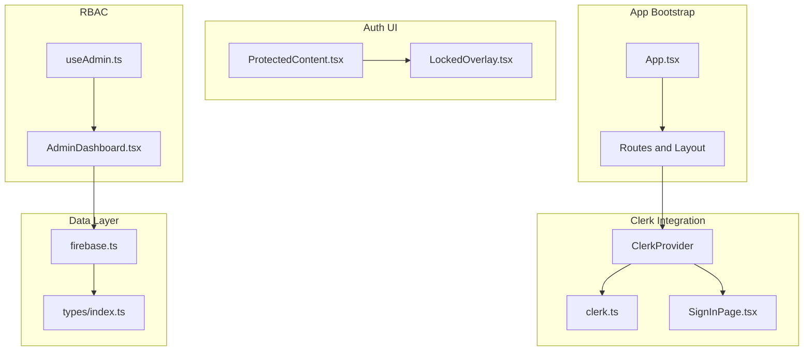
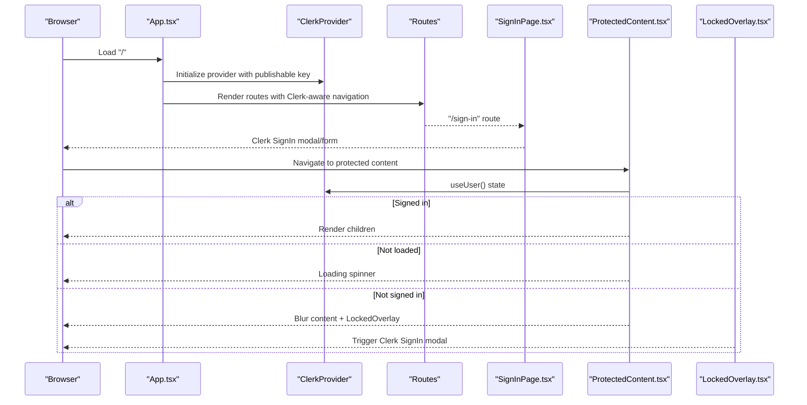
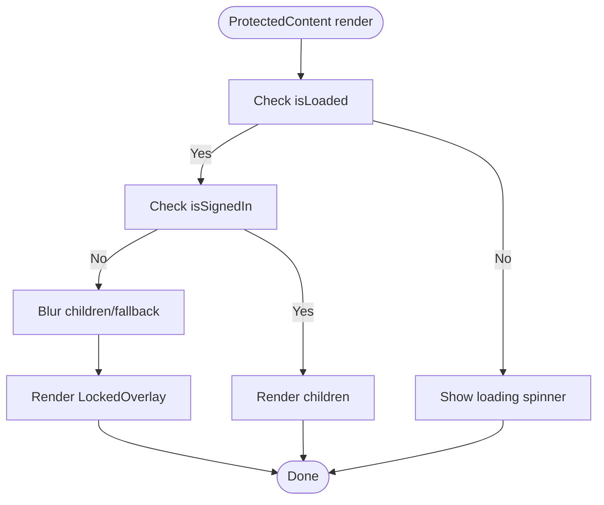
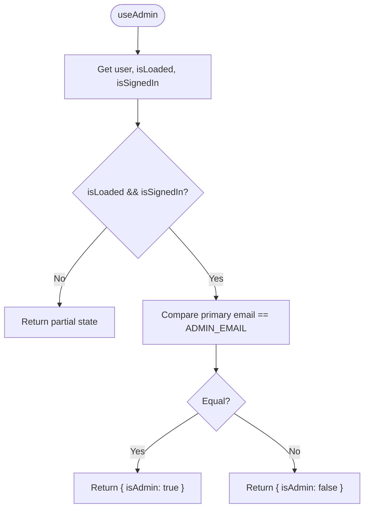
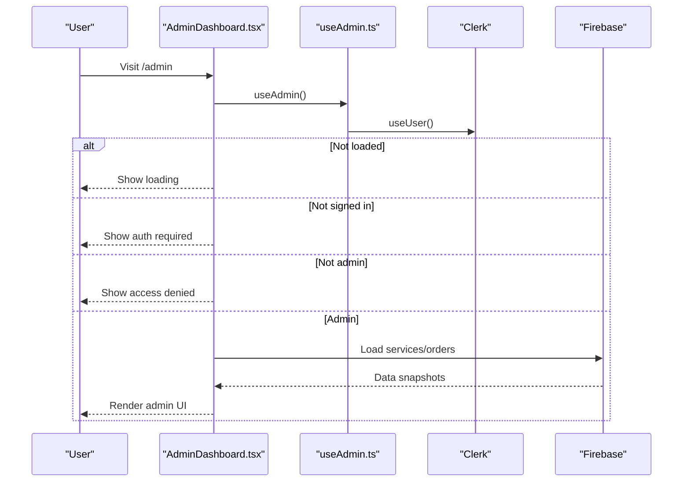
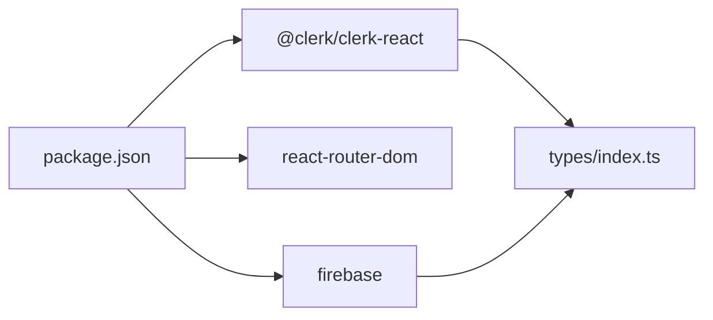

# Authentication System

<cite>
**Referenced Files in This Document**
- [App.tsx](file://src/App.tsx)
- [clerk.ts](file://src/config/clerk.ts)
- [firebase.ts](file://src/config/firebase.ts)
- [ProtectedContent.tsx](file://src/components/auth/ProtectedContent.tsx)
- [LockedOverlay.tsx](file://src/components/auth/LockedOverlay.tsx)
- [SignInPage.tsx](file://src/components/auth/SignInPage.tsx)
- [useAdmin.ts](file://src/hooks/useAdmin.ts)
- [AdminDashboard.tsx](file://src/components/admin/AdminDashboard.tsx)
- [MenuBar.tsx](file://src/components/layout/MenuBar.tsx)
- [Hero.tsx](file://src/components/home/Hero.tsx)
- [index.ts](file://src/types/index.ts)
- [package.json](file://package.json)
</cite>

## Table of Contents
1. [Introduction](#introduction)
2. [Project Structure](#project-structure)
3. [Core Components](#core-components)
4. [Architecture Overview](#architecture-overview)
5. [Detailed Component Analysis](#detailed-component-analysis)
6. [Dependency Analysis](#dependency-analysis)
7. [Performance Considerations](#performance-considerations)
8. [Troubleshooting Guide](#troubleshooting-guide)
9. [Conclusion](#conclusion)
10. [Appendices](#appendices)

## Introduction
This document describes DevForge’s authentication system built on Clerk for user management and session handling, with role-based access control (RBAC) centered around an administrator email. It covers the authentication flow (registration and login), session lifecycle, protected content rendering, admin-only dashboards, and integration patterns with Clerk SDK and Firebase. It also provides guidance on extending the system, adding additional identity providers, and maintaining security best practices.

## Project Structure
The authentication system spans several areas:
- Application bootstrap and routing with Clerk provider wrapping the app
- Clerk configuration and environment variables
- Authentication UI pages (sign-in modal and full-screen sign-in page)
- Protected content rendering and locked overlay UX
- Admin hook and dashboard with RBAC checks
- Firebase integration for admin data persistence

**Diagram sources**
- [App.tsx:26-58](file://src/App.tsx#L26-L58)
- [clerk.ts:1-4](file://src/config/clerk.ts#L1-L4)
- [SignInPage.tsx:157-221](file://src/components/auth/SignInPage.tsx#L157-L221)
- [ProtectedContent.tsx:10-43](file://src/components/auth/ProtectedContent.tsx#L10-L43)
- [LockedOverlay.tsx:3-56](file://src/components/auth/LockedOverlay.tsx#L3-L56)
- [useAdmin.ts:4-13](file://src/hooks/useAdmin.ts#L4-L13)
- [AdminDashboard.tsx:18-110](file://src/components/admin/AdminDashboard.tsx#L18-L110)
- [firebase.ts:5-18](file://src/config/firebase.ts#L5-L18)
- [index.ts:1-40](file://src/types/index.ts#L1-L40)

**Section sources**
- [App.tsx:1-67](file://src/App.tsx#L1-L67)
- [clerk.ts:1-4](file://src/config/clerk.ts#L1-L4)
- [firebase.ts:1-19](file://src/config/firebase.ts#L1-L19)

## Core Components
- Clerk Provider and Router Integration: Wraps the app with ClerkProvider and configures navigation callbacks to integrate with react-router-dom.
- Clerk Configuration: Exposes publishable key and admin email from environment variables.
- Protected Content Renderer: Conditionally renders children or a locked overlay based on signed-in state.
- Locked Overlay: Provides a modal-triggered sign-in prompt with a “Members Only” message.
- Admin Hook: Computes admin status from Clerk user data and environment configuration.
- Admin Dashboard: Loads and manages admin data from Firestore, gated by RBAC checks.
- Sign-In Page: Full-screen Clerk SignIn component with custom appearance and routing.
- Firebase Config: Initializes Firestore and Storage for admin data operations.

**Section sources**
- [App.tsx:26-58](file://src/App.tsx#L26-L58)
- [clerk.ts:1-4](file://src/config/clerk.ts#L1-L4)
- [ProtectedContent.tsx:10-43](file://src/components/auth/ProtectedContent.tsx#L10-L43)
- [LockedOverlay.tsx:3-56](file://src/components/auth/LockedOverlay.tsx#L3-L56)
- [useAdmin.ts:4-13](file://src/hooks/useAdmin.ts#L4-L13)
- [AdminDashboard.tsx:18-110](file://src/components/admin/AdminDashboard.tsx#L18-L110)
- [SignInPage.tsx:157-221](file://src/components/auth/SignInPage.tsx#L157-L221)
- [firebase.ts:5-18](file://src/config/firebase.ts#L5-L18)

## Architecture Overview
The authentication architecture centers on Clerk for identity and session management, with ClerkProvider at the root. Clerk-managed routes and modals are used for sign-in, while custom components enforce access control and UX overlays.

**Diagram sources**
- [App.tsx:26-58](file://src/App.tsx#L26-L58)
- [SignInPage.tsx:157-221](file://src/components/auth/SignInPage.tsx#L157-L221)
- [ProtectedContent.tsx:10-43](file://src/components/auth/ProtectedContent.tsx#L10-L43)
- [LockedOverlay.tsx:3-56](file://src/components/auth/LockedOverlay.tsx#L3-L56)

## Detailed Component Analysis

### Clerk Provider and Routing
- Wraps the application with ClerkProvider and passes publishable key from environment.
- Configures routerPush/routerReplace to integrate with react-router-dom’s navigate.
- Declares a dedicated sign-in route that renders a full-screen sign-in page without shared layout.

**Section sources**
- [App.tsx:26-58](file://src/App.tsx#L26-L58)
- [clerk.ts:1](file://src/config/clerk.ts#L1)

### ProtectedContent Component
- Uses Clerk’s useUser to determine isLoaded and isSignedIn.
- Renders a loading indicator while user state is resolving.
- If not signed in, blurs underlying content and overlays LockedOverlay.
- Otherwise, renders children.

**Diagram sources**
- [ProtectedContent.tsx:10-43](file://src/components/auth/ProtectedContent.tsx#L10-L43)

**Section sources**
- [ProtectedContent.tsx:10-43](file://src/components/auth/ProtectedContent.tsx#L10-L43)

### LockedOverlay Component
- Presents a centered “Members Only” message with a lock icon.
- Provides a Clerk SignInButton in modal mode to trigger authentication.

**Section sources**
- [LockedOverlay.tsx:3-56](file://src/components/auth/LockedOverlay.tsx#L3-L56)

### Admin Hook and RBAC
- useAdmin computes admin status by checking:
  - isLoaded and isSignedIn from Clerk
  - primary email address equality against configured ADMIN_EMAIL
- Returns isAdmin flag along with user and loading state.

**Diagram sources**
- [useAdmin.ts:4-13](file://src/hooks/useAdmin.ts#L4-L13)
- [clerk.ts:2](file://src/config/clerk.ts#L2)

**Section sources**
- [useAdmin.ts:4-13](file://src/hooks/useAdmin.ts#L4-L13)
- [clerk.ts:2](file://src/config/clerk.ts#L2)

### Admin Dashboard
- Uses useAdmin to gate access and render:
  - Loading state while user state resolves
  - Authentication required notice if not signed in
  - Access denied notice if signed in but not admin
  - Admin UI tabs for managing products/orders
- Loads data from Firestore and updates state accordingly.

**Diagram sources**
- [AdminDashboard.tsx:18-110](file://src/components/admin/AdminDashboard.tsx#L18-L110)
- [useAdmin.ts:4-13](file://src/hooks/useAdmin.ts#L4-L13)
- [firebase.ts:5-18](file://src/config/firebase.ts#L5-L18)

**Section sources**
- [AdminDashboard.tsx:18-110](file://src/components/admin/AdminDashboard.tsx#L18-L110)
- [firebase.ts:5-18](file://src/config/firebase.ts#L5-L18)

### Sign-In Page
- Full-screen Clerk SignIn component with:
  - Custom routing configuration
  - Themed appearance variables for dark mode and glassmorphism
  - Decorative code background and branding

**Section sources**
- [SignInPage.tsx:157-221](file://src/components/auth/SignInPage.tsx#L157-L221)

### Environment Configuration
- Publishable key and admin email are sourced from environment variables.
- Firebase configuration is initialized from environment variables for Firestore and Storage.

**Section sources**
- [clerk.ts:1-4](file://src/config/clerk.ts#L1-L4)
- [firebase.ts:5-18](file://src/config/firebase.ts#L5-L18)

## Dependency Analysis
- Clerk SDK dependencies:
  - @clerk/clerk-react for provider, hooks, and UI components
  - react-router-dom for navigation integration
- Firebase SDK for admin data operations
- Types define service and order structures used by admin components

**Diagram sources**
- [package.json:12-18](file://package.json#L12-L18)
- [index.ts:1-40](file://src/types/index.ts#L1-L40)

**Section sources**
- [package.json:12-18](file://package.json#L12-L18)
- [index.ts:1-40](file://src/types/index.ts#L1-L40)

## Performance Considerations
- Prefer lazy-loading protected sections to avoid unnecessary computations until user state is resolved.
- Debounce or batch Firestore reads in admin dashboards to reduce network overhead.
- Use Clerk’s client-side caching and preloaded user state to minimize re-renders during navigation.
- Keep overlay rendering lightweight; avoid heavy computations inside LockedOverlay.

## Troubleshooting Guide
Common issues and resolutions:
- Publishable key missing or invalid:
  - Ensure VITE_CLERK_PUBLISHABLE_KEY is set in environment.
  - Verify ClerkProvider receives the key correctly.
- Admin email mismatch:
  - Confirm VITE_ADMIN_EMAIL matches the admin’s primary email address.
  - Check that Clerk user’s primary email is accessible.
- Protected content not rendering:
  - Confirm useUser is called within ClerkProvider.
  - Ensure ProtectedContent wraps content intended to be guarded.
- Sign-in modal not appearing:
  - Verify SignInButton is rendered and Clerk SignIn is configured on the page.
  - Check that routing and appearance props are correctly passed to SignIn.
- Admin dashboard blank or loading:
  - Confirm Firestore initialization and environment variables are present.
  - Check for errors in data fetch and update operations.

**Section sources**
- [clerk.ts:1-4](file://src/config/clerk.ts#L1-L4)
- [useAdmin.ts:4-13](file://src/hooks/useAdmin.ts#L4-L13)
- [ProtectedContent.tsx:10-43](file://src/components/auth/ProtectedContent.tsx#L10-L43)
- [LockedOverlay.tsx:3-56](file://src/components/auth/LockedOverlay.tsx#L3-L56)
- [SignInPage.tsx:157-221](file://src/components/auth/SignInPage.tsx#L157-L221)
- [firebase.ts:5-18](file://src/config/firebase.ts#L5-L18)

## Conclusion
DevForge’s authentication system leverages Clerk for robust identity and session management, complemented by a simple yet effective RBAC model centered on a single admin email. ProtectedContent and LockedOverlay deliver a seamless user experience for unauthenticated users, while the AdminDashboard integrates with Firestore for administrative tasks. The system is modular, extensible, and ready for additional identity providers and advanced access patterns.

## Appendices

### Authentication Flow Summary
- Registration/Login: Managed by Clerk SignIn component and Clerk-hosted flows.
- Session Management: Clerk handles tokens and user state; ProtectedContent and AdminDashboard rely on Clerk hooks.
- Role-Based Access Control: Admin status computed via useAdmin hook using primary email comparison.
- Token Management: No manual token handling shown; rely on Clerk SDK for secure token lifecycle.
- Security Best Practices:
  - Store secrets in environment variables (as used).
  - Enforce server-side validation and authorization for sensitive operations.
  - Use HTTPS and secure cookies where applicable.
  - Limit exposure of admin-only routes and data.

### Extending Authentication Features
- Add Identity Providers:
  - Configure additional providers in Clerk dashboard and enable them in Clerk SignIn.
  - Update environment variables if provider-specific settings are required.
- Multi-role Support:
  - Extend useAdmin to check roles stored in Clerk user metadata or a backend database.
  - Introduce additional hooks for other roles (e.g., useEditor, useModerator).
- Enhanced UX:
  - Add custom loaders and error states in ProtectedContent.
  - Implement redirect logic after sign-in to last visited protected page.
- Backend Integration:
  - Use Clerk webhook events to synchronize user roles and permissions with Firestore or a backend API.