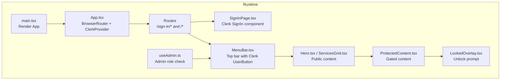
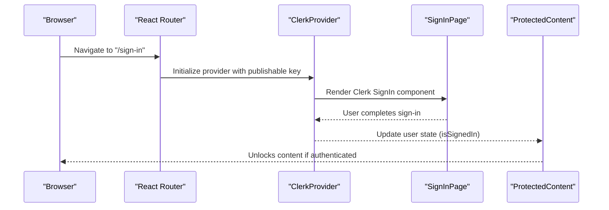
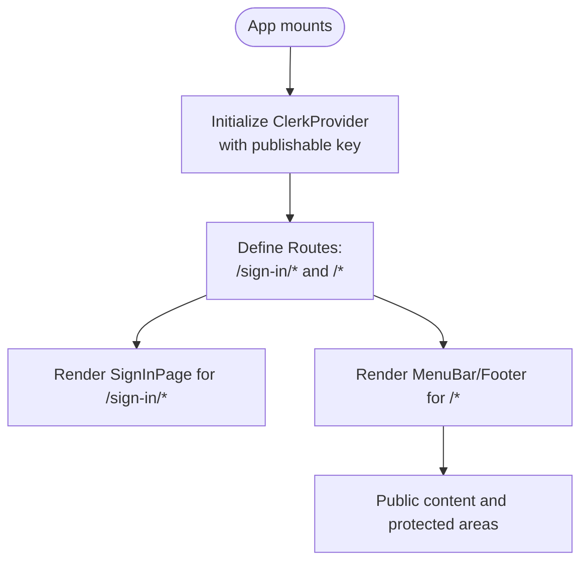
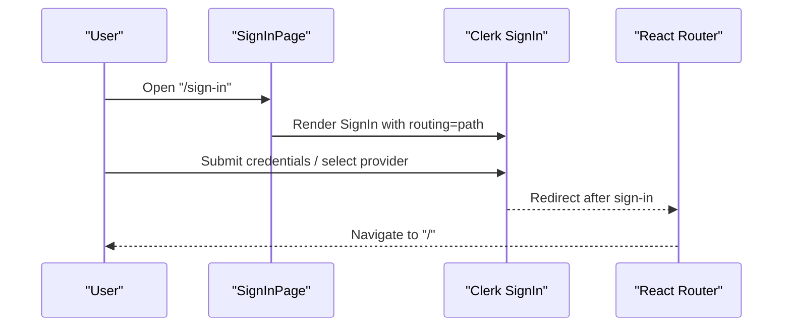
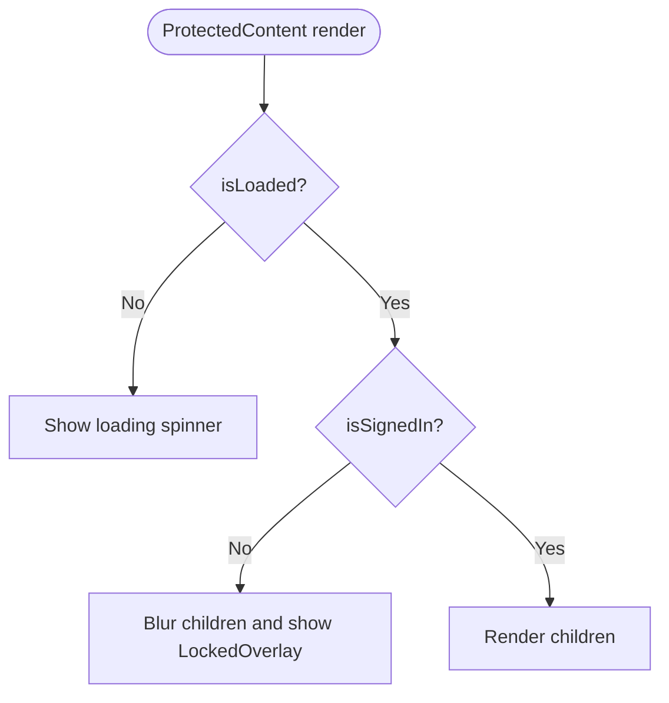
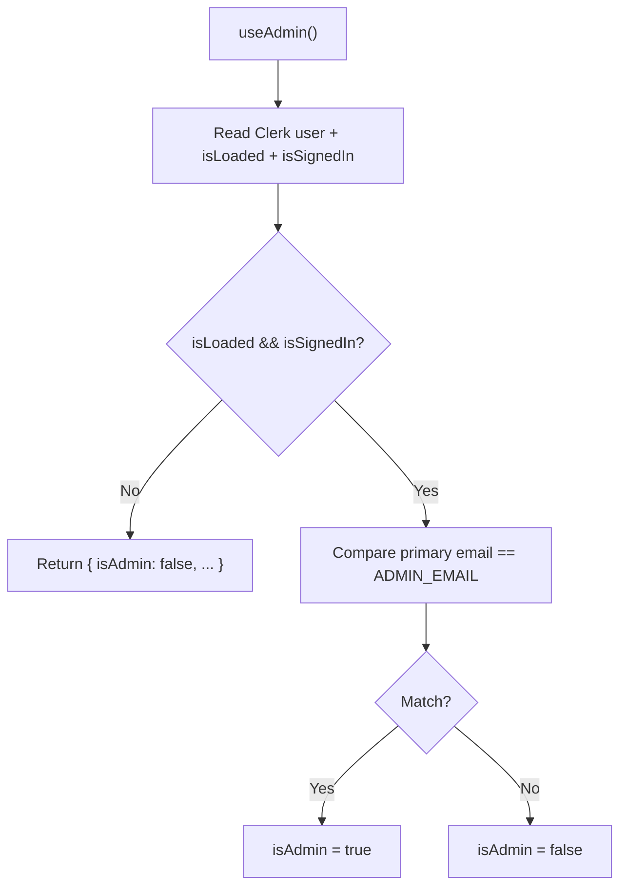
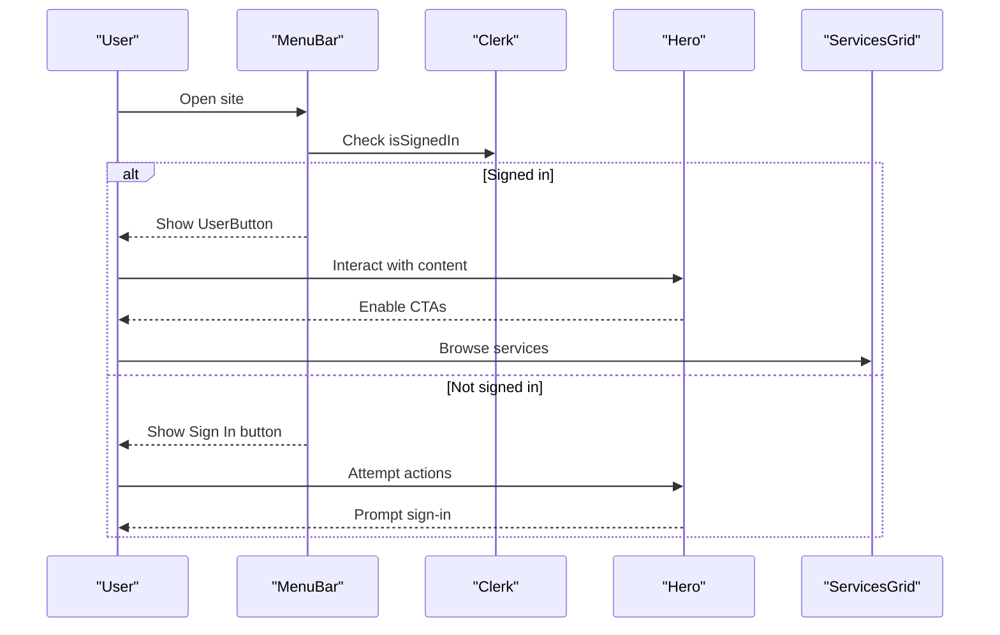
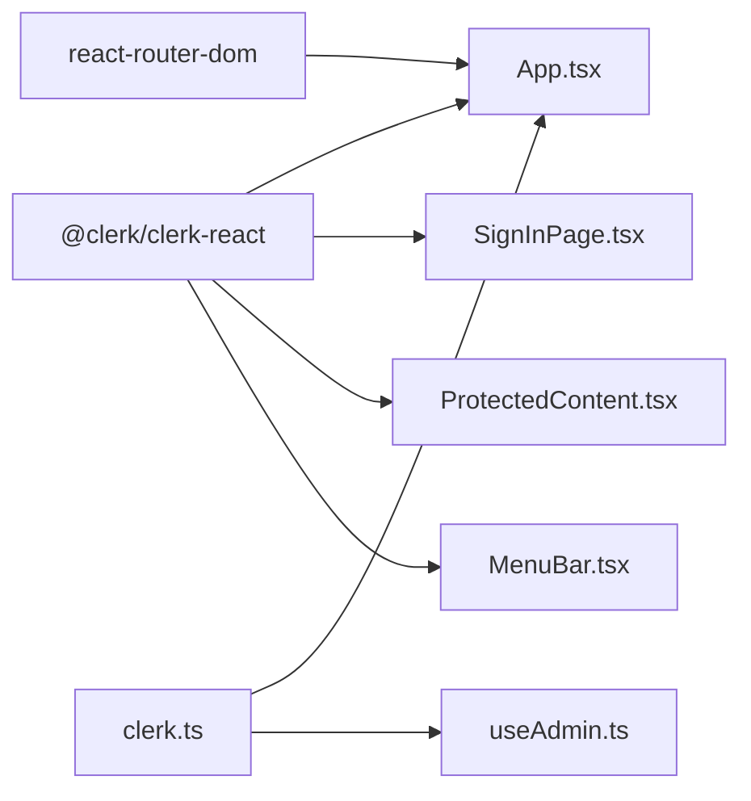

# Authentication Workflow

<cite>
**Referenced Files in This Document**
- [App.tsx](file://src/App.tsx)
- [main.tsx](file://src/main.tsx)
- [clerk.ts](file://src/config/clerk.ts)
- [SignInPage.tsx](file://src/components/auth/SignInPage.tsx)
- [ProtectedContent.tsx](file://src/components/auth/ProtectedContent.tsx)
- [LockedOverlay.tsx](file://src/components/auth/LockedOverlay.tsx)
- [MenuBar.tsx](file://src/components/layout/MenuBar.tsx)
- [Hero.tsx](file://src/components/home/Hero.tsx)
- [ServicesGrid.tsx](file://src/components/home/ServicesGrid.tsx)
- [ServiceCard.tsx](file://src/components/home/ServiceCard.tsx)
- [useAdmin.ts](file://src/hooks/useAdmin.ts)
- [package.json](file://package.json)
</cite>

## Table of Contents
1. [Introduction](#introduction)
2. [Project Structure](#project-structure)
3. [Core Components](#core-components)
4. [Architecture Overview](#architecture-overview)
5. [Detailed Component Analysis](#detailed-component-analysis)
6. [Dependency Analysis](#dependency-analysis)
7. [Performance Considerations](#performance-considerations)
8. [Troubleshooting Guide](#troubleshooting-guide)
9. [Conclusion](#conclusion)

## Introduction
This document explains the end-to-end authentication workflow in DevForge. It covers user registration and login through Clerk, session management, protected content gating, admin role checks, and integration with Clerk’s routing and navigation. It also documents redirect logic, state synchronization, and practical troubleshooting steps for common authentication scenarios such as invalid credentials, network issues, and email verification.

## Project Structure
DevForge integrates Clerk authentication at the application root and exposes Clerk components for sign-in and user state. Protected routes and UI elements rely on Clerk’s user state hooks. Environment configuration supplies Clerk keys and admin contact details.

**Diagram sources**
- [main.tsx:1-11](file://src/main.tsx#L1-L11)
- [App.tsx:1-67](file://src/App.tsx#L1-L67)
- [SignInPage.tsx:1-251](file://src/components/auth/SignInPage.tsx#L1-L251)
- [MenuBar.tsx:1-133](file://src/components/layout/MenuBar.tsx#L1-L133)
- [Hero.tsx:1-110](file://src/components/home/Hero.tsx#L1-L110)
- [ServicesGrid.tsx:1-167](file://src/components/home/ServicesGrid.tsx#L1-L167)
- [ProtectedContent.tsx:1-44](file://src/components/auth/ProtectedContent.tsx#L1-L44)
- [LockedOverlay.tsx:1-61](file://src/components/auth/LockedOverlay.tsx#L1-L61)
- [useAdmin.ts:1-14](file://src/hooks/useAdmin.ts#L1-L14)

**Section sources**
- [main.tsx:1-11](file://src/main.tsx#L1-L11)
- [App.tsx:1-67](file://src/App.tsx#L1-L67)

## Core Components
- Clerk configuration and environment keys
  - Publishable key and admin contact are loaded from environment variables.
- Application shell and routing
  - ClerkProvider wraps the app with Clerk’s routing helpers to integrate with React Router.
  - Dedicated sign-in route renders a full-screen sign-in page.
- Sign-in experience
  - Clerk’s SignIn component handles authentication flows with configurable appearance and routing.
- Protected content gating
  - ProtectedContent blocks unauthenticated users behind a locked overlay while preserving fallback content.
- Admin role checks
  - useAdmin determines admin access based on signed-in state and primary email address.
- Top navigation
  - MenuBar displays either a sign-in button or a Clerk UserButton depending on authentication state.

**Section sources**
- [clerk.ts:1-4](file://src/config/clerk.ts#L1-L4)
- [App.tsx:1-67](file://src/App.tsx#L1-L67)
- [SignInPage.tsx:1-251](file://src/components/auth/SignInPage.tsx#L1-L251)
- [ProtectedContent.tsx:1-44](file://src/components/auth/ProtectedContent.tsx#L1-L44)
- [LockedOverlay.tsx:1-61](file://src/components/auth/LockedOverlay.tsx#L1-L61)
- [MenuBar.tsx:1-133](file://src/components/layout/MenuBar.tsx#L1-L133)
- [useAdmin.ts:1-14](file://src/hooks/useAdmin.ts#L1-L14)

## Architecture Overview
The authentication architecture centers on Clerk’s client-side SDK. ClerkProvider initializes Clerk and bridges Clerk’s routing to React Router. The SignIn component manages the sign-in UI and flows. ProtectedContent and LockedOverlay gate access to premium content. useAdmin derives admin privileges from Clerk’s user state and environment configuration.

**Diagram sources**
- [App.tsx:26-58](file://src/App.tsx#L26-L58)
- [SignInPage.tsx:155-221](file://src/components/auth/SignInPage.tsx#L155-L221)
- [ProtectedContent.tsx:10-43](file://src/components/auth/ProtectedContent.tsx#L10-L43)

## Detailed Component Analysis

### Clerk Initialization and Routing Bridge
- ClerkProvider is configured with the publishable key and custom router push/replace handlers to align Clerk’s internal navigation with React Router.
- The sign-in route is isolated from the main layout to provide a focused authentication experience.

**Diagram sources**
- [App.tsx:26-58](file://src/App.tsx#L26-L58)

**Section sources**
- [App.tsx:1-67](file://src/App.tsx#L1-L67)
- [clerk.ts:1-4](file://src/config/clerk.ts#L1-L4)

### Sign-In Page and Clerk SignIn Component
- The sign-in page hosts Clerk’s SignIn component with routing set to path-based navigation and a custom appearance theme.
- Clerk manages OAuth providers, magic links, and other sign-in methods according to your Clerk dashboard configuration.

**Diagram sources**
- [SignInPage.tsx:155-221](file://src/components/auth/SignInPage.tsx#L155-L221)
- [App.tsx:36-56](file://src/App.tsx#L36-L56)

**Section sources**
- [SignInPage.tsx:1-251](file://src/components/auth/SignInPage.tsx#L1-L251)
- [App.tsx:1-67](file://src/App.tsx#L1-L67)

### Protected Content Gating
- ProtectedContent uses Clerk’s user hook to detect loading and signed-in states.
- When the user is not signed in, ProtectedContent overlays a LockedOverlay prompting sign-in and blurs underlying content.

**Diagram sources**
- [ProtectedContent.tsx:10-43](file://src/components/auth/ProtectedContent.tsx#L10-L43)
- [LockedOverlay.tsx:1-61](file://src/components/auth/LockedOverlay.tsx#L1-L61)

**Section sources**
- [ProtectedContent.tsx:1-44](file://src/components/auth/ProtectedContent.tsx#L1-L44)
- [LockedOverlay.tsx:1-61](file://src/components/auth/LockedOverlay.tsx#L1-L61)

### Admin Role Determination
- useAdmin reads Clerk’s user object and compares the primary email address against the configured admin email.
- It returns a boolean flag indicating admin status along with load and sign-in indicators.

**Diagram sources**
- [useAdmin.ts:4-13](file://src/hooks/useAdmin.ts#L4-L13)
- [clerk.ts:2](file://src/config/clerk.ts#L2)

**Section sources**
- [useAdmin.ts:1-14](file://src/hooks/useAdmin.ts#L1-L14)
- [clerk.ts:1-4](file://src/config/clerk.ts#L1-L4)

### Navigation and Public Experience
- MenuBar switches between a sign-in prompt and a Clerk UserButton based on authentication state.
- Public pages like Hero and ServicesGrid adapt their CTAs and availability to signed-in users.

**Diagram sources**
- [MenuBar.tsx:102-128](file://src/components/layout/MenuBar.tsx#L102-L128)
- [Hero.tsx:86-104](file://src/components/home/Hero.tsx#L86-L104)
- [ServicesGrid.tsx:116-166](file://src/components/home/ServicesGrid.tsx#L116-L166)

**Section sources**
- [MenuBar.tsx:1-133](file://src/components/layout/MenuBar.tsx#L1-L133)
- [Hero.tsx:1-110](file://src/components/home/Hero.tsx#L1-L110)
- [ServicesGrid.tsx:1-167](file://src/components/home/ServicesGrid.tsx#L1-L167)

### Session Persistence and Logout
- Clerk manages session persistence client-side. After sign-in, the user remains authenticated until Clerk indicates otherwise (e.g., session expiration or logout).
- The Clerk UserButton in the top navigation provides a standard interface for account management and logout.

**Section sources**
- [MenuBar.tsx:102-128](file://src/components/layout/MenuBar.tsx#L102-L128)

### Password Reset, Email Verification, and Account Linking
- Clerk’s SignIn component orchestrates password resets, email verification, and provider-based sign-in flows as configured in your Clerk Dashboard.
- The SignIn page’s routing and appearance are customizable to match your brand and UX needs.

**Section sources**
- [SignInPage.tsx:155-221](file://src/components/auth/SignInPage.tsx#L155-L221)

### Authentication Callbacks and Redirect Logic
- ClerkProvider’s routerPush/routerReplace props ensure Clerk’s internal navigation aligns with React Router.
- The sign-in route is dedicated to authentication, while other routes render the main layout.

**Section sources**
- [App.tsx:26-58](file://src/App.tsx#L26-L58)

## Dependency Analysis
- External libraries
  - @clerk/clerk-react provides ClerkProvider, SignIn, UserButton, and user state hooks.
  - react-router-dom provides routing and navigation.
- Internal dependencies
  - ProtectedContent depends on Clerk user state and LockedOverlay for UI behavior.
  - useAdmin depends on Clerk user state and environment configuration.

**Diagram sources**
- [package.json:12-17](file://package.json#L12-L17)
- [App.tsx:1-67](file://src/App.tsx#L1-L67)
- [SignInPage.tsx:1-251](file://src/components/auth/SignInPage.tsx#L1-L251)
- [ProtectedContent.tsx:1-44](file://src/components/auth/ProtectedContent.tsx#L1-L44)
- [MenuBar.tsx:1-133](file://src/components/layout/MenuBar.tsx#L1-L133)
- [clerk.ts:1-4](file://src/config/clerk.ts#L1-L4)
- [useAdmin.ts:1-14](file://src/hooks/useAdmin.ts#L1-L14)

**Section sources**
- [package.json:12-17](file://package.json#L12-L17)
- [App.tsx:1-67](file://src/App.tsx#L1-L67)

## Performance Considerations
- Keep Clerk initialization lightweight by avoiding unnecessary re-renders in the provider wrapper.
- Defer heavy computations inside protected components until after authentication is confirmed.
- Use Clerk’s built-in caching and state synchronization to minimize redundant network requests.

## Troubleshooting Guide
- Invalid credentials or failed sign-in
  - Verify the publishable key and Clerk dashboard configuration.
  - Confirm the SignIn component is rendered on the correct route and routing is set to path-based.
- Network errors during authentication
  - Check browser console for network failures and Clerk SDK logs.
  - Ensure ClerkProvider is initialized before rendering SignIn.
- Email verification and password reset
  - Ensure your Clerk project is configured to send verification emails and password reset links.
  - Confirm the user receives emails and follows the links to complete flows.
- Admin role not recognized
  - Verify the ADMIN_EMAIL environment variable matches the user’s primary email address.
  - Confirm the user is signed in and Clerk’s user object is loaded.
- Protected content still locked
  - Ensure ProtectedContent is used around the intended content and that Clerk’s user state is loaded.
  - Confirm LockedOverlay is not unintentionally applied due to layout issues.

**Section sources**
- [App.tsx:26-58](file://src/App.tsx#L26-L58)
- [SignInPage.tsx:155-221](file://src/components/auth/SignInPage.tsx#L155-L221)
- [ProtectedContent.tsx:10-43](file://src/components/auth/ProtectedContent.tsx#L10-L43)
- [useAdmin.ts:4-13](file://src/hooks/useAdmin.ts#L4-L13)
- [clerk.ts:1-4](file://src/config/clerk.ts#L1-L4)

## Conclusion
DevForge’s authentication workflow leverages Clerk for robust sign-in, session management, and user state synchronization. The app’s routing bridge ensures seamless navigation, while ProtectedContent and LockedOverlay provide clear user feedback for access control. Admin privileges are derived from Clerk’s user state and environment configuration. By following the documented patterns and troubleshooting steps, you can maintain a secure and reliable authentication experience.