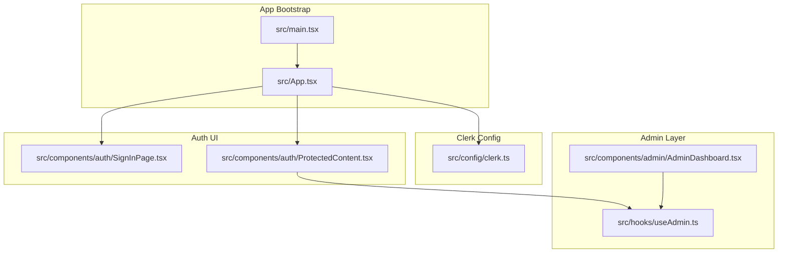
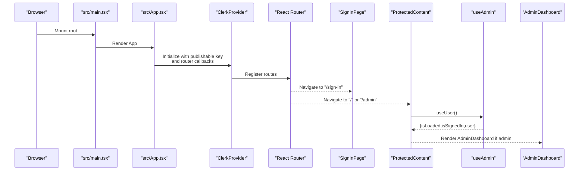
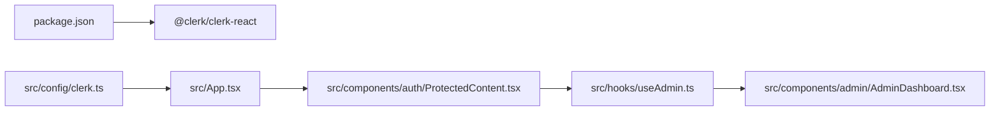

# Clerk Integration

<cite>
**Referenced Files in This Document**
- [src\App.tsx](file://src/App.tsx)
- [src\config\clerk.ts](file://src/config/clerk.ts)
- [src\components\auth\SignInPage.tsx](file://src/components/auth/SignInPage.tsx)
- [src\components\auth\ProtectedContent.tsx](file://src/components/auth/ProtectedContent.tsx)
- [src\hooks\useAdmin.ts](file://src/hooks/useAdmin.ts)
- [src\components\admin\AdminDashboard.tsx](file://src/components/admin/AdminDashboard.tsx)
- [src\main.tsx](file://src/main.tsx)
- [package.json](file://package.json)
</cite>

## Table of Contents
1. [Introduction](#introduction)
2. [Project Structure](#project-structure)
3. [Core Components](#core-components)
4. [Architecture Overview](#architecture-overview)
5. [Detailed Component Analysis](#detailed-component-analysis)
6. [Dependency Analysis](#dependency-analysis)
7. [Performance Considerations](#performance-considerations)
8. [Troubleshooting Guide](#troubleshooting-guide)
9. [Conclusion](#conclusion)

## Introduction
This document explains how Clerk SDK is integrated into DevForge. It covers environment configuration, ClerkProvider setup, authentication state management, token and session handling, and practical examples for accessing user data and enforcing admin access. It also includes security considerations for publishable keys, best practices, common integration issues, debugging techniques, and performance optimization tips.

## Project Structure
Clerk integration is centered around a small set of files:
- Environment configuration constants for publishable key, admin email, and WhatsApp number
- Application bootstrap and routing wrapped in ClerkProvider
- Clerk sign-in page using Clerk’s prebuilt component
- Protected content wrapper using Clerk’s user hook
- Admin guard hook and admin dashboard protected by authentication and admin email check
- Root application entry point

**Diagram sources**
- [src\main.tsx:1-11](file://src/main.tsx#L1-L11)
- [src\App.tsx:1-67](file://src/App.tsx#L1-L67)
- [src\config\clerk.ts:1-4](file://src/config/clerk.ts#L1-L4)
- [src\components\auth\SignInPage.tsx:1-251](file://src/components/auth/SignInPage.tsx#L1-L251)
- [src\components\auth\ProtectedContent.tsx:1-44](file://src/components/auth/ProtectedContent.tsx#L1-L44)
- [src\hooks\useAdmin.ts:1-14](file://src/hooks/useAdmin.ts#L1-L14)
- [src\components\admin\AdminDashboard.tsx:1-186](file://src/components/admin/AdminDashboard.tsx#L1-L186)

**Section sources**
- [src\main.tsx:1-11](file://src/main.tsx#L1-L11)
- [src\App.tsx:1-67](file://src/App.tsx#L1-L67)
- [src\config\clerk.ts:1-4](file://src/config/clerk.ts#L1-L4)

## Core Components
- Environment configuration module exports the publishable key, admin email, and WhatsApp number. These values are consumed from Vite’s import.meta.env and are used across the app.
- App wraps routing in ClerkProvider and configures router push/replace callbacks to integrate with React Router.
- SignInPage renders Clerk’s SignIn component with a custom appearance and mounts at the dedicated sign-in route.
- ProtectedContent enforces authentication for arbitrary content by gating on Clerk’s user state.
- useAdmin composes Clerk’s user data with the configured admin email to compute an isAdmin flag.
- AdminDashboard uses useAdmin to enforce admin-only access and displays admin controls.

**Section sources**
- [src\config\clerk.ts:1-4](file://src/config/clerk.ts#L1-L4)
- [src\App.tsx:26-58](file://src/App.tsx#L26-L58)
- [src\components\auth\SignInPage.tsx:1-251](file://src/components/auth/SignInPage.tsx#L1-L251)
- [src\components\auth\ProtectedContent.tsx:1-44](file://src/components/auth/ProtectedContent.tsx#L1-L44)
- [src\hooks\useAdmin.ts:1-14](file://src/hooks/useAdmin.ts#L1-L14)
- [src\components\admin\AdminDashboard.tsx:1-186](file://src/components/admin/AdminDashboard.tsx#L1-L186)

## Architecture Overview
ClerkProvider is the central integration point. It initializes Clerk with the publishable key and integrates navigation with React Router. Routes are organized so that sign-in is separate from the main app shell. ProtectedContent and useAdmin encapsulate authentication and authorization checks.

**Diagram sources**
- [src\main.tsx:1-11](file://src/main.tsx#L1-L11)
- [src\App.tsx:26-58](file://src/App.tsx#L26-L58)
- [src\components\auth\SignInPage.tsx:1-251](file://src/components/auth/SignInPage.tsx#L1-L251)
- [src\components\auth\ProtectedContent.tsx:1-44](file://src/components/auth/ProtectedContent.tsx#L1-L44)
- [src\hooks\useAdmin.ts:1-14](file://src/hooks/useAdmin.ts#L1-L14)
- [src\components\admin\AdminDashboard.tsx:1-186](file://src/components/admin/AdminDashboard.tsx#L1-L186)

## Detailed Component Analysis

### Environment Configuration
- Publishable key is imported from Vite’s environment and passed to ClerkProvider.
- Admin email and WhatsApp number defaults are provided in case environment variables are missing.
- These constants are used across the app for authentication gating and UI messaging.

Best practices:
- Store the publishable key in a Vite-compatible environment variable.
- Keep admin email aligned with your Clerk user management.
- Treat the publishable key as public; never embed secret keys in client code.

**Section sources**
- [src\config\clerk.ts:1-4](file://src/config/clerk.ts#L1-L4)

### ClerkProvider Implementation
- App wraps routes in ClerkProvider and passes the publishable key.
- Router callbacks are configured to use React Router’s navigate for push/replace semantics.
- Routes are structured so that sign-in is isolated from the main app shell.

Security and correctness:
- Ensure ClerkProvider is present at the root and not duplicated.
- Verify routerPush/routerReplace match your routing strategy.

**Section sources**
- [src\App.tsx:26-58](file://src/App.tsx#L26-L58)

### Clerk Initialization and Session Handling
- ClerkProvider initializes Clerk with the publishable key and integrates navigation.
- Clerk’s internal session and token lifecycle are managed by the provider; your app consumes state via hooks.

Common patterns:
- Use Clerk’s user and auth hooks to gate content and derive permissions.
- Use router callbacks to maintain SPA navigation while keeping Clerk’s routing model intact.

**Section sources**
- [src\App.tsx:26-58](file://src/App.tsx#L26-L58)

### Token Management
- Clerk exposes a getToken helper via its hooks. Use it to acquire a JWT for protected backend calls.
- Token retrieval is asynchronous and depends on Clerk being ready and a session being active.

Guidance:
- Call getToken after isLoaded is true and the user is signed in.
- Cache tokens appropriately and refresh when needed.

**Section sources**
- [src\App.tsx:26-58](file://src/App.tsx#L26-L58)

### Authentication Status Checks and User Data Access
- useUser provides isLoaded, isSignedIn, and user data.
- useAdmin composes user primary email address against the configured admin email to compute isAdmin.

Examples (paths):
- Access user data and authentication status: [src\hooks\useAdmin.ts:4-12](file://src/hooks/useAdmin.ts#L4-L12)
- Gate content by authentication: [src\components\auth\ProtectedContent.tsx:10-43](file://src/components/auth/ProtectedContent.tsx#L10-L43)

**Section sources**
- [src\hooks\useAdmin.ts:1-14](file://src/hooks/useAdmin.ts#L1-L14)
- [src\components\auth\ProtectedContent.tsx:1-44](file://src/components/auth/ProtectedContent.tsx#L1-L44)

### Integration with React Components
- SignInPage uses Clerk’s SignIn component with a custom appearance and mounts at the sign-in route.
- ProtectedContent conditionally renders children or a locked overlay depending on authentication state.
- AdminDashboard uses useAdmin to enforce admin-only access and displays admin controls.

Example paths:
- Sign-in UI: [src\components\auth\SignInPage.tsx:1-251](file://src/components/auth/SignInPage.tsx#L1-L251)
- Protected content wrapper: [src\components\auth\ProtectedContent.tsx:1-44](file://src/components/auth/ProtectedContent.tsx#L1-L44)
- Admin dashboard: [src\components\admin\AdminDashboard.tsx:1-186](file://src/components/admin/AdminDashboard.tsx#L1-L186)

**Section sources**
- [src\components\auth\SignInPage.tsx:1-251](file://src/components/auth/SignInPage.tsx#L1-L251)
- [src\components\auth\ProtectedContent.tsx:1-44](file://src/components/auth/ProtectedContent.tsx#L1-L44)
- [src\components\admin\AdminDashboard.tsx:1-186](file://src/components/admin/AdminDashboard.tsx#L1-L186)

### Admin Access Control
- useAdmin derives admin status from isLoaded, isSignedIn, and user’s primary email address compared to the configured admin email.
- AdminDashboard uses useAdmin to block unauthenticated users and non-administrators.

Example paths:
- Admin hook: [src\hooks\useAdmin.ts:4-12](file://src/hooks/useAdmin.ts#L4-L12)
- Admin dashboard gating: [src\components\admin\AdminDashboard.tsx:18-110](file://src/components/admin/AdminDashboard.tsx#L18-L110)

**Section sources**
- [src\hooks\useAdmin.ts:1-14](file://src/hooks/useAdmin.ts#L1-L14)
- [src\components\admin\AdminDashboard.tsx:1-186](file://src/components/admin/AdminDashboard.tsx#L1-L186)

## Dependency Analysis
- The app depends on @clerk/clerk-react for provider, hooks, and prebuilt components.
- ClerkProvider is initialized with the publishable key exported from the config module.
- ProtectedContent and AdminDashboard rely on Clerk hooks to enforce access.

**Diagram sources**
- [package.json:12-18](file://package.json#L12-L18)
- [src\config\clerk.ts:1-4](file://src/config/clerk.ts#L1-L4)
- [src\App.tsx:1-67](file://src/App.tsx#L1-L67)
- [src\components\auth\ProtectedContent.tsx:1-44](file://src/components/auth/ProtectedContent.tsx#L1-L44)
- [src\hooks\useAdmin.ts:1-14](file://src/hooks/useAdmin.ts#L1-L14)
- [src\components\admin\AdminDashboard.tsx:1-186](file://src/components/admin/AdminDashboard.tsx#L1-L186)

**Section sources**
- [package.json:12-18](file://package.json#L12-L18)
- [src\App.tsx:1-67](file://src/App.tsx#L1-L67)

## Performance Considerations
- Minimize re-renders by checking isLoaded and isSignedIn before rendering sensitive components.
- Defer heavy admin data loads until the user is authenticated and verified as admin.
- Avoid unnecessary token requests; reuse tokens when possible and refresh only when required.
- Keep ClerkProvider at the root to prevent redundant initialization.

## Troubleshooting Guide
Common issues and resolutions:
- Missing or incorrect publishable key
  - Ensure VITE_CLERK_PUBLISHABLE_KEY is set and matches your Clerk application.
  - Confirm the key is prefixed with VITE_ for Vite.
- Multiple ClerkProvider instances
  - Ensure ClerkProvider appears only once at the root.
- Protected content not unlocking
  - Verify useUser returns isLoaded and isSignedIn before rendering protected content.
- Admin dashboard inaccessible
  - Confirm the signed-in user’s primary email matches VITE_ADMIN_EMAIL.
- Sign-in page not displaying
  - Ensure the route path "/sign-in" is reachable and SignInPage is rendered at that path.

Debugging techniques:
- Log isLoaded, isSignedIn, and user fields from useUser to inspect state transitions.
- Temporarily render raw user data to verify email and identity.
- Use browser devtools to inspect Clerk network requests and session cookies.

Security reminders:
- Publishable keys are safe to include in client code; never expose secret keys.
- Enforce admin checks on the server-side for critical operations.

**Section sources**
- [src\config\clerk.ts:1-4](file://src/config/clerk.ts#L1-L4)
- [src\App.tsx:26-58](file://src/App.tsx#L26-L58)
- [src\components\auth\ProtectedContent.tsx:10-43](file://src/components/auth/ProtectedContent.tsx#L10-L43)
- [src\hooks\useAdmin.ts:4-12](file://src/hooks/useAdmin.ts#L4-L12)
- [src\components\admin\AdminDashboard.tsx:18-110](file://src/components/admin/AdminDashboard.tsx#L18-L110)

## Conclusion
DevForge integrates Clerk via a clean, minimal setup: a root ClerkProvider, environment-driven configuration, and straightforward guards using Clerk’s hooks. The design separates sign-in from the main app, protects content with a simple wrapper, and enforces admin access with a concise hook. Following the best practices and troubleshooting steps outlined here will help maintain a robust and secure authentication layer.