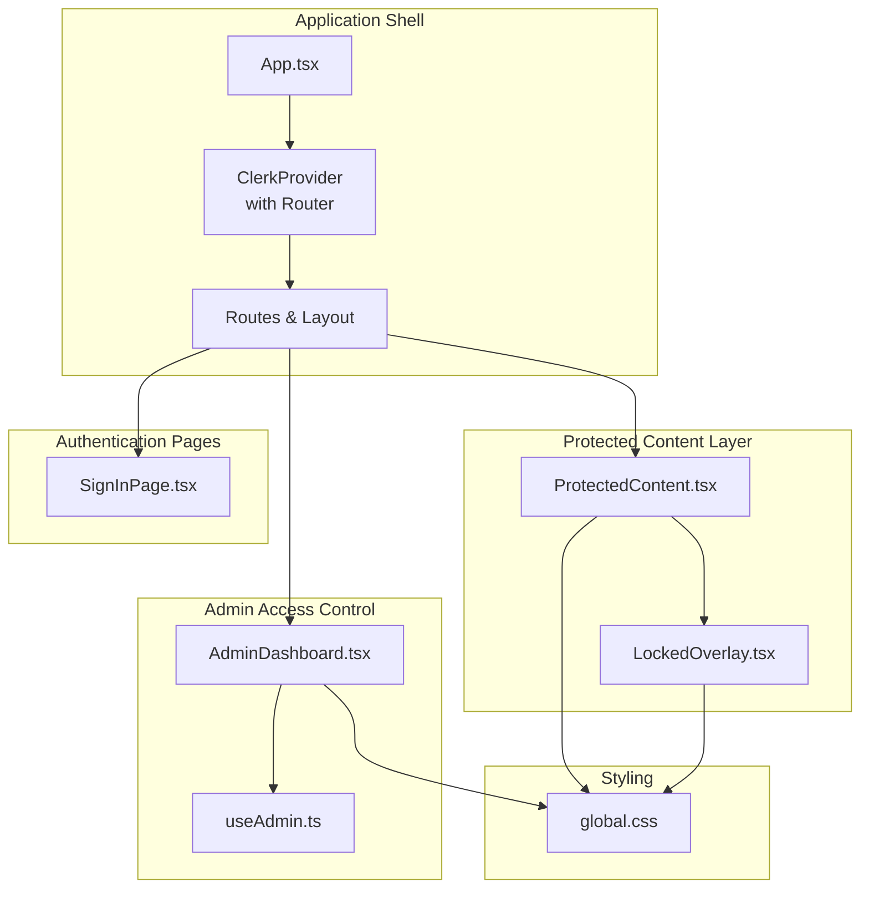
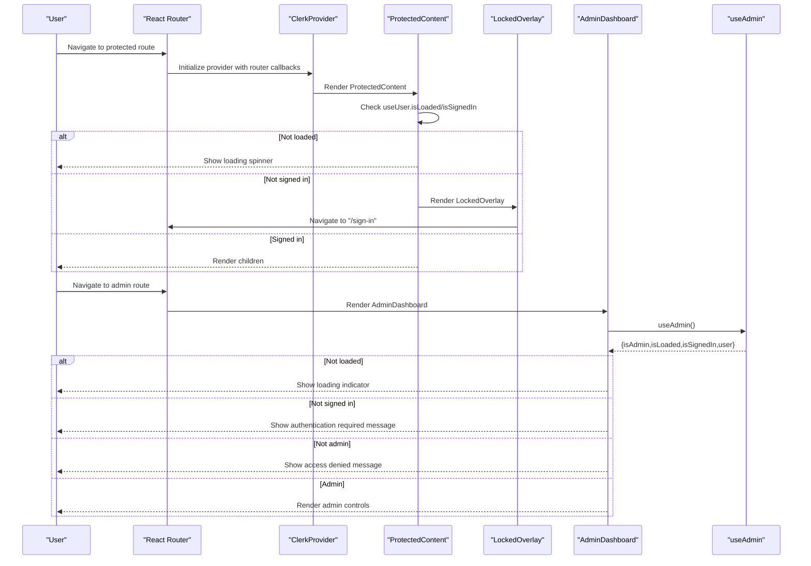
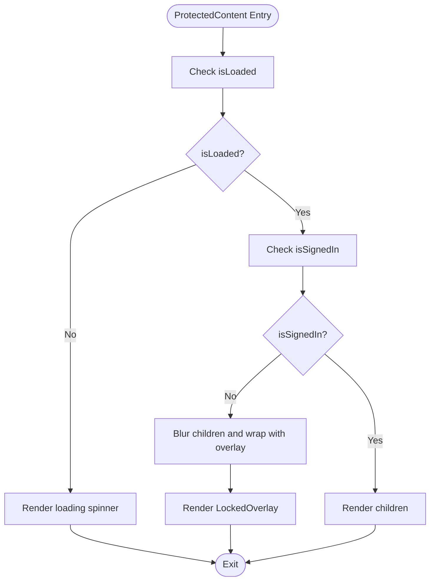
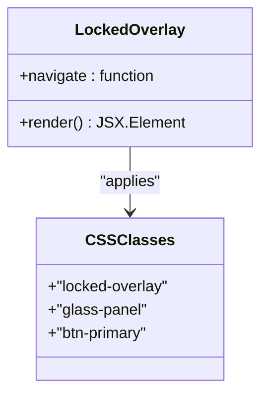
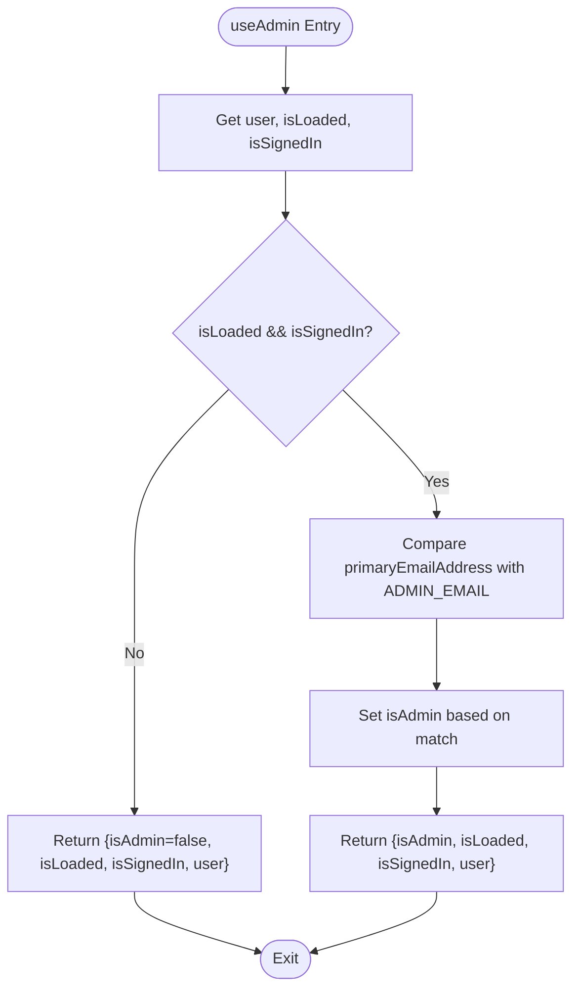
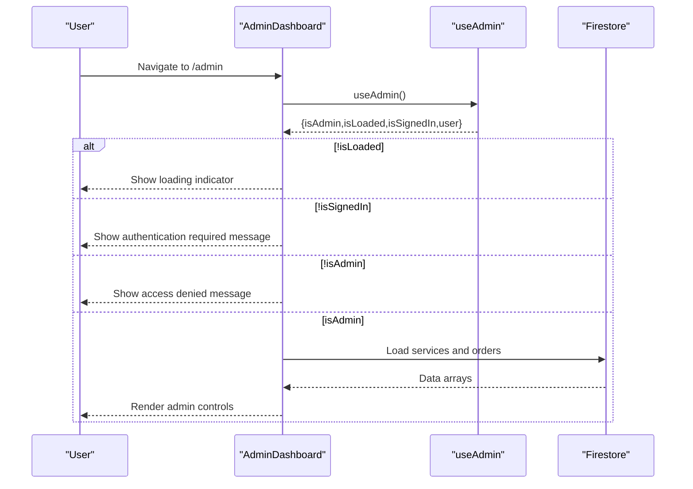
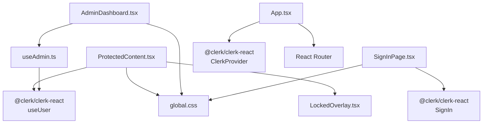

# Protected Content Rendering

<cite>
**Referenced Files in This Document**
- [ProtectedContent.tsx](file://src/components/auth/ProtectedContent.tsx)
- [LockedOverlay.tsx](file://src/components/auth/LockedOverlay.tsx)
- [useAdmin.ts](file://src/hooks/useAdmin.ts)
- [AdminDashboard.tsx](file://src/components/admin/AdminDashboard.tsx)
- [SignInPage.tsx](file://src/components/auth/SignInPage.tsx)
- [App.tsx](file://src/App.tsx)
- [clerk.ts](file://src/config/clerk.ts)
- [global.css](file://src/styles/global.css)
- [ProductManager.tsx](file://src/components/admin/ProductManager.tsx)
- [OrderList.tsx](file://src/components/admin/OrderList.tsx)
- [index.ts](file://src/types/index.ts)
</cite>

## Table of Contents
1. [Introduction](#introduction)
2. [Project Structure](#project-structure)
3. [Core Components](#core-components)
4. [Architecture Overview](#architecture-overview)
5. [Detailed Component Analysis](#detailed-component-analysis)
6. [Dependency Analysis](#dependency-analysis)
7. [Performance Considerations](#performance-considerations)
8. [Troubleshooting Guide](#troubleshooting-guide)
9. [Conclusion](#conclusion)

## Introduction
This document explains DevForge's protected content rendering mechanisms, focusing on how the system conditionally displays content based on authentication and authorization state. It covers the ProtectedContent component for gating access to UI elements, the LockedOverlay component for handling unauthorized access scenarios, and the broader authentication flow using Clerk. The guide details rendering logic for authenticated versus unauthenticated users, admin-only content restrictions, fallback UI patterns, and implementation guidelines for extending protected content functionality.

## Project Structure
The protected content system spans several key areas:
- Authentication and routing orchestration in the main application shell
- Protected content wrappers for route-level and component-level protection
- Admin-only access control with dedicated UI states
- Clerk integration for authentication state and navigation
- Global styling that supports locked overlays and glassmorphism effects

**Diagram sources**
- [App.tsx:1-67](file://src/App.tsx#L1-L67)
- [ProtectedContent.tsx:1-44](file://src/components/auth/ProtectedContent.tsx#L1-L44)
- [LockedOverlay.tsx:1-61](file://src/components/auth/LockedOverlay.tsx#L1-L61)
- [useAdmin.ts:1-14](file://src/hooks/useAdmin.ts#L1-L14)
- [AdminDashboard.tsx:1-186](file://src/components/admin/AdminDashboard.tsx#L1-L186)
- [SignInPage.tsx:1-251](file://src/components/auth/SignInPage.tsx#L1-L251)
- [global.css:267-289](file://src/styles/global.css#L267-L289)

**Section sources**
- [App.tsx:1-67](file://src/App.tsx#L1-L67)
- [ProtectedContent.tsx:1-44](file://src/components/auth/ProtectedContent.tsx#L1-L44)
- [LockedOverlay.tsx:1-61](file://src/components/auth/LockedOverlay.tsx#L1-L61)
- [useAdmin.ts:1-14](file://src/hooks/useAdmin.ts#L1-L14)
- [AdminDashboard.tsx:1-186](file://src/components/admin/AdminDashboard.tsx#L1-L186)
- [SignInPage.tsx:1-251](file://src/components/auth/SignInPage.tsx#L1-L251)
- [global.css:267-289](file://src/styles/global.css#L267-L289)

## Core Components
This section documents the primary building blocks for protected content rendering.

- ProtectedContent: A wrapper component that conditionally renders children based on Clerk authentication state. It handles loading states, fallback UI, and overlays for unauthorized access.
- LockedOverlay: A focused overlay that prompts unauthenticated users to sign in, with a centered message and a call-to-action button.
- useAdmin: A hook that augments Clerk user state to determine administrative privileges based on email address.
- AdminDashboard: Demonstrates admin-only rendering with distinct states for loading, unauthenticated, unauthorized, and authorized views.

Key implementation characteristics:
- Uses Clerk's useUser hook to derive isLoaded and isSignedIn flags
- Provides a fallback prop to render alternative content while blurring the main content
- Applies CSS classes for locked overlays and glass panels
- Integrates with Clerk's router push/replace for seamless navigation

**Section sources**
- [ProtectedContent.tsx:10-43](file://src/components/auth/ProtectedContent.tsx#L10-L43)
- [LockedOverlay.tsx:3-60](file://src/components/auth/LockedOverlay.tsx#L3-L60)
- [useAdmin.ts:4-13](file://src/hooks/useAdmin.ts#L4-L13)
- [AdminDashboard.tsx:18-110](file://src/components/admin/AdminDashboard.tsx#L18-L110)

## Architecture Overview
The protected content architecture integrates Clerk for authentication state, React Router for navigation, and custom components for UI overlays. The flow ensures that:
- Unauthenticated users see a blurred overlay with a sign-in prompt
- Authenticated users see the protected content
- Admin-only routes show specific UI states for loading, unauthenticated, and unauthorized access
- Clerk manages routing callbacks to keep the UI synchronized with authentication transitions

**Diagram sources**
- [App.tsx:26-58](file://src/App.tsx#L26-L58)
- [ProtectedContent.tsx:10-43](file://src/components/auth/ProtectedContent.tsx#L10-L43)
- [LockedOverlay.tsx:3-60](file://src/components/auth/LockedOverlay.tsx#L3-L60)
- [useAdmin.ts:4-13](file://src/hooks/useAdmin.ts#L4-L13)
- [AdminDashboard.tsx:18-110](file://src/components/admin/AdminDashboard.tsx#L18-L110)

## Detailed Component Analysis

### ProtectedContent Component
ProtectedContent encapsulates the logic for conditional rendering based on authentication state. It:
- Reads Clerk's authentication state via useUser
- Renders a loading indicator while authentication state is resolving
- Blurs the main content and overlays a LockedOverlay when the user is not authenticated
- Uses a fallback prop to display alternative content behind the overlay if provided
- Passes through children when the user is authenticated

**Diagram sources**
- [ProtectedContent.tsx:10-43](file://src/components/auth/ProtectedContent.tsx#L10-L43)

**Section sources**
- [ProtectedContent.tsx:10-43](file://src/components/auth/ProtectedContent.tsx#L10-L43)

### LockedOverlay Component
LockedOverlay provides a focused, centered UI for unauthenticated users. It:
- Displays a prominent lock icon and messaging indicating members-only access
- Offers a primary button that navigates to the sign-in route
- Uses CSS classes for glassmorphism and neon accents
- Relies on react-router-dom's useNavigate for programmatic navigation

**Diagram sources**
- [LockedOverlay.tsx:3-60](file://src/components/auth/LockedOverlay.tsx#L3-L60)
- [global.css:267-289](file://src/styles/global.css#L267-L289)

**Section sources**
- [LockedOverlay.tsx:3-60](file://src/components/auth/LockedOverlay.tsx#L3-L60)
- [global.css:267-289](file://src/styles/global.css#L267-L289)

### useAdmin Hook
useAdmin extends Clerk's user state to determine administrative privileges:
- Checks isLoaded and isSignedIn to ensure state readiness
- Compares the user's primary email address against a configured admin email
- Returns a tuple of { isAdmin, isLoaded, isSignedIn, user } for downstream components

**Diagram sources**
- [useAdmin.ts:4-13](file://src/hooks/useAdmin.ts#L4-L13)
- [clerk.ts:1-4](file://src/config/clerk.ts#L1-L4)

**Section sources**
- [useAdmin.ts:4-13](file://src/hooks/useAdmin.ts#L4-L13)
- [clerk.ts:1-4](file://src/config/clerk.ts#L1-L4)

### AdminDashboard Component
AdminDashboard demonstrates comprehensive protected content patterns:
- Uses useAdmin to gate access to admin-only features
- Handles four distinct states: loading, unauthenticated, unauthorized, and authorized
- Renders glass panels and neon-styled UI elements for consistent UX
- Manages Firestore data fetching and updates for products and orders

**Diagram sources**
- [AdminDashboard.tsx:18-110](file://src/components/admin/AdminDashboard.tsx#L18-L110)
- [useAdmin.ts:4-13](file://src/hooks/useAdmin.ts#L4-L13)

**Section sources**
- [AdminDashboard.tsx:18-110](file://src/components/admin/AdminDashboard.tsx#L18-L110)
- [AdminDashboard.tsx:112-184](file://src/components/admin/AdminDashboard.tsx#L112-L184)

### Protected Content in Practice
ProtectedContent is used to protect both entire routes and specific UI elements. Examples include:
- Wrapping route elements to prevent unauthorized access
- Protecting individual components within a page
- Providing fallback content while maintaining a consistent user experience

Implementation patterns:
- Wrap route elements with ProtectedContent to enforce authentication
- Use the fallback prop to display alternative content behind the overlay
- Combine with Clerk's router callbacks for seamless navigation

**Section sources**
- [ProtectedContent.tsx:10-43](file://src/components/auth/ProtectedContent.tsx#L10-L43)
- [App.tsx:39-54](file://src/App.tsx#L39-L54)

## Dependency Analysis
The protected content system relies on several key dependencies and integrations:
- Clerk for authentication state and navigation callbacks
- React Router for route-level protection and navigation
- Custom CSS classes for overlay styling and glassmorphism effects
- Firebase for admin data operations (in AdminDashboard)

**Diagram sources**
- [ProtectedContent.tsx:1-3](file://src/components/auth/ProtectedContent.tsx#L1-L3)
- [LockedOverlay.tsx:1](file://src/components/auth/LockedOverlay.tsx#L1)
- [useAdmin.ts:1-2](file://src/hooks/useAdmin.ts#L1-L2)
- [AdminDashboard.tsx:1-16](file://src/components/admin/AdminDashboard.tsx#L1-L16)
- [SignInPage.tsx:1](file://src/components/auth/SignInPage.tsx#L1)
- [App.tsx:1-3](file://src/App.tsx#L1-L3)
- [global.css:267-289](file://src/styles/global.css#L267-L289)

**Section sources**
- [ProtectedContent.tsx:1-3](file://src/components/auth/ProtectedContent.tsx#L1-L3)
- [useAdmin.ts:1-2](file://src/hooks/useAdmin.ts#L1-L2)
- [AdminDashboard.tsx:1-16](file://src/components/admin/AdminDashboard.tsx#L1-L16)
- [SignInPage.tsx:1](file://src/components/auth/SignInPage.tsx#L1)
- [App.tsx:1-3](file://src/App.tsx#L1-L3)
- [global.css:267-289](file://src/styles/global.css#L267-L289)

## Performance Considerations
- Authentication state resolution: ProtectedContent renders a loading indicator while isLoaded is false, preventing unnecessary re-renders and avoiding flickering UI.
- Overlay rendering: LockedOverlay is lightweight and only rendered when needed, minimizing DOM overhead.
- CSS-based blurring: The locked-content class applies blur via CSS filters, which is GPU-accelerated and efficient for large content areas.
- Admin data fetching: AdminDashboard uses useEffect to fetch data only when admin privileges are confirmed, reducing unnecessary network requests.

## Troubleshooting Guide
Common issues and resolutions:
- Authentication state not updating: Verify ClerkProvider is wrapping the application and router callbacks are configured correctly.
- LockedOverlay not appearing: Ensure ProtectedContent is wrapping the intended content and that isSignedIn is false.
- Admin access not granted: Confirm the user's primary email matches ADMIN_EMAIL and that useAdmin is invoked within AdminDashboard.
- Navigation problems: Check that Clerk's routerPush/routerReplace callbacks are passed to ClerkProvider.

Error handling patterns:
- Loading states: Both ProtectedContent and AdminDashboard provide loading indicators while authentication or data is being fetched.
- Unauthorized access: AdminDashboard shows a clear access denied message when isSignedIn is true but isAdmin is false.
- Graceful degradation: ProtectedContent falls back to rendering children when authentication state resolves to signed-in.

**Section sources**
- [ProtectedContent.tsx:13-29](file://src/components/auth/ProtectedContent.tsx#L13-L29)
- [AdminDashboard.tsx:74-110](file://src/components/admin/AdminDashboard.tsx#L74-L110)

## Conclusion
DevForge's protected content rendering system provides a robust, user-friendly mechanism for controlling access to sensitive features. ProtectedContent and LockedOverlay offer a clean separation of concerns, while useAdmin and AdminDashboard demonstrate how to extend protection to admin-only functionality. The system balances performance with usability, offering loading states, graceful degradation, and consistent styling through CSS utilities. These patterns can be extended to protect routes, components, and specific UI elements with minimal boilerplate and maximum flexibility.