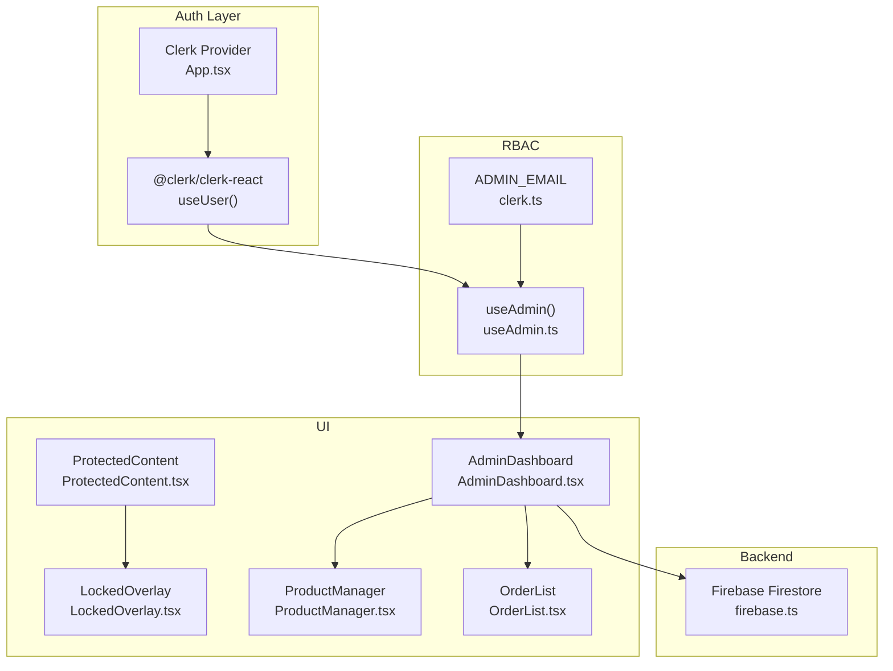
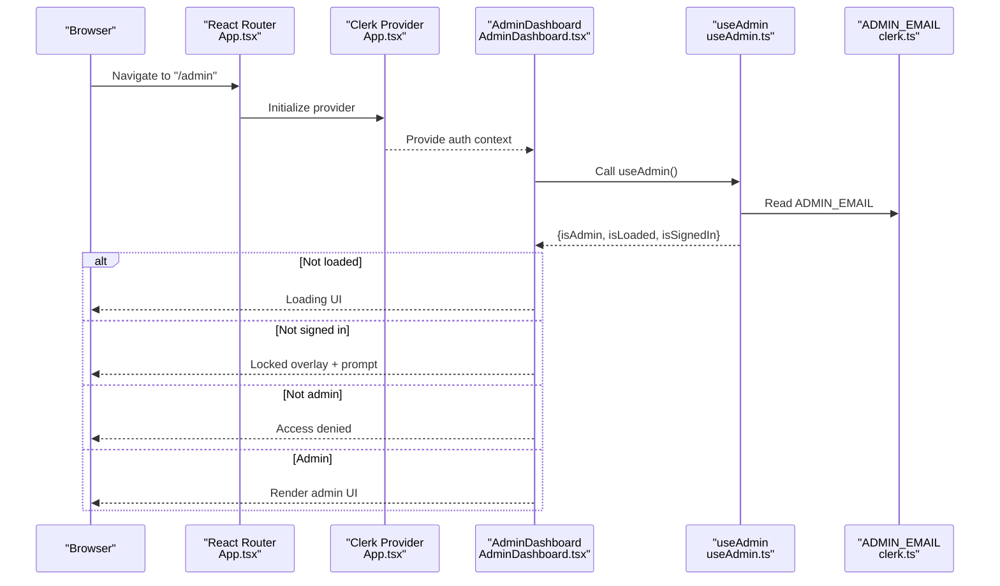
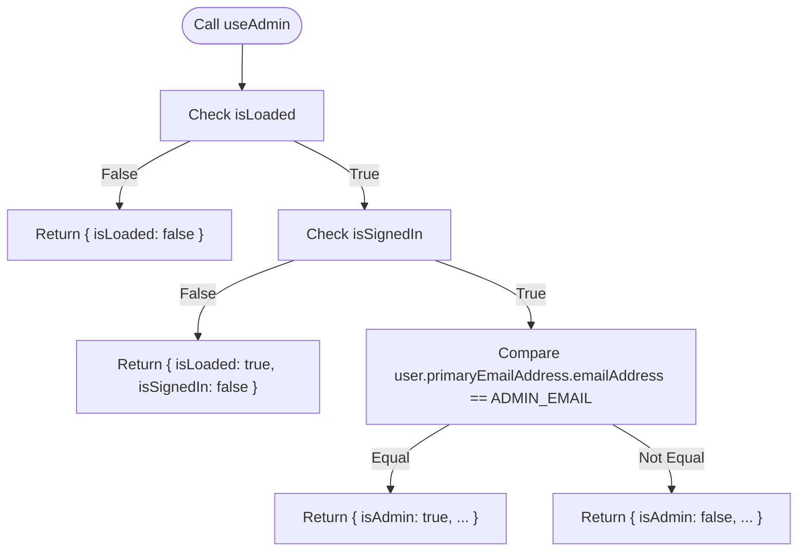
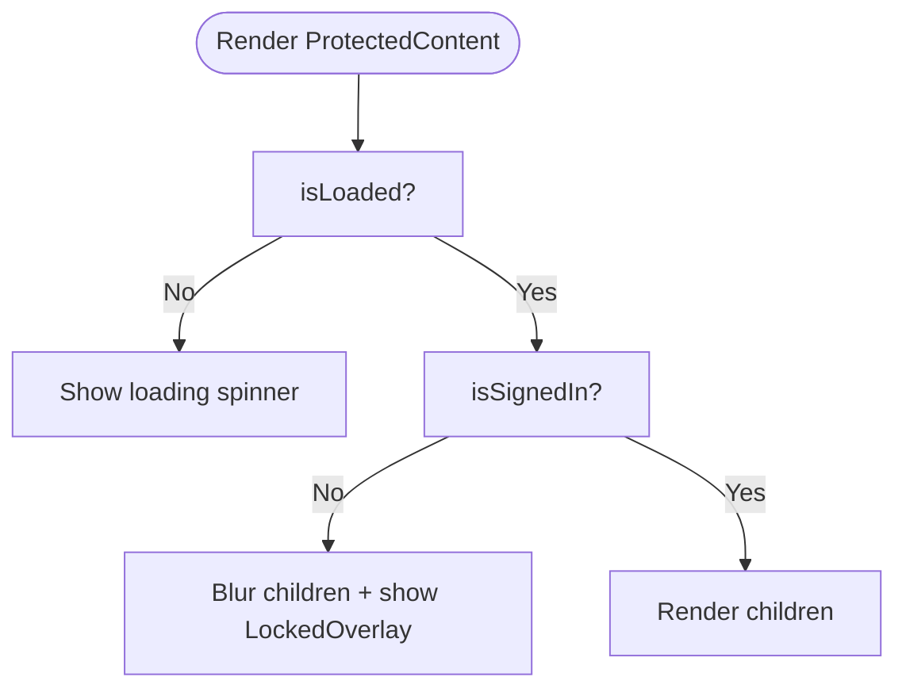
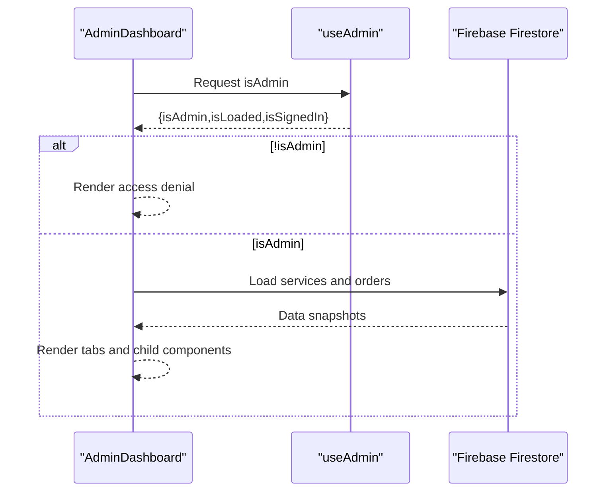
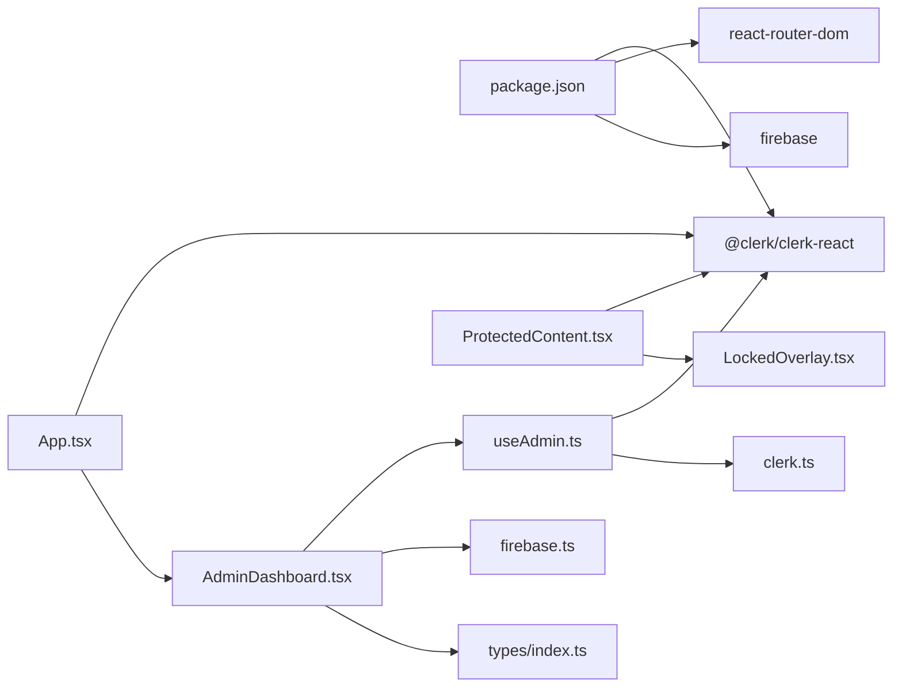

# Role-Based Access Control

<cite>
**Referenced Files in This Document**
- [useAdmin.ts](file://src/hooks/useAdmin.ts)
- [ProtectedContent.tsx](file://src/components/auth/ProtectedContent.tsx)
- [LockedOverlay.tsx](file://src/components/auth/LockedOverlay.tsx)
- [AdminDashboard.tsx](file://src/components/admin/AdminDashboard.tsx)
- [ProductManager.tsx](file://src/components/admin/ProductManager.tsx)
- [OrderList.tsx](file://src/components/admin/OrderList.tsx)
- [clerk.ts](file://src/config/clerk.ts)
- [firebase.ts](file://src/config/firebase.ts)
- [App.tsx](file://src/App.tsx)
- [vite-env.d.ts](file://src/vite-env.d.ts)
- [package.json](file://package.json)
</cite>

## Table of Contents
1. [Introduction](#introduction)
2. [Project Structure](#project-structure)
3. [Core Components](#core-components)
4. [Architecture Overview](#architecture-overview)
5. [Detailed Component Analysis](#detailed-component-analysis)
6. [Dependency Analysis](#dependency-analysis)
7. [Performance Considerations](#performance-considerations)
8. [Troubleshooting Guide](#troubleshooting-guide)
9. [Conclusion](#conclusion)
10. [Appendices](#appendices)

## Introduction
This document explains the role-based access control (RBAC) system in DevForge. It focuses on:
- The useAdmin custom hook for verifying administrator privileges
- Admin email configuration and verification logic
- The ProtectedContent component for conditional rendering based on authentication state
- Implementation patterns for protecting admin routes and sensitive features
- Permission validation logic, current limitations, and recommended extensions for multi-role support

The system currently implements a simplified RBAC model where a single admin privilege is granted based on matching the authenticated user’s primary email address against a configured admin email. This document provides practical guidance for extending the system to support richer permission hierarchies while maintaining security and clarity.

## Project Structure
The RBAC-related code spans a small set of focused modules:
- Hook for admin checks
- Authentication gating for protected content
- Admin dashboard and child components
- Configuration for Clerk publishable key and admin email
- Routing integration with Clerk provider

**Diagram sources**
- [App.tsx:30-56](file://src/App.tsx#L30-L56)
- [useAdmin.ts:1-14](file://src/hooks/useAdmin.ts#L1-L14)
- [clerk.ts:1-4](file://src/config/clerk.ts#L1-L4)
- [ProtectedContent.tsx:1-44](file://src/components/auth/ProtectedContent.tsx#L1-L44)
- [LockedOverlay.tsx:1-61](file://src/components/auth/LockedOverlay.tsx#L1-L61)
- [AdminDashboard.tsx:1-186](file://src/components/admin/AdminDashboard.tsx#L1-L186)
- [ProductManager.tsx:1-221](file://src/components/admin/ProductManager.tsx#L1-L221)
- [OrderList.tsx:1-91](file://src/components/admin/OrderList.tsx#L1-L91)
- [firebase.ts:1-19](file://src/config/firebase.ts#L1-L19)

**Section sources**
- [App.tsx:30-56](file://src/App.tsx#L30-L56)
- [useAdmin.ts:1-14](file://src/hooks/useAdmin.ts#L1-L14)
- [clerk.ts:1-4](file://src/config/clerk.ts#L1-L4)
- [ProtectedContent.tsx:1-44](file://src/components/auth/ProtectedContent.tsx#L1-L44)
- [LockedOverlay.tsx:1-61](file://src/components/auth/LockedOverlay.tsx#L1-L61)
- [AdminDashboard.tsx:1-186](file://src/components/admin/AdminDashboard.tsx#L1-L186)
- [ProductManager.tsx:1-221](file://src/components/admin/ProductManager.tsx#L1-L221)
- [OrderList.tsx:1-91](file://src/components/admin/OrderList.tsx#L1-L91)
- [firebase.ts:1-19](file://src/config/firebase.ts#L1-L19)

## Core Components
- useAdmin hook
  - Purpose: Determine whether the currently authenticated user qualifies as an administrator by comparing the user’s primary email address to the configured admin email.
  - Returns: A tuple-like object containing admin status, loading state, signed-in state, and the user object.
  - Validation logic: Requires Clerk to report the user as loaded and signed in, then compares the user’s primary email address to the configured admin email.
  - Configuration: Admin email is sourced from environment configuration.

- ProtectedContent component
  - Purpose: Conditionally render children based on authentication state. When the user is not loaded, it renders a loading indicator. When the user is not signed in, it blurs the content and overlays a sign-in prompt. Otherwise, it renders the protected content.

- AdminDashboard
  - Purpose: Serve as the admin portal. It uses useAdmin to gate access and conditionally renders either a loading message, an authentication-required notice, an access-denied message, or the admin UI.

- Configuration
  - Clerk publishable key and admin email are read from environment variables.
  - Environment variable types are declared in the project’s type definitions.

**Section sources**
- [useAdmin.ts:1-14](file://src/hooks/useAdmin.ts#L1-L14)
- [ProtectedContent.tsx:1-44](file://src/components/auth/ProtectedContent.tsx#L1-L44)
- [AdminDashboard.tsx:18-110](file://src/components/admin/AdminDashboard.tsx#L18-L110)
- [clerk.ts:1-4](file://src/config/clerk.ts#L1-L4)
- [vite-env.d.ts:3-17](file://src/vite-env.d.ts#L3-L17)

## Architecture Overview
The RBAC architecture integrates Clerk for authentication and a simple email-based admin check. The routing layer wraps the application with Clerk, and the admin route is protected by the useAdmin hook inside AdminDashboard.

**Diagram sources**
- [App.tsx:30-56](file://src/App.tsx#L30-L56)
- [AdminDashboard.tsx:18-110](file://src/components/admin/AdminDashboard.tsx#L18-L110)
- [useAdmin.ts:1-14](file://src/hooks/useAdmin.ts#L1-L14)
- [clerk.ts:1-4](file://src/config/clerk.ts#L1-L4)

## Detailed Component Analysis

### useAdmin Hook
- Responsibilities
  - Centralizes admin privilege validation logic
  - Integrates with Clerk’s useUser to obtain user, loading, and signed-in states
  - Compares the user’s primary email address to the configured admin email

- Implementation pattern
  - Uses logical AND across three conditions: isLoaded, isSignedIn, and email equality
  - Returns a stable object for downstream consumers

- Security considerations
  - Relies on Clerk’s primary email field; ensure Clerk is configured to require verified emails upstream
  - Email comparison is case-sensitive; ensure consistent casing in configuration

**Diagram sources**
- [useAdmin.ts:4-13](file://src/hooks/useAdmin.ts#L4-L13)
- [clerk.ts:2](file://src/config/clerk.ts#L2)

**Section sources**
- [useAdmin.ts:1-14](file://src/hooks/useAdmin.ts#L1-L14)
- [clerk.ts:1-4](file://src/config/clerk.ts#L1-L4)

### ProtectedContent Component
- Responsibilities
  - Gate access to arbitrary content based on authentication state
  - Provide a non-intrusive loading state while auth is resolving
  - Blur content and show a locked overlay with a sign-in prompt when unauthenticated

- Implementation pattern
  - Uses Clerk’s useUser to derive isLoaded and isSignedIn
  - Renders a custom LockedOverlay component when unauthenticated
  - Accepts a fallback prop to customize the content shown behind the overlay

**Diagram sources**
- [ProtectedContent.tsx:10-43](file://src/components/auth/ProtectedContent.tsx#L10-L43)
- [LockedOverlay.tsx:3-60](file://src/components/auth/LockedOverlay.tsx#L3-L60)

**Section sources**
- [ProtectedContent.tsx:1-44](file://src/components/auth/ProtectedContent.tsx#L1-L44)
- [LockedOverlay.tsx:1-61](file://src/components/auth/LockedOverlay.tsx#L1-L61)

### AdminDashboard Component
- Responsibilities
  - Serve as the admin-only route handler
  - Use useAdmin to enforce access control
  - Fetch and manage admin data via Firebase when authorized

- Implementation pattern
  - On mount, checks isAdmin and proceeds to load data if authorized
  - Renders distinct UI states: loading, authentication required, access denied, and the admin interface
  - Delegates product management and order updates to child components

**Diagram sources**
- [AdminDashboard.tsx:18-110](file://src/components/admin/AdminDashboard.tsx#L18-L110)
- [ProductManager.tsx:22-52](file://src/components/admin/ProductManager.tsx#L22-L52)
- [OrderList.tsx:15-89](file://src/components/admin/OrderList.tsx#L15-L89)
- [firebase.ts:16](file://src/config/firebase.ts#L16)

**Section sources**
- [AdminDashboard.tsx:1-186](file://src/components/admin/AdminDashboard.tsx#L1-L186)
- [ProductManager.tsx:1-221](file://src/components/admin/ProductManager.tsx#L1-L221)
- [OrderList.tsx:1-91](file://src/components/admin/OrderList.tsx#L1-L91)
- [firebase.ts:1-19](file://src/config/firebase.ts#L1-L19)

### Child Components: ProductManager and OrderList
- ProductManager
  - Provides form-based CRUD actions for services/products
  - Accepts callbacks for add and delete operations
- OrderList
  - Displays orders and allows status updates via a dropdown

These components are rendered conditionally by AdminDashboard after authorization checks.

**Section sources**
- [ProductManager.tsx:1-221](file://src/components/admin/ProductManager.tsx#L1-L221)
- [OrderList.tsx:1-91](file://src/components/admin/OrderList.tsx#L1-L91)

## Dependency Analysis
- External libraries
  - @clerk/clerk-react: Provides authentication state and user data
  - react-router-dom: Handles routing and navigation
  - firebase: Firestore integration for admin data

- Internal dependencies
  - useAdmin depends on Clerk user state and ADMIN_EMAIL
  - AdminDashboard depends on useAdmin and Firebase
  - ProtectedContent depends on Clerk and LockedOverlay

**Diagram sources**
- [package.json:12-18](file://package.json#L12-L18)
- [useAdmin.ts:1-2](file://src/hooks/useAdmin.ts#L1-L2)
- [clerk.ts:1-4](file://src/config/clerk.ts#L1-L4)
- [ProtectedContent.tsx:1-3](file://src/components/auth/ProtectedContent.tsx#L1-L3)
- [LockedOverlay.tsx:1](file://src/components/auth/LockedOverlay.tsx#L1)
- [AdminDashboard.tsx:1-16](file://src/components/admin/AdminDashboard.tsx#L1-L16)
- [firebase.ts:1-19](file://src/config/firebase.ts#L1-L19)
- [App.tsx:1-12](file://src/App.tsx#L1-L12)

**Section sources**
- [package.json:12-18](file://package.json#L12-L18)
- [useAdmin.ts:1-14](file://src/hooks/useAdmin.ts#L1-L14)
- [clerk.ts:1-4](file://src/config/clerk.ts#L1-L4)
- [ProtectedContent.tsx:1-44](file://src/components/auth/ProtectedContent.tsx#L1-L44)
- [LockedOverlay.tsx:1-61](file://src/components/auth/LockedOverlay.tsx#L1-L61)
- [AdminDashboard.tsx:1-186](file://src/components/admin/AdminDashboard.tsx#L1-L186)
- [firebase.ts:1-19](file://src/config/firebase.ts#L1-L19)
- [App.tsx:1-12](file://src/App.tsx#L1-L12)

## Performance Considerations
- useAdmin performs a constant-time comparison and is safe to call frequently.
- AdminDashboard defers data loading until isAdmin is confirmed, reducing unnecessary Firestore calls.
- ProtectedContent’s overlay blur and pointer events avoid heavy computations while keeping UX responsive.
- Recommendations:
  - Keep ADMIN_EMAIL static and validated at startup to avoid repeated re-renders.
  - Consider caching the admin decision in a context provider if used widely across the app.

[No sources needed since this section provides general guidance]

## Troubleshooting Guide
- Admin route shows “Access Denied”
  - Verify the authenticated user’s primary email matches ADMIN_EMAIL.
  - Confirm Clerk is configured to require verified emails so primaryEmailAddress is reliable.
  - Check environment variables are correctly set during build.

- Admin route shows “Authentication Required”
  - Ensure Clerk is initialized and the user is signed in.
  - Confirm the route is wrapped by the Clerk provider.

- ProtectedContent does not show the locked overlay
  - Ensure the component is used around the intended content.
  - Verify Clerk’s isSignedIn and isLoaded states are being respected.

- Firebase errors in AdminDashboard
  - Confirm Firestore rules permit reads/writes for the admin user.
  - Verify the Firebase app is initialized with correct environment variables.

**Section sources**
- [AdminDashboard.tsx:82-110](file://src/components/admin/AdminDashboard.tsx#L82-L110)
- [ProtectedContent.tsx:31-40](file://src/components/auth/ProtectedContent.tsx#L31-L40)
- [clerk.ts:2](file://src/config/clerk.ts#L2)
- [vite-env.d.ts:3-17](file://src/vite-env.d.ts#L3-L17)
- [firebase.ts:16](file://src/config/firebase.ts#L16)

## Conclusion
DevForge’s RBAC system centers on a simple, robust admin check driven by Clerk and a single admin email. The ProtectedContent component provides a reusable pattern for gating content, while AdminDashboard orchestrates admin-specific UI and data operations. The current design is secure and maintainable but intentionally minimal. Extending it to support multiple roles and granular permissions requires careful planning around configuration, validation, and UI composition.

[No sources needed since this section summarizes without analyzing specific files]

## Appendices

### Implementation Examples

- Protecting an admin route
  - Wrap the route with Clerk and use AdminDashboard, which internally calls useAdmin to gate access.
  - Reference: [App.tsx:40-49](file://src/App.tsx#L40-L49), [AdminDashboard.tsx:18-110](file://src/components/admin/AdminDashboard.tsx#L18-L110)

- Restricting access to sensitive features
  - Wrap feature components with ProtectedContent to ensure only authenticated users can interact with them.
  - Reference: [ProtectedContent.tsx:10-43](file://src/components/auth/ProtectedContent.tsx#L10-L43), [LockedOverlay.tsx:3-60](file://src/components/auth/LockedOverlay.tsx#L3-L60)

- Managing user permission hierarchies (extension guide)
  - Current state: Single admin email check.
  - Recommended extension:
    - Introduce a user role claim in Clerk (e.g., a custom field or Clerk role) and fetch it via useUser.
    - Define a role-to-permissions mapping in configuration.
    - Create a new hook similar to useAdmin that validates roles and permissions.
    - Replace email-based checks with role-based checks in AdminDashboard and ProtectedContent.
  - Security considerations:
    - Enforce role checks on both client and server boundaries.
    - Store role claims securely and avoid exposing raw role strings in UI state.
    - Audit role assignments and monitor access logs.

[No sources needed since this section provides general guidance]