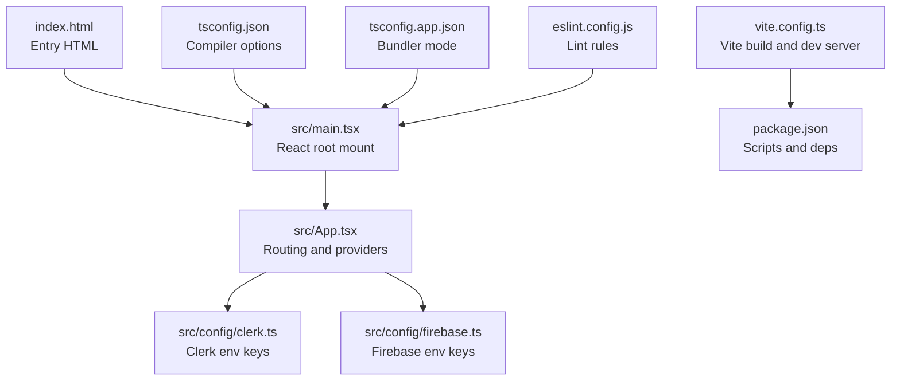
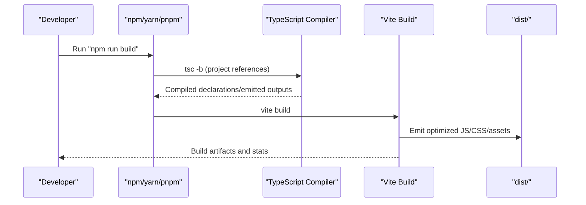
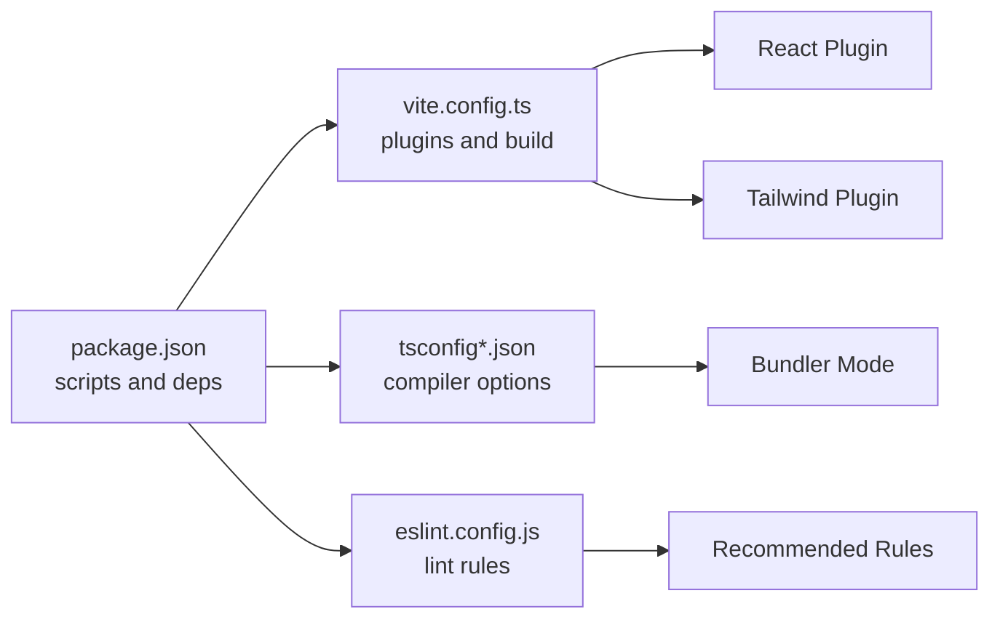

# Build & Deployment

<cite>
**Referenced Files in This Document**
- [vite.config.ts](file://vite.config.ts)
- [package.json](file://package.json)
- [index.html](file://index.html)
- [src/main.tsx](file://src/main.tsx)
- [src/App.tsx](file://src/App.tsx)
- [src/config/clerk.ts](file://src/config/clerk.ts)
- [src/config/firebase.ts](file://src/config/firebase.ts)
- [tsconfig.json](file://tsconfig.json)
- [tsconfig.app.json](file://tsconfig.app.json)
- [eslint.config.js](file://eslint.config.js)
- [README.md](file://README.md)
</cite>

## Table of Contents
1. [Introduction](#introduction)
2. [Project Structure](#project-structure)
3. [Core Components](#core-components)
4. [Architecture Overview](#architecture-overview)
5. [Detailed Component Analysis](#detailed-component-analysis)
6. [Dependency Analysis](#dependency-analysis)
7. [Performance Considerations](#performance-considerations)
8. [Troubleshooting Guide](#troubleshooting-guide)
9. [Conclusion](#conclusion)
10. [Appendices](#appendices)

## Introduction
This document provides comprehensive build and deployment guidance for DevForge’s Vite-based React application. It covers development server configuration, production builds, asset handling, environment variables, deployment strategies, and performance optimizations. The goal is to help teams reliably build, ship, and monitor applications across development, staging, and production environments.

## Project Structure
DevForge follows a standard Vite + React + TypeScript setup with a single-page application architecture. Key build and runtime configuration resides in Vite, TypeScript, and ESLint configuration files. The application bootstraps via a root HTML file and mounts the React root in the main entry script.

**Diagram sources**
- [index.html:1-14](file://index.html#L1-L14)
- [src/main.tsx:1-11](file://src/main.tsx#L1-L11)
- [src/App.tsx:1-67](file://src/App.tsx#L1-L67)
- [src/config/clerk.ts:1-4](file://src/config/clerk.ts#L1-L4)
- [src/config/firebase.ts:1-19](file://src/config/firebase.ts#L1-L19)
- [vite.config.ts:1-22](file://vite.config.ts#L1-L22)
- [package.json:1-38](file://package.json#L1-L38)
- [tsconfig.json:1-24](file://tsconfig.json#L1-L24)
- [tsconfig.app.json:1-26](file://tsconfig.app.json#L1-L26)
- [eslint.config.js:1-24](file://eslint.config.js#L1-L24)

**Section sources**
- [index.html:1-14](file://index.html#L1-L14)
- [src/main.tsx:1-11](file://src/main.tsx#L1-L11)
- [src/App.tsx:1-67](file://src/App.tsx#L1-L67)
- [vite.config.ts:1-22](file://vite.config.ts#L1-L22)
- [package.json:1-38](file://package.json#L1-L38)
- [tsconfig.json:1-24](file://tsconfig.json#L1-L24)
- [tsconfig.app.json:1-26](file://tsconfig.app.json#L1-L26)
- [eslint.config.js:1-24](file://eslint.config.js#L1-L24)

## Core Components
- Vite configuration defines plugins, aliases, dev server, and build outputs.
- TypeScript configurations set bundler mode and module resolution for Vite.
- Environment variables are consumed via import.meta.env for Clerk and Firebase.
- Scripts orchestrate development, build, linting, and preview.

Key responsibilities:
- vite.config.ts: Plugin registration, path aliasing, dev server port, output directory, and source maps.
- package.json scripts: Development, build, lint, and preview commands.
- src/config/*.ts: Runtime configuration loaded from environment variables.
- tsconfig*.json: Compiler and bundler settings aligned with Vite’s ES module bundling.

**Section sources**
- [vite.config.ts:1-22](file://vite.config.ts#L1-L22)
- [package.json:6-11](file://package.json#L6-L11)
- [src/config/clerk.ts:1-4](file://src/config/clerk.ts#L1-L4)
- [src/config/firebase.ts:1-19](file://src/config/firebase.ts#L1-L19)
- [tsconfig.json:1-24](file://tsconfig.json#L1-L24)
- [tsconfig.app.json:1-26](file://tsconfig.app.json#L1-L26)

## Architecture Overview
The build pipeline integrates TypeScript compilation with Vite’s bundling. During development, Vite serves the app with hot module replacement. Production builds emit optimized assets to the configured output directory.

**Diagram sources**
- [package.json:8-8](file://package.json#L8-L8)
- [vite.config.ts:17-20](file://vite.config.ts#L17-L20)

**Section sources**
- [package.json:8-8](file://package.json#L8-L8)
- [vite.config.ts:17-20](file://vite.config.ts#L17-L20)

## Detailed Component Analysis

### Vite Configuration
- Plugins: React and Tailwind CSS plugins are registered for JSX transform and CSS processing.
- Aliasing: @ resolves to the src directory for ergonomic imports.
- Dev server: Port and auto-open behavior are configured for local development.
- Build: Output directory and source maps are enabled for debugging and observability.

Recommended enhancements for production:
- Enable code splitting via dynamic imports for routes and heavy components.
- Configure asset hashing and CDN base paths for cache busting.
- Add minification and gzip/brotli compression for assets.
- Integrate Rollup plugin options for advanced chunking and treeshaking.

**Section sources**
- [vite.config.ts:6-21](file://vite.config.ts#L6-L21)

### TypeScript Configuration
- Root tsconfig.json sets ESNext target, DOM libs, bundler module resolution, and path aliases mirroring Vite’s alias.
- tsconfig.app.json enables bundler mode and strictness suitable for Vite’s native ES module handling.

Best practices:
- Keep moduleResolution as “bundler” for Vite compatibility.
- Align JSX transform with React JSX runtime expectations.
- Use verbatimModuleSyntax for cleaner bundling with Vite.

**Section sources**
- [tsconfig.json:2-22](file://tsconfig.json#L2-L22)
- [tsconfig.app.json:2-25](file://tsconfig.app.json#L2-L25)

### Environment Variables and Secrets
Runtime configuration is loaded from import.meta.env:
- Clerk publishable key and admin contact details.
- Firebase credentials for initialization.

Guidelines:
- Define environment variables per environment (development, staging, production).
- Use .env files locally and CI/CD secrets for remote builds.
- Avoid committing sensitive values; keep them scoped to environment contexts.

**Section sources**
- [src/config/clerk.ts:1-4](file://src/config/clerk.ts#L1-L4)
- [src/config/firebase.ts:5-12](file://src/config/firebase.ts#L5-L12)

### Application Bootstrap and Routing
- index.html provides the root container and loads the main entry script.
- src/main.tsx mounts the React root and initializes global styles.
- src/App.tsx wires routing, Clerk provider, and nested routes.

Considerations:
- Keep route components granular to enable code splitting.
- Ensure Clerk and Firebase initialization occurs after environment variables are injected.

**Section sources**
- [index.html:9-12](file://index.html#L9-L12)
- [src/main.tsx:1-11](file://src/main.tsx#L1-L11)
- [src/App.tsx:26-66](file://src/App.tsx#L26-L66)

### ESLint Configuration
- Flat config excludes dist, sets recommended rulesets, and aligns with Vite and React Refresh.
- For production-grade linting, consider enabling type-checked configurations and additional React-specific plugins.

**Section sources**
- [eslint.config.js:8-23](file://eslint.config.js#L8-L23)

## Dependency Analysis
The build system relies on Vite, React, TypeScript, and related tooling. Dependencies are declared in package.json with scripts orchestrating development and production workflows.

**Diagram sources**
- [package.json:6-36](file://package.json#L6-L36)
- [vite.config.ts:6-21](file://vite.config.ts#L6-L21)
- [tsconfig.json:2-22](file://tsconfig.json#L2-L22)
- [tsconfig.app.json:2-25](file://tsconfig.app.json#L2-L25)
- [eslint.config.js:8-23](file://eslint.config.js#L8-L23)

**Section sources**
- [package.json:6-36](file://package.json#L6-L36)
- [vite.config.ts:6-21](file://vite.config.ts#L6-L21)
- [tsconfig.json:2-22](file://tsconfig.json#L2-L22)
- [tsconfig.app.json:2-25](file://tsconfig.app.json#L2-L25)
- [eslint.config.js:8-23](file://eslint.config.js#L8-L23)

## Performance Considerations
Optimization techniques applicable to this Vite + React + TypeScript setup:

- Lazy loading and code splitting
  - Split routes and heavy components using dynamic imports to reduce initial bundle size.
  - Leverage Vite’s native dynamic import support with minimal configuration.

- Tree shaking
  - Prefer ES module imports and avoid side effects in libraries.
  - Keep dependencies up to date to benefit from modern module practices.

- Asset compression and caching
  - Enable gzip/brotli compression on the web server or CDN.
  - Use hashed filenames for long-term caching; configure Vite to emit hashes and a manifest.

- Source maps
  - Keep source maps enabled in development; switch to hidden or production-friendly settings in production.

- Build statistics and budgets
  - Use Vite’s built-in stats or external tools to track bundle sizes and detect regressions.

[No sources needed since this section provides general guidance]

## Troubleshooting Guide
Common issues and remedies:

- Missing environment variables
  - Symptoms: Runtime errors during Clerk/Firebase initialization.
  - Resolution: Ensure environment variables are present in the runtime context and correctly named per import.meta.env usage.

- Path alias not resolving
  - Symptoms: Import errors for @/* paths.
  - Resolution: Verify tsconfig.json and vite.config.ts aliases match and are consistent.

- Build fails due to TypeScript errors
  - Symptoms: Type errors blocking the build.
  - Resolution: Fix type issues or adjust tsconfig settings; confirm bundler mode is enabled.

- Dev server port conflicts
  - Symptoms: Port already in use.
  - Resolution: Change the dev server port in vite.config.ts or free the port.

- Lint failures blocking commits
  - Symptoms: ESLint errors preventing progress.
  - Resolution: Apply suggested fixes or adjust eslint.config.js rules as appropriate.

**Section sources**
- [src/config/clerk.ts:1-4](file://src/config/clerk.ts#L1-L4)
- [src/config/firebase.ts:5-12](file://src/config/firebase.ts#L5-L12)
- [tsconfig.json:18-20](file://tsconfig.json#L18-L20)
- [vite.config.ts:13-16](file://vite.config.ts#L13-L16)
- [eslint.config.js:8-23](file://eslint.config.js#L8-L23)

## Conclusion
DevForge’s current build system is well-aligned with Vite’s native capabilities. By extending Vite configuration for production optimizations, enforcing environment-driven configuration, and adopting robust deployment and monitoring practices, teams can deliver fast, reliable, and observable applications across environments.

[No sources needed since this section summarizes without analyzing specific files]

## Appendices

### A. Environment Variable Reference
- Clerk publishable key and admin contact details are loaded from import.meta.env.
- Firebase configuration reads API key, auth domain, project ID, storage bucket, messaging sender ID, and app ID from import.meta.env.

Implementation notes:
- Define variables per environment (development, staging, production).
- Inject variables at build time and runtime consistently.

**Section sources**
- [src/config/clerk.ts:1-4](file://src/config/clerk.ts#L1-L4)
- [src/config/firebase.ts:5-12](file://src/config/firebase.ts#L5-L12)

### B. Build Commands and Scripts
- Development: Start the Vite dev server with hot reloading.
- Build: Compile TypeScript and run Vite build to produce optimized assets.
- Preview: Serve the production build locally for verification.
- Lint: Run ESLint across the project.

**Section sources**
- [package.json:6-11](file://package.json#L6-L11)

### C. Recommended Production Enhancements
- Vite build tuning
  - Enable asset hashing and CDN base path.
  - Configure Rollup options for chunking and treeshaking.
  - Minify and compress assets.
- Monitoring and observability
  - Track bundle sizes and load performance.
  - Monitor error rates and user journeys post-deployment.
- Rollback procedures
  - Maintain artifact retention and version tagging.
  - Automate safe rollouts with health checks and canary deployments.

[No sources needed since this section provides general guidance]