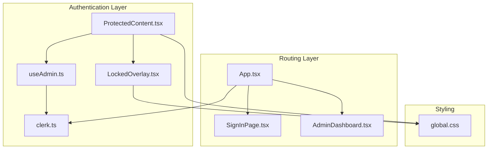
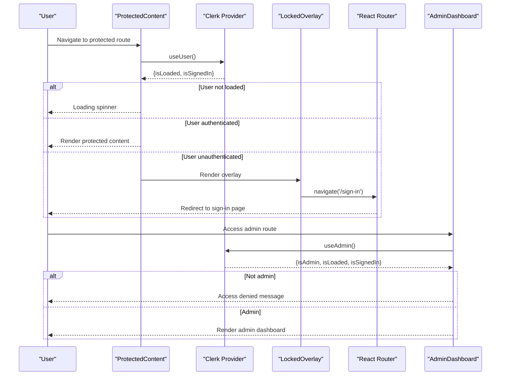
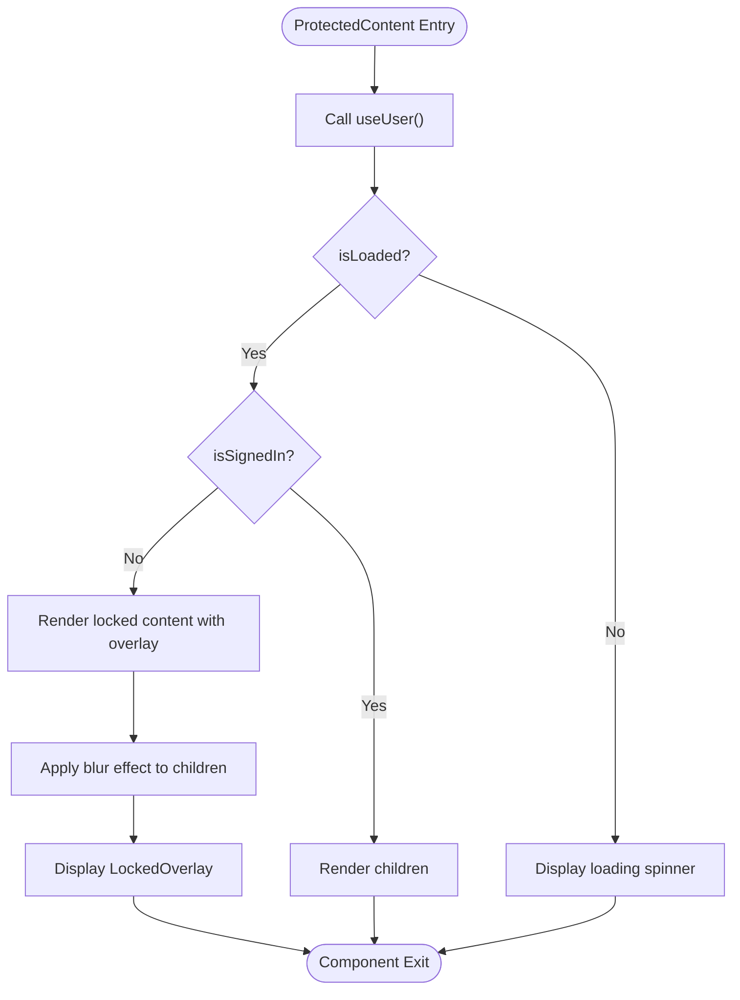
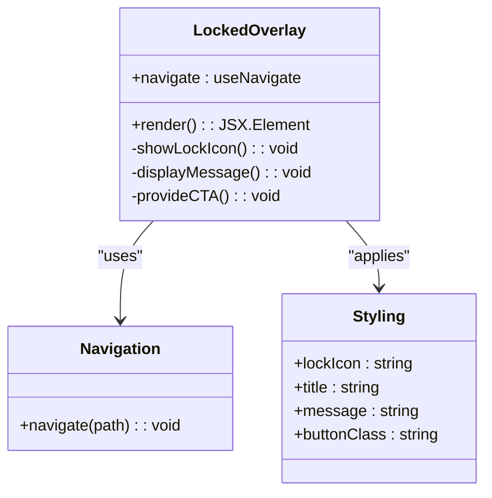
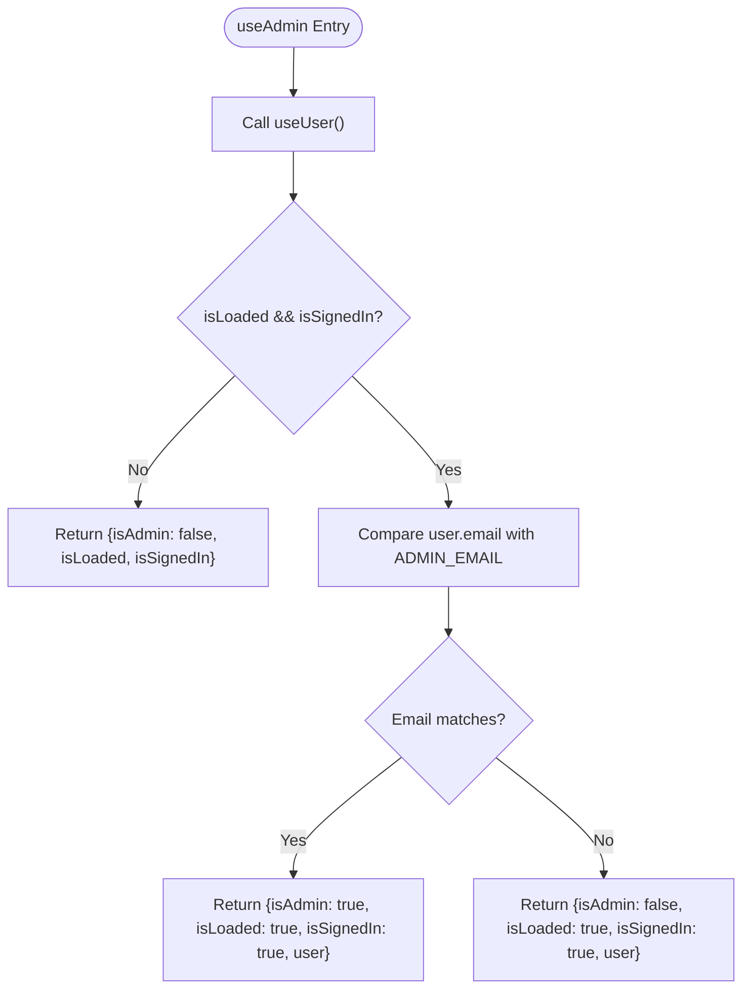
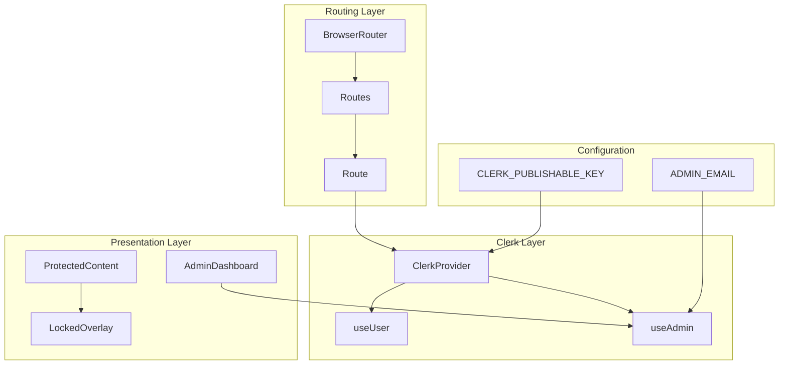
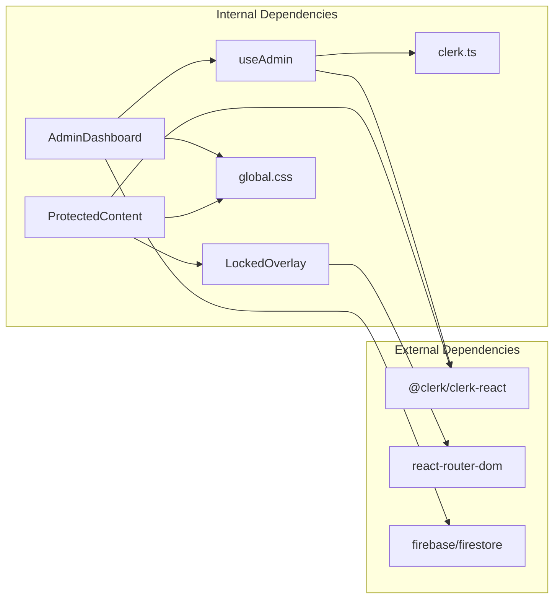
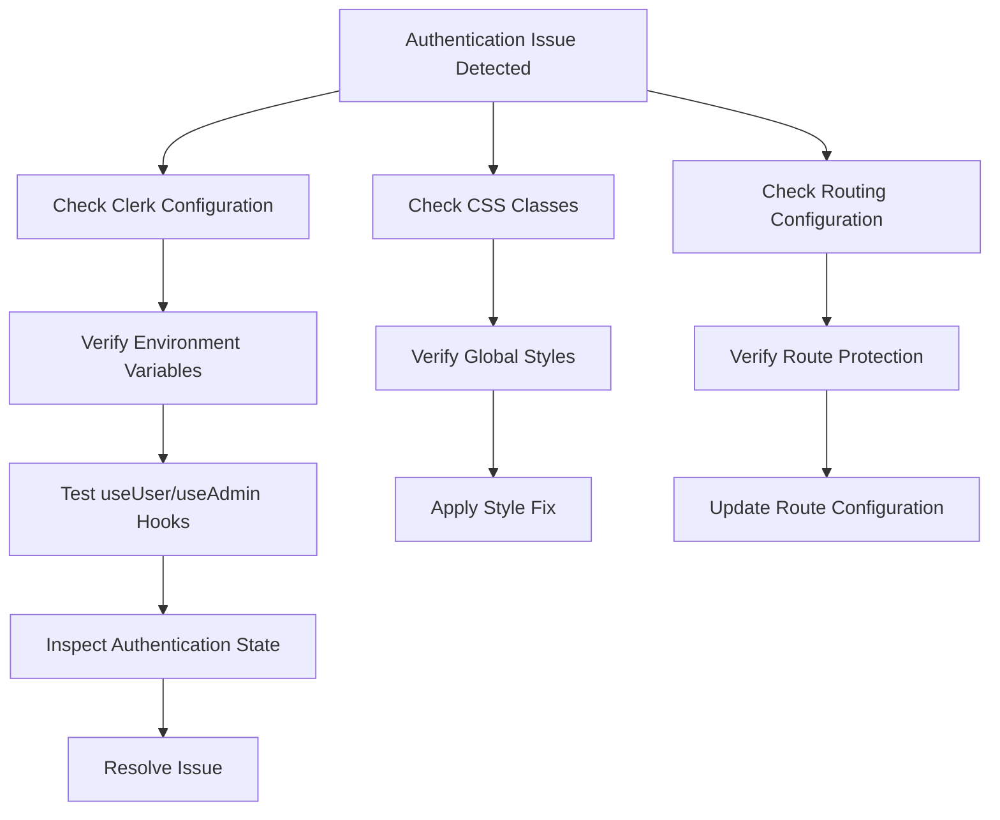

# Authentication Components

<cite>
**Referenced Files in This Document**
- [ProtectedContent.tsx](file://src/components/auth/ProtectedContent.tsx)
- [LockedOverlay.tsx](file://src/components/auth/LockedOverlay.tsx)
- [useAdmin.ts](file://src/hooks/useAdmin.ts)
- [clerk.ts](file://src/config/clerk.ts)
- [App.tsx](file://src/App.tsx)
- [SignInPage.tsx](file://src/components/auth/SignInPage.tsx)
- [AdminDashboard.tsx](file://src/components/admin/AdminDashboard.tsx)
- [global.css](file://src/styles/global.css)
</cite>

## Table of Contents
1. [Introduction](#introduction)
2. [Project Structure](#project-structure)
3. [Core Components](#core-components)
4. [Architecture Overview](#architecture-overview)
5. [Detailed Component Analysis](#detailed-component-analysis)
6. [Dependency Analysis](#dependency-analysis)
7. [Performance Considerations](#performance-considerations)
8. [Troubleshooting Guide](#troubleshooting-guide)
9. [Conclusion](#conclusion)

## Introduction
This document provides comprehensive documentation for DevForge's authentication components, focusing on ProtectedContent and LockedOverlay implementations. These components work together to render protected content only when users are authenticated and to block access to restricted areas until proper authentication is achieved. The documentation covers component roles, integration with Clerk's authentication state, conditional rendering patterns, prop interfaces, authentication state management, and user experience considerations. It also includes implementation examples for protecting new routes, customizing access control logic, integrating with admin-only features, and handling authentication errors gracefully, along with the components' relationship to the useAdmin hook and overall authentication flow.

## Project Structure
DevForge organizes authentication-related code under the src/components/auth directory, with complementary hooks and configuration files supporting Clerk integration. The application integrates Clerk through a provider wrapper around the routing system, enabling seamless authentication state management across routes.

**Diagram sources**
- [ProtectedContent.tsx:1-44](file://src/components/auth/ProtectedContent.tsx#L1-L44)
- [LockedOverlay.tsx:1-61](file://src/components/auth/LockedOverlay.tsx#L1-L61)
- [useAdmin.ts:1-14](file://src/hooks/useAdmin.ts#L1-L14)
- [clerk.ts:1-4](file://src/config/clerk.ts#L1-L4)
- [App.tsx:1-67](file://src/App.tsx#L1-L67)
- [SignInPage.tsx:1-251](file://src/components/auth/SignInPage.tsx#L1-L251)
- [AdminDashboard.tsx:1-186](file://src/components/admin/AdminDashboard.tsx#L1-L186)
- [global.css:1-383](file://src/styles/global.css#L1-L383)

**Section sources**
- [App.tsx:1-67](file://src/App.tsx#L1-L67)
- [clerk.ts:1-4](file://src/config/clerk.ts#L1-L4)

## Core Components
This section documents the primary authentication components and their responsibilities within the DevForge application.

### ProtectedContent Component
ProtectedContent renders children only when users are authenticated. It integrates with Clerk's useUser hook to access authentication state and conditionally renders either the protected content or a locked overlay with a fallback option.

Key characteristics:
- Uses Clerk's useUser hook to determine authentication state
- Provides graceful loading state while authentication state is being determined
- Supports optional fallback content when users are not signed in
- Integrates LockedOverlay for blocked content presentation
- Applies CSS classes for blurred content and overlay positioning

Prop interface:
- children: ReactNode (content to render when authenticated)
- fallback?: ReactNode (optional fallback content shown behind overlay)

Conditional rendering logic:
- Loading state: displays spinner while authentication state is loading
- Unauthenticated state: blurs content and overlays LockedOverlay
- Authenticated state: renders children directly

**Section sources**
- [ProtectedContent.tsx:1-44](file://src/components/auth/ProtectedContent.tsx#L1-L44)

### LockedOverlay Component
LockedOverlay presents a visually appealing overlay indicating restricted access and provides navigation to the sign-in page. It uses react-router-dom for navigation and follows DevForge's design system with glassmorphism effects.

Key characteristics:
- Displays lock icon, title, and explanatory text
- Provides prominent call-to-action button
- Navigates to '/sign-in' route on button click
- Uses CSS classes for styling consistent with the application theme
- Implements responsive design with centered layout

User interaction:
- Clicking the button triggers navigation to the sign-in page
- Overlay remains fixed over blurred content
- Maintains accessibility with proper focus management

**Section sources**
- [LockedOverlay.tsx:1-61](file://src/components/auth/LockedOverlay.tsx#L1-L61)

### useAdmin Hook
The useAdmin hook extends Clerk's authentication state to provide administrative privileges checking. It verifies that the authenticated user matches the configured administrator email address.

Key characteristics:
- Leverages Clerk's useUser hook for authentication state
- Compares user's primary email address against ADMIN_EMAIL configuration
- Returns comprehensive state including isAdmin flag and original authentication data
- Enables fine-grained access control for admin-only features

Access control logic:
- Requires isLoaded and isSignedIn to be true
- Compares user's primary email address with ADMIN_EMAIL
- Returns isAdmin boolean alongside original state

**Section sources**
- [useAdmin.ts:1-14](file://src/hooks/useAdmin.ts#L1-L14)
- [clerk.ts:1-4](file://src/config/clerk.ts#L1-L4)

## Architecture Overview
The authentication architecture integrates Clerk's authentication provider with custom React components to create a seamless user experience. The system follows a layered approach with Clerk managing authentication state and custom components handling presentation and access control.

**Diagram sources**
- [ProtectedContent.tsx:1-44](file://src/components/auth/ProtectedContent.tsx#L1-L44)
- [LockedOverlay.tsx:1-61](file://src/components/auth/LockedOverlay.tsx#L1-L61)
- [useAdmin.ts:1-14](file://src/hooks/useAdmin.ts#L1-L14)
- [App.tsx:1-67](file://src/App.tsx#L1-L67)
- [AdminDashboard.tsx:1-186](file://src/components/admin/AdminDashboard.tsx#L1-L186)

## Detailed Component Analysis

### ProtectedContent Implementation Details
ProtectedContent serves as the primary gatekeeper for authenticated content, implementing sophisticated conditional rendering based on Clerk's authentication state.

**Diagram sources**
- [ProtectedContent.tsx:10-43](file://src/components/auth/ProtectedContent.tsx#L10-L43)

Key implementation patterns:
- Graceful loading: Spinner animation during authentication state determination
- Content protection: CSS blur effect combined with overlay positioning
- Fallback support: Optional fallback content when overlay is displayed
- State management: Integration with Clerk's asynchronous authentication state

### LockedOverlay Implementation Details
LockedOverlay provides a cohesive user experience for unauthenticated users attempting to access protected content.

**Diagram sources**
- [LockedOverlay.tsx:1-61](file://src/components/auth/LockedOverlay.tsx#L1-L61)

User experience considerations:
- Visual feedback: Lock icon with neon green styling
- Clear messaging: Informative text explaining membership requirement
- Immediate action: Prominent button with gradient styling
- Consistent design: Follows DevForge's glassmorphism aesthetic

### useAdmin Hook Implementation Details
The useAdmin hook extends basic authentication to provide administrative capabilities.

**Diagram sources**
- [useAdmin.ts:4-13](file://src/hooks/useAdmin.ts#L4-L13)

Administrative access patterns:
- Email-based verification: Primary email address comparison
- State propagation: Passes through original authentication state
- Type safety: Returns typed object with all relevant state information

**Section sources**
- [ProtectedContent.tsx:1-44](file://src/components/auth/ProtectedContent.tsx#L1-L44)
- [LockedOverlay.tsx:1-61](file://src/components/auth/LockedOverlay.tsx#L1-L61)
- [useAdmin.ts:1-14](file://src/hooks/useAdmin.ts#L1-L14)

### Conceptual Overview
The authentication system operates on a layered approach where Clerk manages low-level authentication state while custom components handle presentation and access control logic.

[No sources needed since this diagram shows conceptual workflow, not actual code structure]

## Dependency Analysis
The authentication components demonstrate clean separation of concerns with minimal coupling between modules.

**Diagram sources**
- [ProtectedContent.tsx:1-44](file://src/components/auth/ProtectedContent.tsx#L1-L44)
- [LockedOverlay.tsx:1-61](file://src/components/auth/LockedOverlay.tsx#L1-L61)
- [useAdmin.ts:1-14](file://src/hooks/useAdmin.ts#L1-L14)
- [AdminDashboard.tsx:1-186](file://src/components/admin/AdminDashboard.tsx#L1-L186)
- [clerk.ts:1-4](file://src/config/clerk.ts#L1-L4)
- [global.css:1-383](file://src/styles/global.css#L1-L383)

Key dependency relationships:
- ProtectedContent depends on Clerk for authentication state and LockedOverlay for presentation
- useAdmin depends on Clerk for user data and configuration for admin email
- AdminDashboard depends on useAdmin for access control and Firebase for data operations
- All components depend on global CSS for consistent styling

**Section sources**
- [ProtectedContent.tsx:1-44](file://src/components/auth/ProtectedContent.tsx#L1-L44)
- [useAdmin.ts:1-14](file://src/hooks/useAdmin.ts#L1-L14)
- [AdminDashboard.tsx:1-186](file://src/components/admin/AdminDashboard.tsx#L1-L186)

## Performance Considerations
The authentication components are designed for optimal performance with minimal re-renders and efficient state management.

### Rendering Optimization
- Lazy evaluation: Authentication state is checked only when needed
- Conditional rendering: Components render only the necessary UI elements
- CSS-based effects: Blur and overlay effects are handled by CSS for GPU acceleration
- Minimal DOM manipulation: Overlay is positioned absolutely without affecting layout

### State Management Efficiency
- Single source of truth: Clerk provides centralized authentication state
- Efficient updates: Components subscribe only to relevant state changes
- Debounced operations: No unnecessary API calls during authentication transitions

### Memory Management
- Cleanup: Components properly manage event listeners and subscriptions
- Reference equality: State objects are compared efficiently
- Garbage collection: Temporary loading states are promptly cleaned up

## Troubleshooting Guide

### Common Authentication Issues
**ProtectedContent not rendering correctly:**
- Verify ClerkProvider is properly configured in App.tsx
- Check that ProtectedContent is wrapped around the intended content
- Ensure useUser hook is returning expected authentication state

**LockedOverlay not appearing:**
- Confirm that ProtectedContent is receiving isSignedIn as false
- Verify CSS classes are properly loaded from global.css
- Check that LockedOverlay is not being blocked by parent container styles

**useAdmin hook returning incorrect results:**
- Validate ADMIN_EMAIL environment variable is correctly set
- Ensure user's primary email address matches the configured admin email
- Check that Clerk user object contains the expected email address

### Debugging Authentication State

**Diagram sources**
- [ProtectedContent.tsx:1-44](file://src/components/auth/ProtectedContent.tsx#L1-L44)
- [useAdmin.ts:1-14](file://src/hooks/useAdmin.ts#L1-L14)
- [global.css:267-289](file://src/styles/global.css#L267-L289)

**Section sources**
- [ProtectedContent.tsx:1-44](file://src/components/auth/ProtectedContent.tsx#L1-L44)
- [LockedOverlay.tsx:1-61](file://src/components/auth/LockedOverlay.tsx#L1-L61)
- [useAdmin.ts:1-14](file://src/hooks/useAdmin.ts#L1-L14)

## Conclusion
DevForge's authentication components provide a robust, user-friendly solution for protecting content and managing access control. The ProtectedContent component effectively gates access to authenticated users while maintaining excellent user experience through graceful loading and visual feedback. The LockedOverlay component delivers clear messaging and intuitive navigation to the sign-in process. The useAdmin hook extends authentication capabilities to support administrative features with precise email-based verification.

The architecture demonstrates clean separation of concerns with Clerk handling authentication state while custom components manage presentation and access control logic. The system's design allows for easy extension to support additional authentication providers, custom access control rules, and enhanced user experiences.

Key strengths of the implementation include:
- Seamless integration with Clerk's authentication ecosystem
- Consistent user experience across protected content
- Efficient state management with minimal re-renders
- Extensible design supporting future enhancements
- Comprehensive error handling and graceful degradation

The components serve as a solid foundation for building secure, scalable applications with sophisticated access control requirements while maintaining excellent user experience standards.