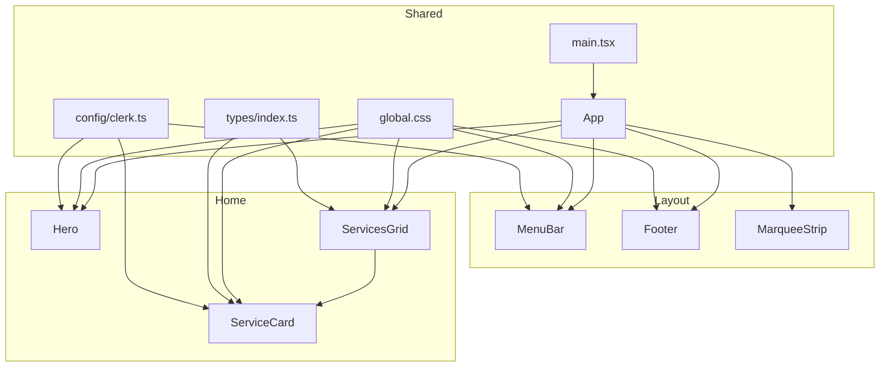
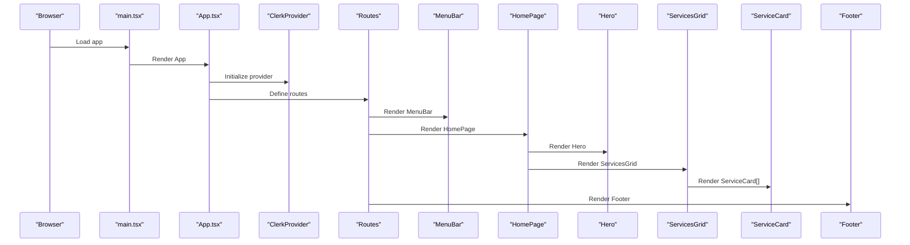
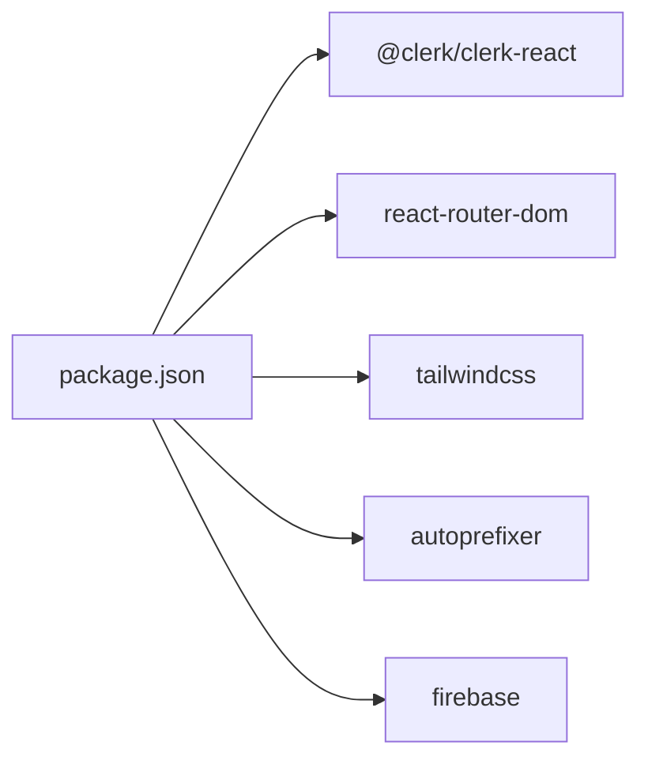

# Component Library

<cite>
**Referenced Files in This Document**
- [MenuBar.tsx](file://src/components/layout/MenuBar.tsx)
- [Footer.tsx](file://src/components/layout/Footer.tsx)
- [Hero.tsx](file://src/components/home/Hero.tsx)
- [ServicesGrid.tsx](file://src/components/home/ServicesGrid.tsx)
- [ServiceCard.tsx](file://src/components/home/ServiceCard.tsx)
- [MarqueeStrip.tsx](file://src/components/layout/MarqueeStrip.tsx)
- [App.tsx](file://src/App.tsx)
- [main.tsx](file://src/main.tsx)
- [global.css](file://src/styles/global.css)
- [index.ts](file://src/types/index.ts)
- [clerk.ts](file://src/config/clerk.ts)
- [package.json](file://package.json)
</cite>

## Table of Contents
1. [Introduction](#introduction)
2. [Project Structure](#project-structure)
3. [Core Components](#core-components)
4. [Architecture Overview](#architecture-overview)
5. [Detailed Component Analysis](#detailed-component-analysis)
6. [Dependency Analysis](#dependency-analysis)
7. [Performance Considerations](#performance-considerations)
8. [Troubleshooting Guide](#troubleshooting-guide)
9. [Conclusion](#conclusion)
10. [Appendices](#appendices)

## Introduction
This document describes DevForge’s reusable UI component library, focusing on layout components (MenuBar and Footer), home page components (Hero, ServicesGrid, and ServiceCard), and the glass morphism design system built with Tailwind CSS utilities and custom CSS. It explains component props, event handling, interactivity, responsive design, accessibility, and cross-browser compatibility considerations. It also provides guidance for extending components and maintaining design consistency.

## Project Structure
The component library is organized by feature areas:
- Layout: MenuBar, Footer, MarqueeStrip
- Home: Hero, ServicesGrid, ServiceCard, ScriptConverter, LocalSupport
- Auth: ProtectedContent, LockedOverlay, SignInPage
- Admin: AdminDashboard, OrderList, ProductManager
- Shared: Types, Styles, Config

**Diagram sources**
- [App.tsx:14-24](file://src/App.tsx#L14-L24)
- [MenuBar.tsx:1-133](file://src/components/layout/MenuBar.tsx#L1-L133)
- [Footer.tsx:1-174](file://src/components/layout/Footer.tsx#L1-L174)
- [MarqueeStrip.tsx:14-65](file://src/components/layout/MarqueeStrip.tsx#L14-L65)
- [Hero.tsx:1-110](file://src/components/home/Hero.tsx#L1-L110)
- [ServicesGrid.tsx:116-167](file://src/components/home/ServicesGrid.tsx#L116-L167)
- [ServiceCard.tsx:10-177](file://src/components/home/ServiceCard.tsx#L10-L177)
- [main.tsx:1-11](file://src/main.tsx#L1-L11)
- [global.css:1-383](file://src/styles/global.css#L1-L383)
- [index.ts:29-40](file://src/types/index.ts#L29-L40)
- [clerk.ts:1-4](file://src/config/clerk.ts#L1-L4)

**Section sources**
- [App.tsx:14-24](file://src/App.tsx#L14-L24)
- [main.tsx:1-11](file://src/main.tsx#L1-L11)

## Core Components
- MenuBar: Fixed header with real-time clock, responsive navigation, and authentication controls.
- Footer: Multi-column brand and contact section with social links and copyright bar.
- Hero: Dynamic headline, tagline, and CTA buttons with Clerk integration.
- ServicesGrid: Grid of ServiceCard instances with Clerk-aware rendering.
- ServiceCard: Flip-card with front/back faces, macOS-style title bar, and CTA actions.

**Section sources**
- [MenuBar.tsx:5-133](file://src/components/layout/MenuBar.tsx#L5-L133)
- [Footer.tsx:1-174](file://src/components/layout/Footer.tsx#L1-L174)
- [Hero.tsx:5-110](file://src/components/home/Hero.tsx#L5-L110)
- [ServicesGrid.tsx:116-167](file://src/components/home/ServicesGrid.tsx#L116-L167)
- [ServiceCard.tsx:10-177](file://src/components/home/ServiceCard.tsx#L10-L177)

## Architecture Overview
The application integrates Clerk for authentication and routes all pages through a shared layout with MenuBar and Footer. Home page composes Hero, MarqueeStrip, ServicesGrid, ScriptConverter, and LocalSupport.

**Diagram sources**
- [main.tsx:6-10](file://src/main.tsx#L6-L10)
- [App.tsx:26-58](file://src/App.tsx#L26-L58)
- [MenuBar.tsx:27-131](file://src/components/layout/MenuBar.tsx#L27-L131)
- [App.tsx:14-24](file://src/App.tsx#L14-L24)
- [Hero.tsx:16-107](file://src/components/home/Hero.tsx#L16-L107)
- [ServicesGrid.tsx:119-164](file://src/components/home/ServicesGrid.tsx#L119-L164)
- [ServiceCard.tsx:30-175](file://src/components/home/ServiceCard.tsx#L30-L175)
- [Footer.tsx:4-172](file://src/components/layout/Footer.tsx#L4-L172)

## Detailed Component Analysis

### MenuBar
- Real-time clock: Updates every second using a timer effect.
- Navigation: Internal links to sections on the home page.
- Authentication: Clerk UserButton when signed in; “Sign In” button otherwise.
- Styling: Uses glass-panel-strong utility and CSS variables for theme tokens.

Props
- None (uses Clerk and routing internally)

Events
- Click on “Sign In” triggers navigation to sign-in route.

Accessibility and responsiveness
- Uses semantic elements and maintains focus-friendly interactions.
- Responsive layout adapts to viewport width.

Customization
- Adjust time format via locale options.
- Modify colors and typography via CSS variables.

**Section sources**
- [MenuBar.tsx:5-133](file://src/components/layout/MenuBar.tsx#L5-L133)
- [clerk.ts:1-4](file://src/config/clerk.ts#L1-L4)

### Footer
- Multi-column grid layout with brand identity, address, and social links.
- Copyright bar with year and branding note.
- Uses glass-panel-strong and neon-brand text utilities.

Props
- None

Events
- External links open in new tabs with safe attributes.

Accessibility and responsiveness
- Grid uses auto-fit with minmax to wrap columns responsively.
- Semantic address and anchor elements.

Customization
- Add/remove columns by editing grid template.
- Update contact details and social handles.

**Section sources**
- [Footer.tsx:1-174](file://src/components/layout/Footer.tsx#L1-L174)

### Hero
- Dynamic headline with neon brand text and clamp sizing.
- Tagline with leading and max-width constraints.
- CTA buttons: primary link to services; secondary opens WhatsApp when signed in, disabled otherwise.
- Integrates Clerk for signed-in state and navigation.

Props
- None

Events
- Click handlers for navigation and WhatsApp deep-link.

Accessibility and responsiveness
- Uses clamp for fluid typography.
- Flexbox wraps on small screens.

Customization
- Replace tagline and CTA text via content.
- Adjust button classes for alternate styles.

**Section sources**
- [Hero.tsx:5-110](file://src/components/home/Hero.tsx#L5-L110)
- [clerk.ts:1-4](file://src/config/clerk.ts#L1-L4)

### ServicesGrid
- Renders a grid of ServiceCard items.
- Uses a typed array of service definitions.
- Clerk-aware: passes authentication state to cards.

Props
- None

Events
- Delegated to child ServiceCard components.

Accessibility and responsiveness
- CSS Grid with auto-fill and minmax for responsive columns.
- Centered layout with constrained max-width.

Customization
- Extend the services array with new entries.
- Adjust grid gap and column sizes via inline styles.

**Section sources**
- [ServicesGrid.tsx:116-167](file://src/components/home/ServicesGrid.tsx#L116-L167)
- [index.ts:29-40](file://src/types/index.ts#L29-L40)

### ServiceCard
- Flip animation on click toggles front/back faces.
- Front face shows icon, title, short description, and price.
- Back face lists features and a CTA button.
- CTA action dispatches based on card configuration:
  - whatsapp: opens WhatsApp deep-link with pre-filled message.
  - upload: scrolls to converter section.
  - fallback: opens WhatsApp with a generic message.
- Disabled state when unauthenticated.

Props
- data: ServiceCardData
- isAuthenticated: boolean

Events
- Click toggles flip state.
- Button click invokes CTA handler.

Accessibility and responsiveness
- Uses CSS transforms and preserve-3d for flip effect.
- Hover and focus states handled by CSS utilities.

Customization
- Add new service entries to ServicesGrid.
- Extend CTA actions by adding cases in the handler.

**Section sources**
- [ServiceCard.tsx:5-177](file://src/components/home/ServiceCard.tsx#L5-L177)
- [index.ts:29-40](file://src/types/index.ts#L29-L40)
- [clerk.ts:1-4](file://src/config/clerk.ts#L1-L4)

### MarqueeStrip
- Horizontal scrolling strip of promotional items with repeated content for seamless looping.
- Uses CSS animation and custom property-based typography.

Props
- None

Events
- None

Accessibility and responsiveness
- Animation runs smoothly; content remains readable.

Customization
- Add or remove items in the marqueeItems array.

**Section sources**
- [MarqueeStrip.tsx:14-65](file://src/components/layout/MarqueeStrip.tsx#L14-L65)

## Dependency Analysis
External libraries and integrations:
- Clerk for authentication and user state.
- React Router for navigation.
- Tailwind CSS v4 plugin for styling utilities.
- Firebase for backend services.

**Diagram sources**
- [package.json:12-36](file://package.json#L12-L36)

**Section sources**
- [package.json:12-36](file://package.json#L12-L36)

## Performance Considerations
- MenuBar clock updates every second; consider throttling or pausing when tab is inactive if needed.
- ServiceCard flip uses CSS transforms; keep animations smooth by avoiding heavy content inside flipped panels.
- Global CSS defines backdrop filters and blur effects; ensure GPU acceleration is available on target devices.
- Lazy-load images or offscreen content if adding media to future components.

## Troubleshooting Guide
Common issues and resolutions:
- Authentication state not reflected
  - Verify Clerk publishable key is set in environment variables.
  - Ensure ClerkProvider wraps the application and routes.
- WhatsApp deep-links not opening
  - Confirm WHATSAPP_NUMBER is configured and the message encoding is correct.
- Glass panel styles not applying
  - Ensure global.css is imported and Tailwind utilities are available.
- Flip animation not working
  - Check that the card container has proper perspective and the inner element rotates on click.

**Section sources**
- [clerk.ts:1-4](file://src/config/clerk.ts#L1-L4)
- [global.css:92-115](file://src/styles/global.css#L92-L115)
- [ServiceCard.tsx:30-175](file://src/components/home/ServiceCard.tsx#L30-L175)

## Conclusion
DevForge’s component library combines a cohesive glass morphism design system with Clerk-driven authentication and responsive layouts. The MenuBar and Footer provide consistent navigation and branding, while the home page components deliver dynamic, interactive experiences. Following the established patterns ensures visual and behavioral consistency across the application.

## Appendices

### Design System and Tailwind Utilities
- Glass morphism utilities: glass-panel, glass-panel-strong
- Neon brand utilities: neon-green-text, brand-blue-text, neon-border-green, neon-border-blue
- Button utilities: btn-primary, btn-secondary
- Animations: animate-fade-in-up, animate-pulse-glow, animate-float
- macOS-style card: card-flip-container, card-flip-inner, card-front, card-back, macos-title-bar
- Responsive adjustments: media query for smaller screens

**Section sources**
- [global.css:92-204](file://src/styles/global.css#L92-L204)
- [global.css:205-266](file://src/styles/global.css#L205-L266)
- [global.css:267-322](file://src/styles/global.css#L267-L322)
- [global.css:323-383](file://src/styles/global.css#L323-L383)

### Component Prop Interfaces
- ServiceCardData
  - id: string
  - title: string
  - subtitle: string
  - price: string
  - icon: string
  - description: string
  - features: string[]
  - ctaText: string
  - ctaAction: 'whatsapp' | 'upload' | 'contact'

**Section sources**
- [index.ts:29-40](file://src/types/index.ts#L29-L40)

### Implementation Examples

- Extending ServiceCard
  - Add a new service entry to the services array in ServicesGrid.
  - Reference the ServiceCardData interface for shape and constraints.
  - Use the same CTA action patterns for consistency.

- Creating a new layout component
  - Place the component under src/components/layout/.
  - Import and render it in App.tsx alongside MenuBar/Footer.
  - Apply glass-panel utilities and CSS variables for theme consistency.

- Maintaining design consistency
  - Use predefined utilities (btn-primary, glass-panel-strong).
  - Leverage CSS variables for colors and typography.
  - Follow clamp-based responsive typography and grid layouts.

**Section sources**
- [ServicesGrid.tsx:5-114](file://src/components/home/ServicesGrid.tsx#L5-L114)
- [index.ts:29-40](file://src/types/index.ts#L29-L40)
- [App.tsx:26-58](file://src/App.tsx#L26-L58)
- [global.css:92-115](file://src/styles/global.css#L92-L115)