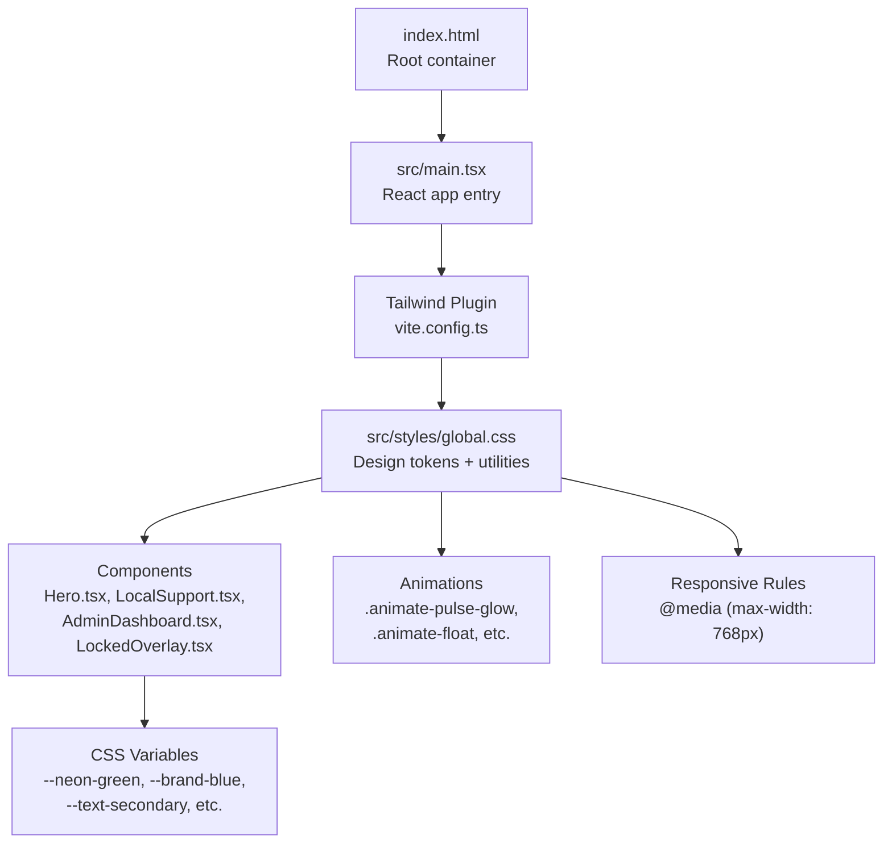
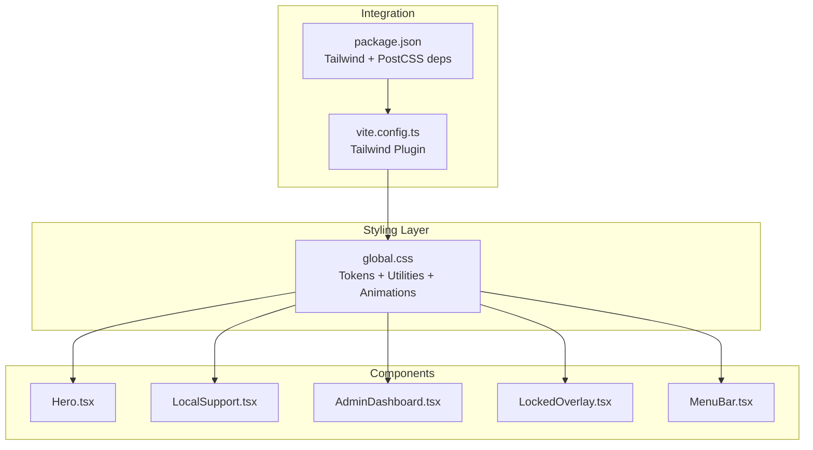
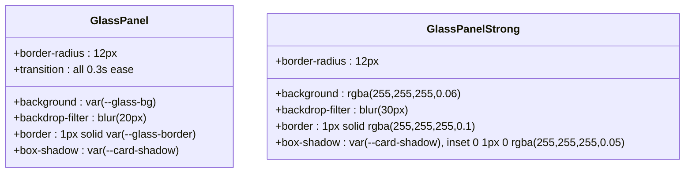
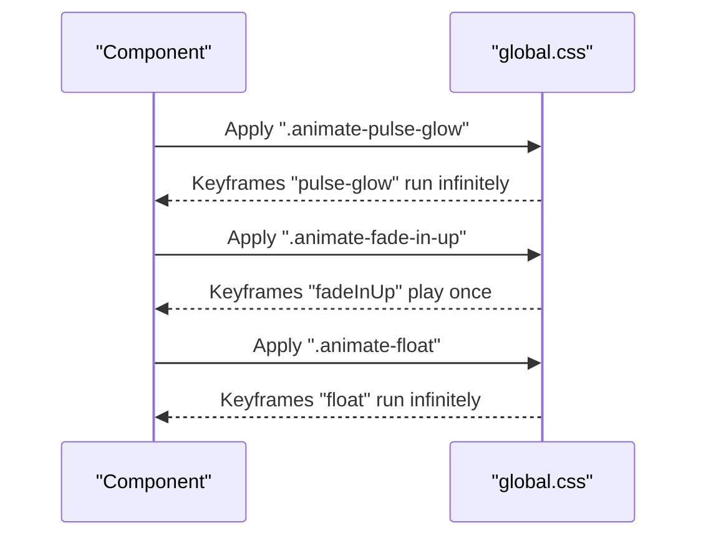
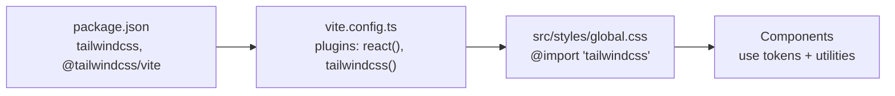

# Design System & Styling

<cite>
**Referenced Files in This Document**
- [global.css](file://src/styles/global.css)
- [vite.config.ts](file://vite.config.ts)
- [package.json](file://package.json)
- [index.html](file://index.html)
- [Hero.tsx](file://src/components/home/Hero.tsx)
- [LocalSupport.tsx](file://src/components/home/LocalSupport.tsx)
- [AdminDashboard.tsx](file://src/components/admin/AdminDashboard.tsx)
- [ProductManager.tsx](file://src/components/admin/ProductManager.tsx)
- [LockedOverlay.tsx](file://src/components/auth/LockedOverlay.tsx)
- [MenuBar.tsx](file://src/components/layout/MenuBar.tsx)
- [index.ts](file://src/types/index.ts)
</cite>

## Table of Contents
1. [Introduction](#introduction)
2. [Project Structure](#project-structure)
3. [Core Components](#core-components)
4. [Architecture Overview](#architecture-overview)
5. [Detailed Component Analysis](#detailed-component-analysis)
6. [Dependency Analysis](#dependency-analysis)
7. [Performance Considerations](#performance-considerations)
8. [Troubleshooting Guide](#troubleshooting-guide)
9. [Conclusion](#conclusion)
10. [Appendices](#appendices)

## Introduction
This document describes DevForge’s design system and styling architecture. It explains the glass morphism design pattern implemented via CSS variables and backdrop-filter effects, Tailwind CSS integration, custom utility classes, responsive design principles, the color palette and typography hierarchy, animation system, and component styling patterns. It also provides guidelines for maintaining design consistency, creating new components, and extending the design system with additional themes or variations.

## Project Structure
DevForge integrates Tailwind CSS through the Vite plugin and defines a centralized stylesheet for design tokens and utilities. The global stylesheet sets CSS custom properties for colors, typography, shadows, and spacing, and provides reusable utility classes for glass panels, neon glows, buttons, overlays, and animations. Components consume these tokens and utilities to maintain visual consistency.

**Diagram sources**
- [index.html:1-14](file://index.html#L1-L14)
- [vite.config.ts:1-22](file://vite.config.ts#L1-L22)
- [global.css:1-22](file://src/styles/global.css#L1-L22)
- [Hero.tsx:1-110](file://src/components/home/Hero.tsx#L1-L110)
- [LocalSupport.tsx:1-181](file://src/components/home/LocalSupport.tsx#L1-L181)
- [AdminDashboard.tsx:1-186](file://src/components/admin/AdminDashboard.tsx#L1-L186)
- [LockedOverlay.tsx:1-61](file://src/components/auth/LockedOverlay.tsx#L1-L61)

**Section sources**
- [vite.config.ts:1-22](file://vite.config.ts#L1-L22)
- [package.json:1-38](file://package.json#L1-L38)
- [index.html:1-14](file://index.html#L1-L14)

## Core Components
- Design tokens: CSS custom properties in :root define brand colors, backgrounds, text colors, glows, fonts, and shadows.
- Glass morphism utilities: Classes like .glass-panel and .glass-panel-strong apply backdrop-filter, borders, rounded corners, and shadows.
- Neon glow utilities: Text and border utilities use CSS variables to apply subtle neon glows.
- Buttons: Primary and secondary button utilities with hover states and gradients.
- Animations: Keyframe animations and utility classes for fade-in, pulse glow, floating, and staggered delays.
- Responsive rules: Media queries adjust component heights and paddings for smaller screens.

**Section sources**
- [global.css:3-22](file://src/styles/global.css#L3-L22)
- [global.css:92-115](file://src/styles/global.css#L92-L115)
- [global.css:117-136](file://src/styles/global.css#L117-L136)
- [global.css:205-265](file://src/styles/global.css#L205-L265)
- [global.css:323-376](file://src/styles/global.css#L323-L376)
- [global.css:377-382](file://src/styles/global.css#L377-L382)

## Architecture Overview
The design system is built around a single stylesheet that defines tokens and utilities. Components import these tokens and classes directly, while Tailwind CSS provides layout and spacing utilities. Animations are defined centrally and applied via class names. The Vite plugin ensures Tailwind processes the stylesheet during builds.

**Diagram sources**
- [global.css:1-22](file://src/styles/global.css#L1-L22)
- [vite.config.ts:1-22](file://vite.config.ts#L1-L22)
- [package.json:19-35](file://package.json#L19-L35)
- [Hero.tsx:1-110](file://src/components/home/Hero.tsx#L1-L110)
- [LocalSupport.tsx:1-181](file://src/components/home/LocalSupport.tsx#L1-L181)
- [AdminDashboard.tsx:1-186](file://src/components/admin/AdminDashboard.tsx#L1-L186)
- [LockedOverlay.tsx:1-61](file://src/components/auth/LockedOverlay.tsx#L1-L61)
- [MenuBar.tsx:47-95](file://src/components/layout/MenuBar.tsx#L47-L95)

## Detailed Component Analysis

### Glass Morphism Pattern
The glass effect is implemented using CSS variables for background, border, and shadow, combined with backdrop-filter blur. Two primary classes are used:
- .glass-panel: Standard glass panel with moderate blur and subtle borders.
- .glass-panel-strong: Stronger glass with higher blur and inset highlights.

**Diagram sources**
- [global.css:92-115](file://src/styles/global.css#L92-L115)

**Section sources**
- [global.css:92-115](file://src/styles/global.css#L92-L115)
- [AdminDashboard.tsx:85](file://src/components/admin/AdminDashboard.tsx#L85-L91)
- [AdminDashboard.tsx:99](file://src/components/admin/AdminDashboard.tsx#L99-L108)
- [LocalSupport.tsx:58](file://src/components/home/LocalSupport.tsx#L58-L65)
- [LocalSupport.tsx:122](file://src/components/home/LocalSupport.tsx#L122-L129)

### Color Palette and Tokens
The design system relies on CSS variables for consistent theming:
- Brand accents: --neon-green, --brand-blue
- Backgrounds: --bg-dark, --bg-dark-secondary
- Glass states: --glass-bg, --glass-bg-hover, --glass-border, --glass-border-hover
- Text: --text-primary, --text-secondary, --text-muted
- Glows: --neon-glow, --blue-glow
- Typography: --font-body, --font-mono
- Shadows: --card-shadow
- UI metrics: --menu-bar-height

These tokens are consumed directly in components and utilities.

**Section sources**
- [global.css:3-22](file://src/styles/global.css#L3-L22)
- [Hero.tsx:33-56](file://src/components/home/Hero.tsx#L33-L56)
- [LocalSupport.tsx:74-80](file://src/components/home/LocalSupport.tsx#L74-L80)
- [AdminDashboard.tsx:123-126](file://src/components/admin/AdminDashboard.tsx#L123-L126)

### Typography Hierarchy
Typography is driven by CSS variables and enforced at the base level:
- Headings use a mono font stack with bold weights and tight line heights.
- Links and interactive elements use brand colors with transitions.
- Body text uses a readable serif-derived stack.

**Section sources**
- [global.css:70-90](file://src/styles/global.css#L70-L90)
- [Hero.tsx:60-67](file://src/components/home/Hero.tsx#L60-L67)
- [LocalSupport.tsx:32-42](file://src/components/home/LocalSupport.tsx#L32-L42)

### Animation System
Custom animations are defined as keyframes and exposed as utility classes:
- .animate-pulse-glow: Pulsing glow for text and badges.
- .animate-fade-in-up: Smooth entrance with vertical movement.
- .animate-float: Vertical bobbing motion.
- Staggered delays: delay-100 through delay-500 for choreographed sequences.

**Diagram sources**
- [global.css:323-376](file://src/styles/global.css#L323-L376)
- [Hero.tsx:61-62](file://src/components/home/Hero.tsx#L61-L62)
- [MenuBar.tsx:47-57](file://src/components/layout/MenuBar.tsx#L47-L57)

**Section sources**
- [global.css:323-376](file://src/styles/global.css#L323-L376)
- [Hero.tsx:25-26](file://src/components/home/Hero.tsx#L25-L26)
- [MenuBar.tsx:47-68](file://src/components/layout/MenuBar.tsx#L47-L68)

### Button Styles and Interactions
Primary and secondary buttons are styled with gradients, borders, and hover effects. They integrate with the brand color tokens and typography variables.

**Section sources**
- [global.css:205-265](file://src/styles/global.css#L205-L265)
- [Hero.tsx:88-104](file://src/components/home/Hero.tsx#L88-L104)
- [LockedOverlay.tsx:50-56](file://src/components/auth/LockedOverlay.tsx#L50-L56)

### Responsive Design Principles
Media queries adjust component sizing on smaller screens, ensuring readability and usability across devices.

**Section sources**
- [global.css:377-382](file://src/styles/global.css#L377-L382)
- [LocalSupport.tsx:50-55](file://src/components/home/LocalSupport.tsx#L50-L55)

### Component Styling Patterns
Common patterns observed across components:
- Using .glass-panel for cards and overlays.
- Applying .neon-green-text and .brand-blue-text for accent text.
- Leveraging .btn-primary and .btn-secondary for actions.
- Utilizing .locked-overlay for protected content.
- Employing .macos-title-bar for window-like headers.

**Section sources**
- [LocalSupport.tsx:58-65](file://src/components/home/LocalSupport.tsx#L58-L65)
- [LocalSupport.tsx:122-134](file://src/components/home/LocalSupport.tsx#L122-L134)
- [Hero.tsx:61-62](file://src/components/home/Hero.tsx#L61-L62)
- [LockedOverlay.tsx:7-59](file://src/components/auth/LockedOverlay.tsx#L7-L59)
- [AdminDashboard.tsx:133-165](file://src/components/admin/AdminDashboard.tsx#L133-L165)

## Dependency Analysis
Tailwind CSS is integrated via the @tailwindcss/vite plugin. The global stylesheet imports Tailwind’s base and utilities, enabling design tokens and custom utilities to coexist with Tailwind’s spacing, colors, and layout helpers.

**Diagram sources**
- [package.json:19-35](file://package.json#L19-L35)
- [vite.config.ts:1-8](file://vite.config.ts#L1-L8)
- [global.css:1](file://src/styles/global.css#L1)

**Section sources**
- [package.json:19-35](file://package.json#L19-L35)
- [vite.config.ts:1-8](file://vite.config.ts#L1-L8)
- [global.css:1](file://src/styles/global.css#L1)

## Performance Considerations
- backdrop-filter can be expensive on low-end devices; prefer .glass-panel-strong sparingly and reserve for focal UI elements.
- Use CSS variables to minimize repaints and enable theme switching without reflows.
- Keep animations lightweight; avoid animating heavy properties like width/height when possible.
- Consolidate animations and utilities to reduce CSS payload.

## Troubleshooting Guide
- Glass effect not visible: Ensure the browser supports backdrop-filter and that the element has sufficient contrast against the blurred background.
- Animations not playing: Verify the presence of the corresponding utility class and confirm the keyframes are defined in the stylesheet.
- Typography inconsistencies: Confirm that headings and body text use the intended font variables and that the base stylesheet is loaded before component styles.
- Tailwind utilities missing: Check that the Tailwind plugin is enabled in Vite and that the stylesheet imports Tailwind.

## Conclusion
DevForge’s design system centers on a cohesive set of CSS variables, glass morphism utilities, neon glow accents, and a small set of custom animations. Components consistently apply these tokens and utilities, ensuring a unified look and feel. The Tailwind integration complements the custom styles, enabling rapid layout and spacing while preserving the brand aesthetic.

## Appendices

### Maintaining Design Consistency
- Prefer CSS variables for all colors, typography, and spacing.
- Use .glass-panel and .glass-panel-strong for elevated surfaces; avoid overusing strong blur.
- Apply .neon-green-text and .brand-blue-text for emphasis; keep brand accents subtle.
- Use .btn-primary and .btn-secondary for CTAs; avoid custom button styles unless necessary.
- Add new animations as keyframes and expose them as utility classes.

### Creating New Components Following Established Patterns
- Import and apply .glass-panel for cards and modals.
- Use --text-primary, --text-secondary, --text-muted for text hierarchy.
- Leverage --neon-green and --brand-blue for interactive and accent elements.
- Use .animate-* utilities for micro-interactions; chain staggered delays for lists.
- Wrap protected content with .locked-overlay when appropriate.

### Extending the Design System
- Add new tokens in :root for additional brand colors or metrics.
- Define new utility classes in global.css; export keyframes as needed.
- Introduce variants of .glass-panel for special cases (e.g., .glass-panel-subtle).
- Extend animations with new keyframes and utility classes.

### Customizing the Glass Effect
- Adjust --glass-bg, --glass-border, and --card-shadow to change translucency and depth.
- Increase backdrop-filter blur for stronger transparency effects.
- Modify border-radius and box-shadow for different corner treatments.

### Modifying Color Schemes
- Change --neon-green and --brand-blue to align with new branding.
- Update --bg-dark and --bg-dark-secondary to shift the base tone.
- Regenerate text color tokens (--text-primary, --text-secondary) to maintain contrast.

### Implementing New Design Elements
- Define a new utility class in global.css that composes existing tokens.
- If introducing a new animation, add a keyframe and a .animate-... class.
- Document the new element in this guide and update component examples.