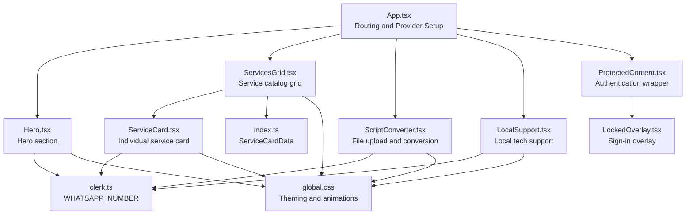
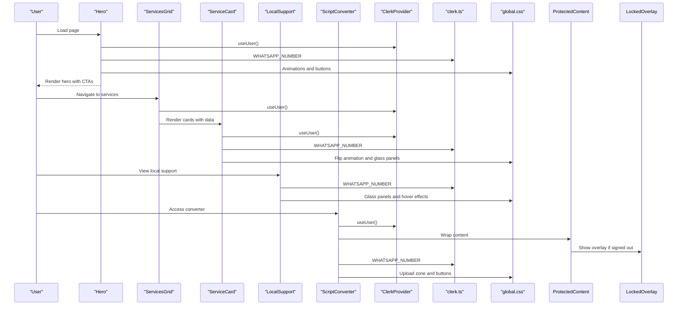
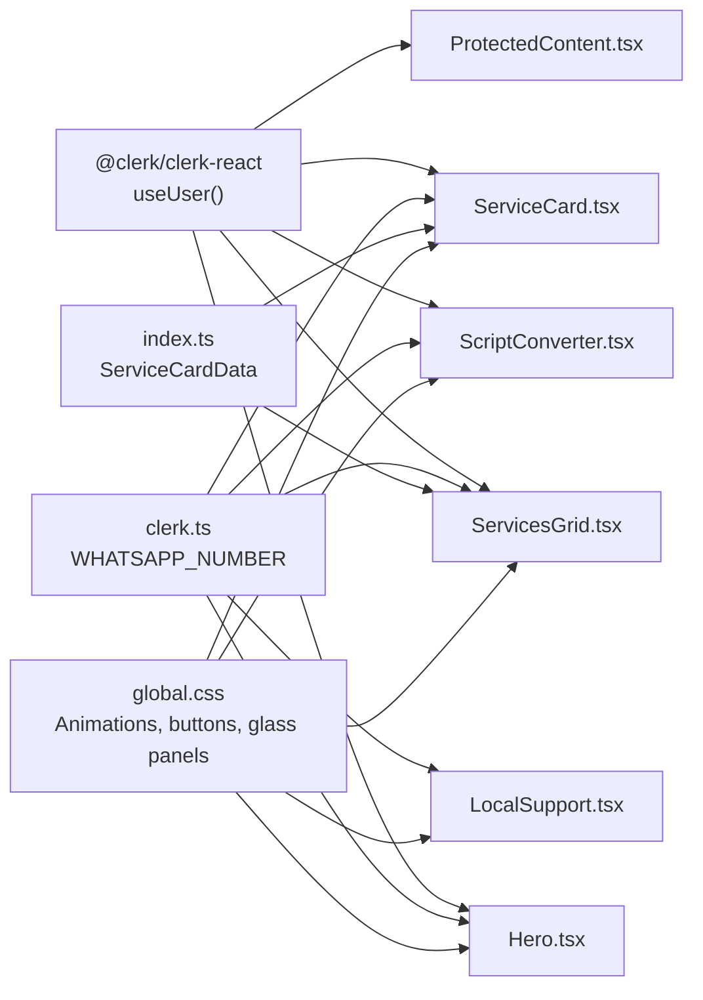

# Home Page Components

<cite>
**Referenced Files in This Document**
- [Hero.tsx](file://src/components/home/Hero.tsx)
- [ServicesGrid.tsx](file://src/components/home/ServicesGrid.tsx)
- [ServiceCard.tsx](file://src/components/home/ServiceCard.tsx)
- [LocalSupport.tsx](file://src/components/home/LocalSupport.tsx)
- [ScriptConverter.tsx](file://src/components/home/ScriptConverter.tsx)
- [ProtectedContent.tsx](file://src/components/auth/ProtectedContent.tsx)
- [LockedOverlay.tsx](file://src/components/auth/LockedOverlay.tsx)
- [clerk.ts](file://src/config/clerk.ts)
- [index.ts](file://src/types/index.ts)
- [global.css](file://src/styles/global.css)
- [App.tsx](file://src/App.tsx)
</cite>

## Table of Contents
1. [Introduction](#introduction)
2. [Project Structure](#project-structure)
3. [Core Components](#core-components)
4. [Architecture Overview](#architecture-overview)
5. [Detailed Component Analysis](#detailed-component-analysis)
6. [Dependency Analysis](#dependency-analysis)
7. [Performance Considerations](#performance-considerations)
8. [Troubleshooting Guide](#troubleshooting-guide)
9. [Conclusion](#conclusion)
10. [Appendices](#appendices)

## Introduction
This document provides comprehensive documentation for DevForge’s home page components: Hero, ServicesGrid, ServiceCard, LocalSupport, and ScriptConverter. It explains each component’s role, implementation patterns, responsive design, accessibility considerations, and integration points. It also covers customization examples for services, adding new service cards, implementing custom converter workflows, and extending support features.

## Project Structure
The home page components are organized under the home directory and integrated into the main application routing. They rely on shared configuration (Clerk), type definitions, and global styles for consistent theming and behavior.

**Diagram sources**
- [App.tsx:14-24](file://src/App.tsx#L14-L24)
- [Hero.tsx:1-110](file://src/components/home/Hero.tsx#L1-L110)
- [ServicesGrid.tsx:1-167](file://src/components/home/ServicesGrid.tsx#L1-L167)
- [ServiceCard.tsx:1-177](file://src/components/home/ServiceCard.tsx#L1-L177)
- [ScriptConverter.tsx:1-188](file://src/components/home/ScriptConverter.tsx#L1-L188)
- [LocalSupport.tsx:1-181](file://src/components/home/LocalSupport.tsx#L1-L181)
- [ProtectedContent.tsx:1-44](file://src/components/auth/ProtectedContent.tsx#L1-L44)
- [LockedOverlay.tsx:1-61](file://src/components/auth/LockedOverlay.tsx#L1-L61)
- [clerk.ts:1-4](file://src/config/clerk.ts#L1-L4)
- [index.ts:29-39](file://src/types/index.ts#L29-L39)
- [global.css:1-383](file://src/styles/global.css#L1-L383)

**Section sources**
- [App.tsx:14-24](file://src/App.tsx#L14-L24)
- [global.css:1-383](file://src/styles/global.css#L1-L383)

## Core Components
This section introduces each component’s purpose and primary responsibilities.

- Hero: Presents dynamic, animated hero content with sign-in-aware CTAs and a WhatsApp quick-order flow.
- ServicesGrid: Renders a responsive grid of service cards with categorized offerings and interactive macOS-style cards.
- ServiceCard: Individual card with flip animation, feature lists, and action routing (WhatsApp, upload, or contact).
- LocalSupport: Displays local tech support offerings, pricing, and on-site service area with click-to-contact integration.
- ScriptConverter: Provides a protected file upload interface with drag-and-drop, validation, and conversion workflow initiation via WhatsApp.

**Section sources**
- [Hero.tsx:5-110](file://src/components/home/Hero.tsx#L5-L110)
- [ServicesGrid.tsx:116-167](file://src/components/home/ServicesGrid.tsx#L116-L167)
- [ServiceCard.tsx:10-177](file://src/components/home/ServiceCard.tsx#L10-L177)
- [LocalSupport.tsx:12-181](file://src/components/home/LocalSupport.tsx#L12-L181)
- [ScriptConverter.tsx:9-188](file://src/components/home/ScriptConverter.tsx#L9-L188)

## Architecture Overview
The home page composes five components in sequence. Authentication state from Clerk determines visibility and interactivity. Shared configuration supplies the WhatsApp number for all external integrations. Global CSS defines theming, animations, and reusable UI patterns.

**Diagram sources**
- [Hero.tsx:1-110](file://src/components/home/Hero.tsx#L1-L110)
- [ServicesGrid.tsx:1-167](file://src/components/home/ServicesGrid.tsx#L1-L167)
- [ServiceCard.tsx:1-177](file://src/components/home/ServiceCard.tsx#L1-L177)
- [LocalSupport.tsx:1-181](file://src/components/home/LocalSupport.tsx#L1-L181)
- [ScriptConverter.tsx:1-188](file://src/components/home/ScriptConverter.tsx#L1-L188)
- [ProtectedContent.tsx:1-44](file://src/components/auth/ProtectedContent.tsx#L1-L44)
- [LockedOverlay.tsx:1-61](file://src/components/auth/LockedOverlay.tsx#L1-L61)
- [clerk.ts:1-4](file://src/config/clerk.ts#L1-L4)
- [global.css:1-383](file://src/styles/global.css#L1-L383)

## Detailed Component Analysis

### Hero Component
The Hero component creates a visually engaging hero section with:
- Animated headline and tagline using CSS animations.
- Conditional CTA buttons based on authentication state.
- WhatsApp quick-order integration using the configured WhatsApp number.

Key behaviors:
- Uses Clerk’s user state to decide whether to show “Browse Solutions” or “Sign In”.
- Opens a pre-filled WhatsApp message when the user clicks “Quick WhatsApp Order”.

Accessibility and responsiveness:
- Uses clamp-based typography for scalable headings.
- Responsive padding and container widths ensure readability across devices.

Customization examples:
- Modify the tagline and pricing copy by editing the static text nodes.
- Adjust animations by updating the CSS classes referenced in the component.

**Section sources**
- [Hero.tsx:5-110](file://src/components/home/Hero.tsx#L5-L110)
- [clerk.ts:1-4](file://src/config/clerk.ts#L1-L4)
- [global.css:324-368](file://src/styles/global.css#L324-L368)

### ServicesGrid Component
ServicesGrid renders a responsive grid of service cards:
- Defines a static list of services with metadata (title, subtitle, price, icon, description, features, CTA text, and action).
- Uses CSS Grid with automatic column sizing for responsive layouts.
- Integrates with Clerk to conditionally render content.

Interactive elements:
- Each card is rendered via ServiceCard with authentication-aware actions.

Customization examples:
- Add a new service by appending an object to the services array with the required fields.
- Change the grid layout by adjusting the grid template columns and gap.

**Section sources**
- [ServicesGrid.tsx:116-167](file://src/components/home/ServicesGrid.tsx#L116-L167)
- [index.ts:29-39](file://src/types/index.ts#L29-L39)

### ServiceCard Component
ServiceCard implements a flip-able macOS-style card with:
- Front face displaying icon, title, description, and price.
- Back face listing features and a call-to-action button.
- Flip animation triggered by clicking the card.
- Action routing based on ctaAction:
  - whatsapp: opens a pre-filled WhatsApp message.
  - upload: scrolls to the converter section.
  - contact: opens a WhatsApp message with a generic inquiry.

Authentication gating:
- Requires sign-in to enable actions; otherwise shows a locked CTA.

Accessibility and responsiveness:
- Uses CSS animations and transitions for smooth interactions.
- Responsive layout adapts to smaller screens.

Customization examples:
- Add new cards by extending the services array in ServicesGrid.
- Modify CTA text and actions by updating the service objects.

**Section sources**
- [ServiceCard.tsx:10-177](file://src/components/home/ServiceCard.tsx#L10-L177)
- [clerk.ts:1-4](file://src/config/clerk.ts#L1-L4)
- [global.css:138-204](file://src/styles/global.css#L138-L204)

### LocalSupport Component
LocalSupport presents local tech support offerings:
- Displays service area and hours in a glass panel.
- Lists services with icons, names, and prices.
- Enables click-to-contact via WhatsApp with a pre-filled message.

Interaction patterns:
- Hover effects on service items change background and border.
- Clicking a service item opens a WhatsApp chat with contextual details.

Customization examples:
- Add new services by extending the localServices array.
- Update pricing or descriptions to reflect current offerings.

**Section sources**
- [LocalSupport.tsx:12-181](file://src/components/home/LocalSupport.tsx#L12-L181)
- [clerk.ts:1-4](file://src/config/clerk.ts#L1-L4)
- [global.css:92-116](file://src/styles/global.css#L92-L116)

### ScriptConverter Component
ScriptConverter provides a protected file upload interface:
- Validates file extensions (.cmd, .ps1, .py) and size (max 10MB).
- Implements drag-and-drop and click-to-browse interactions.
- Displays selected file details and allows clearing.
- Initiates conversion workflow via WhatsApp with a pre-filled message.

Authentication protection:
- Wraps the converter UI in ProtectedContent, which overlays LockedOverlay when the user is not signed in.

Customization examples:
- Extend supported file types by updating ALLOWED_EXTENSIONS.
- Adjust max file size by changing MAX_FILE_SIZE.
- Integrate with a backend workflow by replacing the WhatsApp integration with a form submission.

**Section sources**
- [ScriptConverter.tsx:9-188](file://src/components/home/ScriptConverter.tsx#L9-L188)
- [ProtectedContent.tsx:10-44](file://src/components/auth/ProtectedContent.tsx#L10-L44)
- [LockedOverlay.tsx:3-61](file://src/components/auth/LockedOverlay.tsx#L3-L61)
- [clerk.ts:1-4](file://src/config/clerk.ts#L1-L4)
- [global.css:291-307](file://src/styles/global.css#L291-L307)

## Dependency Analysis
The components share common dependencies and patterns:
- Clerk integration for authentication state and navigation.
- Shared configuration for the WhatsApp number.
- Global CSS for theming, animations, and reusable UI utilities.

**Diagram sources**
- [Hero.tsx:1-110](file://src/components/home/Hero.tsx#L1-L110)
- [ServicesGrid.tsx:1-167](file://src/components/home/ServicesGrid.tsx#L1-L167)
- [ServiceCard.tsx:1-177](file://src/components/home/ServiceCard.tsx#L1-L177)
- [LocalSupport.tsx:1-181](file://src/components/home/LocalSupport.tsx#L1-L181)
- [ScriptConverter.tsx:1-188](file://src/components/home/ScriptConverter.tsx#L1-L188)
- [ProtectedContent.tsx:1-44](file://src/components/auth/ProtectedContent.tsx#L1-L44)
- [clerk.ts:1-4](file://src/config/clerk.ts#L1-L4)
- [index.ts:29-39](file://src/types/index.ts#L29-L39)
- [global.css:1-383](file://src/styles/global.css#L1-L383)

**Section sources**
- [clerk.ts:1-4](file://src/config/clerk.ts#L1-L4)
- [index.ts:29-39](file://src/types/index.ts#L29-L39)
- [global.css:1-383](file://src/styles/global.css#L1-L383)

## Performance Considerations
- Use memoized callbacks for file handling and validation to prevent unnecessary re-renders.
- Defer heavy computations off the main thread when scaling to larger datasets.
- Optimize animations by limiting expensive properties (e.g., avoid animating layout-heavy properties).
- Ensure responsive breakpoints are efficient and avoid excessive repaints on small screens.

[No sources needed since this section provides general guidance]

## Troubleshooting Guide
Common issues and resolutions:
- Authentication overlay appears unexpectedly:
  - Verify Clerk provider configuration and route guards.
  - Ensure ProtectedContent wraps sensitive sections correctly.
- WhatsApp links not opening:
  - Confirm WHATSAPP_NUMBER is set in environment variables.
  - Test the generated URL in a browser to validate formatting.
- File upload errors:
  - Check allowed extensions and size limits.
  - Inspect drag-and-drop events for conflicts with other handlers.
- Cards not flipping:
  - Confirm CSS classes for flip animation are present and not overridden.
  - Ensure the flip state toggle is wired correctly.

**Section sources**
- [ProtectedContent.tsx:10-44](file://src/components/auth/ProtectedContent.tsx#L10-L44)
- [LockedOverlay.tsx:3-61](file://src/components/auth/LockedOverlay.tsx#L3-L61)
- [clerk.ts:1-4](file://src/config/clerk.ts#L1-L4)
- [global.css:138-204](file://src/styles/global.css#L138-L204)

## Conclusion
The home page components deliver a cohesive, visually appealing, and functional experience. They leverage Clerk for authentication, global CSS for consistent theming, and modular components for maintainability. The design supports customization of services, conversion workflows, and support offerings while preserving responsive and accessible behavior.

[No sources needed since this section summarizes without analyzing specific files]

## Appendices

### Component Prop Interfaces and Event Handling Patterns
- ServiceCard props:
  - data: ServiceCardData
  - isAuthenticated: boolean
- Event handling patterns:
  - Click-to-flip for cards.
  - Drag-and-drop and click-to-browse for file uploads.
  - Form submission via WhatsApp links.

**Section sources**
- [ServiceCard.tsx:5-8](file://src/components/home/ServiceCard.tsx#L5-L8)
- [index.ts:29-39](file://src/types/index.ts#L29-L39)
- [ScriptConverter.tsx:39-47](file://src/components/home/ScriptConverter.tsx#L39-L47)

### Accessibility Considerations
- Keyboard navigable cards and buttons.
- Sufficient color contrast for neon accents against dark backgrounds.
- Focus-visible indicators for interactive elements.
- Semantic HTML for headings and lists.

**Section sources**
- [global.css:1-383](file://src/styles/global.css#L1-L383)

### Responsive Design Implementation
- Clamp-based typography for scalable headings.
- CSS Grid with repeat and minmax for adaptive column widths.
- Hover and focus states for interactive elements.
- Media queries for fine-tuning on smaller screens.

**Section sources**
- [Hero.tsx:60-82](file://src/components/home/Hero.tsx#L60-L82)
- [ServicesGrid.tsx:148-155](file://src/components/home/ServicesGrid.tsx#L148-L155)
- [ScriptConverter.tsx:57-153](file://src/components/home/ScriptConverter.tsx#L57-L153)
- [LocalSupport.tsx:49-55](file://src/components/home/LocalSupport.tsx#L49-L55)
- [global.css:377-383](file://src/styles/global.css#L377-L383)

### Customization Examples
- Customizing service offerings:
  - Edit the services array in ServicesGrid to add, remove, or modify service entries.
- Adding new service cards:
  - Extend the services array with a new ServiceCardData object containing id, title, subtitle, price, icon, description, features, ctaText, and ctaAction.
- Implementing custom converter workflows:
  - Replace the WhatsApp integration in ScriptConverter with a form submission to a backend endpoint.
  - Update validation rules and file handling logic accordingly.
- Extending support features:
  - Add new local services to the localServices array in LocalSupport.
  - Update the contact handler to include additional metadata in the WhatsApp message.

**Section sources**
- [ServicesGrid.tsx:5-114](file://src/components/home/ServicesGrid.tsx#L5-L114)
- [ServiceCard.tsx:13-28](file://src/components/home/ServiceCard.tsx#L13-L28)
- [ScriptConverter.tsx:49-55](file://src/components/home/ScriptConverter.tsx#L49-L55)
- [LocalSupport.tsx:13-18](file://src/components/home/LocalSupport.tsx#L13-L18)