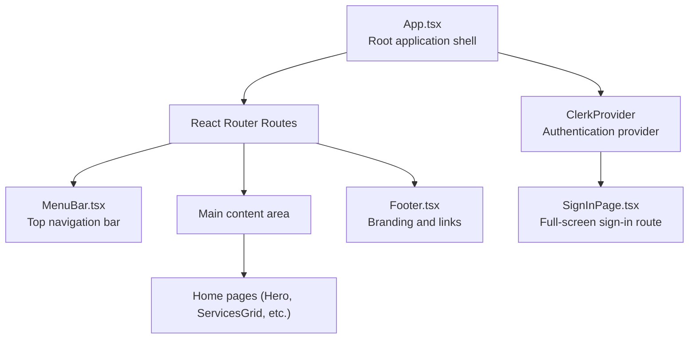
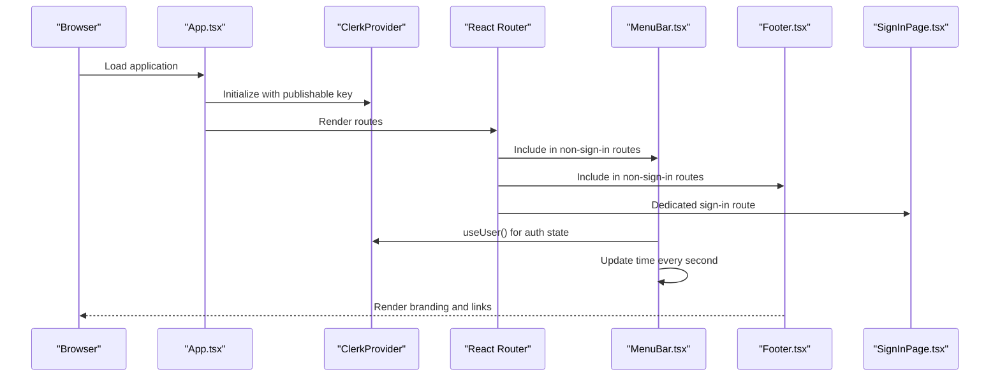
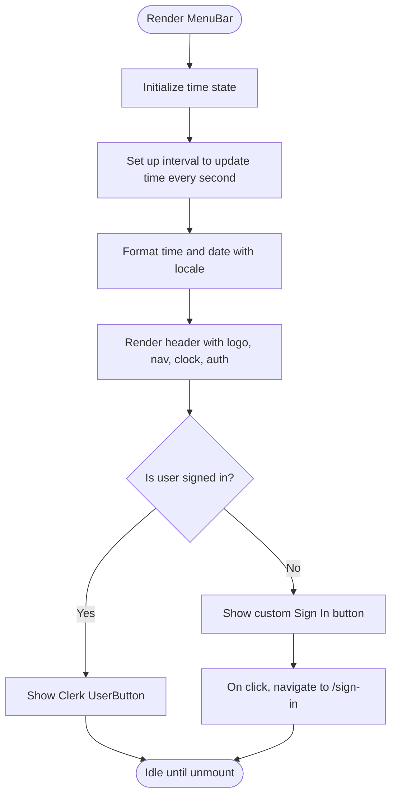
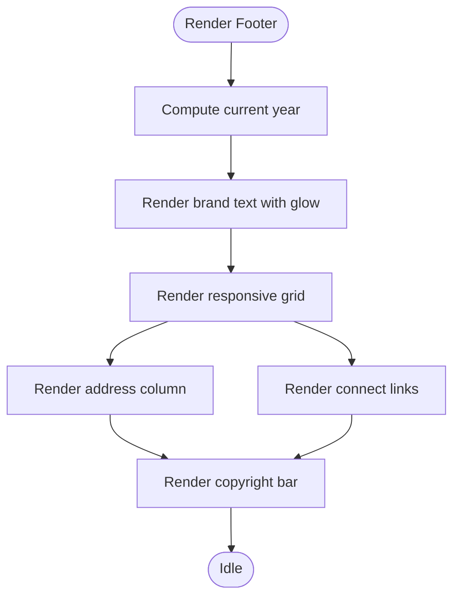
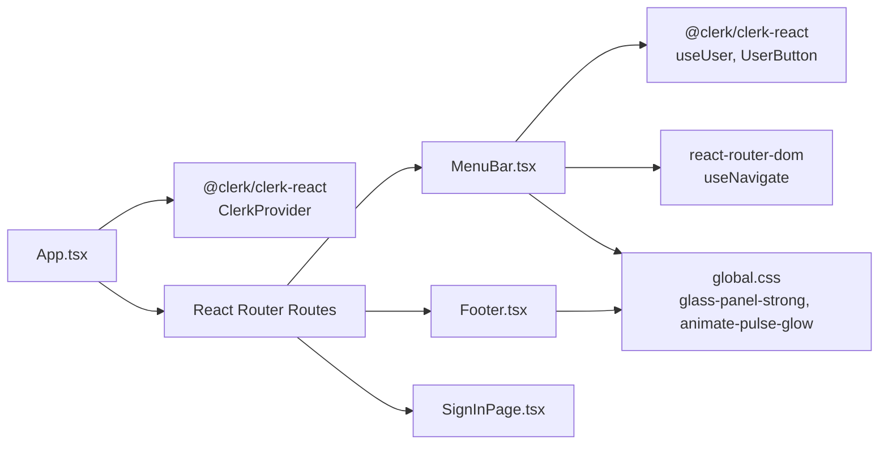

# Layout Components

<cite>
**Referenced Files in This Document**
- [MenuBar.tsx](file://src/components/layout/MenuBar.tsx)
- [Footer.tsx](file://src/components/layout/Footer.tsx)
- [App.tsx](file://src/App.tsx)
- [clerk.ts](file://src/config/clerk.ts)
- [global.css](file://src/styles/global.css)
- [SignInPage.tsx](file://src/components/auth/SignInPage.tsx)
</cite>

## Table of Contents
1. [Introduction](#introduction)
2. [Project Structure](#project-structure)
3. [Core Components](#core-components)
4. [Architecture Overview](#architecture-overview)
5. [Detailed Component Analysis](#detailed-component-analysis)
6. [Dependency Analysis](#dependency-analysis)
7. [Performance Considerations](#performance-considerations)
8. [Troubleshooting Guide](#troubleshooting-guide)
9. [Conclusion](#conclusion)

## Introduction
This document provides comprehensive technical and practical guidance for DevForge’s layout components, focusing on MenuBar and Footer. It explains the real-time clock functionality, responsive navigation structure, authentication integration with Clerk, and glass morphism design styling. It also documents state management, CSS-in-JS styling approach, responsive design patterns, and integration with the overall application layout. Implementation examples show how to customize styling, add new navigation items, integrate additional authentication features, and modify glass panel effects.

## Project Structure
The layout components are part of the shared UI layer and are integrated into the main application shell. The MenuBar appears at the top of the page, while the Footer appears at the bottom. Both components rely on global design tokens and glass morphism utilities defined in the global stylesheet.

**Diagram sources**
- [App.tsx:26-58](file://src/App.tsx#L26-L58)
- [MenuBar.tsx:27-131](file://src/components/layout/MenuBar.tsx#L27-L131)
- [Footer.tsx:4-172](file://src/components/layout/Footer.tsx#L4-L172)
- [SignInPage.tsx:4-251](file://src/components/auth/SignInPage.tsx#L4-L251)

**Section sources**
- [App.tsx:14-58](file://src/App.tsx#L14-L58)
- [global.css:3-22](file://src/styles/global.css#L3-L22)

## Core Components
- MenuBar: Fixed-position header with logo, navigation links, real-time clock, and authentication controls. Uses Clerk’s UserButton for signed-in users and a custom “Sign In” button for guests. Implements a real-time clock with locale-aware formatting and glass morphism styling.
- Footer: Full-width branding and link section with responsive grid layout, address information, and connect links. Also includes a copyright bar with dynamic year and subtle branding text.

Key integration points:
- Authentication: Clerk’s publishable key is configured in the root App wrapper and used by MenuBar and SignInPage.
- Routing: MenuBar is included in routes except the dedicated sign-in page.
- Design system: Global CSS defines glass morphism utilities, neon glow effects, and typography tokens used by both components.

**Section sources**
- [MenuBar.tsx:5-133](file://src/components/layout/MenuBar.tsx#L5-L133)
- [Footer.tsx:1-174](file://src/components/layout/Footer.tsx#L1-L174)
- [App.tsx:1-67](file://src/App.tsx#L1-L67)
- [clerk.ts:1-4](file://src/config/clerk.ts#L1-L4)
- [global.css:92-126](file://src/styles/global.css#L92-L126)

## Architecture Overview
The layout components participate in a fixed-top/fixed-bottom layout pattern. The main content area is offset vertically by the MenuBar height to prevent overlap. Clerk’s provider wraps the routing so that authentication state is available to MenuBar and other components.

**Diagram sources**
- [App.tsx:26-58](file://src/App.tsx#L26-L58)
- [MenuBar.tsx:6-13](file://src/components/layout/MenuBar.tsx#L6-L13)
- [Footer.tsx:1-174](file://src/components/layout/Footer.tsx#L1-L174)
- [SignInPage.tsx:4-251](file://src/components/auth/SignInPage.tsx#L4-L251)

## Detailed Component Analysis

### MenuBar Component
MenuBar implements:
- Real-time clock: A React effect updates the time every second and formats it with locale-aware time and date strings.
- Navigation: Three static links styled with mono fonts and secondary colors.
- Authentication integration: Uses Clerk’s useUser hook to detect signed-in state. Displays UserButton for signed-in users and a custom “Sign In” button for guests. The guest button navigates to the sign-in route.
- Glass morphism styling: Applies a strong glass panel class and inline styles for positioning, spacing, and borders.
- Responsive design: Uses CSS-in-JS for layout alignment and spacing; relies on global design tokens for typography and colors.

State management:
- Local state for time with useEffect interval setup and cleanup.

Styling approach:
- CSS-in-JS via inline styles for positioning and layout.
- Global CSS classes for glass panel and neon glow effects.

Props and events:
- No props accepted.
- Event handlers: onClick on the “Sign In” button triggers navigation.

Integration:
- Included in the main route wrapper alongside the main content and Footer.
- Uses global CSS variables for menu bar height and colors.

Implementation examples:
- Customize styling: Adjust inline styles for padding, spacing, and borders; change font family and weights via global variables.
- Add new navigation items: Extend the nav section with additional anchor elements styled consistently.
- Integrate additional authentication features: Use Clerk’s UserButton appearance customization or add additional buttons (e.g., account menu) inside the auth area.
- Modify glass panel effects: Replace the strong glass class with the lighter variant or adjust blur and border values in global CSS.

**Diagram sources**
- [MenuBar.tsx:6-13](file://src/components/layout/MenuBar.tsx#L6-L13)
- [MenuBar.tsx:15-25](file://src/components/layout/MenuBar.tsx#L15-L25)
- [MenuBar.tsx:102-128](file://src/components/layout/MenuBar.tsx#L102-L128)

**Section sources**
- [MenuBar.tsx:5-133](file://src/components/layout/MenuBar.tsx#L5-L133)
- [App.tsx:40-54](file://src/App.tsx#L40-L54)
- [global.css:92-126](file://src/styles/global.css#L92-L126)

### Footer Component
Footer implements:
- Branding: Dual-color brand text with mono font and glow effects.
- Responsive grid: Uses CSS Grid with auto-fit columns to adapt to screen size.
- Address and contact: Local office address and connect links with icons.
- Copyright bar: Dynamic year and subtle branding text aligned with responsive wrapping.

Styling approach:
- Pure CSS-in-JS for layout and typography.
- Global CSS classes for glass panel and text glow effects.

Props and events:
- No props accepted.
- No event handlers.

Integration:
- Included in the main route wrapper below the main content.
- Uses global design tokens for colors and typography.

Implementation examples:
- Customize styling: Adjust grid template columns, gap, and typography sizes via inline styles.
- Add new sections: Insert additional columns in the grid container with new headings and content.
- Modify links: Update anchor targets and icons while preserving global hover transitions.
- Adjust glass panel: Apply the lighter glass class or tweak blur and border in global CSS.

**Diagram sources**
- [Footer.tsx:1-174](file://src/components/layout/Footer.tsx#L1-L174)

**Section sources**
- [Footer.tsx:1-174](file://src/components/layout/Footer.tsx#L1-L174)
- [global.css:92-126](file://src/styles/global.css#L92-L126)

## Dependency Analysis
MenuBar depends on:
- Clerk’s UserButton and useUser for authentication state.
- react-router-dom for navigation.
- Global CSS for glass panel and neon glow classes.

Footer depends on:
- Global CSS for glass panel and text glow classes.

App integrates:
- ClerkProvider with publishable key and router adapters.
- Routes that include MenuBar and Footer except the sign-in route.

**Diagram sources**
- [MenuBar.tsx:1-3](file://src/components/layout/MenuBar.tsx#L1-L3)
- [Footer.tsx:1-13](file://src/components/layout/Footer.tsx#L1-L13)
- [App.tsx:1-6](file://src/App.tsx#L1-L6)
- [global.css:92-126](file://src/styles/global.css#L92-L126)

**Section sources**
- [MenuBar.tsx:1-3](file://src/components/layout/MenuBar.tsx#L1-L3)
- [Footer.tsx:1-13](file://src/components/layout/Footer.tsx#L1-L13)
- [App.tsx:1-6](file://src/App.tsx#L1-L6)

## Performance Considerations
- Time updates: MenuBar updates every second; this is lightweight but ensure cleanup occurs on unmount (already handled).
- Glass morphism: Backdrop filters can be expensive on low-end devices; consider reducing blur intensity or disabling on mobile if needed.
- Inline styles: Excessive inline styles can impact re-render performance; keep styles minimal and centralized where possible.
- Clerk rendering: UserButton is a third-party widget; monitor its load and hydration behavior in production.

## Troubleshooting Guide
Common issues and resolutions:
- Authentication state not reflected: Verify ClerkProvider is initialized with the correct publishable key and router adapters are set.
- Time does not update: Confirm the interval is cleared on unmount and the effect runs only once.
- Glass panel not visible: Ensure the glass CSS classes are present and global CSS is loaded.
- Navigation links not styled: Check global font variables and color tokens are defined.

**Section sources**
- [MenuBar.tsx:10-13](file://src/components/layout/MenuBar.tsx#L10-L13)
- [App.tsx:30-34](file://src/App.tsx#L30-L34)
- [global.css:92-126](file://src/styles/global.css#L92-L126)

## Conclusion
MenuBar and Footer form the backbone of DevForge’s layout, combining Clerk authentication, real-time updates, and a cohesive glass morphism design system. Their modular structure and reliance on global design tokens enable easy customization and consistent theming. By following the implementation examples and troubleshooting tips, teams can extend navigation, refine authentication flows, and tailor the glass panel aesthetics to evolving product needs.