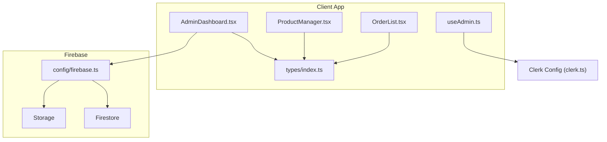
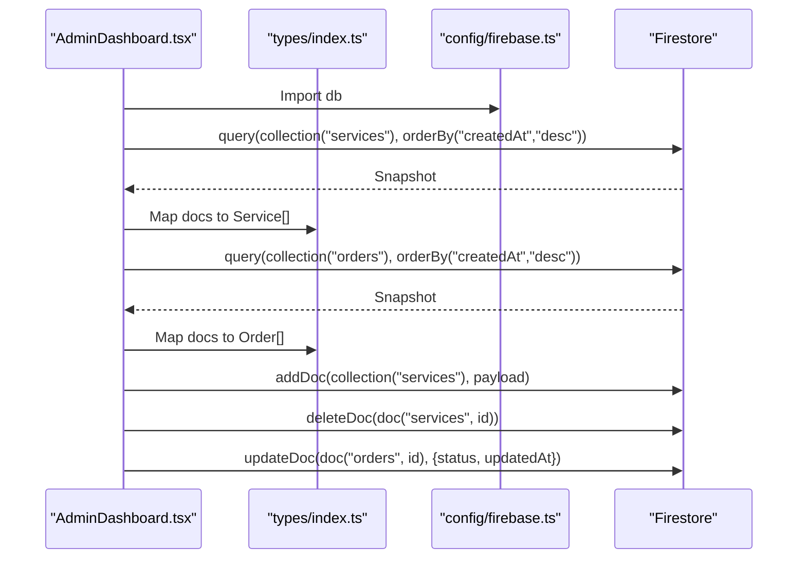
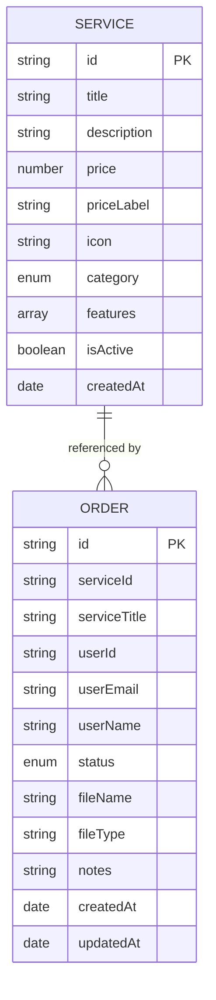
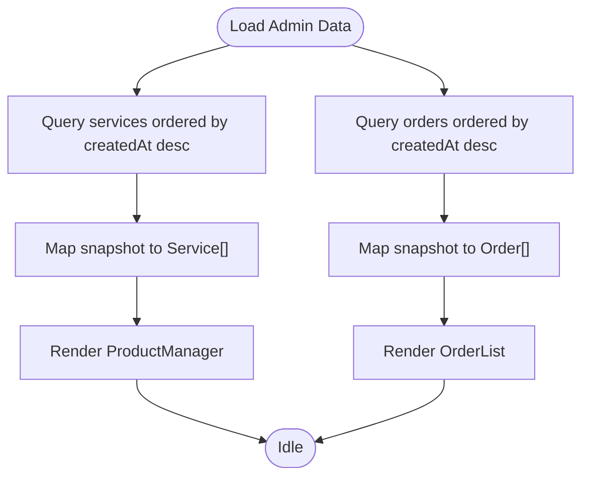
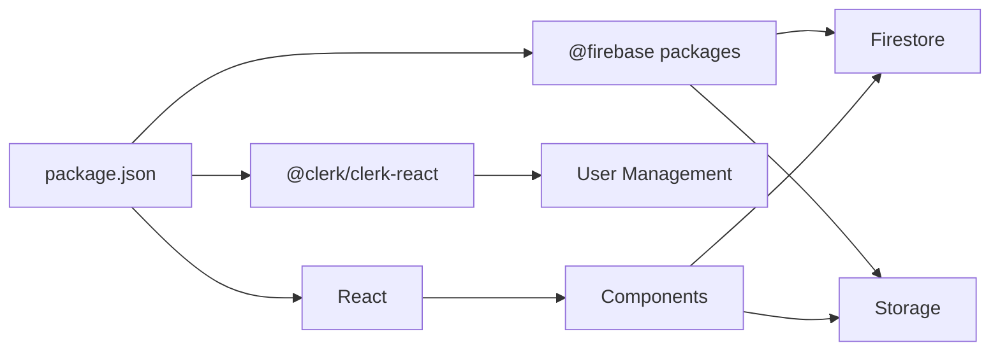

# Data Management with Firebase

<cite>
**Referenced Files in This Document**
- [firebase.ts](file://src/config/firebase.ts)
- [index.ts](file://src/types/index.ts)
- [AdminDashboard.tsx](file://src/components/admin/AdminDashboard.tsx)
- [ProductManager.tsx](file://src/components/admin/ProductManager.tsx)
- [OrderList.tsx](file://src/components/admin/OrderList.tsx)
- [useAdmin.ts](file://src/hooks/useAdmin.ts)
- [clerk.ts](file://src/config/clerk.ts)
- [ScriptConverter.tsx](file://src/components/home/ScriptConverter.tsx)
- [package.json](file://package.json)
</cite>

## Table of Contents
1. [Introduction](#introduction)
2. [Project Structure](#project-structure)
3. [Core Components](#core-components)
4. [Architecture Overview](#architecture-overview)
5. [Detailed Component Analysis](#detailed-component-analysis)
6. [Dependency Analysis](#dependency-analysis)
7. [Performance Considerations](#performance-considerations)
8. [Troubleshooting Guide](#troubleshooting-guide)
9. [Conclusion](#conclusion)
10. [Appendices](#appendices)

## Introduction
This document explains DevForge’s Firebase-based data management solution. It covers Firestore database configuration, collection structures, CRUD operations, and current data access patterns. It also documents TypeScript interfaces for services, orders, and user-related data models, and outlines practical guidance for real-time synchronization, caching, security rules, validation, error handling, file uploads, and operational best practices for production.

## Project Structure
DevForge integrates Firebase services through a small, focused configuration module and uses strongly typed models defined in a shared types file. Administrative views demonstrate Firestore usage for services and orders, while Clerk handles authentication and admin checks. The project currently uses Firestore and Storage SDKs but does not implement real-time listeners or caching in the analyzed components.

**Diagram sources**
- [AdminDashboard.tsx:1-185](file://src/components/admin/AdminDashboard.tsx#L1-L185)
- [ProductManager.tsx:1-221](file://src/components/admin/ProductManager.tsx#L1-L221)
- [OrderList.tsx:1-91](file://src/components/admin/OrderList.tsx#L1-L91)
- [useAdmin.ts:1-14](file://src/hooks/useAdmin.ts#L1-L14)
- [index.ts:1-40](file://src/types/index.ts#L1-L40)
- [firebase.ts:1-19](file://src/config/firebase.ts#L1-L19)
- [clerk.ts:1-4](file://src/config/clerk.ts#L1-L4)

**Section sources**
- [firebase.ts:1-19](file://src/config/firebase.ts#L1-L19)
- [index.ts:1-40](file://src/types/index.ts#L1-L40)
- [AdminDashboard.tsx:1-185](file://src/components/admin/AdminDashboard.tsx#L1-L185)
- [ProductManager.tsx:1-221](file://src/components/admin/ProductManager.tsx#L1-L221)
- [OrderList.tsx:1-91](file://src/components/admin/OrderList.tsx#L1-L91)
- [useAdmin.ts:1-14](file://src/hooks/useAdmin.ts#L1-L14)
- [clerk.ts:1-4](file://src/config/clerk.ts#L1-L4)

## Core Components
- Firebase initialization and exports:
  - Firestore client and Storage client are exported from a single configuration module.
  - Environment variables are loaded from Vite’s import meta env.
- TypeScript models:
  - Service: product catalog item with metadata, pricing, category, and timestamps.
  - Order: customer order with status, associated service and user identifiers, optional file metadata, and timestamps.
  - ServiceCardData: UI-focused model for rendering product cards.
- Admin UI:
  - AdminDashboard loads services and orders via Firestore queries, supports adding/deleting services, and updating order statuses.
  - ProductManager renders a form and list for services.
  - OrderList displays orders and allows status updates.

**Section sources**
- [firebase.ts:1-19](file://src/config/firebase.ts#L1-L19)
- [index.ts:1-40](file://src/types/index.ts#L1-L40)
- [AdminDashboard.tsx:1-185](file://src/components/admin/AdminDashboard.tsx#L1-L185)
- [ProductManager.tsx:1-221](file://src/components/admin/ProductManager.tsx#L1-L221)
- [OrderList.tsx:1-91](file://src/components/admin/OrderList.tsx#L1-L91)

## Architecture Overview
The application follows a clean separation of concerns:
- Configuration: Firebase initialization and exports.
- Domain models: Strongly typed interfaces for services and orders.
- UI: AdminDashboard orchestrates data loading and mutation, delegating rendering to ProductManager and OrderList.
- Authentication: Clerk integration for admin checks.

**Diagram sources**
- [AdminDashboard.tsx:25-72](file://src/components/admin/AdminDashboard.tsx#L25-L72)
- [index.ts:1-40](file://src/types/index.ts#L1-L40)
- [firebase.ts:1-19](file://src/config/firebase.ts#L1-L19)

## Detailed Component Analysis

### Firestore Collections and Models
- Collections:
  - services: Stores product offerings.
  - orders: Stores customer orders linked to services and users.
- Models:
  - Service: Fields include identifiers, metadata, pricing, category, features, activity flag, and creation timestamp.
  - Order: Fields include identifiers, status, optional file metadata, and timestamps.
  - ServiceCardData: UI model for rendering product cards.

**Diagram sources**
- [index.ts:1-40](file://src/types/index.ts#L1-L40)

**Section sources**
- [index.ts:1-40](file://src/types/index.ts#L1-L40)

### Admin Dashboard Data Access Patterns
- Load services and orders:
  - Uses Firestore queries with ordering by creation timestamp.
  - Maps snapshots to typed arrays.
- Mutations:
  - Add service with createdAt timestamp.
  - Delete service by document reference.
  - Update order status and updatedAt timestamp.
- UI orchestration:
  - Tabs switch between products and orders.
  - Loading states and error logging during fetch.

**Diagram sources**
- [AdminDashboard.tsx:25-52](file://src/components/admin/AdminDashboard.tsx#L25-L52)

**Section sources**
- [AdminDashboard.tsx:25-72](file://src/components/admin/AdminDashboard.tsx#L25-L72)

### Real-Time Synchronization and Caching
- Current state:
  - No real-time listeners are implemented in the analyzed components.
  - No client-side caching is present.
- Recommended patterns (conceptual):
  - Use Firestore listeners for live updates to services and orders.
  - Implement a lightweight cache layer to reduce redundant reads and improve responsiveness.
  - Debounce frequent writes and batch updates where appropriate.

[No sources needed since this section provides conceptual guidance]

### Security Rules and Validation
- Current state:
  - No Firebase Security Rules files are included in the analyzed repository.
- Recommended patterns (conceptual):
  - Enforce field validation on write (e.g., required fields, numeric bounds).
  - Restrict access to admin-only mutations (add/delete/update).
  - Use composite indexes for common queries (e.g., status + createdAt).
  - Apply IAM and bucket-level restrictions for Storage.

[No sources needed since this section provides conceptual guidance]

### Error Handling Strategies
- Current state:
  - AdminDashboard logs errors during data load and sets loading flags.
- Recommendations (conceptual):
  - Centralize error reporting with Sentry or similar.
  - Implement retry/backoff for transient failures.
  - Surface user-friendly messages and provide retry actions.

**Section sources**
- [AdminDashboard.tsx:44-48](file://src/components/admin/AdminDashboard.tsx#L44-L48)

### Firebase Storage Integration for Files
- Current state:
  - Storage client is initialized and exported.
  - No upload/download logic is implemented in the analyzed components.
- Recommended patterns (conceptual):
  - Use Storage upload tasks with progress callbacks.
  - Store download URLs in Firestore for orders.
  - Enforce file type and size limits server-side and client-side.
  - Implement signed URLs for secure downloads.

**Section sources**
- [firebase.ts:1-19](file://src/config/firebase.ts#L1-L19)

### Implementation Examples (Conceptual)
- CRUD operations:
  - Add service: Use addDoc with createdAt timestamp.
  - Delete service: Use deleteDoc by document reference.
  - Update order: Use updateDoc with status and updatedAt.
- Real-time listeners:
  - Use onSnapshot for services and orders collections.
  - Unsubscribe listeners on component unmount.
- Batch processing:
  - Use writeBatch for atomic updates across documents.

[No sources needed since this section provides conceptual guidance]

### Data Migration, Backup, and Disaster Recovery
- Current state:
  - No migration scripts or backup procedures are present in the analyzed components.
- Recommendations (conceptual):
  - Use Firestore Data Transfer for migrations.
  - Enable automated backups via Cloud Console or CLI.
  - Test restore procedures regularly and maintain offsite backups.

[No sources needed since this section provides conceptual guidance]

## Dependency Analysis
- Firebase SDKs:
  - Firestore and Storage are installed and configured.
- Authentication:
  - Clerk is used for user management and admin checks.
- UI and typing:
  - React components consume typed models and Firebase clients.

**Diagram sources**
- [package.json:12-18](file://package.json#L12-L18)

**Section sources**
- [package.json:12-18](file://package.json#L12-L18)

## Performance Considerations
- Query optimization:
  - Ensure indexes exist for orderBy and where clauses.
  - Paginate large lists and limit initial fetch sizes.
- Caching:
  - Implement local caching for frequently accessed data.
  - Invalidate cache on mutation events.
- Network efficiency:
  - Batch writes and avoid excessive polling.
  - Use shallow queries where possible.

[No sources needed since this section provides general guidance]

## Troubleshooting Guide
- Common issues:
  - Missing environment variables cause initialization failures.
  - Unauthorized access to Firestore or Storage.
  - Large document reads causing slow UI.
- Actions:
  - Verify Vite environment variables are set.
  - Confirm Firestore Security Rules and Storage Bucket policies.
  - Monitor query costs and adjust pagination.

**Section sources**
- [firebase.ts:5-12](file://src/config/firebase.ts#L5-L12)

## Conclusion
DevForge’s Firebase integration currently focuses on Firestore-backed admin operations and a typed domain model. To reach production readiness, implement real-time listeners, introduce client-side caching, enforce robust security rules, and add Storage-based file handling with validation and signed URLs. Establish migration and backup procedures, and continuously monitor performance and error rates.

[No sources needed since this section summarizes without analyzing specific files]

## Appendices

### Appendix A: TypeScript Interfaces Reference
- Service: [index.ts:1-12](file://src/types/index.ts#L1-L12)
- Order: [index.ts:14-27](file://src/types/index.ts#L14-L27)
- ServiceCardData: [index.ts:29-40](file://src/types/index.ts#L29-L40)

### Appendix B: Firestore Usage Reference
- AdminDashboard data operations: [AdminDashboard.tsx:25-72](file://src/components/admin/AdminDashboard.tsx#L25-L72)
- ProductManager rendering and mutation delegation: [ProductManager.tsx:22-52](file://src/components/admin/ProductManager.tsx#L22-L52)
- OrderList rendering and status updates: [OrderList.tsx:15-89](file://src/components/admin/OrderList.tsx#L15-L89)

### Appendix C: Authentication and Admin Checks
- useAdmin hook: [useAdmin.ts:4-13](file://src/hooks/useAdmin.ts#L4-L13)
- Clerk configuration: [clerk.ts:1-4](file://src/config/clerk.ts#L1-L4)