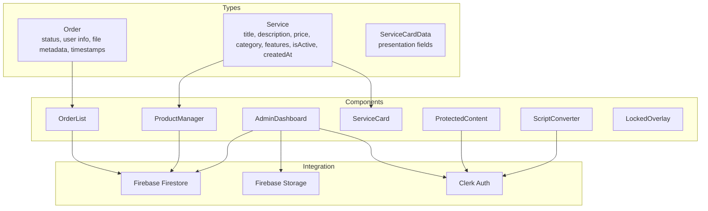
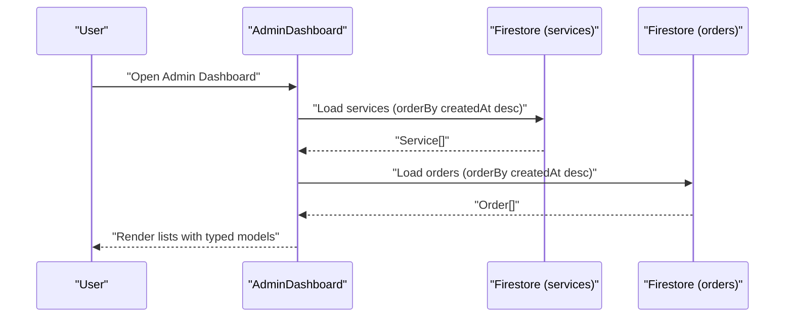
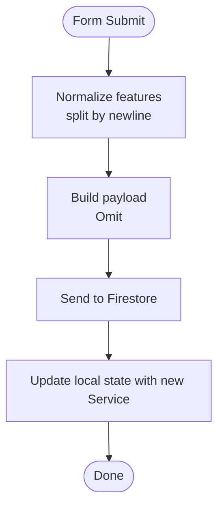
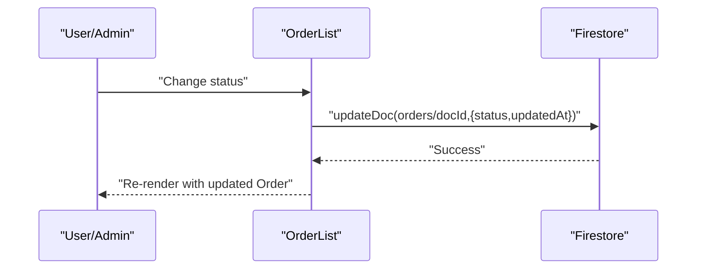
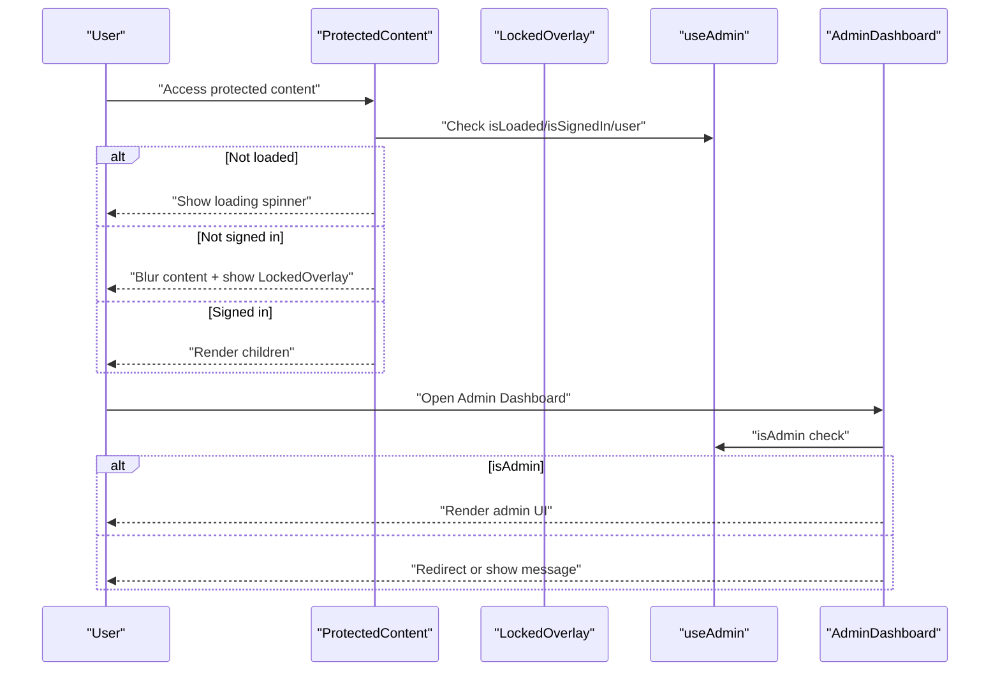
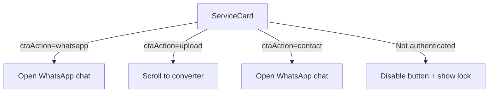
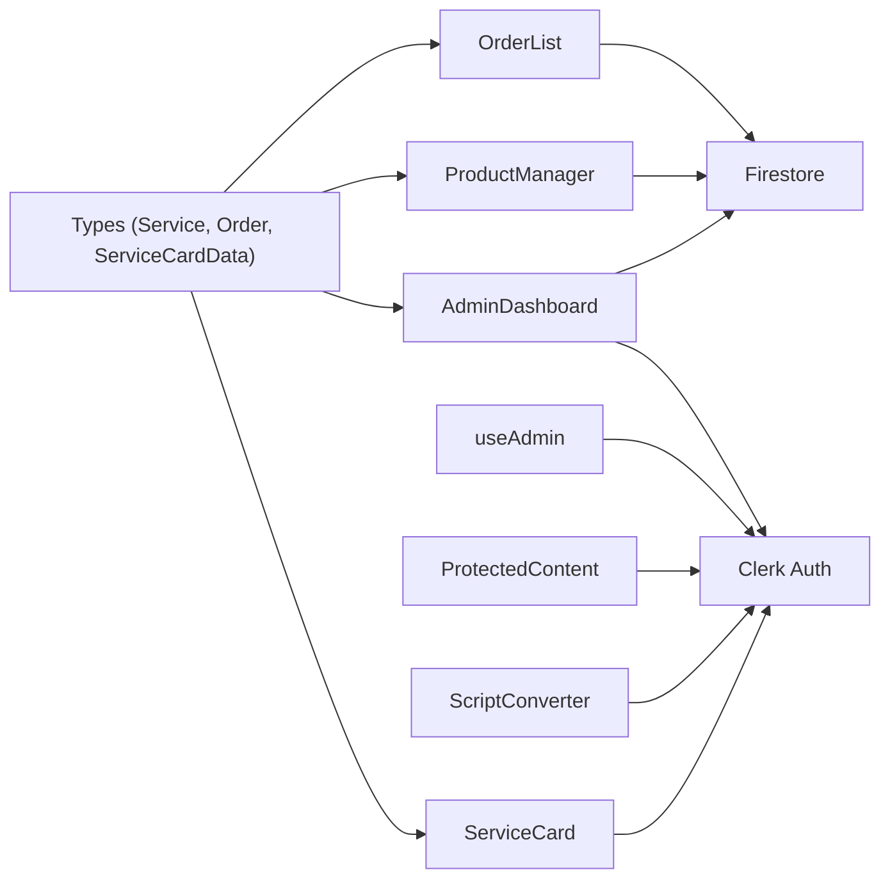

# Data Models and TypeScript Interfaces

<cite>
**Referenced Files in This Document**
- [index.ts](file://src/types/index.ts)
- [firebase.ts](file://src/config/firebase.ts)
- [clerk.ts](file://src/config/clerk.ts)
- [AdminDashboard.tsx](file://src/components/admin/AdminDashboard.tsx)
- [ProductManager.tsx](file://src/components/admin/ProductManager.tsx)
- [OrderList.tsx](file://src/components/admin/OrderList.tsx)
- [ServiceCard.tsx](file://src/components/home/ServiceCard.tsx)
- [ScriptConverter.tsx](file://src/components/home/ScriptConverter.tsx)
- [ProtectedContent.tsx](file://src/components/auth/ProtectedContent.tsx)
- [LockedOverlay.tsx](file://src/components/auth/LockedOverlay.tsx)
- [useAdmin.ts](file://src/hooks/useAdmin.ts)
- [App.tsx](file://src/App.tsx)
</cite>

## Table of Contents
1. [Introduction](#introduction)
2. [Project Structure](#project-structure)
3. [Core Components](#core-components)
4. [Architecture Overview](#architecture-overview)
5. [Detailed Component Analysis](#detailed-component-analysis)
6. [Dependency Analysis](#dependency-analysis)
7. [Performance Considerations](#performance-considerations)
8. [Troubleshooting Guide](#troubleshooting-guide)
9. [Conclusion](#conclusion)

## Introduction
This document describes DevForge’s data models and TypeScript interfaces, focusing on the Service and Order domain objects, related UI components, and integration with Firebase and Clerk for authentication and role-based access control. It explains field definitions, data types, validation rules, optional property handling, type safety patterns, and Firestore serialization/deserialization approaches used in the application.

## Project Structure
The data model definitions live under the shared types module and are consumed by admin and home components, with Firestore and Clerk providing persistence and authentication respectively.

**Diagram sources**
- [index.ts:1-39](file://src/types/index.ts#L1-L39)
- [AdminDashboard.tsx:1-83](file://src/components/admin/AdminDashboard.tsx#L1-L83)
- [ProductManager.tsx:1-221](file://src/components/admin/ProductManager.tsx#L1-L221)
- [OrderList.tsx:1-91](file://src/components/admin/OrderList.tsx#L1-L91)
- [ServiceCard.tsx:1-177](file://src/components/home/ServiceCard.tsx#L1-L177)
- [ScriptConverter.tsx:1-188](file://src/components/home/ScriptConverter.tsx#L1-L188)
- [ProtectedContent.tsx:1-44](file://src/components/auth/ProtectedContent.tsx#L1-L44)
- [firebase.ts:1-19](file://src/config/firebase.ts#L1-L19)
- [clerk.ts:1-4](file://src/config/clerk.ts#L1-L4)

**Section sources**
- [index.ts:1-39](file://src/types/index.ts#L1-L39)
- [firebase.ts:1-19](file://src/config/firebase.ts#L1-L19)
- [clerk.ts:1-4](file://src/config/clerk.ts#L1-L4)

## Core Components
This section documents the primary data models and their usage across components.

- Service
  - Purpose: Represents a service offering with pricing, categorization, and presentation metadata.
  - Fields:
    - id: string
    - title: string
    - description: string
    - price: number
    - priceLabel: string
    - icon: string
    - category: 'digital' | 'local' | 'custom'
    - features: string[]
    - isActive: boolean
    - createdAt: Date
  - Validation and constraints:
    - Numeric price must be non-negative.
    - Category is an enumerated union; invalid values are rejected by type checker.
    - features is a non-empty array of strings in practice (validated by form).
    - Optional fields: None; however, isActive defaults to true in forms.
  - Type safety patterns:
    - Uses literal union types for category and enums for status elsewhere.
    - Omit pattern used in admin form handlers to exclude id and createdAt during creation.
  - Serialization/deserialization:
    - Firestore writes include createdAt as a Date.
    - Firestore reads map raw document data into typed Service objects.

- Order
  - Purpose: Tracks customer orders with status, user identity, and optional file metadata.
  - Fields:
    - id: string
    - serviceId: string
    - serviceTitle: string
    - userId: string
    - userEmail: string
    - userName: string
    - status: 'pending' | 'processing' | 'completed' | 'cancelled'
    - fileName?: string
    - fileType?: string
    - notes?: string
    - createdAt: Date
    - updatedAt: Date
  - Validation and constraints:
    - Status is constrained to a closed set of literals.
    - Optional fields allow partial order records until file upload completes.
    - Timestamps are managed by server-side write or client-side updates.
  - Type safety patterns:
    - Order['status'] leveraged in select controls to maintain type-safe updates.
  - Serialization/deserialization:
    - Firestore writes include createdAt and updatedAt as Dates.
    - Firestore reads map raw document data into typed Order objects.

- ServiceCardData
  - Purpose: Presentation-focused model for rendering service cards.
  - Fields:
    - id: string
    - title: string
    - subtitle: string
    - price: string
    - icon: string
    - description: string
    - features: string[]
    - ctaText: string
    - ctaAction: 'whatsapp' | 'upload' | 'contact'
  - Notes:
    - Intended for UI rendering; not persisted to Firestore.
    - ctaAction drives navigation or external messaging.

Usage examples and patterns:
- AdminDashboard loads services and orders from Firestore and renders them using typed props.
- ProductManager handles form submission with Omit<Service,'id'|'createdAt'> to enforce creation-time constraints.
- OrderList displays status badges and allows updating status via type-safe select bindings.
- ServiceCard consumes ServiceCardData to render interactive cards and route actions based on ctaAction.

**Section sources**
- [index.ts:1-39](file://src/types/index.ts#L1-L39)
- [AdminDashboard.tsx:18-83](file://src/components/admin/AdminDashboard.tsx#L18-L83)
- [ProductManager.tsx:4-8](file://src/components/admin/ProductManager.tsx#L4-L8)
- [OrderList.tsx:3-6](file://src/components/admin/OrderList.tsx#L3-L6)
- [ServiceCard.tsx:5-8](file://src/components/home/ServiceCard.tsx#L5-L8)

## Architecture Overview
The system integrates Clerk for authentication and role-based access control, and Firestore for persistence. Components consume strongly-typed models to ensure correctness across the UI and data layer.

**Diagram sources**
- [AdminDashboard.tsx:25-52](file://src/components/admin/AdminDashboard.tsx#L25-L52)
- [firebase.ts:16-17](file://src/config/firebase.ts#L16-L17)

**Section sources**
- [App.tsx:1-66](file://src/App.tsx#L1-L66)
- [AdminDashboard.tsx:18-83](file://src/components/admin/AdminDashboard.tsx#L18-L83)
- [firebase.ts:1-19](file://src/config/firebase.ts#L1-L19)

## Detailed Component Analysis

### Service Model and Product Management
- Data model: Service
- Key behaviors:
  - Creation form excludes id and createdAt to prevent accidental misuse.
  - Features are normalized from newline-separated input to an array.
  - Category is validated against a union of allowed values.
- Type safety:
  - Omit<Service,'id'|'createdAt'> ensures only creatable fields are passed to add handlers.
  - Select controls bind to Service['category'] to maintain type safety.

**Diagram sources**
- [ProductManager.tsx:35-52](file://src/components/admin/ProductManager.tsx#L35-L52)
- [AdminDashboard.tsx:54-60](file://src/components/admin/AdminDashboard.tsx#L54-L60)

**Section sources**
- [ProductManager.tsx:22-52](file://src/components/admin/ProductManager.tsx#L22-L52)
- [AdminDashboard.tsx:54-60](file://src/components/admin/AdminDashboard.tsx#L54-L60)

### Order Model and Status Tracking
- Data model: Order
- Key behaviors:
  - Status badges reflect current state with color-coded labels.
  - Status updates are type-safe via Order['status'].
  - Timestamps are updated on each status change.
- Type safety:
  - Select option values are cast to Order['status'] ensuring compile-time safety.

**Diagram sources**
- [OrderList.tsx:66-85](file://src/components/admin/OrderList.tsx#L66-L85)
- [AdminDashboard.tsx:67-72](file://src/components/admin/AdminDashboard.tsx#L67-L72)

**Section sources**
- [OrderList.tsx:15-91](file://src/components/admin/OrderList.tsx#L15-L91)
- [AdminDashboard.tsx:67-72](file://src/components/admin/AdminDashboard.tsx#L67-L72)

### Authentication Integration and Role-Based Access Control
- Clerk integration:
  - Publishable key configured and used in App provider.
  - ProtectedContent wraps premium content and shows LockedOverlay when not signed in.
  - useAdmin hook computes admin status by comparing primary email address to ADMIN_EMAIL.
- Role-based access control:
  - AdminDashboard conditionally renders content based on useAdmin.isAdmin.
  - ScriptConverter disables ordering actions when not signed in.

**Diagram sources**
- [ProtectedContent.tsx:10-43](file://src/components/auth/ProtectedContent.tsx#L10-L43)
- [LockedOverlay.tsx:3-60](file://src/components/auth/LockedOverlay.tsx#L3-L60)
- [useAdmin.ts:4-13](file://src/hooks/useAdmin.ts#L4-L13)
- [AdminDashboard.tsx:18-83](file://src/components/admin/AdminDashboard.tsx#L18-L83)
- [App.tsx:30-57](file://src/App.tsx#L30-L57)

**Section sources**
- [clerk.ts:1-4](file://src/config/clerk.ts#L1-L4)
- [ProtectedContent.tsx:10-43](file://src/components/auth/ProtectedContent.tsx#L10-L43)
- [LockedOverlay.tsx:3-60](file://src/components/auth/LockedOverlay.tsx#L3-L60)
- [useAdmin.ts:4-13](file://src/hooks/useAdmin.ts#L4-L13)
- [AdminDashboard.tsx:18-83](file://src/components/admin/AdminDashboard.tsx#L18-L83)
- [App.tsx:30-57](file://src/App.tsx#L30-L57)

### Service Card Rendering and Conversion Flow
- ServiceCardData drives UI rendering and action routing.
- ScriptConverter validates file types and sizes, then enables order actions when signed in.
- ServiceCard coordinates CTA actions based on ctaAction and authentication state.

**Diagram sources**
- [ServiceCard.tsx:13-28](file://src/components/home/ServiceCard.tsx#L13-L28)
- [ScriptConverter.tsx:49-55](file://src/components/home/ScriptConverter.tsx#L49-L55)

**Section sources**
- [ServiceCard.tsx:10-177](file://src/components/home/ServiceCard.tsx#L10-L177)
- [ScriptConverter.tsx:9-188](file://src/components/home/ScriptConverter.tsx#L9-L188)

## Dependency Analysis
The following diagram shows how components depend on typed models and integrations.

**Diagram sources**
- [index.ts:1-39](file://src/types/index.ts#L1-L39)
- [ProductManager.tsx:1-221](file://src/components/admin/ProductManager.tsx#L1-L221)
- [OrderList.tsx:1-91](file://src/components/admin/OrderList.tsx#L1-L91)
- [ServiceCard.tsx:1-177](file://src/components/home/ServiceCard.tsx#L1-L177)
- [AdminDashboard.tsx:1-83](file://src/components/admin/AdminDashboard.tsx#L1-L83)
- [firebase.ts:1-19](file://src/config/firebase.ts#L1-L19)
- [clerk.ts:1-4](file://src/config/clerk.ts#L1-L4)
- [useAdmin.ts:1-13](file://src/hooks/useAdmin.ts#L1-L13)

**Section sources**
- [index.ts:1-39](file://src/types/index.ts#L1-L39)
- [AdminDashboard.tsx:1-83](file://src/components/admin/AdminDashboard.tsx#L1-L83)
- [ProductManager.tsx:1-221](file://src/components/admin/ProductManager.tsx#L1-L221)
- [OrderList.tsx:1-91](file://src/components/admin/OrderList.tsx#L1-L91)
- [ServiceCard.tsx:1-177](file://src/components/home/ServiceCard.tsx#L1-L177)
- [ScriptConverter.tsx:1-188](file://src/components/home/ScriptConverter.tsx#L1-L188)
- [ProtectedContent.tsx:1-44](file://src/components/auth/ProtectedContent.tsx#L1-L44)
- [useAdmin.ts:1-13](file://src/hooks/useAdmin.ts#L1-L13)
- [firebase.ts:1-19](file://src/config/firebase.ts#L1-L19)
- [clerk.ts:1-4](file://src/config/clerk.ts#L1-L4)

## Performance Considerations
- Firestore queries use ordering to optimize client-side rendering and pagination.
- Client-side state updates avoid unnecessary re-fetches after local mutations.
- Type narrowing prevents runtime errors and reduces defensive checks in components.

## Troubleshooting Guide
Common issues and resolutions:
- Type mismatch on category or status
  - Ensure values are selected from the enumerated unions defined in types.
  - Example: Use Service['category'] and Order['status'] in select bindings.
- Missing id or createdAt during creation
  - Use Omit<Service,'id'|'createdAt'> when submitting new services to ProductManager.
- Authentication gating not working
  - Verify Clerk publishable key and ADMIN_EMAIL configuration.
  - Confirm useAdmin hook evaluates isLoaded, isSignedIn, and email equality.
- Firestore serialization errors
  - Dates must be stored as Date objects; Firestore converts them to/from server timestamps automatically.
  - When reading documents, spread raw data into typed models to ensure all fields are present.

**Section sources**
- [ProductManager.tsx:6-6](file://src/components/admin/ProductManager.tsx#L6-L6)
- [OrderList.tsx:68-68](file://src/components/admin/OrderList.tsx#L68-L68)
- [useAdmin.ts:7-10](file://src/hooks/useAdmin.ts#L7-L10)
- [AdminDashboard.tsx:34-43](file://src/components/admin/AdminDashboard.tsx#L34-L43)

## Conclusion
DevForge’s data models are designed with strong TypeScript typing, enabling safe UI interactions and predictable data flows. Service and Order interfaces encapsulate business semantics, while Clerk and Firestore integrate seamlessly to support authentication and persistence. The provided patterns—union types, Omit for creation, and type-safe event handlers—ensure robustness and maintainability across components.