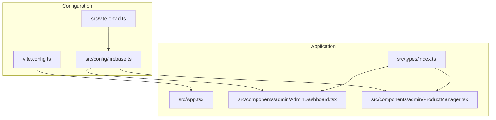
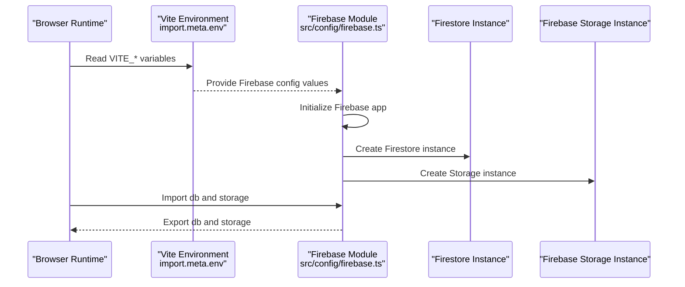
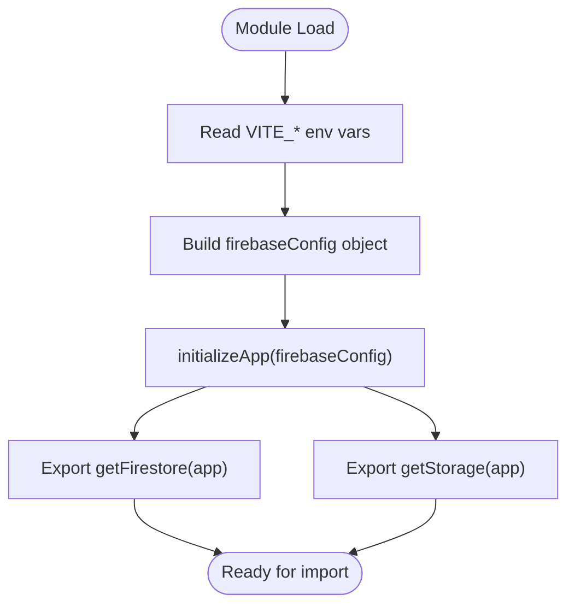
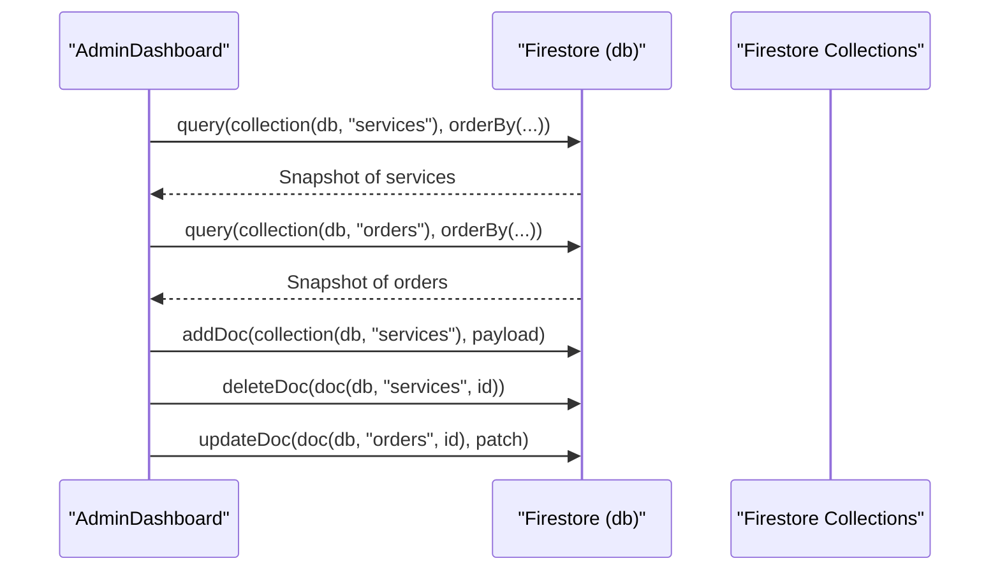
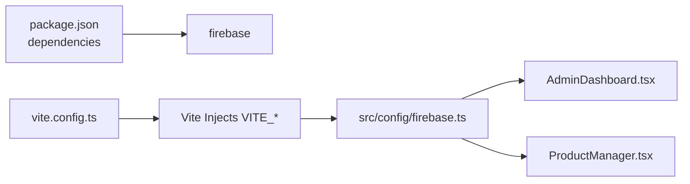

# Firebase Configuration and Setup

<cite>
**Referenced Files in This Document**
- [firebase.ts](file://src/config/firebase.ts)
- [vite.config.ts](file://vite.config.ts)
- [vite-env.d.ts](file://src/vite-env.d.ts)
- [package.json](file://package.json)
- [AdminDashboard.tsx](file://src/components/admin/AdminDashboard.tsx)
- [ProductManager.tsx](file://src/components/admin/ProductManager.tsx)
- [index.ts](file://src/types/index.ts)
</cite>

## Table of Contents
1. [Introduction](#introduction)
2. [Project Structure](#project-structure)
3. [Core Components](#core-components)
4. [Architecture Overview](#architecture-overview)
5. [Detailed Component Analysis](#detailed-component-analysis)
6. [Dependency Analysis](#dependency-analysis)
7. [Performance Considerations](#performance-considerations)
8. [Troubleshooting Guide](#troubleshooting-guide)
9. [Conclusion](#conclusion)
10. [Appendices](#appendices)

## Introduction
This document explains how Firebase is configured and initialized in DevForge, how environment variables are used, and how Firestore and Firebase Storage are exported and consumed. It also covers security considerations for API keys, authentication domains, and project configuration, along with step-by-step setup instructions for local development and production, plus troubleshooting and best practices for Firebase project management.

## Project Structure
Firebase configuration is centralized in a single module that initializes the Firebase app and exposes Firestore and Storage instances. Environment variables are typed via Vite’s import.meta.env and prefixed with VITE_ so they are accessible at runtime in the browser. Components consume these services for data operations.

**Diagram sources**
- [firebase.ts:1-19](file://src/config/firebase.ts#L1-L19)
- [vite-env.d.ts:3-17](file://src/vite-env.d.ts#L3-L17)
- [vite.config.ts:1-22](file://vite.config.ts#L1-L22)
- [AdminDashboard.tsx:1-186](file://src/components/admin/AdminDashboard.tsx#L1-L186)
- [ProductManager.tsx:1-221](file://src/components/admin/ProductManager.tsx#L1-L221)
- [index.ts:1-40](file://src/types/index.ts#L1-L40)

**Section sources**
- [firebase.ts:1-19](file://src/config/firebase.ts#L1-L19)
- [vite-env.d.ts:3-17](file://src/vite-env.d.ts#L3-L17)
- [vite.config.ts:1-22](file://vite.config.ts#L1-L22)

## Core Components
- Firebase initialization module: Initializes the Firebase app using environment-provided configuration and exports Firestore and Storage instances for use across the app.
- Environment typings: Declares Vite environment variable types for Firebase configuration fields.
- Application usage: Admin dashboard and product manager components import the Firestore instance to read/write documents.

Key export points:
- Firestore instance: [db export:16-16](file://src/config/firebase.ts#L16-L16)
- Firebase Storage instance: [storage export:16-17](file://src/config/firebase.ts#L16-L17)
- Default Firebase app instance: [default export:17-17](file://src/config/firebase.ts#L17-L17)

Consumers:
- Admin dashboard reads and writes Firestore collections: [usage:31-43](file://src/components/admin/AdminDashboard.tsx#L31-L43), [add/delete/update:54-72](file://src/components/admin/AdminDashboard.tsx#L54-L72)
- Product manager component receives props for adding/deleting services: [props and handlers:4-8](file://src/components/admin/ProductManager.tsx#L4-L8)

**Section sources**
- [firebase.ts:1-19](file://src/config/firebase.ts#L1-L19)
- [vite-env.d.ts:3-17](file://src/vite-env.d.ts#L3-L17)
- [AdminDashboard.tsx:1-186](file://src/components/admin/AdminDashboard.tsx#L1-L186)
- [ProductManager.tsx:1-221](file://src/components/admin/ProductManager.tsx#L1-L221)

## Architecture Overview
The Firebase configuration module acts as a singleton provider for Firestore and Storage. Components import the Firestore instance directly from this module to perform queries and mutations. Vite resolves environment variables at build time and injects them into the client bundle.

**Diagram sources**
- [firebase.ts:5-17](file://src/config/firebase.ts#L5-L17)
- [vite-env.d.ts:5-10](file://src/vite-env.d.ts#L5-L10)

## Detailed Component Analysis

### Firebase Initialization Module
- Imports: Firebase app, Firestore, and Storage.
- Reads environment variables via Vite’s import.meta.env with VITE_ prefix.
- Initializes the Firebase app once and exports Firestore and Storage instances.

**Diagram sources**
- [firebase.ts:5-17](file://src/config/firebase.ts#L5-L17)

**Section sources**
- [firebase.ts:1-19](file://src/config/firebase.ts#L1-L19)

### Environment Variable Typings
- Declares Vite environment variable types for Firebase fields used by the app.
- Ensures compile-time safety for VITE_FIREBASE_* variables.

**Section sources**
- [vite-env.d.ts:3-17](file://src/vite-env.d.ts#L3-L17)

### Firestore Usage in Admin Dashboard
- Imports Firestore helpers and the db instance.
- Loads services and orders from Firestore collections.
- Adds, deletes, and updates documents via Firestore commands.

**Diagram sources**
- [AdminDashboard.tsx:31-43](file://src/components/admin/AdminDashboard.tsx#L31-L43)
- [AdminDashboard.tsx:54-72](file://src/components/admin/AdminDashboard.tsx#L54-L72)

**Section sources**
- [AdminDashboard.tsx:1-186](file://src/components/admin/AdminDashboard.tsx#L1-L186)

### Firestore Types Used by Admin Dashboard
- Defines the shape of Service and Order documents used in Firestore.
- Ensures type-safe handling of Firestore data in components.

**Section sources**
- [index.ts:1-40](file://src/types/index.ts#L1-L40)

## Dependency Analysis
- Firebase SDK is included as a runtime dependency.
- Vite handles environment variable injection at build time.
- Components depend on the Firebase module for database operations.

**Diagram sources**
- [package.json:12-18](file://package.json#L12-L18)
- [vite.config.ts:1-22](file://vite.config.ts#L1-L22)
- [firebase.ts:5-17](file://src/config/firebase.ts#L5-L17)
- [AdminDashboard.tsx:1-186](file://src/components/admin/AdminDashboard.tsx#L1-L186)
- [ProductManager.tsx:1-221](file://src/components/admin/ProductManager.tsx#L1-L221)

**Section sources**
- [package.json:12-18](file://package.json#L12-L18)
- [vite.config.ts:1-22](file://vite.config.ts#L1-L22)
- [firebase.ts:5-17](file://src/config/firebase.ts#L5-L17)

## Performance Considerations
- Keep Firestore queries scoped and ordered to minimize document reads.
- Batch writes when adding multiple documents to reduce network overhead.
- Use Firestore indexes strategically to support orderBy and where clauses.
- Avoid unnecessary re-initialization of the Firebase app; the module exports a singleton.

## Troubleshooting Guide
Common setup issues and resolutions:
- Missing VITE_FIREBASE_* variables
  - Symptom: Firebase initialization fails or app does not connect to Firestore.
  - Resolution: Ensure all VITE_FIREBASE_* variables are present in the environment and correctly named.
  - Reference: [Environment typings:5-10](file://src/vite-env.d.ts#L5-L10)
- Incorrect API key or auth domain
  - Symptom: Authentication errors or inability to access Firestore.
  - Resolution: Verify the API key and auth domain match the Firebase project settings.
  - Reference: [Firebase config usage:5-12](file://src/config/firebase.ts#L5-L12)
- Wrong project ID or storage bucket
  - Symptom: Storage operations fail or incorrect bucket accessed.
  - Resolution: Confirm project ID and storage bucket values align with the Firebase project.
  - Reference: [Firebase config usage:5-12](file://src/config/firebase.ts#L5-L12)
- Build-time environment not injected
  - Symptom: Variables appear undefined in the browser.
  - Resolution: Ensure variables are prefixed with VITE_ and loaded via Vite’s environment mechanism.
  - Reference: [Vite config:1-22](file://vite.config.ts#L1-L22)
- Type errors for environment variables
  - Symptom: TypeScript compilation errors for VITE_*.
  - Resolution: Update the environment typings to include the missing variables.
  - Reference: [Environment typings:3-17](file://src/vite-env.d.ts#L3-L17)

## Conclusion
DevForge initializes Firebase once and exposes Firestore and Storage for use across components. Environment variables are typed and prefixed for safe runtime access. Following the setup instructions and security recommendations ensures reliable operation in both development and production.

## Appendices

### Step-by-Step Setup Instructions

- Local Development
  1. Create a Firebase project and register a web app to obtain configuration values.
  2. Add the following VITE_* environment variables to your local environment:
     - VITE_FIREBASE_API_KEY
     - VITE_FIREBASE_AUTH_DOMAIN
     - VITE_FIREBASE_PROJECT_ID
     - VITE_FIREBASE_STORAGE_BUCKET
     - VITE_FIREBASE_MESSAGING_SENDER_ID
     - VITE_FIREBASE_APP_ID
  3. Confirm the environment typings include these variables.
  4. Start the Vite dev server; the app will initialize Firebase using these variables.
  5. Verify Firestore connectivity by loading data in the admin dashboard.

- Production
  1. Configure the same Firebase project and environment variables in your hosting platform.
  2. Ensure the hosting platform injects VITE_* variables at build/runtime.
  3. Deploy the built application; the Firebase module will initialize with production values.

### Security Considerations
- API key exposure
  - Keep VITE_FIREBASE_API_KEY secret in your CI/CD secrets and avoid committing it to version control.
  - Restrict API key usage by setting up HTTP referrer restrictions in the Google Cloud Console if applicable.
- Authentication domain
  - Set the auth domain to match your hosted domain(s) to prevent unauthorized origins.
- Project configuration
  - Limit permissions and use Firestore security rules to enforce access control.
  - Regularly review and audit Firebase project settings and service accounts.

### Configuration Validation Examples
- Environment variable usage
  - Example reference: [Firebase config object construction:5-12](file://src/config/firebase.ts#L5-L12)
- Firestore usage in components
  - Example reference: [Reading services and orders:31-43](file://src/components/admin/AdminDashboard.tsx#L31-L43)
  - Example reference: [Adding and deleting services:54-64](file://src/components/admin/AdminDashboard.tsx#L54-L64)

### Security Rule Recommendations and Access Control Patterns
- Firestore security rules
  - Enforce authenticated access for admin operations.
  - Scope document reads/writes to specific user IDs or roles.
  - Use field-level validation and deny unsafe operations.
- Storage rules
  - Restrict uploads to authenticated users and specific content types.
  - Enforce bucket-level policies to prevent public access.
- Access control patterns
  - Use role-based collections or document fields to gate access.
  - Leverage Firestore indexes to optimize secure queries.