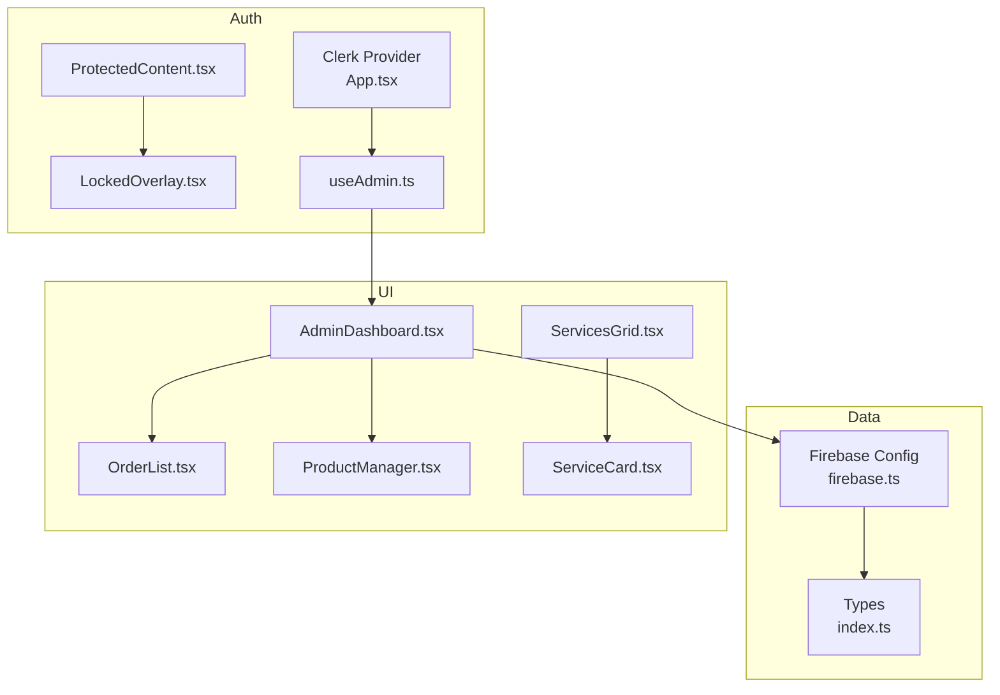
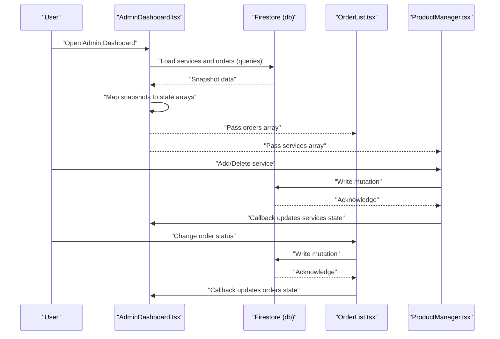
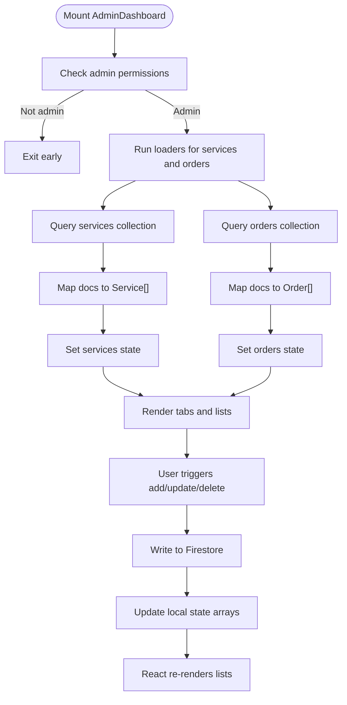
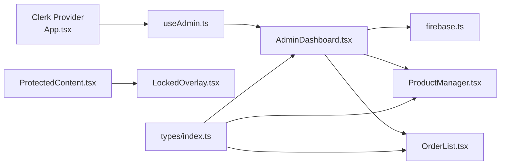

# Real-time Data Synchronization

<cite>
**Referenced Files in This Document**
- [firebase.ts](file://src/config/firebase.ts)
- [clerk.ts](file://src/config/clerk.ts)
- [App.tsx](file://src/App.tsx)
- [AdminDashboard.tsx](file://src/components/admin/AdminDashboard.tsx)
- [OrderList.tsx](file://src/components/admin/OrderList.tsx)
- [ProductManager.tsx](file://src/components/admin/ProductManager.tsx)
- [ServicesGrid.tsx](file://src/components/home/ServicesGrid.tsx)
- [ServiceCard.tsx](file://src/components/home/ServiceCard.tsx)
- [ProtectedContent.tsx](file://src/components/auth/ProtectedContent.tsx)
- [LockedOverlay.tsx](file://src/components/auth/LockedOverlay.tsx)
- [useAdmin.ts](file://src/hooks/useAdmin.ts)
- [index.ts](file://src/types/index.ts)
- [vite-env.d.ts](file://src/vite-env.d.ts)
</cite>

## Table of Contents
1. [Introduction](#introduction)
2. [Project Structure](#project-structure)
3. [Core Components](#core-components)
4. [Architecture Overview](#architecture-overview)
5. [Detailed Component Analysis](#detailed-component-analysis)
6. [Dependency Analysis](#dependency-analysis)
7. [Performance Considerations](#performance-considerations)
8. [Troubleshooting Guide](#troubleshooting-guide)
9. [Conclusion](#conclusion)

## Introduction
This document explains real-time data synchronization patterns in DevForge. It focuses on how Firestore is used to synchronize services and orders data, how components react to changes, and how to implement robust listener management, cleanup, and error handling. It also covers offline handling, conflict resolution, and performance strategies for large datasets and frequent updates.

## Project Structure
DevForge integrates Clerk for authentication and Firebase for data persistence. The admin dashboard loads services and orders from Firestore on mount and updates the UI reactively. The home page displays static service cards, while authentication-protected overlays prevent access until signed in.

**Diagram sources**
- [App.tsx:1-67](file://src/App.tsx#L1-L67)
- [useAdmin.ts:1-14](file://src/hooks/useAdmin.ts#L1-L14)
- [AdminDashboard.tsx:1-186](file://src/components/admin/AdminDashboard.tsx#L1-L186)
- [OrderList.tsx:1-91](file://src/components/admin/OrderList.tsx#L1-L91)
- [ProductManager.tsx:1-221](file://src/components/admin/ProductManager.tsx#L1-L221)
- [ServicesGrid.tsx:1-167](file://src/components/home/ServicesGrid.tsx#L1-L167)
- [ServiceCard.tsx:1-177](file://src/components/home/ServiceCard.tsx#L1-L177)
- [ProtectedContent.tsx:1-44](file://src/components/auth/ProtectedContent.tsx#L1-L44)
- [LockedOverlay.tsx:1-61](file://src/components/auth/LockedOverlay.tsx#L1-L61)
- [firebase.ts:1-19](file://src/config/firebase.ts#L1-L19)
- [index.ts:1-40](file://src/types/index.ts#L1-L40)

**Section sources**
- [App.tsx:1-67](file://src/App.tsx#L1-L67)
- [firebase.ts:1-19](file://src/config/firebase.ts#L1-L19)
- [index.ts:1-40](file://src/types/index.ts#L1-L40)

## Core Components
- Firebase configuration exports Firestore and Storage instances used by components.
- AdminDashboard orchestrates loading and updating services and orders via Firestore queries and mutations.
- OrderList and ProductManager present and mutate order and service data respectively.
- Authentication is enforced via Clerk and a custom hook; protected content overlays block unauthorized access.

Key responsibilities:
- Firestore initialization and exports: [firebase.ts:1-19](file://src/config/firebase.ts#L1-L19)
- Admin data loading and mutation: [AdminDashboard.tsx:25-72](file://src/components/admin/AdminDashboard.tsx#L25-L72)
- Order rendering and status updates: [OrderList.tsx:15-89](file://src/components/admin/OrderList.tsx#L15-L89)
- Service CRUD UI: [ProductManager.tsx:22-220](file://src/components/admin/ProductManager.tsx#L22-L220)
- Authentication provider and routes: [App.tsx:26-58](file://src/App.tsx#L26-L58)
- Admin guard hook: [useAdmin.ts:4-13](file://src/hooks/useAdmin.ts#L4-L13)

**Section sources**
- [firebase.ts:1-19](file://src/config/firebase.ts#L1-L19)
- [AdminDashboard.tsx:18-72](file://src/components/admin/AdminDashboard.tsx#L18-L72)
- [OrderList.tsx:15-89](file://src/components/admin/OrderList.tsx#L15-L89)
- [ProductManager.tsx:22-220](file://src/components/admin/ProductManager.tsx#L22-L220)
- [App.tsx:26-58](file://src/App.tsx#L26-L58)
- [useAdmin.ts:4-13](file://src/hooks/useAdmin.ts#L4-L13)

## Architecture Overview
The current implementation uses server-side reads and client-side state updates:
- AdminDashboard fetches services and orders on mount using Firestore queries.
- Mutations (add, delete, update) write to Firestore and immediately update local state.
- No Firestore listeners are implemented; updates require manual refresh.

**Diagram sources**
- [AdminDashboard.tsx:25-72](file://src/components/admin/AdminDashboard.tsx#L25-L72)
- [OrderList.tsx:66-85](file://src/components/admin/OrderList.tsx#L66-L85)
- [ProductManager.tsx:35-52](file://src/components/admin/ProductManager.tsx#L35-L52)

## Detailed Component Analysis

### Firestore Initialization and Exports
- Initializes Firebase app and exports Firestore and Storage.
- Environment variables are loaded via Vite’s import.meta.env.

Implementation highlights:
- App initialization and exports: [firebase.ts:14-18](file://src/config/firebase.ts#L14-L18)
- Environment variable declarations: [vite-env.d.ts:3-12](file://src/vite-env.d.ts#L3-L12)

**Section sources**
- [firebase.ts:1-19](file://src/config/firebase.ts#L1-L19)
- [vite-env.d.ts:1-17](file://src/vite-env.d.ts#L1-L17)

### AdminDashboard: Data Loading and Reactive Updates
- Loads services and orders via queries ordered by creation date.
- Uses local state arrays for reactive UI updates.
- Provides handlers to add/delete services and update order statuses.

Key patterns:
- Query construction and snapshot mapping: [AdminDashboard.tsx:31-43](file://src/components/admin/AdminDashboard.tsx#L31-L43)
- Mutation handlers update Firestore and local state: [AdminDashboard.tsx:54-72](file://src/components/admin/AdminDashboard.tsx#L54-L72)
- Tabbed UI renders either ProductManager or OrderList: [AdminDashboard.tsx:174-182](file://src/components/admin/AdminDashboard.tsx#L174-L182)

**Diagram sources**
- [AdminDashboard.tsx:25-72](file://src/components/admin/AdminDashboard.tsx#L25-L72)

**Section sources**
- [AdminDashboard.tsx:18-72](file://src/components/admin/AdminDashboard.tsx#L18-L72)

### OrderList: Status Updates and Rendering
- Renders a list of orders with status badges and a dropdown to change status.
- Calls an onUpdateStatus handler passed from AdminDashboard.

Important behaviors:
- Status badge coloring and mapping: [OrderList.tsx:8-13](file://src/components/admin/OrderList.tsx#L8-L13)
- Dropdown change triggers handler with selected status: [OrderList.tsx:66-85](file://src/components/admin/OrderList.tsx#L66-L85)

**Section sources**
- [OrderList.tsx:15-89](file://src/components/admin/OrderList.tsx#L15-L89)

### ProductManager: Service CRUD UI
- Provides a form to add new services and a list to delete existing ones.
- Submits normalized data to AdminDashboard handlers.

Key points:
- Form submission and normalization: [ProductManager.tsx:35-52](file://src/components/admin/ProductManager.tsx#L35-L52)
- Deletion handler: [ProductManager.tsx:199-214](file://src/components/admin/ProductManager.tsx#L199-L214)

**Section sources**
- [ProductManager.tsx:22-220](file://src/components/admin/ProductManager.tsx#L22-L220)

### Authentication and Access Control
- ClerkProvider wraps routing; ProtectedContent overlays locked content until signed in.
- useAdmin hook checks admin email against Clerk user data.

Integration points:
- Clerk provider and routes: [App.tsx:26-58](file://src/App.tsx#L26-L58)
- Admin guard: [useAdmin.ts:4-13](file://src/hooks/useAdmin.ts#L4-L13)
- Protected overlay: [ProtectedContent.tsx:10-43](file://src/components/auth/ProtectedContent.tsx#L10-L43)
- Locked overlay UI: [LockedOverlay.tsx:3-60](file://src/components/auth/LockedOverlay.tsx#L3-L60)

**Section sources**
- [App.tsx:1-67](file://src/App.tsx#L1-L67)
- [useAdmin.ts:1-14](file://src/hooks/useAdmin.ts#L1-L14)
- [ProtectedContent.tsx:1-44](file://src/components/auth/ProtectedContent.tsx#L1-L44)
- [LockedOverlay.tsx:1-61](file://src/components/auth/LockedOverlay.tsx#L1-L61)

### Types and Data Contracts
- Defines Service and Order interfaces used across components and Firestore documents.

Interfaces:
- Service: [index.ts:1-12](file://src/types/index.ts#L1-L12)
- Order: [index.ts:14-27](file://src/types/index.ts#L14-L27)

**Section sources**
- [index.ts:1-40](file://src/types/index.ts#L1-L40)

## Dependency Analysis
- AdminDashboard depends on Clerk for admin checks and Firestore for data.
- OrderList and ProductManager depend on props passed by AdminDashboard.
- ProtectedContent and LockedOverlay depend on Clerk user state and navigation.

**Diagram sources**
- [App.tsx:26-58](file://src/App.tsx#L26-L58)
- [useAdmin.ts:4-13](file://src/hooks/useAdmin.ts#L4-L13)
- [AdminDashboard.tsx:1-186](file://src/components/admin/AdminDashboard.tsx#L1-L186)
- [OrderList.tsx:1-91](file://src/components/admin/OrderList.tsx#L1-L91)
- [ProductManager.tsx:1-221](file://src/components/admin/ProductManager.tsx#L1-L221)
- [firebase.ts:1-19](file://src/config/firebase.ts#L1-L19)
- [ProtectedContent.tsx:1-44](file://src/components/auth/ProtectedContent.tsx#L1-L44)
- [LockedOverlay.tsx:1-61](file://src/components/auth/LockedOverlay.tsx#L1-L61)
- [index.ts:1-40](file://src/types/index.ts#L1-L40)

**Section sources**
- [App.tsx:1-67](file://src/App.tsx#L1-L67)
- [useAdmin.ts:1-14](file://src/hooks/useAdmin.ts#L1-L14)
- [AdminDashboard.tsx:1-186](file://src/components/admin/AdminDashboard.tsx#L1-L186)
- [OrderList.tsx:1-91](file://src/components/admin/OrderList.tsx#L1-L91)
- [ProductManager.tsx:1-221](file://src/components/admin/ProductManager.tsx#L1-L221)
- [firebase.ts:1-19](file://src/config/firebase.ts#L1-L19)
- [ProtectedContent.tsx:1-44](file://src/components/auth/ProtectedContent.tsx#L1-L44)
- [LockedOverlay.tsx:1-61](file://src/components/auth/LockedOverlay.tsx#L1-L61)
- [index.ts:1-40](file://src/types/index.ts#L1-L40)

## Performance Considerations
- Current implementation performs initial loads on mount; no continuous listeners are used.
- Recommendations for scaling to frequent updates and large datasets:
  - Replace initial loads with onSnapshot listeners for services and orders collections.
  - Debounce or batch UI updates when handling rapid changes.
  - Paginate queries for large datasets; use cursor-based pagination.
  - Apply field-level indexing on frequently queried fields (e.g., createdAt, status).
  - Use Firestore Composite Indexes for complex queries.
  - Cache snapshots locally (e.g., IndexedDB) for offline-first experiences.
  - Normalize data and keep only necessary fields in views.
  - Virtualize long lists to reduce DOM nodes.
  - Use memoization (e.g., useMemo/useCallback) around heavy renderers.

[No sources needed since this section provides general guidance]

## Troubleshooting Guide
Common issues and resolutions:
- Network interruptions
  - Detect offline scenarios and show retry prompts.
  - Persist mutations locally and sync when connectivity resumes.
  - Use Firestore transactions for atomicity during resync.
- Authentication failures
  - Redirect unauthenticated users to sign-in; show LockedOverlay.
  - Re-run admin checks after sign-in completes.
- Data inconsistencies
  - Use server timestamps and updatedAt fields to detect stale reads.
  - Implement optimistic updates with rollback on failure.
- Memory leaks
  - Ensure listeners are unsubscribed when components unmount.
  - Use cleanup functions in useEffect to detach listeners.

[No sources needed since this section provides general guidance]

## Conclusion
DevForge currently uses Firestore for server-side reads and client-side state updates without continuous listeners. To achieve true real-time synchronization, implement onSnapshot listeners for services and orders, enforce proper cleanup, and adopt offline-first strategies with conflict resolution. These changes will improve responsiveness, reliability, and user experience at scale.