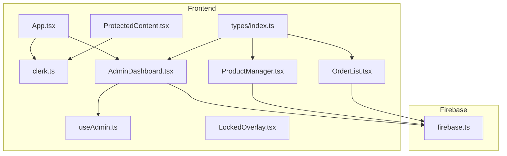
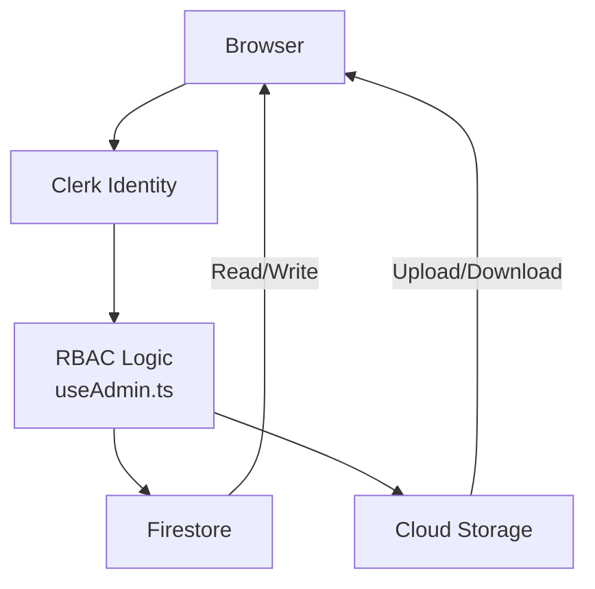
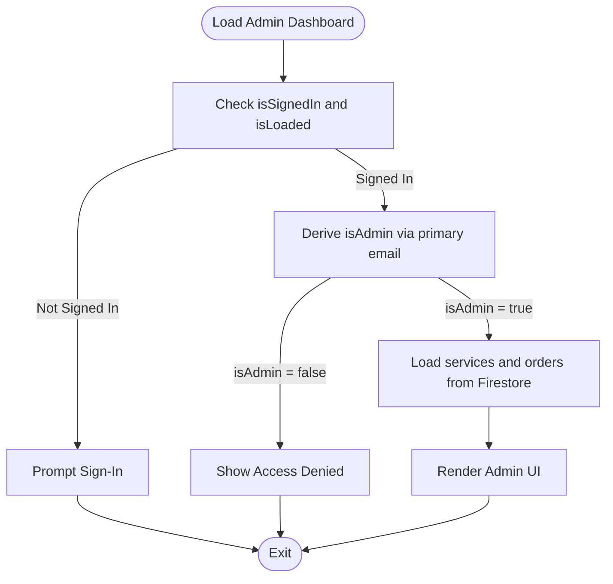
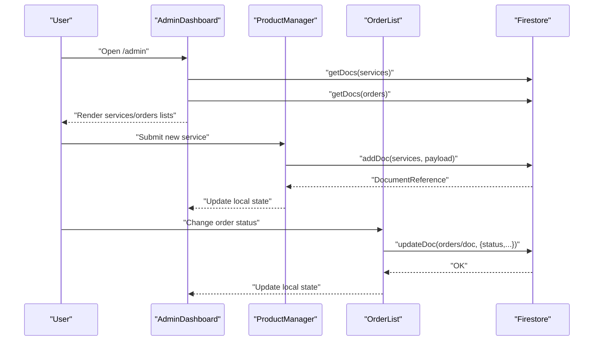
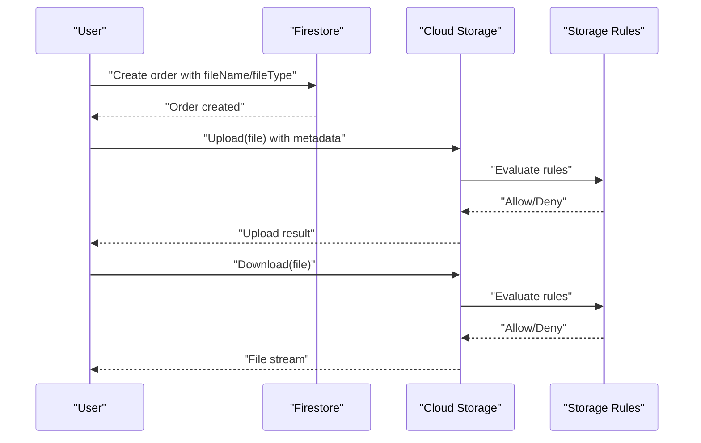
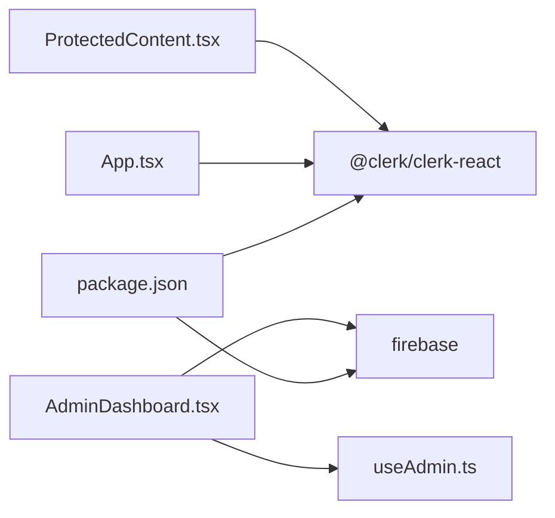

# Security Rules and Access Control

<cite>
**Referenced Files in This Document**
- [firebase.ts](file://src/config/firebase.ts)
- [clerk.ts](file://src/config/clerk.ts)
- [useAdmin.ts](file://src/hooks/useAdmin.ts)
- [ProtectedContent.tsx](file://src/components/auth/ProtectedContent.tsx)
- [LockedOverlay.tsx](file://src/components/auth/LockedOverlay.tsx)
- [AdminDashboard.tsx](file://src/components/admin/AdminDashboard.tsx)
- [ProductManager.tsx](file://src/components/admin/ProductManager.tsx)
- [OrderList.tsx](file://src/components/admin/OrderList.tsx)
- [index.ts](file://src/types/index.ts)
- [App.tsx](file://src/App.tsx)
- [package.json](file://package.json)
</cite>

## Table of Contents
1. [Introduction](#introduction)
2. [Project Structure](#project-structure)
3. [Core Components](#core-components)
4. [Architecture Overview](#architecture-overview)
5. [Detailed Component Analysis](#detailed-component-analysis)
6. [Dependency Analysis](#dependency-analysis)
7. [Performance Considerations](#performance-considerations)
8. [Troubleshooting Guide](#troubleshooting-guide)
9. [Conclusion](#conclusion)
10. [Appendices](#appendices)

## Introduction
This document explains how Firebase security rules and access control are modeled and enforced in the project. It focuses on:
- Firestore read/write permissions and data validation patterns
- Cloud Storage access restrictions for uploads/downloads
- Role-based access control using Clerk integration and custom claims
- Conditional permissions, data masking, and sensitive information protection
- Testing and debugging techniques for security rules
- Best practices for permission modeling and performance optimization

The frontend integrates Clerk for authentication and admin checks, while Firestore and Cloud Storage are initialized via Firebase SDK. The current codebase demonstrates client-side gating for admin features but does not include server-side security rules. This document therefore provides a blueprint for implementing robust Firebase security rules aligned with the existing client-side logic.

## Project Structure
The project is a React + TypeScript application using Clerk for authentication and Firebase for backend services. The relevant pieces for access control are:
- Clerk configuration and admin hook
- Firestore and Cloud Storage initialization
- Admin dashboard and protected content components
- Data types for services and orders

**Diagram sources**
- [App.tsx:1-67](file://src/App.tsx#L1-L67)
- [clerk.ts:1-4](file://src/config/clerk.ts#L1-L4)
- [useAdmin.ts:1-14](file://src/hooks/useAdmin.ts#L1-L14)
- [ProtectedContent.tsx:1-44](file://src/components/auth/ProtectedContent.tsx#L1-L44)
- [LockedOverlay.tsx:1-61](file://src/components/auth/LockedOverlay.tsx#L1-L61)
- [AdminDashboard.tsx:1-186](file://src/components/admin/AdminDashboard.tsx#L1-L186)
- [ProductManager.tsx:1-221](file://src/components/admin/ProductManager.tsx#L1-L221)
- [OrderList.tsx:1-91](file://src/components/admin/OrderList.tsx#L1-L91)
- [index.ts:1-40](file://src/types/index.ts#L1-L40)
- [firebase.ts:1-19](file://src/config/firebase.ts#L1-L19)

**Section sources**
- [App.tsx:1-67](file://src/App.tsx#L1-L67)
- [firebase.ts:1-19](file://src/config/firebase.ts#L1-L19)
- [clerk.ts:1-4](file://src/config/clerk.ts#L1-L4)
- [useAdmin.ts:1-14](file://src/hooks/useAdmin.ts#L1-L14)
- [ProtectedContent.tsx:1-44](file://src/components/auth/ProtectedContent.tsx#L1-L44)
- [LockedOverlay.tsx:1-61](file://src/components/auth/LockedOverlay.tsx#L1-L61)
- [AdminDashboard.tsx:1-186](file://src/components/admin/AdminDashboard.tsx#L1-L186)
- [ProductManager.tsx:1-221](file://src/components/admin/ProductManager.tsx#L1-L221)
- [OrderList.tsx:1-91](file://src/components/admin/OrderList.tsx#L1-L91)
- [index.ts:1-40](file://src/types/index.ts#L1-L40)

## Core Components
- Clerk configuration exposes the publishable key and admin email constant used for admin checks.
- The admin hook derives an isAdmin flag by comparing the signed-in user’s primary email address against the configured admin email.
- ProtectedContent wraps content and renders a locked overlay if the user is not signed in.
- AdminDashboard loads services and orders from Firestore only when the user is an admin; otherwise, it denies access or prompts sign-in.
- ProductManager and OrderList are admin-only UI components that trigger Firestore mutations.

These components collectively model:
- Authentication gating (signed-in vs anonymous)
- Authorization gating (admin-only)
- Data access patterns (reads/writes to services/orders collections)

**Section sources**
- [clerk.ts:1-4](file://src/config/clerk.ts#L1-L4)
- [useAdmin.ts:1-14](file://src/hooks/useAdmin.ts#L1-L14)
- [ProtectedContent.tsx:1-44](file://src/components/auth/ProtectedContent.tsx#L1-L44)
- [AdminDashboard.tsx:1-186](file://src/components/admin/AdminDashboard.tsx#L1-L186)
- [ProductManager.tsx:1-221](file://src/components/admin/ProductManager.tsx#L1-L221)
- [OrderList.tsx:1-91](file://src/components/admin/OrderList.tsx#L1-L91)

## Architecture Overview
The runtime access control architecture combines client-side checks with Firebase backend enforcement. Clerk handles identity; the app enforces role-based access; Firestore and Cloud Storage enforce read/write policies.

[No sources needed since this diagram shows conceptual workflow, not actual code structure]

## Detailed Component Analysis

### Clerk Integration and Admin Role Model
- Publishable key is provided to ClerkProvider in the application shell.
- Admin check compares the signed-in user’s primary email address to a configured admin email constant.
- The admin check is performed before loading admin data and before rendering admin UI.

**Diagram sources**
- [App.tsx:26-58](file://src/App.tsx#L26-L58)
- [useAdmin.ts:4-13](file://src/hooks/useAdmin.ts#L4-L13)
- [AdminDashboard.tsx:18-110](file://src/components/admin/AdminDashboard.tsx#L18-L110)

**Section sources**
- [App.tsx:1-67](file://src/App.tsx#L1-L67)
- [clerk.ts:1-4](file://src/config/clerk.ts#L1-L4)
- [useAdmin.ts:1-14](file://src/hooks/useAdmin.ts#L1-L14)
- [AdminDashboard.tsx:1-186](file://src/components/admin/AdminDashboard.tsx#L1-L186)

### Firestore Access Patterns and Data Validation
- Services and orders are stored in top-level collections.
- AdminDashboard reads services and orders with ordering and maps documents to typed objects.
- ProductManager writes new services and deletes existing ones.
- OrderList updates order status.

**Diagram sources**
- [AdminDashboard.tsx:25-72](file://src/components/admin/AdminDashboard.tsx#L25-L72)
- [ProductManager.tsx:35-52](file://src/components/admin/ProductManager.tsx#L35-L52)
- [OrderList.tsx:66-85](file://src/components/admin/OrderList.tsx#L66-L85)
- [index.ts:1-40](file://src/types/index.ts#L1-L40)

**Section sources**
- [AdminDashboard.tsx:1-186](file://src/components/admin/AdminDashboard.tsx#L1-L186)
- [ProductManager.tsx:1-221](file://src/components/admin/ProductManager.tsx#L1-L221)
- [OrderList.tsx:1-91](file://src/components/admin/OrderList.tsx#L1-L91)
- [index.ts:1-40](file://src/types/index.ts#L1-L40)

### Cloud Storage Access Model
- Cloud Storage is initialized via Firebase SDK.
- Upload/download flows are controlled by Cloud Storage security rules.
- Suggested pattern: restrict by user ID, file metadata, and bucket-level policies.

[No sources needed since this diagram shows conceptual workflow, not actual code structure]

## Dependency Analysis
- Clerk dependency is declared in package.json.
- Firebase SDK is used for Firestore and Storage initialization.
- AdminDashboard depends on Clerk user state and Firebase SDK.
- ProtectedContent depends on Clerk user state for overlay behavior.

**Diagram sources**
- [package.json:12-18](file://package.json#L12-L18)
- [App.tsx:1-67](file://src/App.tsx#L1-L67)
- [useAdmin.ts:1-14](file://src/hooks/useAdmin.ts#L1-L14)
- [AdminDashboard.tsx:1-186](file://src/components/admin/AdminDashboard.tsx#L1-L186)
- [ProtectedContent.tsx:1-44](file://src/components/auth/ProtectedContent.tsx#L1-L44)

**Section sources**
- [package.json:1-38](file://package.json#L1-L38)
- [App.tsx:1-67](file://src/App.tsx#L1-L67)
- [useAdmin.ts:1-14](file://src/hooks/useAdmin.ts#L1-L14)
- [AdminDashboard.tsx:1-186](file://src/components/admin/AdminDashboard.tsx#L1-L186)
- [ProtectedContent.tsx:1-44](file://src/components/auth/ProtectedContent.tsx#L1-L44)

## Performance Considerations
- Minimize document reads/writes to only required fields.
- Use indexed queries (e.g., ordering by timestamps) to reduce scan costs.
- Batch writes for bulk updates (e.g., order status changes).
- Cache frequently accessed data locally to reduce round trips.
- Keep security rules concise and deterministic to avoid latency spikes.

[No sources needed since this section provides general guidance]

## Troubleshooting Guide
Common issues and remedies:
- Rule evaluation failures: Verify that all variables referenced in rules exist for the operation (e.g., request.auth.uid for write operations).
- Permission denied errors: Confirm that client-side checks align with server-side rules; mismatch leads to confusing UX.
- Slow queries: Review Firestore indexes and query patterns; ensure appropriate compound indexes for filtered/sorted reads.
- Storage access blocked: Check Cloud Storage rules for bucket-level and path-level conditions.
- Debugging techniques:
  - Use Firestore Emulator to test rules locally.
  - Log request context (auth, resource, time) in rules comments during development.
  - Validate data shapes against TypeScript types to prevent runtime rule mismatches.

[No sources needed since this section provides general guidance]

## Conclusion
The project establishes a clear admin-role model using Clerk and client-side checks. To achieve robust security, implement Firebase security rules that mirror the client-side logic:
- Enforce authentication and admin authorization for admin routes and mutations.
- Validate data shape and constraints in Firestore rules.
- Restrict Cloud Storage uploads/downloads by user identity and file metadata.
- Adopt defensive programming practices: always validate inputs, mask sensitive fields, and prefer least-privilege access.

[No sources needed since this section summarizes without analyzing specific files]

## Appendices

### Appendix A: Firestore Security Rules Blueprint
- Collections: services, orders
- Conditions:
  - Read/write requires a valid authenticated session.
  - Admin-only mutations require a verified admin claim or email match.
  - Data validation: reject writes that violate field types or constraints.
  - Conditional permissions: allow users to read only their own orders; allow admins to read all.
  - Sensitive data protection: hide internal fields; mask PII in listings.

[No sources needed since this section provides general guidance]

### Appendix B: Cloud Storage Security Rules Blueprint
- Bucket-level: enforce HTTPS and origin restrictions.
- Path-level: allow uploads only under user-specific prefixes; deny listing buckets.
- Download: require signed URLs with short TTLs; restrict by user ownership.
- Metadata: validate content-type and size limits; reject suspicious filenames.

[No sources needed since this section provides general guidance]