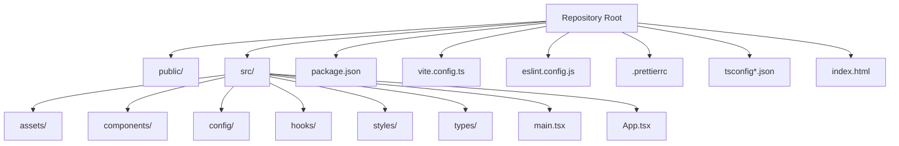
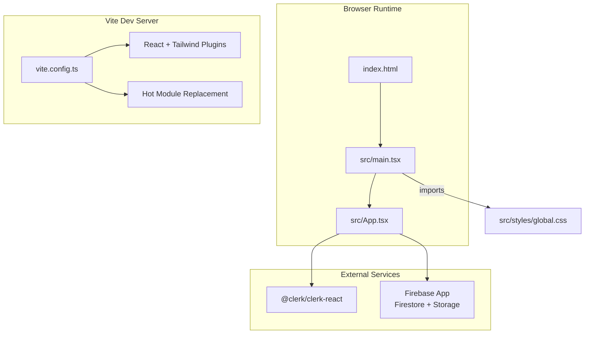
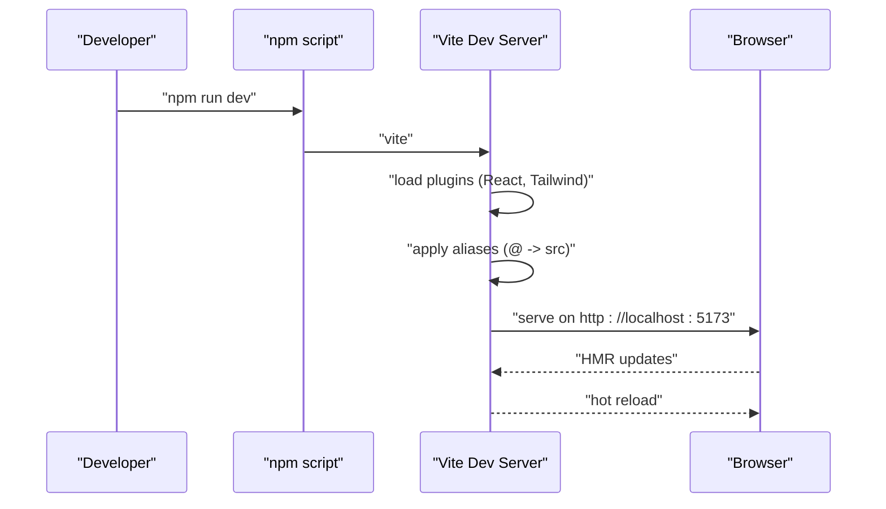
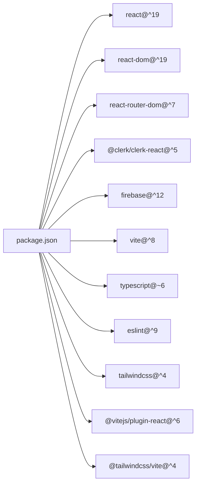

# Getting Started

<cite>
**Referenced Files in This Document**
- [README.md](file://README.md)
- [package.json](file://package.json)
- [vite.config.ts](file://vite.config.ts)
- [eslint.config.js](file://eslint.config.js)
- [.prettierrc](file://.prettierrc)
- [tsconfig.json](file://tsconfig.json)
- [tsconfig.app.json](file://tsconfig.app.json)
- [tsconfig.node.json](file://tsconfig.node.json)
- [index.html](file://index.html)
- [src/main.tsx](file://src/main.tsx)
- [src/App.tsx](file://src/App.tsx)
- [src/config/clerk.ts](file://src/config/clerk.ts)
- [src/config/firebase.ts](file://src/config/firebase.ts)
- [src/styles/global.css](file://src/styles/global.css)
</cite>

## Table of Contents
1. [Introduction](#introduction)
2. [Project Structure](#project-structure)
3. [Core Components](#core-components)
4. [Architecture Overview](#architecture-overview)
5. [Detailed Component Analysis](#detailed-component-analysis)
6. [Dependency Analysis](#dependency-analysis)
7. [Performance Considerations](#performance-considerations)
8. [Troubleshooting Guide](#troubleshooting-guide)
9. [Conclusion](#conclusion)
10. [Appendices](#appendices)

## Introduction
This guide helps you set up the DevForge development environment from cloning the repository to running the application locally with hot module replacement (HMR). It covers prerequisites, installation, environment configuration, local server startup, code quality tools, and verification steps.

## Project Structure
DevForge is a React + TypeScript + Vite project with Tailwind CSS integration. The build pipeline uses TypeScript compilation followed by Vite for bundling and HMR during development. ESLint enforces code quality, and Prettier handles formatting. Environment variables are loaded via Vite’s import.meta.env mechanism.

**Diagram sources**
- [package.json:1-38](file://package.json#L1-L38)
- [vite.config.ts:1-22](file://vite.config.ts#L1-L22)
- [tsconfig.json:1-24](file://tsconfig.json#L1-L24)
- [tsconfig.app.json:1-26](file://tsconfig.app.json#L1-L26)
- [tsconfig.node.json:1-25](file://tsconfig.node.json#L1-L25)
- [index.html:1-14](file://index.html#L1-L14)
- [src/main.tsx:1-11](file://src/main.tsx#L1-L11)
- [src/App.tsx:1-39](file://src/App.tsx#L1-L39)

**Section sources**
- [package.json:1-38](file://package.json#L1-L38)
- [vite.config.ts:1-22](file://vite.config.ts#L1-L22)
- [tsconfig.json:1-24](file://tsconfig.json#L1-L24)
- [tsconfig.app.json:1-26](file://tsconfig.app.json#L1-L26)
- [tsconfig.node.json:1-25](file://tsconfig.node.json#L1-L25)
- [index.html:1-14](file://index.html#L1-L14)

## Core Components
- Build and dev scripts are defined in package.json, including dev, build, lint, and preview commands.
- Vite configuration enables React plugin, Tailwind CSS integration, path aliases, and HMR-friendly server settings.
- ESLint configuration extends recommended rules for JS, TS, React Hooks, and React Refresh for Vite.
- Prettier formatting is configured via .prettierrc.
- TypeScript configurations split concerns between app and node environments.

**Section sources**
- [package.json:6-11](file://package.json#L6-L11)
- [vite.config.ts:6-21](file://vite.config.ts#L6-L21)
- [eslint.config.js:8-23](file://eslint.config.js#L8-L23)
- [.prettierrc:1-13](file://.prettierrc#L1-L13)
- [tsconfig.json:1-24](file://tsconfig.json#L1-L24)
- [tsconfig.app.json:1-26](file://tsconfig.app.json#L1-L26)
- [tsconfig.node.json:1-25](file://tsconfig.node.json#L1-L25)

## Architecture Overview
The runtime architecture integrates Vite’s dev server with React and Clerk for authentication, while Firebase is initialized for Firestore and Storage. Tailwind CSS is imported globally for styling.

**Diagram sources**
- [index.html:1-14](file://index.html#L1-L14)
- [src/main.tsx:1-11](file://src/main.tsx#L1-L11)
- [src/App.tsx:1-39](file://src/App.tsx#L1-L39)
- [vite.config.ts:1-22](file://vite.config.ts#L1-L22)
- [src/config/clerk.ts:1-4](file://src/config/clerk.ts#L1-L4)
- [src/config/firebase.ts:1-19](file://src/config/firebase.ts#L1-L19)
- [src/styles/global.css:1-2](file://src/styles/global.css#L1-L2)

**Section sources**
- [index.html:1-14](file://index.html#L1-L14)
- [src/main.tsx:1-11](file://src/main.tsx#L1-L11)
- [src/App.tsx:1-39](file://src/App.tsx#L1-L39)
- [vite.config.ts:1-22](file://vite.config.ts#L1-L22)
- [src/config/clerk.ts:1-4](file://src/config/clerk.ts#L1-L4)
- [src/config/firebase.ts:1-19](file://src/config/firebase.ts#L1-L19)
- [src/styles/global.css:1-2](file://src/styles/global.css#L1-L2)

## Detailed Component Analysis

### Prerequisites and Setup
- Node.js: Install a current LTS version compatible with the project’s toolchain. Confirm with your system’s node -v and npm -v.
- Package manager: Use npm (as defined by scripts in package.json).
- IDE: Recommended editors include VS Code with extensions for TypeScript, ESLint, and Prettier.
- Browser: Modern browser with ES2020 support; Chrome/Firefox/Edge work well for HMR.

### Installation Steps
1. Clone the repository to your machine.
2. Open a terminal in the project root and install dependencies:
   - Run: npm install
3. Verify installation by checking that node_modules is populated and package-lock.json exists.

**Section sources**
- [package.json:1-38](file://package.json#L1-L38)

### Environment Variables
- Clerk publishable key and optional overrides are read from Vite’s import.meta.env.
- Firebase configuration reads keys from Vite’s import.meta.env.
- Create a .env file in the project root with the following keys (values depend on your service accounts):
  - VITE_CLERK_PUBLISHABLE_KEY
  - VITE_ADMIN_EMAIL
  - VITE_WHATSAPP_NUMBER
  - VITE_FIREBASE_API_KEY
  - VITE_FIREBASE_AUTH_DOMAIN
  - VITE_FIREBASE_PROJECT_ID
  - VITE_FIREBASE_STORAGE_BUCKET
  - VITE_FIREBASE_MESSAGING_SENDER_ID
  - VITE_FIREBASE_APP_ID
- After adding .env, restart the dev server so Vite injects the variables.

**Section sources**
- [src/config/clerk.ts:1-4](file://src/config/clerk.ts#L1-L4)
- [src/config/firebase.ts:5-12](file://src/config/firebase.ts#L5-L12)

### Local Development Server
- Start the dev server:
  - Run: npm run dev
- Vite opens http://localhost:5173 automatically and enables HMR.
- The dev server resolves @ aliases to ./src and builds sourcemaps for debugging.

**Diagram sources**
- [package.json:6-11](file://package.json#L6-L11)
- [vite.config.ts:6-21](file://vite.config.ts#L6-L21)

**Section sources**
- [package.json:6-11](file://package.json#L6-L11)
- [vite.config.ts:13-16](file://vite.config.ts#L13-L16)

### Running the Application Locally
- After starting the dev server, visit http://localhost:5173 in your browser.
- The root index.html renders the React app via src/main.tsx, which mounts App.tsx.
- App.tsx sets up ClerkProvider and BrowserRouter, rendering routes and layout components.

**Section sources**
- [index.html:9-12](file://index.html#L9-L12)
- [src/main.tsx:1-11](file://src/main.tsx#L1-L11)
- [src/App.tsx:23-38](file://src/App.tsx#L23-L38)

### Code Quality Tools
- ESLint:
  - Installed and configured via eslint.config.js with recommended rules for JS, TS, React Hooks, and React Refresh for Vite.
  - Run: npm run lint to check for issues.
- Prettier:
  - Formatting rules defined in .prettierrc.
  - Integrate with your editor for auto-formatting on save.
- Pre-commit hooks:
  - Not included in this repository. To add pre-commit hooks, configure a tool like Husky and lint-staged to run ESLint and Prettier before commits.

**Section sources**
- [eslint.config.js:8-23](file://eslint.config.js#L8-L23)
- [.prettierrc:1-13](file://.prettierrc#L1-L13)
- [README.md:14-74](file://README.md#L14-L74)

### Verification Steps
- Confirm dev server starts without errors and opens the browser.
- Verify HMR by editing a component file; the page should update without a full reload.
- Check that Clerk and Firebase initialization succeed by ensuring no missing environment variable warnings in the console.
- Run lint checks and fix reported issues:
  - npm run lint

**Section sources**
- [package.json:9-11](file://package.json#L9-L11)
- [vite.config.ts:13-16](file://vite.config.ts#L13-L16)
- [src/config/clerk.ts:1-4](file://src/config/clerk.ts#L1-L4)
- [src/config/firebase.ts:5-12](file://src/config/firebase.ts#L5-L12)

## Dependency Analysis
The project uses React 19, Vite 8, TypeScript ~6.0, ESLint 9, and Tailwind CSS v4. Clerk and Firebase integrations are declared as runtime dependencies.

**Diagram sources**
- [package.json:12-36](file://package.json#L12-L36)

**Section sources**
- [package.json:12-36](file://package.json#L12-L36)

## Performance Considerations
- HMR is enabled by default in Vite; keep it on for fast iteration.
- Sourcemaps are enabled in the dev server for debugging; disable for production builds if needed.
- The React plugin leverages Oxc/SWC under the hood; consult Vite plugin docs for performance tuning.

[No sources needed since this section provides general guidance]

## Troubleshooting Guide
- Port conflicts:
  - Vite runs on port 5173 by default. If the port is in use, change it in vite.config.ts and restart the dev server.
- Missing environment variables:
  - Ensure .env contains all required Clerk and Firebase keys. Restart the dev server after adding new variables.
- ESLint errors:
  - Run npm run lint and address reported issues. Use your editor’s ESLint integration for real-time feedback.
- Prettier formatting:
  - Apply formatting via your editor or run the formatter; ensure .prettierrc is respected.
- Path aliases not resolving:
  - Confirm the @ alias points to src in vite.config.ts and tsconfig.json.

**Section sources**
- [vite.config.ts:13-16](file://vite.config.ts#L13-L16)
- [src/config/clerk.ts:1-4](file://src/config/clerk.ts#L1-L4)
- [src/config/firebase.ts:5-12](file://src/config/firebase.ts#L5-L12)
- [eslint.config.js:8-23](file://eslint.config.js#L8-L23)
- [.prettierrc:1-13](file://.prettierrc#L1-L13)
- [tsconfig.json:18-20](file://tsconfig.json#L18-L20)

## Conclusion
You now have a complete understanding of how to set up and run the DevForge development environment, configure environment variables, leverage HMR, and maintain code quality with ESLint and Prettier. Use the verification steps to confirm a successful setup before beginning development.

## Appendices

### Appendix A: Environment Variable Reference
- VITE_CLERK_PUBLISHABLE_KEY
- VITE_ADMIN_EMAIL
- VITE_WHATSAPP_NUMBER
- VITE_FIREBASE_API_KEY
- VITE_FIREBASE_AUTH_DOMAIN
- VITE_FIREBASE_PROJECT_ID
- VITE_FIREBASE_STORAGE_BUCKET
- VITE_FIREBASE_MESSAGING_SENDER_ID
- VITE_FIREBASE_APP_ID

**Section sources**
- [src/config/clerk.ts:1-4](file://src/config/clerk.ts#L1-L4)
- [src/config/firebase.ts:5-12](file://src/config/firebase.ts#L5-L12)

### Appendix B: Build and Preview Commands
- Development: npm run dev
- Production build: npm run build
- Preview production build locally: npm run preview
- Lint checks: npm run lint

**Section sources**
- [package.json:6-11](file://package.json#L6-L11)