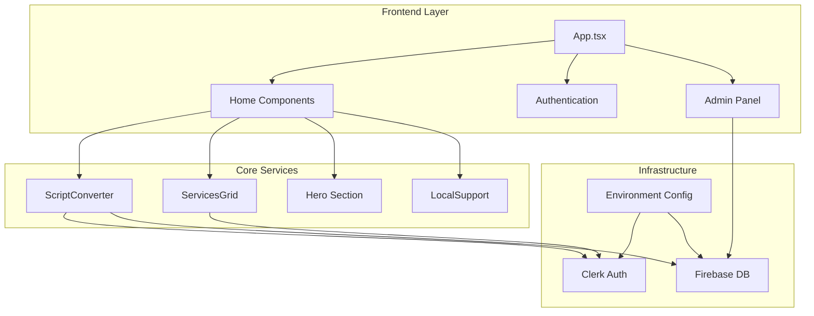
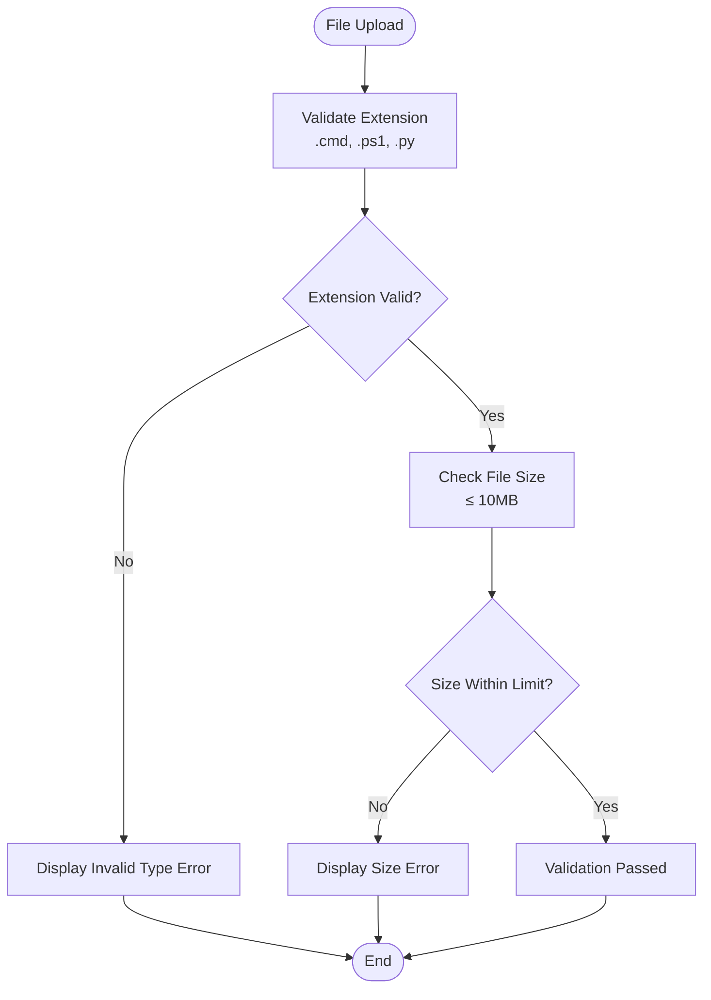
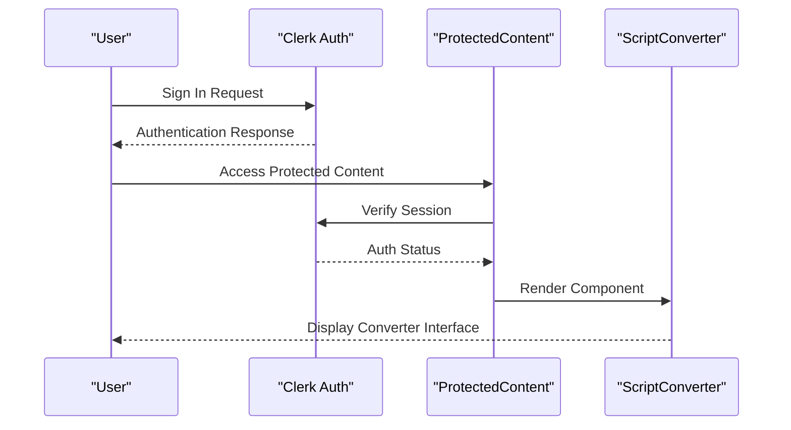
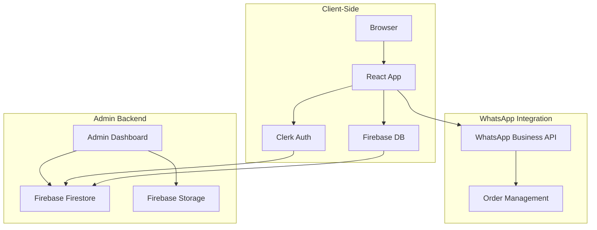
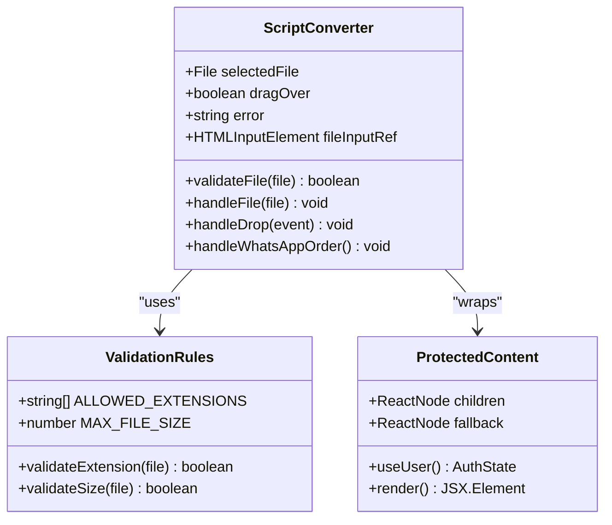
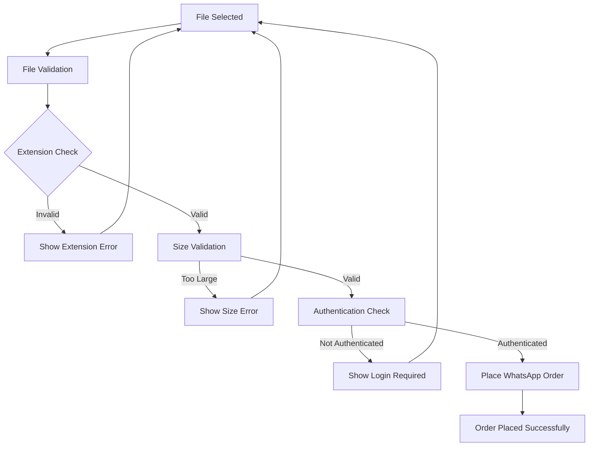
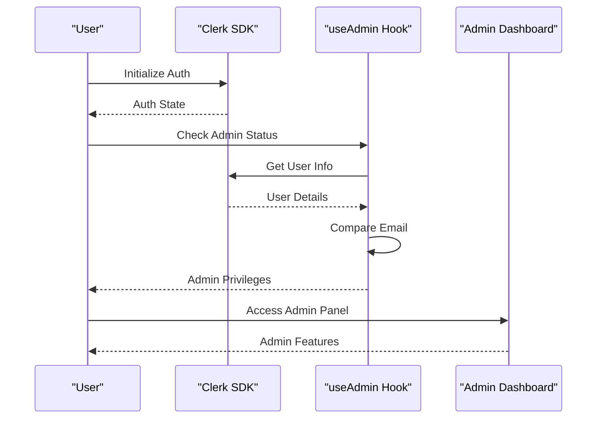
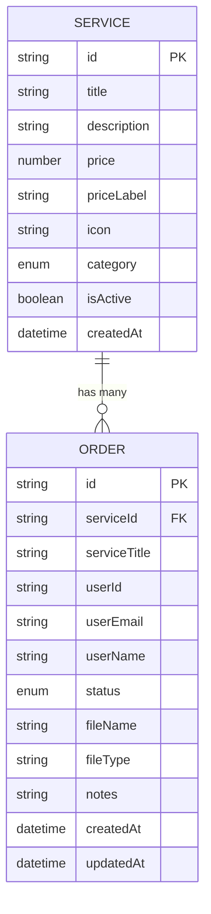
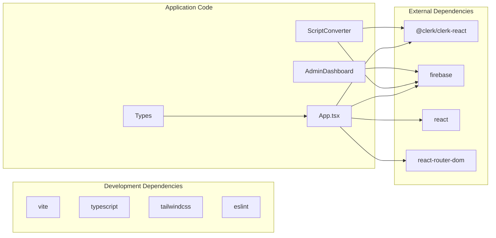

# Project Overview

<cite>
**Referenced Files in This Document**
- [README.md](file://README.md)
- [package.json](file://package.json)
- [src/App.tsx](file://src/App.tsx)
- [src/components/home/ScriptConverter.tsx](file://src/components/home/ScriptConverter.tsx)
- [src/components/home/Hero.tsx](file://src/components/home/Hero.tsx)
- [src/components/home/ServicesGrid.tsx](file://src/components/home/ServicesGrid.tsx)
- [src/components/auth/ProtectedContent.tsx](file://src/components/auth/ProtectedContent.tsx)
- [src/config/clerk.ts](file://src/config/clerk.ts)
- [src/config/firebase.ts](file://src/config/firebase.ts)
- [src/hooks/useAdmin.ts](file://src/hooks/useAdmin.ts)
- [src/types/index.ts](file://src/types/index.ts)
</cite>

## Table of Contents
1. [Introduction](#introduction)
2. [Project Structure](#project-structure)
3. [Core Components](#core-components)
4. [Architecture Overview](#architecture-overview)
5. [Detailed Component Analysis](#detailed-component-analysis)
6. [Dependency Analysis](#dependency-analysis)
7. [Performance Considerations](#performance-considerations)
8. [Troubleshooting Guide](#troubleshooting-guide)
9. [Conclusion](#conclusion)

## Introduction

DevForge is a professional script-to-executable conversion platform designed to transform PowerShell (.ps1), Python (.py), and Command Prompt (.cmd) scripts into standalone Windows executables. The platform serves as a comprehensive solution for developers and IT professionals who need reliable, fast, and secure script conversion services.

### Core Value Proposition

DevForge delivers exceptional value through:
- **Professional-grade conversion**: Transform any supported script into a standalone Windows executable without runtime dependencies
- **Streamlined workflow**: Simple drag-and-drop interface with instant validation and processing
- **Competitive pricing**: Affordable conversion service at ₹10 per script
- **Local expertise**: Hands-on technical support and on-site services in the Biraul area
- **Multi-service ecosystem**: Complete tech support including PC formatting, custom software development, and data recovery

### Target Audience

The platform targets two primary user segments:
- **Developers**: Seeking reliable script-to-EXE conversion for distribution and deployment
- **IT Professionals**: Requiring professional-grade automation tools and technical support services

### Key Benefits

- **Zero-dependency executables**: Generated .exe files run independently on target machines
- **Fast turnaround**: Under 24-hour processing time for standard conversions
- **Secure authentication**: Clerk-based user management ensures safe access
- **Flexible ordering**: WhatsApp integration for seamless order placement
- **Comprehensive support**: Full suite of technical services beyond script conversion

## Project Structure

The DevForge platform follows a modern React + TypeScript architecture built with Vite, organized into distinct functional areas:

**Diagram sources**
- [src/App.tsx:1-39](file://src/App.tsx#L1-L39)
- [src/components/home/ScriptConverter.tsx:1-188](file://src/components/home/ScriptConverter.tsx#L1-L188)
- [src/components/home/ServicesGrid.tsx:1-167](file://src/components/home/ServicesGrid.tsx#L1-L167)

**Section sources**
- [src/App.tsx:1-39](file://src/App.tsx#L1-L39)
- [package.json:1-38](file://package.json#L1-L38)

## Core Components

### Script Converter Component

The heart of the platform, the ScriptConverter component provides a sophisticated file upload interface with comprehensive validation and processing capabilities.

#### File Validation System

The converter implements robust validation through multiple mechanisms:

**Diagram sources**
- [src/components/home/ScriptConverter.tsx:16-28](file://src/components/home/ScriptConverter.tsx#L16-L28)

#### Conversion Workflow

The platform operates through a streamlined three-phase process:

1. **Upload Phase**: Users select or drag-and-drop supported script files
2. **Validation Phase**: Automatic file extension and size verification
3. **Order Placement**: Secure authentication and WhatsApp integration for processing

**Section sources**
- [src/components/home/ScriptConverter.tsx:1-188](file://src/components/home/ScriptConverter.tsx#L1-L188)

### Authentication and Security

The platform integrates Clerk authentication for secure user management and access control:

**Diagram sources**
- [src/components/auth/ProtectedContent.tsx:10-43](file://src/components/auth/ProtectedContent.tsx#L10-L43)
- [src/components/home/ScriptConverter.tsx:9-188](file://src/components/home/ScriptConverter.tsx#L9-L188)

**Section sources**
- [src/components/auth/ProtectedContent.tsx:1-44](file://src/components/auth/ProtectedContent.tsx#L1-L44)
- [src/config/clerk.ts:1-4](file://src/config/clerk.ts#L1-L4)

### Service Ecosystem

The platform offers a comprehensive suite of technology services beyond script conversion:

| Service Category | Description | Price Range | Key Features |
|------------------|-------------|-------------|--------------|
| Script-to-EXE | Professional script conversion | ₹10 | Standalone executables, no dependencies |
| PC Formatting | Complete system restoration | ₹500 | On-site service, driver updates |
| Custom Software | Bespoke applications | ₹999+ | Source code delivery, post-delivery support |
| Web Development | Modern websites | ₹2,999+ | Responsive design, CMS integration |
| Data Recovery | File restoration services | ₹299+ | Confidential handling, multiple media types |
| Virus Removal | Malware cleanup | ₹199 | Deep scanning, prevention training |

**Section sources**
- [src/components/home/ServicesGrid.tsx:5-114](file://src/components/home/ServicesGrid.tsx#L5-L114)

## Architecture Overview

DevForge employs a modern, cloud-native architecture combining frontend React components with backend services:

**Diagram sources**
- [src/App.tsx:23-38](file://src/App.tsx#L23-L38)
- [src/config/firebase.ts:1-19](file://src/config/firebase.ts#L1-L19)
- [src/config/clerk.ts:1-4](file://src/config/clerk.ts#L1-L4)

### Technology Stack

The platform leverages cutting-edge technologies for optimal performance and scalability:

- **Frontend**: React 19 with TypeScript, Vite build system
- **Authentication**: Clerk React SDK for secure user management
- **Database**: Firebase Firestore for real-time data synchronization
- **Storage**: Firebase Storage for file management
- **Deployment**: Optimized build pipeline with TypeScript compilation

**Section sources**
- [package.json:12-36](file://package.json#L12-L36)
- [src/config/firebase.ts:1-19](file://src/config/firebase.ts#L1-L19)

## Detailed Component Analysis

### Script Converter Implementation

The ScriptConverter component exemplifies modern React development patterns with comprehensive state management and user experience optimization.

#### State Management Architecture

**Diagram sources**
- [src/components/home/ScriptConverter.tsx:9-188](file://src/components/home/ScriptConverter.tsx#L9-L188)
- [src/components/auth/ProtectedContent.tsx:10-43](file://src/components/auth/ProtectedContent.tsx#L10-L43)

#### File Processing Pipeline

The converter implements a sophisticated file processing pipeline with comprehensive error handling:

**Diagram sources**
- [src/components/home/ScriptConverter.tsx:16-55](file://src/components/home/ScriptConverter.tsx#L16-L55)

**Section sources**
- [src/components/home/ScriptConverter.tsx:1-188](file://src/components/home/ScriptConverter.tsx#L1-L188)

### Authentication System

The authentication layer provides robust security through Clerk integration with custom admin privileges:

**Diagram sources**
- [src/hooks/useAdmin.ts:4-13](file://src/hooks/useAdmin.ts#L4-L13)
- [src/components/admin/AdminDashboard.tsx:18-52](file://src/components/admin/AdminDashboard.tsx#L18-L52)

**Section sources**
- [src/hooks/useAdmin.ts:1-14](file://src/hooks/useAdmin.ts#L1-L14)
- [src/components/admin/AdminDashboard.tsx:1-186](file://src/components/admin/AdminDashboard.tsx#L1-L186)

### Data Model Architecture

The platform utilizes a clean data model architecture supporting both services and orders:

**Diagram sources**
- [src/types/index.ts:1-40](file://src/types/index.ts#L1-L40)

**Section sources**
- [src/types/index.ts:1-40](file://src/types/index.ts#L1-L40)

## Dependency Analysis

The platform maintains clean separation of concerns through strategic dependency management:

**Diagram sources**
- [package.json:12-36](file://package.json#L12-L36)

### Key Dependencies

The platform relies on several critical dependencies for optimal functionality:

- **@clerk/clerk-react**: Enterprise-grade authentication and user management
- **firebase**: Real-time database and storage solutions
- **react-router-dom**: Client-side routing for SPA navigation
- **vite**: Lightning-fast build tool and development server

**Section sources**
- [package.json:12-36](file://package.json#L12-L36)

## Performance Considerations

DevForge is optimized for performance through several architectural decisions:

### Frontend Optimization
- **Lazy loading**: Components load only when needed
- **Efficient state management**: Minimal re-renders through proper React patterns
- **Optimized bundle size**: Tree-shaking and code splitting reduce initial load time

### Authentication Efficiency
- **Client-side caching**: Clerk SDK handles efficient session management
- **Conditional rendering**: Protected content only renders when authenticated

### Database Performance
- **Real-time updates**: Firebase Firestore provides instant data synchronization
- **Indexed queries**: Optimized data retrieval patterns

## Troubleshooting Guide

### Common Issues and Solutions

#### File Upload Problems
- **Issue**: Files not accepted despite valid extensions
- **Solution**: Verify file size does not exceed 10MB limit
- **Prevention**: Implement client-side size checking before upload

#### Authentication Errors
- **Issue**: Protected content not displaying
- **Solution**: Ensure user is signed in through Clerk authentication
- **Prevention**: Implement proper authentication guards

#### WhatsApp Integration Issues
- **Issue**: Order placement fails through WhatsApp
- **Solution**: Verify WhatsApp number configuration in environment variables
- **Prevention**: Test integration during development phase

**Section sources**
- [src/components/home/ScriptConverter.tsx:16-28](file://src/components/home/ScriptConverter.tsx#L16-L28)
- [src/components/auth/ProtectedContent.tsx:10-43](file://src/components/auth/ProtectedContent.tsx#L10-L43)

## Conclusion

DevForge represents a comprehensive solution for script-to-executable conversion needs, combining modern web technologies with practical business services. The platform successfully addresses the growing demand for professional script conversion services while maintaining technical excellence and user-friendly design.

### Competitive Advantages

- **Integrated ecosystem**: Combines conversion services with broader tech support offerings
- **Local presence**: On-site services in Biraul area provide personal touch
- **Professional quality**: Focus on high-quality, dependency-free executables
- **Streamlined workflow**: Simple, intuitive interface reduces friction
- **Secure infrastructure**: Enterprise-grade authentication and data protection

### Future Enhancement Opportunities

The platform provides a solid foundation for future growth, including potential integration with automated conversion pipelines, expanded service offerings, and enhanced administrative capabilities for managing conversion workflows and order processing.