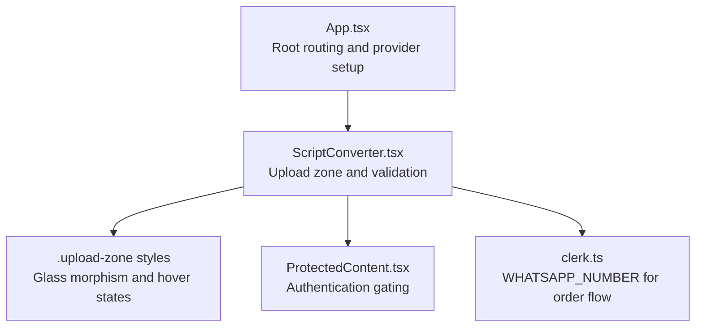
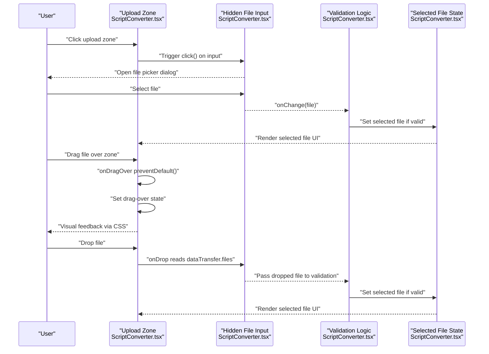
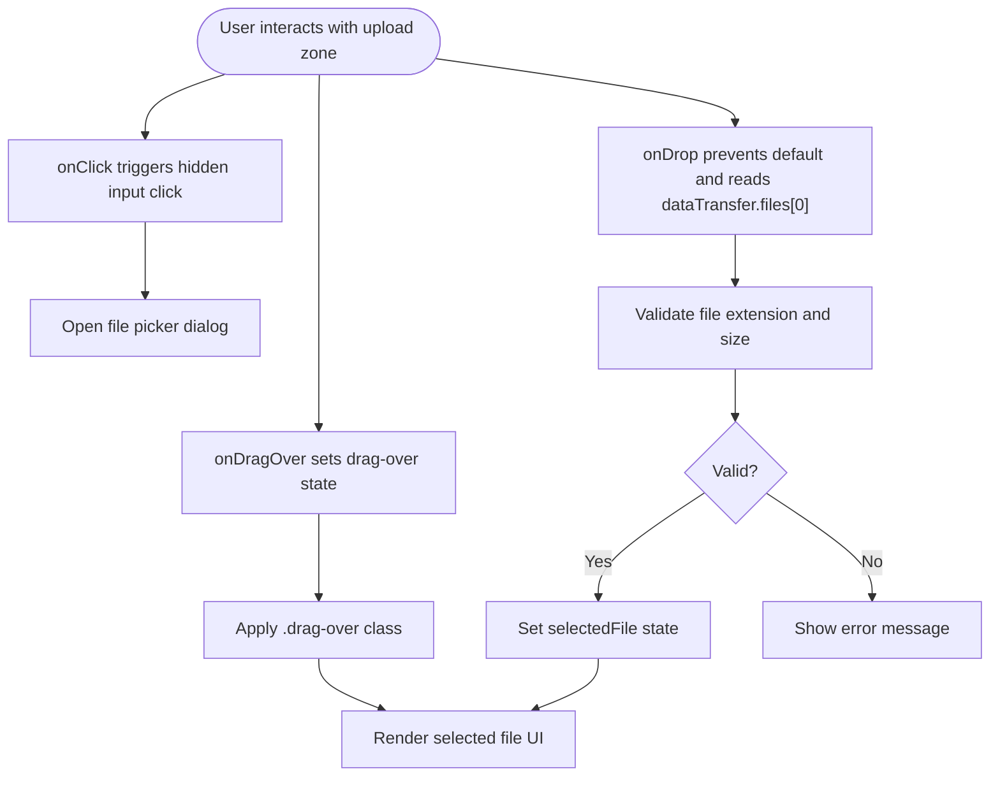
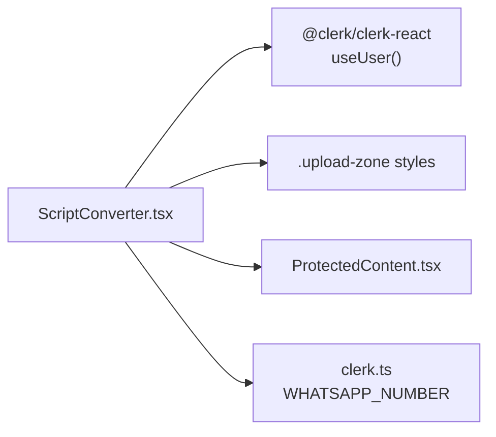

# File Upload Interface

<cite>
**Referenced Files in This Document**
- [ScriptConverter.tsx](file://src/components/home/ScriptConverter.tsx)
- [global.css](file://src/styles/global.css)
- [App.tsx](file://src/App.tsx)
- [ProtectedContent.tsx](file://src/components/auth/ProtectedContent.tsx)
- [clerk.ts](file://src/config/clerk.ts)
</cite>

## Table of Contents
1. [Introduction](#introduction)
2. [Project Structure](#project-structure)
3. [Core Components](#core-components)
4. [Architecture Overview](#architecture-overview)
5. [Detailed Component Analysis](#detailed-component-analysis)
6. [Dependency Analysis](#dependency-analysis)
7. [Performance Considerations](#performance-considerations)
8. [Troubleshooting Guide](#troubleshooting-guide)
9. [Conclusion](#conclusion)

## Introduction
This document explains the file upload interface component used for uploading scripts (.cmd, .ps1, .py) with a modern glass-morphism design. It covers the drag-and-drop implementation using HTML5 drag events, visual feedback during drag-over states, the hidden file input element configuration, the click-to-browse fallback mechanism, styling for the upload zone, and visual indicators for selected files. It also documents file input reference handling, event delegation patterns, and accessibility considerations. Finally, it provides implementation examples for customizing upload zones, adding file previews, and integrating with cloud storage services.

## Project Structure
The upload interface is part of the ScriptConverter component, which is rendered on the homepage. The component integrates with Clerk for authentication and uses Tailwind-based CSS utilities for styling.

**Diagram sources**
- [App.tsx:14-24](file://src/App.tsx#L14-L24)
- [ScriptConverter.tsx:9-187](file://src/components/home/ScriptConverter.tsx#L9-L187)
- [global.css:291-306](file://src/styles/global.css#L291-L306)
- [ProtectedContent.tsx:10-43](file://src/components/auth/ProtectedContent.tsx#L10-L43)
- [clerk.ts:1-4](file://src/config/clerk.ts#L1-L4)

**Section sources**
- [App.tsx:9-24](file://src/App.tsx#L9-L24)
- [ScriptConverter.tsx:57-153](file://src/components/home/ScriptConverter.tsx#L57-L153)

## Core Components
- Upload Zone Container: A clickable area that handles drag-and-drop events and renders either a placeholder or selected file details.
- Hidden File Input: An input[type=file] configured to accept only .cmd, .ps1, and .py files, triggered programmatically via click.
- Validation Logic: Ensures file extension and size constraints are met before selection.
- Visual Feedback: Uses CSS classes to indicate hover and drag-over states, plus emoji and typography to communicate state.
- Authentication Gating: Wraps the upload zone in a protected content wrapper that requires sign-in.

Key implementation references:
- Upload zone container and drag handlers: [ScriptConverter.tsx:60-69](file://src/components/home/ScriptConverter.tsx#L60-L69)
- Hidden input element and accept attribute: [ScriptConverter.tsx:70-79](file://src/components/home/ScriptConverter.tsx#L70-L79)
- Validation and selection: [ScriptConverter.tsx:16-37](file://src/components/home/ScriptConverter.tsx#L16-L37)
- Visual feedback classes: [global.css:291-306](file://src/styles/global.css#L291-L306)
- Protected content wrapper: [ProtectedContent.tsx:10-43](file://src/components/auth/ProtectedContent.tsx#L10-L43)

**Section sources**
- [ScriptConverter.tsx:60-79](file://src/components/home/ScriptConverter.tsx#L60-L79)
- [ScriptConverter.tsx:16-37](file://src/components/home/ScriptConverter.tsx#L16-L37)
- [global.css:291-306](file://src/styles/global.css#L291-L306)
- [ProtectedContent.tsx:10-43](file://src/components/auth/ProtectedContent.tsx#L10-L43)

## Architecture Overview
The upload interface follows a React component pattern with internal state management and CSS-driven visual feedback. The component delegates file selection to a hidden input while exposing a user-friendly drag-and-drop area.

**Diagram sources**
- [ScriptConverter.tsx:60-69](file://src/components/home/ScriptConverter.tsx#L60-L69)
- [ScriptConverter.tsx:70-79](file://src/components/home/ScriptConverter.tsx#L70-L79)
- [ScriptConverter.tsx:16-37](file://src/components/home/ScriptConverter.tsx#L16-L37)

## Detailed Component Analysis

### Upload Zone Container
- Purpose: Acts as the primary drop target and fallback for file selection.
- Event Handlers:
  - onDragOver: Prevents default browser behavior and sets drag-over state.
  - onDragLeave: Resets drag-over state.
  - onDrop: Prevents default, clears drag-over state, extracts the first file, and passes it to validation.
  - onClick: Programmatically clicks the hidden input to open the file picker.
- Visual Feedback:
  - Uses a CSS class that toggles on drag-over to change border color, background, and shadow.
  - Renders either a placeholder with instructions or a selected file indicator with filename and size.

Implementation references:
- Container and handlers: [ScriptConverter.tsx:60-69](file://src/components/home/ScriptConverter.tsx#L60-L69)
- Drag-over class: [global.css:301-306](file://src/styles/global.css#L301-L306)
- Placeholder vs selected UI: [ScriptConverter.tsx:83-109](file://src/components/home/ScriptConverter.tsx#L83-L109)

**Diagram sources**
- [ScriptConverter.tsx:60-69](file://src/components/home/ScriptConverter.tsx#L60-L69)
- [ScriptConverter.tsx:16-37](file://src/components/home/ScriptConverter.tsx#L16-L37)
- [global.css:301-306](file://src/styles/global.css#L301-L306)

**Section sources**
- [ScriptConverter.tsx:60-69](file://src/components/home/ScriptConverter.tsx#L60-L69)
- [ScriptConverter.tsx:83-109](file://src/components/home/ScriptConverter.tsx#L83-L109)
- [global.css:291-306](file://src/styles/global.css#L291-L306)

### Hidden File Input Element
- Configuration:
  - type="file" with accept=".cmd,.ps1,.py" restricts allowed file types.
  - display: none hides the input visually while keeping it focusable for programmatic triggering.
- Behavior:
  - onChange captures the selected file and passes it to validation logic.
  - Triggered by clicking the upload zone container.

Implementation references:
- Hidden input definition: [ScriptConverter.tsx:70-79](file://src/components/home/ScriptConverter.tsx#L70-L79)
- Accept attribute: [ScriptConverter.tsx:73](file://src/components/home/ScriptConverter.tsx#L73)

**Section sources**
- [ScriptConverter.tsx:70-79](file://src/components/home/ScriptConverter.tsx#L70-L79)

### Validation and Selection Logic
- Validation Rules:
  - Allowed extensions: .cmd, .ps1, .py (case-insensitive).
  - Max file size: 10 MB.
- Selection Flow:
  - On successful validation, the selected file is stored in component state.
  - Errors are displayed with a styled message.

Implementation references:
- Validation function: [ScriptConverter.tsx:16-28](file://src/components/home/ScriptConverter.tsx#L16-L28)
- Selection handler: [ScriptConverter.tsx:30-37](file://src/components/home/ScriptConverter.tsx#L30-L37)
- Error rendering: [ScriptConverter.tsx:111-122](file://src/components/home/ScriptConverter.tsx#L111-L122)

**Section sources**
- [ScriptConverter.tsx:16-28](file://src/components/home/ScriptConverter.tsx#L16-L28)
- [ScriptConverter.tsx:30-37](file://src/components/home/ScriptConverter.tsx#L30-L37)
- [ScriptConverter.tsx:111-122](file://src/components/home/ScriptConverter.tsx#L111-L122)

### Visual Feedback and Styling
- Upload Zone Styles:
  - Dashed border, rounded corners, padding, centered text, and hover transitions.
  - Drag-over state changes border color, background, and adds an inner glow shadow.
- Glass Morphism:
  - The upload zone sits inside a glass-panel container for a frosted effect.
  - Hover effects enhance the glass appearance.

Implementation references:
- Upload zone base and drag-over: [global.css:291-306](file://src/styles/global.css#L291-L306)
- Glass panel utilities: [global.css:92-115](file://src/styles/global.css#L92-L115)

**Section sources**
- [global.css:291-306](file://src/styles/global.css#L291-L306)
- [global.css:92-115](file://src/styles/global.css#L92-L115)

### Accessibility Considerations
- Keyboard and Screen Reader Friendly:
  - The hidden input remains focusable and operable via assistive technologies.
  - The upload zone is a clickable container that triggers the input, ensuring non-mouse users can still select files.
- Visual Indicators:
  - Clear text instructions and emoji cues help convey state without relying solely on color.
  - Drag-over state is purely visual; ensure any critical information is also conveyed via text.

Implementation references:
- Hidden input focusability: [ScriptConverter.tsx:70-79](file://src/components/home/ScriptConverter.tsx#L70-L79)
- Click-to-browse fallback: [ScriptConverter.tsx:68](file://src/components/home/ScriptConverter.tsx#L68)

**Section sources**
- [ScriptConverter.tsx:70-79](file://src/components/home/ScriptConverter.tsx#L70-L79)
- [ScriptConverter.tsx:68](file://src/components/home/ScriptConverter.tsx#L68)

### Authentication Gating
- The upload zone is wrapped in a protected content component that:
  - Blocks access until the user is signed in.
  - Applies a locked overlay with blur and prompts the user to sign in.

Implementation references:
- Protected content wrapper: [ProtectedContent.tsx:10-43](file://src/components/auth/ProtectedContent.tsx#L10-L43)
- Authentication integration: [ScriptConverter.tsx:9-14](file://src/components/home/ScriptConverter.tsx#L9-L14)

**Section sources**
- [ProtectedContent.tsx:10-43](file://src/components/auth/ProtectedContent.tsx#L10-L43)
- [ScriptConverter.tsx:9-14](file://src/components/home/ScriptConverter.tsx#L9-L14)

## Dependency Analysis
The upload interface depends on:
- Clerk for authentication gating.
- CSS utilities for glass-morphism and drag-over visuals.
- Environment configuration for external integrations.

**Diagram sources**
- [ScriptConverter.tsx:1-4](file://src/components/home/ScriptConverter.tsx#L1-L4)
- [global.css:291-306](file://src/styles/global.css#L291-L306)
- [ProtectedContent.tsx:1-3](file://src/components/auth/ProtectedContent.tsx#L1-L3)
- [clerk.ts:1-4](file://src/config/clerk.ts#L1-L4)

**Section sources**
- [ScriptConverter.tsx:1-4](file://src/components/home/ScriptConverter.tsx#L1-L4)
- [global.css:291-306](file://src/styles/global.css#L291-L306)
- [ProtectedContent.tsx:1-3](file://src/components/auth/ProtectedContent.tsx#L1-L3)
- [clerk.ts:1-4](file://src/config/clerk.ts#L1-L4)

## Performance Considerations
- File Size Limit: Enforced client-side to prevent large uploads and reduce memory pressure.
- Single File Handling: Only the first file from dataTransfer is processed; additional files are ignored.
- Minimal Re-renders: Validation and selection are memoized via callbacks to avoid unnecessary updates.

[No sources needed since this section provides general guidance]

## Troubleshooting Guide
Common issues and resolutions:
- Drag-and-drop not working:
  - Ensure onDragOver prevents default behavior and sets drag-over state.
  - Verify the container has a click handler that triggers the hidden input.
  - References: [ScriptConverter.tsx:60-69](file://src/components/home/ScriptConverter.tsx#L60-L69)
- File type rejected:
  - Confirm accept attribute matches allowed extensions.
  - Validate that the extension check is case-insensitive.
  - References: [ScriptConverter.tsx:73](file://src/components/home/ScriptConverter.tsx#L73), [ScriptConverter.tsx:16-28](file://src/components/home/ScriptConverter.tsx#L16-L28)
- Visual feedback not appearing:
  - Check that the drag-over class is applied and CSS rules are loaded.
  - References: [global.css:301-306](file://src/styles/global.css#L301-L306)
- Hidden input not opening:
  - Ensure the container’s click handler calls the ref’s click method.
  - References: [ScriptConverter.tsx:68](file://src/components/home/ScriptConverter.tsx#L68), [ScriptConverter.tsx:70-79](file://src/components/home/ScriptConverter.tsx#L70-L79)

**Section sources**
- [ScriptConverter.tsx:60-69](file://src/components/home/ScriptConverter.tsx#L60-L69)
- [ScriptConverter.tsx:73](file://src/components/home/ScriptConverter.tsx#L73)
- [ScriptConverter.tsx:16-28](file://src/components/home/ScriptConverter.tsx#L16-L28)
- [global.css:301-306](file://src/styles/global.css#L301-L306)
- [ScriptConverter.tsx:68](file://src/components/home/ScriptConverter.tsx#L68)
- [ScriptConverter.tsx:70-79](file://src/components/home/ScriptConverter.tsx#L70-L79)

## Conclusion
The file upload interface combines a robust drag-and-drop experience with a clean glass-morphism design and strong validation. It provides clear visual feedback, supports keyboard and assistive technology users, and integrates seamlessly with authentication and external services. The modular structure allows easy customization for additional file types, preview capabilities, and cloud storage integrations.