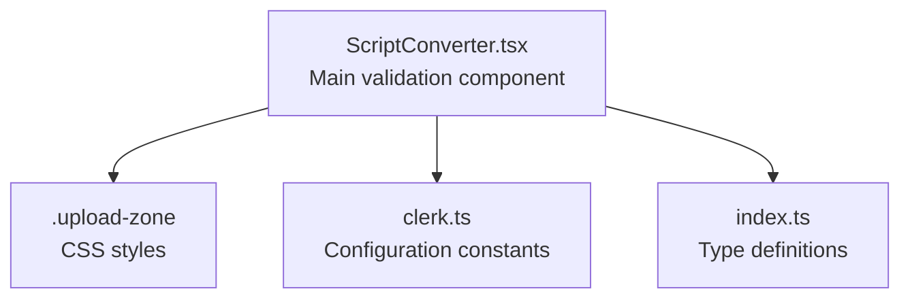
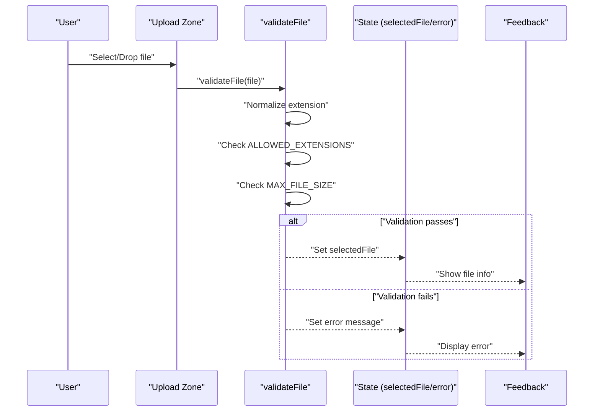
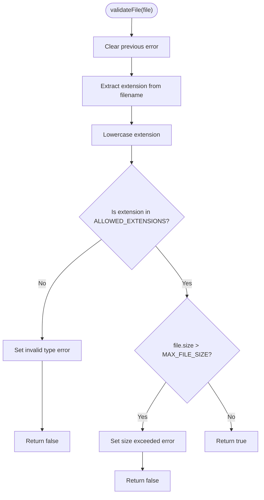
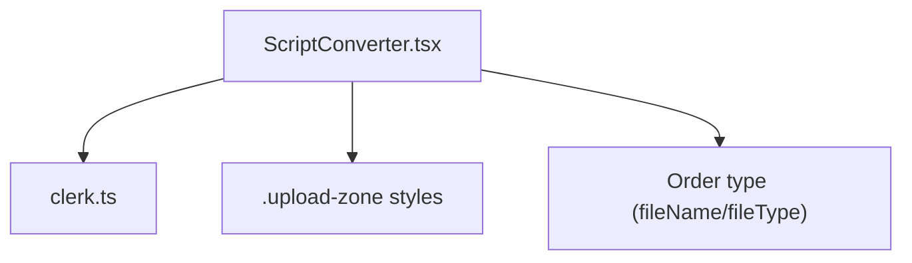

# File Validation System

<cite>
**Referenced Files in This Document**
- [ScriptConverter.tsx](file://src/components/home/ScriptConverter.tsx)
- [global.css](file://src/styles/global.css)
- [clerk.ts](file://src/config/clerk.ts)
- [index.ts](file://src/types/index.ts)
</cite>

## Table of Contents
1. [Introduction](#introduction)
2. [Project Structure](#project-structure)
3. [Core Components](#core-components)
4. [Architecture Overview](#architecture-overview)
5. [Detailed Component Analysis](#detailed-component-analysis)
6. [Dependency Analysis](#dependency-analysis)
7. [Performance Considerations](#performance-considerations)
8. [Troubleshooting Guide](#troubleshooting-guide)
9. [Conclusion](#conclusion)

## Introduction
This document provides comprehensive documentation for the file validation system implemented in the project. It focuses on the validation logic for file uploads, including extension checking against a configurable allowlist, file size validation, error messaging, and user feedback mechanisms. The system centers around a reusable validation callback that enforces rules and manages error state, with clear user-facing feedback through styled UI elements.

## Project Structure
The file validation system is implemented within a single React component responsible for script-to-executable conversion. Supporting styles and configuration are located in dedicated files for consistent behavior and maintainability.

**Diagram sources**
- [ScriptConverter.tsx:1-188](file://src/components/home/ScriptConverter.tsx#L1-L188)
- [global.css:291-306](file://src/styles/global.css#L291-L306)
- [clerk.ts:1-4](file://src/config/clerk.ts#L1-L4)
- [index.ts:1-40](file://src/types/index.ts#L1-L40)

**Section sources**
- [ScriptConverter.tsx:1-188](file://src/components/home/ScriptConverter.tsx#L1-L188)
- [global.css:291-306](file://src/styles/global.css#L291-L306)
- [clerk.ts:1-4](file://src/config/clerk.ts#L1-L4)
- [index.ts:1-40](file://src/types/index.ts#L1-L40)

## Core Components
- Validation constants:
  - ALLOWED_EXTENSIONS: An array of supported file extensions (case-insensitive).
  - MAX_FILE_SIZE: Maximum allowed file size in bytes.
- Validation callback:
  - validateFile(file: File): boolean
    - Clears previous errors.
    - Extracts and normalizes the file extension.
    - Checks extension against ALLOWED_EXTENSIONS.
    - Validates file size against MAX_FILE_SIZE.
    - Sets appropriate error messages and returns false on failure; otherwise returns true.
- State management:
  - selectedFile: Tracks the validated file.
  - error: Stores the current validation error message.
  - dragOver: Manages drag-and-drop visual feedback.
- User feedback:
  - Styled upload zone with hover/drag-over effects.
  - Error message display with monospace styling and red color.
  - File metadata display (name and size) when a valid file is selected.

**Section sources**
- [ScriptConverter.tsx:6-28](file://src/components/home/ScriptConverter.tsx#L6-L28)
- [ScriptConverter.tsx:11-14](file://src/components/home/ScriptConverter.tsx#L11-L14)
- [ScriptConverter.tsx:57-122](file://src/components/home/ScriptConverter.tsx#L57-L122)
- [global.css:291-306](file://src/styles/global.css#L291-L306)

## Architecture Overview
The validation system follows a functional pattern with React hooks. The validateFile callback encapsulates all validation logic and is invoked whenever a file is selected via drag-and-drop or file input. On success, the selected file is stored; on failure, an error message is displayed to the user.

**Diagram sources**
- [ScriptConverter.tsx:16-28](file://src/components/home/ScriptConverter.tsx#L16-L28)
- [ScriptConverter.tsx:30-37](file://src/components/home/ScriptConverter.tsx#L30-L37)
- [ScriptConverter.tsx:57-122](file://src/components/home/ScriptConverter.tsx#L57-L122)

## Detailed Component Analysis

### File Type Detection and Extension Matching
- Extension extraction:
  - The filename is split by "." and the last segment is taken as the extension.
  - The detected extension is lowercased to ensure case-insensitive comparison.
- Case-insensitive matching:
  - The normalized extension is compared against ALLOWED_EXTENSIONS.
  - The allowlist itself is maintained in lowercase to guarantee consistent matching.
- Supported formats:
  - Current allowlist includes ".cmd", ".ps1", ".py".

**Diagram sources**
- [ScriptConverter.tsx:16-28](file://src/components/home/ScriptConverter.tsx#L16-L28)

**Section sources**
- [ScriptConverter.tsx:16-28](file://src/components/home/ScriptConverter.tsx#L16-L28)

### File Size Validation
- Size limit enforcement:
  - The uploaded file's size is compared against MAX_FILE_SIZE.
  - Exceeding the limit triggers a specific error message.
- Size calculation method:
  - The component displays file size in kilobytes by dividing bytes by 1024.
  - This calculation is performed for user feedback and does not affect validation.

**Section sources**
- [ScriptConverter.tsx:7-8](file://src/components/home/ScriptConverter.tsx#L7-L8)
- [ScriptConverter.tsx:23-25](file://src/components/home/ScriptConverter.tsx#L23-L25)
- [ScriptConverter.tsx:95-96](file://src/components/home/ScriptConverter.tsx#L95-L96)

### Error Messaging Implementation
- Error state management:
  - The validateFile callback clears prior errors before performing checks.
  - On failure, it sets an error message describing the issue.
- User feedback:
  - Errors are rendered below the upload zone with a distinctive red color and monospace font.
  - The error message is displayed until a new selection is made or the file is cleared.

**Section sources**
- [ScriptConverter.tsx:17-27](file://src/components/home/ScriptConverter.tsx#L17-L27)
- [ScriptConverter.tsx:111-122](file://src/components/home/ScriptConverter.tsx#L111-L122)

### User Feedback Mechanisms
- Visual feedback:
  - The upload zone changes appearance on hover and during drag-over.
  - A checkmark icon indicates a valid selection; a folder icon indicates no selection.
- Textual feedback:
  - Selected file name and size are shown when a valid file is chosen.
  - The upload zone provides clear instructions and supported formats.

**Section sources**
- [ScriptConverter.tsx:80-108](file://src/components/home/ScriptConverter.tsx#L80-L108)
- [global.css:291-306](file://src/styles/global.css#L291-L306)

### Example: Extending Supported File Formats
To add support for additional file types:
- Modify ALLOWED_EXTENSIONS to include new lowercase extensions.
- Ensure the accept attribute on the file input matches the new allowlist.
- Update any user-facing messaging to reflect the expanded support.

Implementation pointers:
- Update the allowlist constant and the input accept attribute.
- Verify that the extension normalization remains consistent.

**Section sources**
- [ScriptConverter.tsx:6](file://src/components/home/ScriptConverter.tsx#L6)
- [ScriptConverter.tsx:73](file://src/components/home/ScriptConverter.tsx#L73)

### Example: Adjusting Size Limits
To change the maximum file size:
- Update MAX_FILE_SIZE to the desired byte value.
- Reflect the new limit in user-facing messaging and the upload zone instructions.
- Consider backend implications if server-side validation is also enforced.

Implementation pointers:
- Change the constant value and update related UI text.

**Section sources**
- [ScriptConverter.tsx:7](file://src/components/home/ScriptConverter.tsx#L7)
- [ScriptConverter.tsx:105](file://src/components/home/ScriptConverter.tsx#L105)

### Example: Implementing Custom Validation Rules
To enforce additional rules per file type:
- Extend validateFile to include type-specific checks (e.g., MIME-type verification, magic number detection).
- Add conditional logic based on the detected extension.
- Maintain backward compatibility by preserving existing checks.

Implementation pointers:
- Add new branches in validateFile for specific extensions.
- Keep error messages descriptive and actionable.

**Section sources**
- [ScriptConverter.tsx:16-28](file://src/components/home/ScriptConverter.tsx#L16-L28)

## Dependency Analysis
The validation system interacts with external configuration and styling resources. The component relies on Clerk configuration constants and applies styles from the global stylesheet.

**Diagram sources**
- [ScriptConverter.tsx:1-4](file://src/components/home/ScriptConverter.tsx#L1-L4)
- [clerk.ts:1-4](file://src/config/clerk.ts#L1-L4)
- [global.css:291-306](file://src/styles/global.css#L291-L306)
- [index.ts:14-27](file://src/types/index.ts#L14-L27)

**Section sources**
- [ScriptConverter.tsx:1-4](file://src/components/home/ScriptConverter.tsx#L1-L4)
- [clerk.ts:1-4](file://src/config/clerk.ts#L1-L4)
- [global.css:291-306](file://src/styles/global.css#L291-L306)
- [index.ts:14-27](file://src/types/index.ts#L14-L27)

## Performance Considerations
- Validation cost:
  - Extension extraction and comparison are O(n) with respect to the number of allowed extensions; the current allowlist is small, so performance impact is negligible.
- Rendering overhead:
  - Error messages and file metadata are conditionally rendered, minimizing unnecessary DOM updates.
- Memory usage:
  - The selected file is held in state; consider clearing it after successful submission to free memory.

## Troubleshooting Guide
- Common issues and resolutions:
  - Invalid file type error: Ensure the file extension is included in ALLOWED_EXTENSIONS and matches the casing expectations.
  - File too large error: Reduce file size below MAX_FILE_SIZE or adjust the limit as needed.
  - No visual feedback: Verify that the upload zone styles are applied and that error rendering logic is active.
- Debug tips:
  - Log the detected extension and size to confirm normalization and validation thresholds.
  - Confirm that the file input accept attribute aligns with the allowlist.

**Section sources**
- [ScriptConverter.tsx:16-28](file://src/components/home/ScriptConverter.tsx#L16-L28)
- [ScriptConverter.tsx:111-122](file://src/components/home/ScriptConverter.tsx#L111-L122)

## Conclusion
The file validation system provides a clean, reusable pattern for enforcing file type and size constraints with clear user feedback. Its modular design allows easy extension to new formats, adjustment of size limits, and addition of custom validation rules tailored to specific file types.