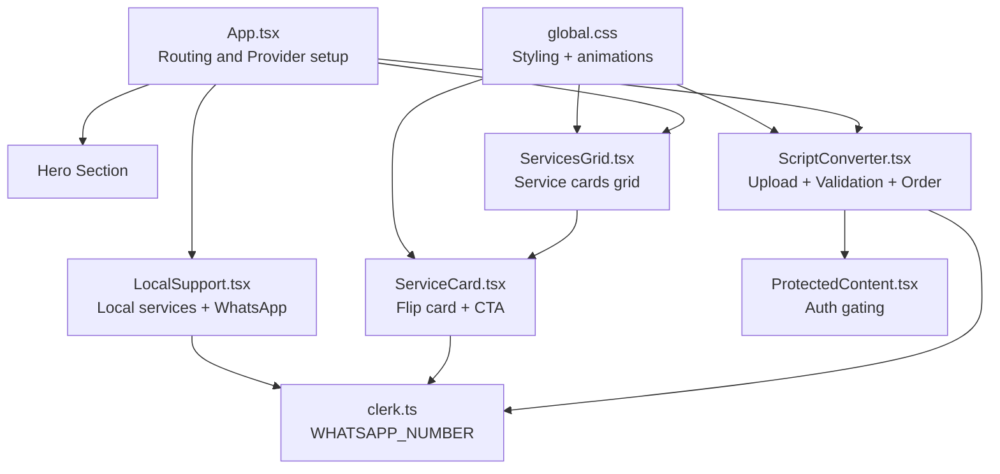
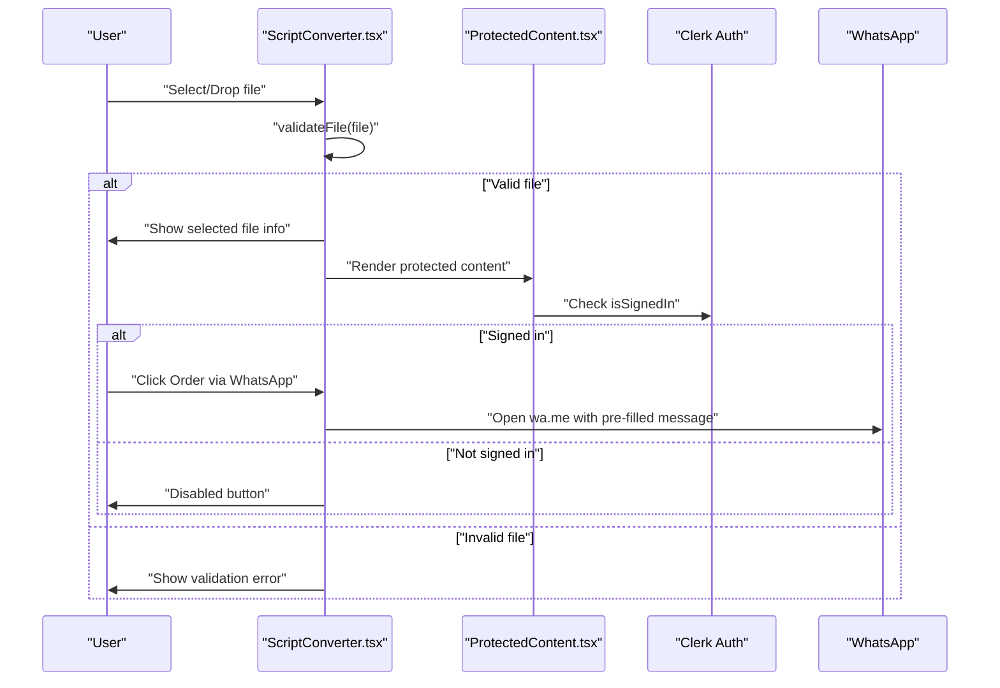
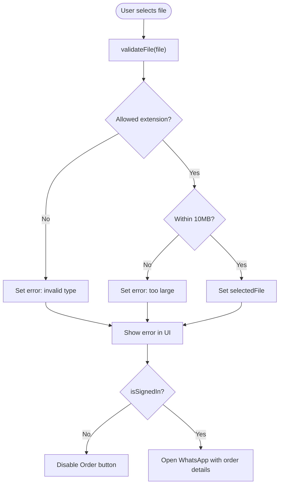
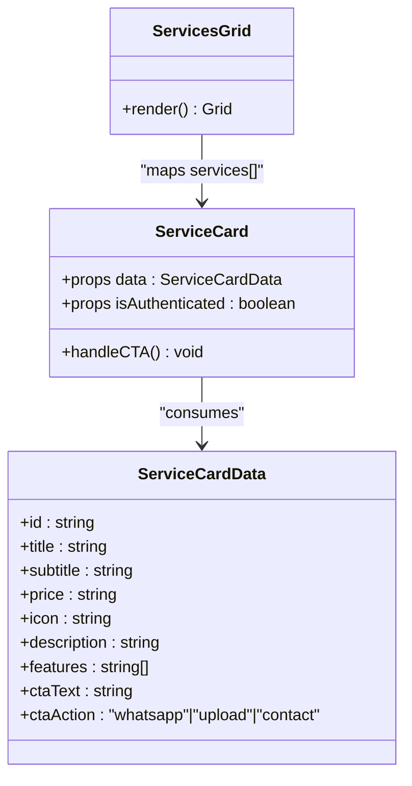
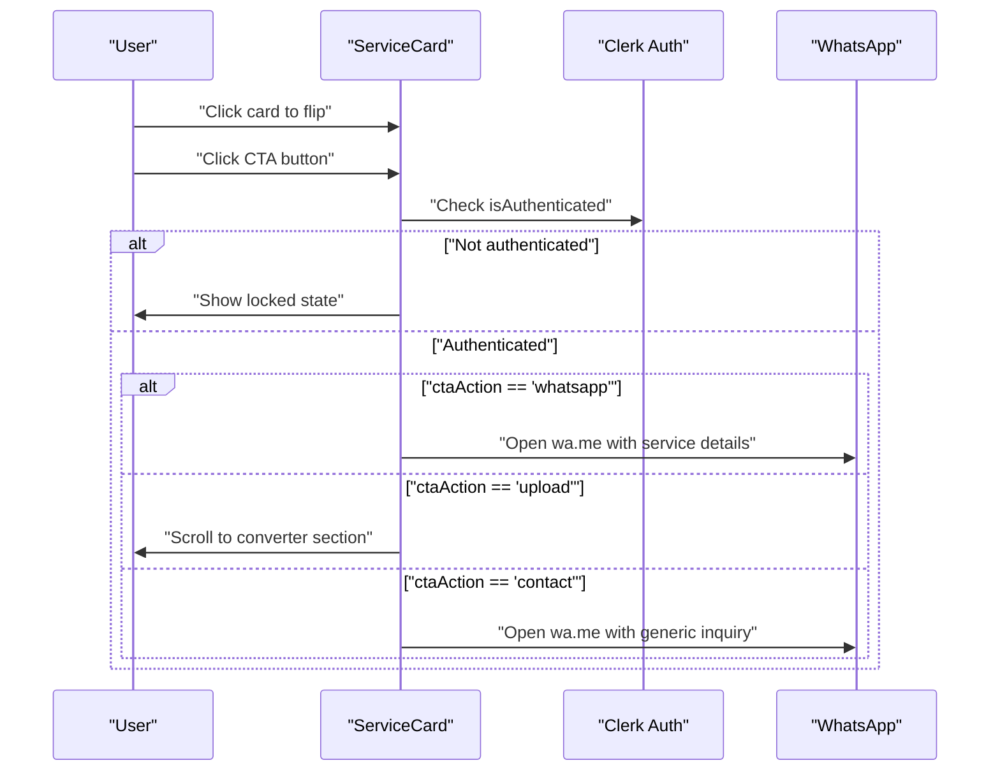
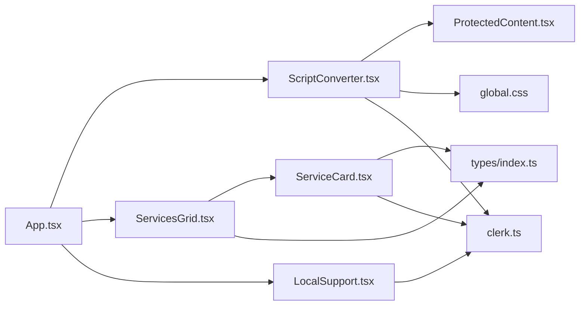

# Script Conversion Service

<cite>
**Referenced Files in This Document**
- [ScriptConverter.tsx](file://src/components/home/ScriptConverter.tsx)
- [ServicesGrid.tsx](file://src/components/home/ServicesGrid.tsx)
- [ServiceCard.tsx](file://src/components/home/ServiceCard.tsx)
- [ProtectedContent.tsx](file://src/components/auth/ProtectedContent.tsx)
- [clerk.ts](file://src/config/clerk.ts)
- [index.ts](file://src/types/index.ts)
- [App.tsx](file://src/App.tsx)
- [global.css](file://src/styles/global.css)
- [LocalSupport.tsx](file://src/components/home/LocalSupport.tsx)
</cite>

## Table of Contents
1. [Introduction](#introduction)
2. [Project Structure](#project-structure)
3. [Core Components](#core-components)
4. [Architecture Overview](#architecture-overview)
5. [Detailed Component Analysis](#detailed-component-analysis)
6. [Dependency Analysis](#dependency-analysis)
7. [Performance Considerations](#performance-considerations)
8. [Security and Compliance](#security-and-compliance)
9. [Troubleshooting Guide](#troubleshooting-guide)
10. [Conclusion](#conclusion)
11. [Appendices](#appendices)

## Introduction
This document explains DevForge’s script-to-executable conversion service. It covers the file upload interface with drag-and-drop and validation, supported formats and limits, the end-to-end conversion workflow, the ServicesGrid and ServiceCard components that present offerings and pricing, and the integration with external services via WhatsApp. It also outlines security considerations and compliance requirements, and provides implementation examples for customization.

## Project Structure
The conversion service is implemented as a React component integrated into the homepage. Authentication is enforced via Clerk, and the UI leverages a glassmorphic design system.

**Diagram sources**
- [App.tsx:14-24](file://src/App.tsx#L14-L24)
- [ServicesGrid.tsx:116-166](file://src/components/home/ServicesGrid.tsx#L116-L166)
- [ScriptConverter.tsx:9-187](file://src/components/home/ScriptConverter.tsx#L9-L187)
- [ServiceCard.tsx:10-176](file://src/components/home/ServiceCard.tsx#L10-L176)
- [ProtectedContent.tsx:10-43](file://src/components/auth/ProtectedContent.tsx#L10-L43)
- [clerk.ts:1-4](file://src/config/clerk.ts#L1-L4)
- [global.css:1-383](file://src/styles/global.css#L1-L383)

**Section sources**
- [App.tsx:14-24](file://src/App.tsx#L14-L24)
- [global.css:1-383](file://src/styles/global.css#L1-L383)

## Core Components
- ScriptConverter: Handles file selection, drag-and-drop, validation, and initiates WhatsApp orders.
- ServicesGrid: Renders a responsive grid of service cards including the script-to-EXE offering.
- ServiceCard: Implements a flip-card UI for service details and actions.
- ProtectedContent: Enforces authentication for sensitive sections.
- Types: Defines the shape for service cards and orders.
- Clerk Config: Provides the WhatsApp number used for all orders.

**Section sources**
- [ScriptConverter.tsx:6-28](file://src/components/home/ScriptConverter.tsx#L6-L28)
- [ServicesGrid.tsx:5-114](file://src/components/home/ServicesGrid.tsx#L5-L114)
- [ServiceCard.tsx:5-28](file://src/components/home/ServiceCard.tsx#L5-L28)
- [ProtectedContent.tsx:10-43](file://src/components/auth/ProtectedContent.tsx#L10-L43)
- [index.ts:29-40](file://src/types/index.ts#L29-L40)
- [clerk.ts:1-4](file://src/config/clerk.ts#L1-L4)

## Architecture Overview
The conversion workflow is client-driven for UX and authentication, with actual processing handled externally via WhatsApp orders. The system enforces authentication and presents a polished UI with animations and glass effects.

**Diagram sources**
- [ScriptConverter.tsx:16-28](file://src/components/home/ScriptConverter.tsx#L16-L28)
- [ScriptConverter.tsx:49-55](file://src/components/home/ScriptConverter.tsx#L49-L55)
- [ProtectedContent.tsx:10-43](file://src/components/auth/ProtectedContent.tsx#L10-L43)
- [clerk.ts:1-4](file://src/config/clerk.ts#L1-L4)

## Detailed Component Analysis

### ScriptConverter: Upload, Validation, and Ordering
- Supported formats: .cmd, .ps1, .py
- Size limit: 10 MB
- Validation logic:
  - Extension whitelist check
  - Size check against 10 MB
  - Error messages surfaced to the UI
- Drag-and-drop zone:
  - Visual feedback during drag-over
  - Accepts only allowed extensions
  - Click-to-browse fallback
- Order flow:
  - Requires authentication
  - Opens WhatsApp with a pre-formatted message containing file metadata
  - Includes a clear action to reset selection

**Diagram sources**
- [ScriptConverter.tsx:16-28](file://src/components/home/ScriptConverter.tsx#L16-L28)
- [ScriptConverter.tsx:39-47](file://src/components/home/ScriptConverter.tsx#L39-L47)
- [ScriptConverter.tsx:49-55](file://src/components/home/ScriptConverter.tsx#L49-L55)

**Section sources**
- [ScriptConverter.tsx:6-7](file://src/components/home/ScriptConverter.tsx#L6-L7)
- [ScriptConverter.tsx:16-28](file://src/components/home/ScriptConverter.tsx#L16-L28)
- [ScriptConverter.tsx:39-47](file://src/components/home/ScriptConverter.tsx#L39-L47)
- [ScriptConverter.tsx:49-55](file://src/components/home/ScriptConverter.tsx#L49-L55)
- [ScriptConverter.tsx:57-153](file://src/components/home/ScriptConverter.tsx#L57-L153)

### ServicesGrid: Presenting Offerings and Pricing
- Displays multiple services in a responsive grid
- The script-to-EXE service card includes:
  - Title, subtitle, price, icon, description
  - Feature list
  - Call-to-action: “Convert Now” with upload intent
- Uses ServiceCard for rendering each item

**Diagram sources**
- [ServicesGrid.tsx:116-166](file://src/components/home/ServicesGrid.tsx#L116-L166)
- [ServiceCard.tsx:5-8](file://src/components/home/ServiceCard.tsx#L5-L8)
- [index.ts:29-40](file://src/types/index.ts#L29-L40)

**Section sources**
- [ServicesGrid.tsx:5-114](file://src/components/home/ServicesGrid.tsx#L5-L114)
- [ServicesGrid.tsx:116-166](file://src/components/home/ServicesGrid.tsx#L116-L166)
- [index.ts:29-40](file://src/types/index.ts#L29-L40)

### ServiceCard: Interactive Service Presentation
- Flip animation to reveal features and CTA
- Three CTA modes:
  - whatsapp: opens WhatsApp with a pre-filled message
  - upload: scrolls to the converter section
  - contact: opens WhatsApp with a generic inquiry
- Requires authentication for CTA actions

**Diagram sources**
- [ServiceCard.tsx:10-28](file://src/components/home/ServiceCard.tsx#L10-L28)
- [ServiceCard.tsx:13-27](file://src/components/home/ServiceCard.tsx#L13-L27)
- [clerk.ts:1-4](file://src/config/clerk.ts#L1-L4)

**Section sources**
- [ServiceCard.tsx:10-28](file://src/components/home/ServiceCard.tsx#L10-L28)
- [ServiceCard.tsx:30-176](file://src/components/home/ServiceCard.tsx#L30-L176)

### ProtectedContent: Authentication Gating
- Ensures only signed-in users can interact with protected sections
- Shows a blurred overlay and lock indicator when not authenticated
- Uses Clerk user state to decide visibility

**Section sources**
- [ProtectedContent.tsx:10-43](file://src/components/auth/ProtectedContent.tsx#L10-L43)

### WhatsApp Integration
- Centralized phone number configured via environment variables
- Used by:
  - ScriptConverter for conversion orders
  - ServiceCard for service inquiries
  - LocalSupport for on-site service requests

**Section sources**
- [clerk.ts:1-4](file://src/config/clerk.ts#L1-L4)
- [ScriptConverter.tsx:49-55](file://src/components/home/ScriptConverter.tsx#L49-L55)
- [ServiceCard.tsx:15-27](file://src/components/home/ServiceCard.tsx#L15-L27)
- [LocalSupport.tsx:13-18](file://src/components/home/LocalSupport.tsx#L13-L18)

### Styling and Animations
- Glassmorphism panels, neon accents, and macOS-style card flips
- Animations for loading, floating, and glow effects
- Responsive grid layouts for services

**Section sources**
- [global.css:93-136](file://src/styles/global.css#L93-L136)
- [global.css:138-203](file://src/styles/global.css#L138-L203)
- [global.css:205-265](file://src/styles/global.css#L205-L265)
- [global.css:291-306](file://src/styles/global.css#L291-L306)
- [global.css:323-376](file://src/styles/global.css#L323-L376)

## Dependency Analysis
- ScriptConverter depends on:
  - Clerk for authentication state
  - ProtectedContent for gating
  - Global CSS for styling and animations
- ServicesGrid depends on:
  - ServiceCard for rendering
  - Types for data contract
- ServiceCard depends on:
  - Clerk for WhatsApp number
  - Types for props
- App integrates all components and sets up Clerk provider

**Diagram sources**
- [ScriptConverter.tsx:1-4](file://src/components/home/ScriptConverter.tsx#L1-L4)
- [ProtectedContent.tsx:1-3](file://src/components/auth/ProtectedContent.tsx#L1-L3)
- [ServicesGrid.tsx:1-3](file://src/components/home/ServicesGrid.tsx#L1-L3)
- [ServiceCard.tsx:1-4](file://src/components/home/ServiceCard.tsx#L1-L4)
- [index.ts:29-40](file://src/types/index.ts#L29-L40)
- [clerk.ts:1-4](file://src/config/clerk.ts#L1-L4)
- [LocalSupport.tsx:1-2](file://src/components/home/LocalSupport.tsx#L1-L2)
- [App.tsx:1-12](file://src/App.tsx#L1-L12)

**Section sources**
- [App.tsx:1-12](file://src/App.tsx#L1-L12)
- [ScriptConverter.tsx:1-4](file://src/components/home/ScriptConverter.tsx#L1-L4)
- [ServicesGrid.tsx:1-3](file://src/components/home/ServicesGrid.tsx#L1-L3)
- [ServiceCard.tsx:1-4](file://src/components/home/ServiceCard.tsx#L1-L4)
- [index.ts:29-40](file://src/types/index.ts#L29-L40)
- [clerk.ts:1-4](file://src/config/clerk.ts#L1-L4)
- [LocalSupport.tsx:1-2](file://src/components/home/LocalSupport.tsx#L1-L2)

## Performance Considerations
- Client-side validation prevents unnecessary uploads and reduces server load.
- Drag-and-drop uses lightweight event handlers; avoid heavy computations in drag callbacks.
- Keep file sizes small to minimize upload time and improve user experience.
- Use memoization for expensive validations if extended to batch uploads.

## Security and Compliance
- Authentication gating ensures only registered users can place orders.
- File validation restricts uploads to known safe script formats (.cmd, .ps1, .py) and enforces a 10 MB cap.
- No client-side virus scanning is implemented; rely on external processing and user warnings.
- Comply with data minimization by limiting the information shared in WhatsApp messages (only filename, size, and type).
- Ensure environment variables for the WhatsApp number are properly secured and not exposed in client bundles.

[No sources needed since this section provides general guidance]

## Troubleshooting Guide
- File type errors:
  - Verify the file extension is one of .cmd, .ps1, .py.
  - Confirm the accept attribute on the input matches allowed extensions.
- File size errors:
  - Ensure the file is under 10 MB.
- Drag-and-drop not working:
  - Check that drag events are not prevented elsewhere and that the drop zone is visible.
- Order button disabled:
  - Ensure the user is signed in via Clerk.
  - Confirm a valid file is selected.
- WhatsApp not opening:
  - Verify the WHATSAPP_NUMBER environment variable is set.
  - Confirm the message encoding does not include unsupported characters.

**Section sources**
- [ScriptConverter.tsx:6-7](file://src/components/home/ScriptConverter.tsx#L6-L7)
- [ScriptConverter.tsx:16-28](file://src/components/home/ScriptConverter.tsx#L16-L28)
- [ScriptConverter.tsx:39-47](file://src/components/home/ScriptConverter.tsx#L39-L47)
- [ScriptConverter.tsx:49-55](file://src/components/home/ScriptConverter.tsx#L49-L55)
- [clerk.ts:1-4](file://src/config/clerk.ts#L1-L4)

## Conclusion
DevForge’s script-to-EXE service combines a user-friendly upload interface with robust validation and seamless WhatsApp integration. The ServicesGrid and ServiceCard components deliver a modern, interactive presentation of offerings. Authentication ensures secure ordering, while clear validation and size limits improve reliability. The design system provides a cohesive, visually engaging experience.

## Appendices

### Implementation Examples

- Customize supported formats:
  - Modify the allowed extensions array and the input accept attribute.
  - Update validation logic to reflect new extensions.
  - Adjust the service card description to reflect new capabilities.

  Example references:
  - [ScriptConverter.tsx:6-7](file://src/components/home/ScriptConverter.tsx#L6-L7)
  - [ScriptConverter.tsx:73-78](file://src/components/home/ScriptConverter.tsx#L73-L78)
  - [ServicesGrid.tsx:12-22](file://src/components/home/ServicesGrid.tsx#L12-L22)

- Modify validation rules:
  - Change the size limit constant and update the error message.
  - Add additional checks (e.g., minimum length, content-type sniffing).

  Example references:
  - [ScriptConverter.tsx:6-7](file://src/components/home/ScriptConverter.tsx#L6-L7)
  - [ScriptConverter.tsx:23-26](file://src/components/home/ScriptConverter.tsx#L23-L26)

- Extend service offerings:
  - Add new entries to the services array with appropriate CTA actions.
  - Use the existing ServiceCard component to render new services.

  Example references:
  - [ServicesGrid.tsx:5-114](file://src/components/home/ServicesGrid.tsx#L5-L114)
  - [index.ts:29-40](file://src/types/index.ts#L29-L40)

- Integrate external conversion processing:
  - Replace the WhatsApp order flow with a backend API call to trigger conversion.
  - Store order metadata (file name, type, user ID) and return a tracking identifier.
  - Notify users via in-app messaging or email when conversion completes.

  Example references:
  - [ScriptConverter.tsx:49-55](file://src/components/home/ScriptConverter.tsx#L49-L55)
  - [index.ts:14-27](file://src/types/index.ts#L14-L27)