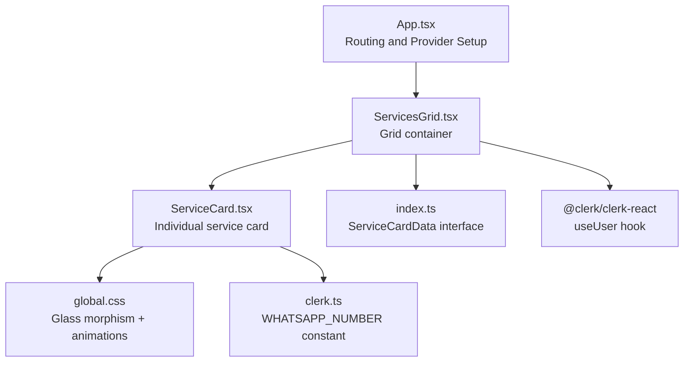
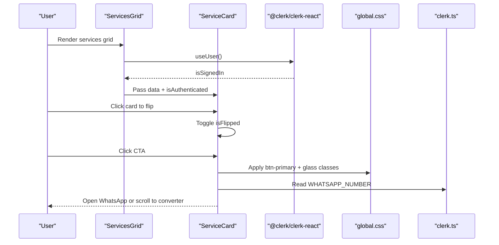
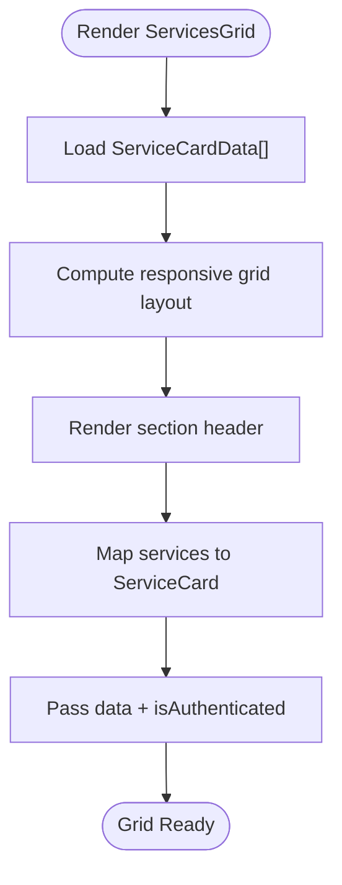
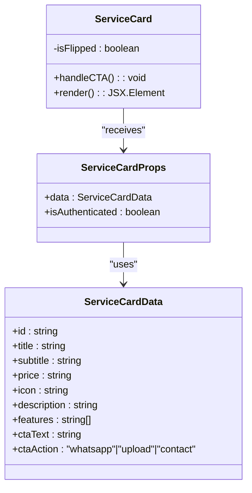
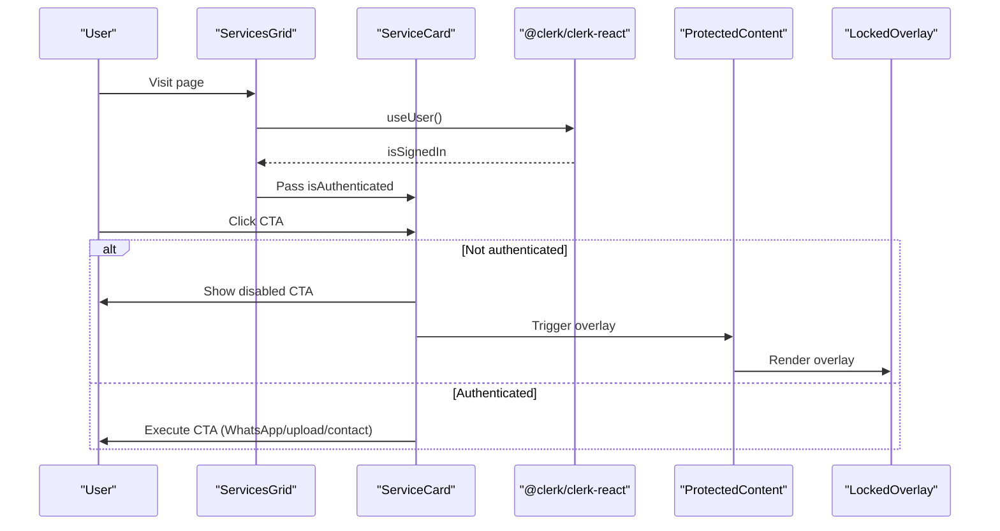
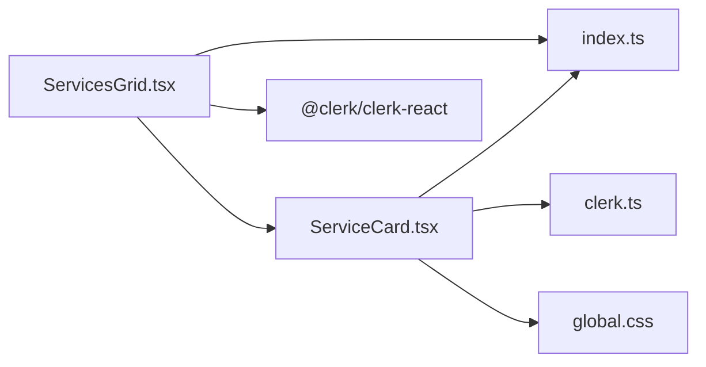

# Service Display Components

<cite>
**Referenced Files in This Document**
- [ServicesGrid.tsx](file://src/components/home/ServicesGrid.tsx)
- [ServiceCard.tsx](file://src/components/home/ServiceCard.tsx)
- [index.ts](file://src/types/index.ts)
- [global.css](file://src/styles/global.css)
- [clerk.ts](file://src/config/clerk.ts)
- [App.tsx](file://src/App.tsx)
- [ScriptConverter.tsx](file://src/components/home/ScriptConverter.tsx)
- [ProtectedContent.tsx](file://src/components/auth/ProtectedContent.tsx)
- [LockedOverlay.tsx](file://src/components/auth/LockedOverlay.tsx)
</cite>

## Table of Contents
1. [Introduction](#introduction)
2. [Project Structure](#project-structure)
3. [Core Components](#core-components)
4. [Architecture Overview](#architecture-overview)
5. [Detailed Component Analysis](#detailed-component-analysis)
6. [Dependency Analysis](#dependency-analysis)
7. [Performance Considerations](#performance-considerations)
8. [Troubleshooting Guide](#troubleshooting-guide)
9. [Conclusion](#conclusion)

## Introduction
This document explains the service display components architecture focused on the ServicesGrid and ServiceCard components. It covers how multiple conversion services are organized in a responsive grid layout, how individual service cards present pricing and interactive elements, and how the components integrate with the glass morphism design system. It also provides practical guidance for adding new services, customizing cards, implementing service filtering, and integrating with the pricing system.

## Project Structure
The service display components reside in the home directory and are wired into the main application routing. The ServicesGrid composes multiple ServiceCard instances and applies responsive grid layout. The glass morphism styling is centralized in the global CSS file, enabling consistent visual themes across panels and buttons.

**Diagram sources**
- [App.tsx:14-24](file://src/App.tsx#L14-L24)
- [ServicesGrid.tsx:116-166](file://src/components/home/ServicesGrid.tsx#L116-L166)
- [ServiceCard.tsx:10-176](file://src/components/home/ServiceCard.tsx#L10-L176)
- [global.css:92-136](file://src/styles/global.css#L92-L136)
- [index.ts:29-39](file://src/types/index.ts#L29-L39)
- [clerk.ts:3](file://src/config/clerk.ts#L3)

**Section sources**
- [App.tsx:14-24](file://src/App.tsx#L14-L24)
- [ServicesGrid.tsx:116-166](file://src/components/home/ServicesGrid.tsx#L116-L166)
- [ServiceCard.tsx:10-176](file://src/components/home/ServiceCard.tsx#L10-L176)
- [global.css:92-136](file://src/styles/global.css#L92-L136)
- [index.ts:29-39](file://src/types/index.ts#L29-L39)
- [clerk.ts:3](file://src/config/clerk.ts#L3)

## Core Components
- ServicesGrid: Renders a responsive grid of service cards, manages section header, and passes authentication state to child cards.
- ServiceCard: Implements a flip-card UI with front/back faces, displays pricing, features, and CTA actions, and integrates with authentication and external systems.
- ServiceCardData: Defines the shape of service data passed to ServiceCard.
- Glass Morphism Styles: Shared utilities for glass panels, neon effects, macOS-style window frames, and button variants.

Key responsibilities:
- ServicesGrid orchestrates layout and data flow to ServiceCard.
- ServiceCard encapsulates interactive behavior and presentation.
- Types define the contract for service data.
- Global CSS provides consistent theming and animations.

**Section sources**
- [ServicesGrid.tsx:116-166](file://src/components/home/ServicesGrid.tsx#L116-L166)
- [ServiceCard.tsx:10-176](file://src/components/home/ServiceCard.tsx#L10-L176)
- [index.ts:29-39](file://src/types/index.ts#L29-L39)
- [global.css:92-136](file://src/styles/global.css#L92-L136)

## Architecture Overview
The service display architecture follows a parent-child composition pattern:
- ServicesGrid renders a grid of ServiceCard components.
- Each ServiceCard receives a ServiceCardData object and an authentication flag.
- ServiceCard handles internal state for flipping and CTA actions.
- Global CSS defines shared visual primitives for glass panels, neon accents, and macOS-style UI.

**Diagram sources**
- [ServicesGrid.tsx:116-166](file://src/components/home/ServicesGrid.tsx#L116-L166)
- [ServiceCard.tsx:10-176](file://src/components/home/ServiceCard.tsx#L10-L176)
- [global.css:92-136](file://src/styles/global.css#L92-L136)
- [clerk.ts:3](file://src/config/clerk.ts#L3)

## Detailed Component Analysis

### ServicesGrid Component
Responsibilities:
- Defines a static list of services using the ServiceCardData interface.
- Applies responsive grid layout with automatic column sizing and gaps.
- Renders a section header with a neon accent and explanatory text.
- Passes authentication state to child cards.

Implementation highlights:
- Uses CSS-in-JS for padding, max-width, and grid layout.
- Iterates over the services array and renders a ServiceCard for each item.
- Reads authentication state via the Clerk user hook to inform child rendering.

**Diagram sources**
- [ServicesGrid.tsx:5-114](file://src/components/home/ServicesGrid.tsx#L5-L114)
- [ServicesGrid.tsx:116-166](file://src/components/home/ServicesGrid.tsx#L116-L166)

**Section sources**
- [ServicesGrid.tsx:5-114](file://src/components/home/ServicesGrid.tsx#L5-L114)
- [ServicesGrid.tsx:116-166](file://src/components/home/ServicesGrid.tsx#L116-L166)

### ServiceCard Component
Responsibilities:
- Implements a flip-card UI with front/back faces styled as macOS-style panels.
- Displays icon, title, description, and price on the front face.
- Lists features and a call-to-action button on the back face.
- Handles authentication gating and CTA actions (WhatsApp, upload, or contact).
- Integrates with glass morphism classes and neon styling.

Interactive behavior:
- Clicking the card toggles the flip state.
- CTA button is disabled when unauthenticated; otherwise triggers action based on ctaAction.
- On upload action, scrolls to the converter section.
- On WhatsApp action, opens a pre-filled message with the service details.

**Diagram sources**
- [ServiceCard.tsx:5-8](file://src/components/home/ServiceCard.tsx#L5-L8)
- [index.ts:29-39](file://src/types/index.ts#L29-L39)

**Section sources**
- [ServiceCard.tsx:10-176](file://src/components/home/ServiceCard.tsx#L10-L176)
- [index.ts:29-39](file://src/types/index.ts#L29-L39)

### Glass Morphism Design System Integration
Shared utilities:
- Glass panels: Soft backgrounds, backdrop blur, subtle borders, and hover transitions.
- Neon accents: Green and blue text shadows and glow effects.
- macOS-style window: Flip animation, title bar dots, and rotated back face.
- Buttons: Gradient backgrounds, hover animations, and disabled states.

How components use it:
- ServiceCard applies glass-panel and glass-panel-strong classes to front and back faces respectively.
- Pricing and headings use neon-green-text for visual emphasis.
- Button classes (btn-primary) are applied to CTA buttons.

**Section sources**
- [global.css:92-136](file://src/styles/global.css#L92-L136)
- [global.css:138-203](file://src/styles/global.css#L138-L203)
- [global.css:205-265](file://src/styles/global.css#L205-L265)
- [ServiceCard.tsx:37-104](file://src/components/home/ServiceCard.tsx#L37-L104)
- [ServiceCard.tsx:107-172](file://src/components/home/ServiceCard.tsx#L107-L172)

### Authentication and Protected Content
- ServicesGrid reads authentication state via the Clerk user hook and passes it to ServiceCard.
- ServiceCard conditionally enables CTAs based on authentication.
- ProtectedContent wraps sensitive sections (e.g., converter) and shows a locked overlay when unauthenticated.
- LockedOverlay provides a clear call-to-action to sign in.

**Diagram sources**
- [ServicesGrid.tsx:116-166](file://src/components/home/ServicesGrid.tsx#L116-L166)
- [ServiceCard.tsx:10-28](file://src/components/home/ServiceCard.tsx#L10-L28)
- [ProtectedContent.tsx:10-43](file://src/components/auth/ProtectedContent.tsx#L10-L43)
- [LockedOverlay.tsx:3-60](file://src/components/auth/LockedOverlay.tsx#L3-L60)

**Section sources**
- [ServicesGrid.tsx:116-166](file://src/components/home/ServicesGrid.tsx#L116-L166)
- [ServiceCard.tsx:10-28](file://src/components/home/ServiceCard.tsx#L10-L28)
- [ProtectedContent.tsx:10-43](file://src/components/auth/ProtectedContent.tsx#L10-L43)
- [LockedOverlay.tsx:3-60](file://src/components/auth/LockedOverlay.tsx#L3-L60)

### Pricing System Integration
- Pricing labels are provided as strings in ServiceCardData (e.g., "₹10", "₹500+", "₹999+").
- ServiceCard displays the price prominently on the front face.
- For upload-based services, the converter section constructs a WhatsApp message with file metadata and pricing details.
- WhatsApp integration constants are configured via environment variables.

Practical integration points:
- Modify ServiceCardData.price to reflect new pricing tiers.
- Adjust ScriptConverter messaging to include pricing when sending orders.

**Section sources**
- [ServicesGrid.tsx:5-114](file://src/components/home/ServicesGrid.tsx#L5-L114)
- [ServiceCard.tsx:83-92](file://src/components/home/ServiceCard.tsx#L83-L92)
- [ScriptConverter.tsx:49-55](file://src/components/home/ScriptConverter.tsx#L49-L55)
- [clerk.ts:3](file://src/config/clerk.ts#L3)

## Dependency Analysis
- ServicesGrid depends on:
  - ServiceCard component
  - ServiceCardData interface
  - Clerk user hook for authentication state
- ServiceCard depends on:
  - ServiceCardData interface
  - Clerk configuration for WhatsApp number
  - Global CSS classes for styling
- Global CSS provides shared utilities consumed by both components.

**Diagram sources**
- [ServicesGrid.tsx:116-166](file://src/components/home/ServicesGrid.tsx#L116-L166)
- [ServiceCard.tsx:10-176](file://src/components/home/ServiceCard.tsx#L10-L176)
- [index.ts:29-39](file://src/types/index.ts#L29-L39)
- [clerk.ts:3](file://src/config/clerk.ts#L3)
- [global.css:92-136](file://src/styles/global.css#L92-L136)

**Section sources**
- [ServicesGrid.tsx:116-166](file://src/components/home/ServicesGrid.tsx#L116-L166)
- [ServiceCard.tsx:10-176](file://src/components/home/ServiceCard.tsx#L10-L176)
- [index.ts:29-39](file://src/types/index.ts#L29-L39)
- [clerk.ts:3](file://src/config/clerk.ts#L3)
- [global.css:92-136](file://src/styles/global.css#L92-L136)

## Performance Considerations
- Rendering cost: The grid maps over a small, static list of services. No performance concerns expected for typical usage.
- CSS animations: Flip transitions and hover effects are lightweight; ensure minimal reflows by avoiding layout thrashing.
- Authentication checks: Using Clerk’s user hook is efficient; avoid unnecessary re-renders by passing props efficiently.
- Image assets: Icons are inline strings; no external asset loading overhead.

## Troubleshooting Guide
Common issues and resolutions:
- CTA does nothing when unauthenticated:
  - Verify authentication state is passed correctly from ServicesGrid to ServiceCard.
  - Confirm ProtectedContent is wrapping sensitive areas.
- WhatsApp links not opening:
  - Ensure the WHATSAPP_NUMBER environment variable is set.
  - Validate the constructed URL format in the CTA handler.
- Cards not flipping:
  - Confirm the flip container and inner wrapper classes are applied.
  - Check that the flip state toggle is triggered on click.
- Pricing not visible:
  - Ensure the price field is populated in ServiceCardData.
  - Verify the front face renders the price element.

**Section sources**
- [ServicesGrid.tsx:116-166](file://src/components/home/ServicesGrid.tsx#L116-L166)
- [ServiceCard.tsx:10-28](file://src/components/home/ServiceCard.tsx#L10-L28)
- [clerk.ts:3](file://src/config/clerk.ts#L3)
- [global.css:138-171](file://src/styles/global.css#L138-L171)

## Conclusion
The service display components architecture cleanly separates concerns between the grid container and individual cards while leveraging a cohesive glass morphism design system. ServicesGrid organizes services responsively, and ServiceCard delivers an engaging, interactive experience with authentication-aware CTAs and seamless integration with the pricing system. The design is extensible, allowing straightforward addition of new services, customization of cards, and future enhancements such as filtering and dynamic pricing.