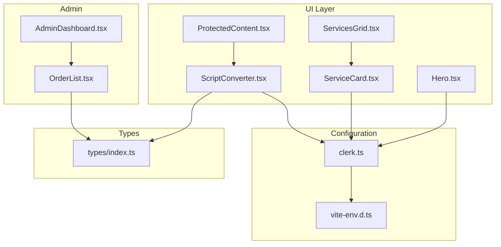
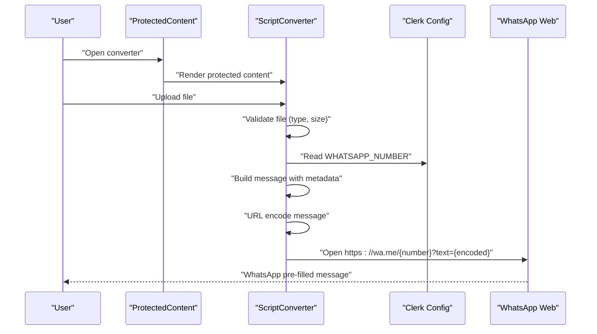
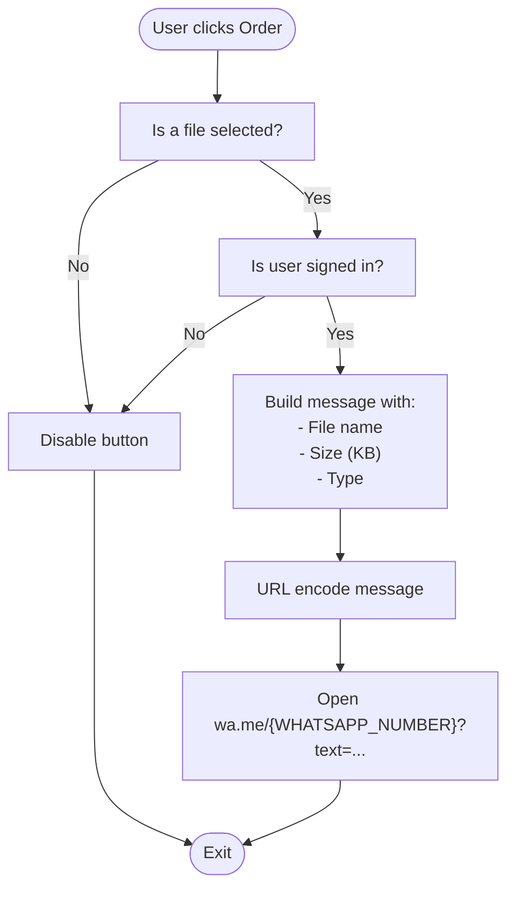
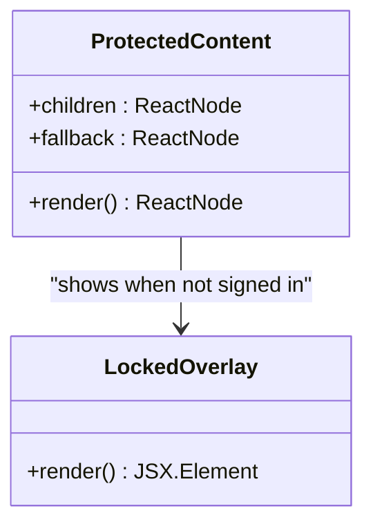
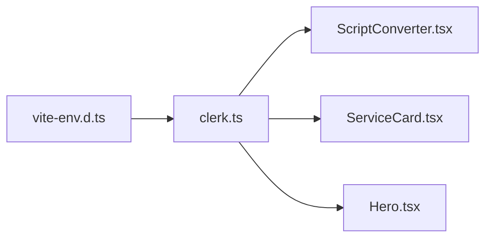
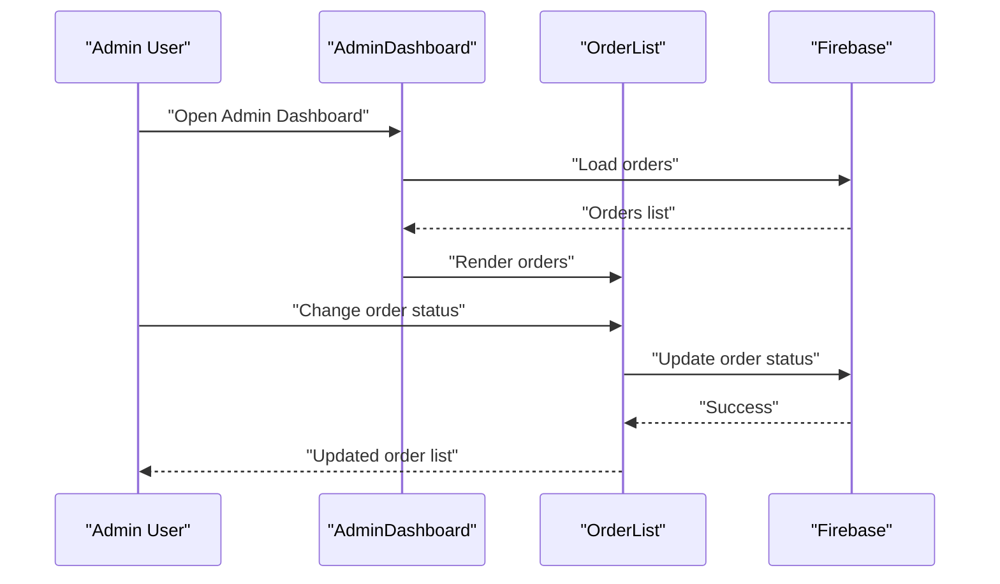
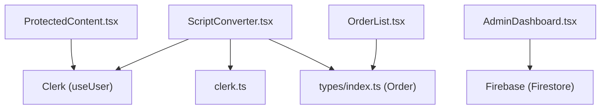

# WhatsApp Order Integration

<cite>
**Referenced Files in This Document**
- [ScriptConverter.tsx](file://src/components/home/ScriptConverter.tsx)
- [ProtectedContent.tsx](file://src/components/auth/ProtectedContent.tsx)
- [clerk.ts](file://src/config/clerk.ts)
- [vite-env.d.ts](file://src/vite-env.d.ts)
- [App.tsx](file://src/App.tsx)
- [OrderList.tsx](file://src/components/admin/OrderList.tsx)
- [AdminDashboard.tsx](file://src/components/admin/AdminDashboard.tsx)
- [ServicesGrid.tsx](file://src/components/home/ServicesGrid.tsx)
- [ServiceCard.tsx](file://src/components/home/ServiceCard.tsx)
- [Hero.tsx](file://src/components/home/Hero.tsx)
- [index.ts](file://src/types/index.ts)
</cite>

## Table of Contents
1. [Introduction](#introduction)
2. [Project Structure](#project-structure)
3. [Core Components](#core-components)
4. [Architecture Overview](#architecture-overview)
5. [Detailed Component Analysis](#detailed-component-analysis)
6. [Dependency Analysis](#dependency-analysis)
7. [Performance Considerations](#performance-considerations)
8. [Troubleshooting Guide](#troubleshooting-guide)
9. [Conclusion](#conclusion)

## Introduction
This document explains the WhatsApp order integration system for script conversion requests. It covers how order messages are generated dynamically with file metadata (name, size, type), how the WHATSAPP_NUMBER configuration is used, and how the wa.me URL is constructed. It also documents the ProtectedContent integration for authentication requirements, order button state management, the message template structure, URL encoding implementation, and external link handling. Finally, it provides examples for customizing order messages, integrating with payment systems, and implementing order tracking workflows.

## Project Structure
The WhatsApp order integration spans several components:
- Authentication gating via ProtectedContent
- Order creation and message generation in ScriptConverter
- Configuration of WHATSAPP_NUMBER and environment variables
- Admin order management and status tracking
- Shared types for orders and services

**Diagram sources**
- [ScriptConverter.tsx:1-188](file://src/components/home/ScriptConverter.tsx#L1-L188)
- [ProtectedContent.tsx:1-44](file://src/components/auth/ProtectedContent.tsx#L1-L44)
- [ServicesGrid.tsx:1-167](file://src/components/home/ServicesGrid.tsx#L1-L167)
- [ServiceCard.tsx:1-37](file://src/components/home/ServiceCard.tsx#L1-L37)
- [Hero.tsx:1-109](file://src/components/home/Hero.tsx#L1-L109)
- [clerk.ts:1-4](file://src/config/clerk.ts#L1-L4)
- [vite-env.d.ts:1-17](file://src/vite-env.d.ts#L1-L17)
- [AdminDashboard.tsx:1-186](file://src/components/admin/AdminDashboard.tsx#L1-L186)
- [OrderList.tsx:1-90](file://src/components/admin/OrderList.tsx#L1-L90)
- [index.ts:1-40](file://src/types/index.ts#L1-L40)

**Section sources**
- [ScriptConverter.tsx:1-188](file://src/components/home/ScriptConverter.tsx#L1-L188)
- [ProtectedContent.tsx:1-44](file://src/components/auth/ProtectedContent.tsx#L1-L44)
- [clerk.ts:1-4](file://src/config/clerk.ts#L1-L4)
- [vite-env.d.ts:1-17](file://src/vite-env.d.ts#L1-L17)
- [AdminDashboard.tsx:1-186](file://src/components/admin/AdminDashboard.tsx#L1-L186)
- [OrderList.tsx:1-90](file://src/components/admin/OrderList.tsx#L1-L90)
- [index.ts:1-40](file://src/types/index.ts#L1-L40)

## Core Components
- ScriptConverter: Handles file selection, validation, and generates the WhatsApp order message with dynamic metadata. It opens a wa.me URL with the encoded message.
- ProtectedContent: Enforces authentication for protected UI sections, including the converter.
- Clerk configuration: Exposes WHATSAPP_NUMBER and other environment variables.
- AdminDashboard and OrderList: Display orders and allow status updates, enabling order tracking workflows.
- Types: Define the Order model used across the admin interface.

Key responsibilities:
- Dynamic message generation with file metadata
- URL encoding for safe transmission
- Authentication gating via Clerk
- Order state management and admin visibility

**Section sources**
- [ScriptConverter.tsx:1-188](file://src/components/home/ScriptConverter.tsx#L1-L188)
- [ProtectedContent.tsx:1-44](file://src/components/auth/ProtectedContent.tsx#L1-L44)
- [clerk.ts:1-4](file://src/config/clerk.ts#L1-L4)
- [AdminDashboard.tsx:1-186](file://src/components/admin/AdminDashboard.tsx#L1-L186)
- [OrderList.tsx:1-90](file://src/components/admin/OrderList.tsx#L1-L90)
- [index.ts:14-27](file://src/types/index.ts#L14-L27)

## Architecture Overview
The integration follows a client-side flow:
- User uploads a supported file in ScriptConverter
- ProtectedContent ensures the user is signed in
- The app constructs a wa.me URL with an encoded message containing file metadata
- The browser opens WhatsApp with the prefilled message

**Diagram sources**
- [ScriptConverter.tsx:1-188](file://src/components/home/ScriptConverter.tsx#L1-L188)
- [ProtectedContent.tsx:1-44](file://src/components/auth/ProtectedContent.tsx#L1-L44)
- [clerk.ts:1-4](file://src/config/clerk.ts#L1-L4)

## Detailed Component Analysis

### ScriptConverter: Order Message Generation and Button State Management
- File validation: Ensures allowed extensions and maximum size before enabling the order button.
- Dynamic message template: Includes file name, size (KB), and type.
- URL encoding: Uses a URL-safe encoding method for the message payload.
- wa.me URL construction: Combines WHATSAPP_NUMBER with the encoded message.
- Button state management: Disabled when no file is selected or when the user is not signed in.

**Diagram sources**
- [ScriptConverter.tsx:16-55](file://src/components/home/ScriptConverter.tsx#L16-L55)
- [clerk.ts:3-3](file://src/config/clerk.ts#L3-L3)

**Section sources**
- [ScriptConverter.tsx:16-55](file://src/components/home/ScriptConverter.tsx#L16-L55)
- [ProtectedContent.tsx:10-43](file://src/components/auth/ProtectedContent.tsx#L10-L43)

### ProtectedContent: Authentication Integration
- Wraps child components and conditionally renders either the children or a locked overlay.
- Uses Clerk's user state to gate access to premium features.
- Provides a fallback mechanism for rendering locked content while keeping the overlay visible.

**Diagram sources**
- [ProtectedContent.tsx:1-44](file://src/components/auth/ProtectedContent.tsx#L1-L44)
- [LockedOverlay.tsx:1-60](file://src/components/auth/LockedOverlay.tsx#L1-L60)

**Section sources**
- [ProtectedContent.tsx:1-44](file://src/components/auth/ProtectedContent.tsx#L1-L44)
- [App.tsx:1-67](file://src/App.tsx#L1-L67)

### Configuration: WHATSAPP_NUMBER and Environment Variables
- WHATSAPP_NUMBER is imported from the Clerk configuration module.
- Environment variables are declared in the Vite environment definition file.
- Default values are provided in case environment variables are missing.

**Diagram sources**
- [vite-env.d.ts:11-11](file://src/vite-env.d.ts#L11-L11)
- [clerk.ts:3-3](file://src/config/clerk.ts#L3-L3)

**Section sources**
- [clerk.ts:1-4](file://src/config/clerk.ts#L1-L4)
- [vite-env.d.ts:1-17](file://src/vite-env.d.ts#L1-L17)

### Admin Order Tracking: Status Management and Visibility
- AdminDashboard loads services and orders from Firebase and displays them in tabs.
- OrderList shows order details and allows changing the status via a select dropdown.
- The Order model includes fields for file metadata, user info, and timestamps.

**Diagram sources**
- [AdminDashboard.tsx:25-72](file://src/components/admin/AdminDashboard.tsx#L25-L72)
- [OrderList.tsx:15-89](file://src/components/admin/OrderList.tsx#L15-L89)
- [index.ts:14-27](file://src/types/index.ts#L14-L27)

**Section sources**
- [AdminDashboard.tsx:1-186](file://src/components/admin/AdminDashboard.tsx#L1-L186)
- [OrderList.tsx:1-90](file://src/components/admin/OrderList.tsx#L1-L90)
- [index.ts:14-27](file://src/types/index.ts#L14-L27)

### Additional WhatsApp Integration Points
- ServicesGrid and ServiceCard: Provide additional quick-order actions via WhatsApp for various services.
- Hero: Offers a quick order button that opens WhatsApp with a generic message.

These components reuse the same pattern: construct a message, encode it, and open wa.me/{number}?text={encoded}.

**Section sources**
- [ServicesGrid.tsx:5-114](file://src/components/home/ServicesGrid.tsx#L5-L114)
- [ServiceCard.tsx:13-28](file://src/components/home/ServiceCard.tsx#L13-L28)
- [Hero.tsx:9-14](file://src/components/home/Hero.tsx#L9-L14)

## Dependency Analysis
The integration relies on:
- Clerk for authentication state
- Vite environment variables for configuration
- Client-side URL construction for wa.me links
- Firebase for admin order persistence

**Diagram sources**
- [ScriptConverter.tsx:1-10](file://src/components/home/ScriptConverter.tsx#L1-L10)
- [ProtectedContent.tsx:1-11](file://src/components/auth/ProtectedContent.tsx#L1-L11)
- [AdminDashboard.tsx:1-16](file://src/components/admin/AdminDashboard.tsx#L1-L16)
- [OrderList.tsx:1-6](file://src/components/admin/OrderList.tsx#L1-L6)
- [index.ts:14-27](file://src/types/index.ts#L14-L27)

**Section sources**
- [ScriptConverter.tsx:1-10](file://src/components/home/ScriptConverter.tsx#L1-L10)
- [ProtectedContent.tsx:1-11](file://src/components/auth/ProtectedContent.tsx#L1-L11)
- [AdminDashboard.tsx:1-16](file://src/components/admin/AdminDashboard.tsx#L1-L16)
- [OrderList.tsx:1-6](file://src/components/admin/OrderList.tsx#L1-L6)
- [index.ts:14-27](file://src/types/index.ts#L14-L27)

## Performance Considerations
- Client-side URL encoding avoids server round trips.
- File validation prevents unnecessary processing for unsupported files.
- Using Clerk's isLoaded and isSignedIn checks avoids blocking UI during authentication transitions.
- Admin order loading uses Firestore queries with ordering to keep lists consistent.

## Troubleshooting Guide
Common issues and resolutions:
- Order button disabled unexpectedly:
  - Ensure a valid file is selected and the user is signed in.
  - Verify ProtectedContent wraps the converter content.
- WhatsApp does not open:
  - Confirm WHATSAPP_NUMBER is set in environment variables.
  - Ensure the message is URL-encoded before constructing the wa.me URL.
- Order not visible in admin:
  - Check Firebase connectivity and permissions.
  - Verify the Order model fields match the stored data.

**Section sources**
- [ScriptConverter.tsx:125-132](file://src/components/home/ScriptConverter.tsx#L125-L132)
- [ProtectedContent.tsx:31-42](file://src/components/auth/ProtectedContent.tsx#L31-L42)
- [clerk.ts:3-3](file://src/config/clerk.ts#L3-L3)
- [AdminDashboard.tsx:25-52](file://src/components/admin/AdminDashboard.tsx#L25-L52)
- [OrderList.tsx:15-24](file://src/components/admin/OrderList.tsx#L15-L24)

## Conclusion
The WhatsApp order integration leverages client-side logic to generate dynamic, URL-encoded messages and open wa.me links with pre-filled content. Authentication is enforced via ProtectedContent, and order tracking is supported through the admin dashboard. The system is extensible: message templates can be customized per service, payment integrations can be added externally, and order workflows can be expanded with additional statuses and notifications.