# Styling & Design System

<cite>
**Referenced Files in This Document**
- [global.css](file://src/styles/global.css)
- [package.json](file://package.json)
- [vite.config.ts](file://vite.config.ts)
- [MenuBar.tsx](file://src/components/layout/MenuBar.tsx)
- [Hero.tsx](file://src/components/home/Hero.tsx)
- [AdminDashboard.tsx](file://src/components/admin/AdminDashboard.tsx)
- [LockedOverlay.tsx](file://src/components/auth/LockedOverlay.tsx)
- [ServiceCard.tsx](file://src/components/home/ServiceCard.tsx)
- [ServicesGrid.tsx](file://src/components/home/ServicesGrid.tsx)
</cite>

## Table of Contents
1. [Introduction](#introduction)
2. [Project Structure](#project-structure)
3. [Core Components](#core-components)
4. [Architecture Overview](#architecture-overview)
5. [Detailed Component Analysis](#detailed-component-analysis)
6. [Dependency Analysis](#dependency-analysis)
7. [Performance Considerations](#performance-considerations)
8. [Troubleshooting Guide](#troubleshooting-guide)
9. [Conclusion](#conclusion)
10. [Appendices](#appendices)

## Introduction
This document describes DevForge’s visual presentation layer and design system. It covers the Tailwind CSS integration, custom CSS architecture, glass morphism patterns, neon glow effects, typography, animations, responsive design, and component styling conventions. It also provides guidance for extending the design system, maintaining visual consistency, optimizing CSS delivery, and ensuring accessibility.

## Project Structure
DevForge integrates Tailwind via Vite and centralizes global styles and design tokens in a single stylesheet. Components apply design tokens and utility classes consistently across the app.

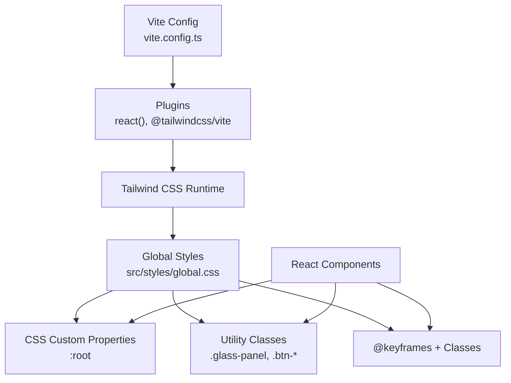

**Diagram sources**
- [vite.config.ts:1-22](file://vite.config.ts#L1-L22)
- [global.css:1-22](file://src/styles/global.css#L1-L22)

**Section sources**
- [vite.config.ts:1-22](file://vite.config.ts#L1-L22)
- [package.json:19-35](file://package.json#L19-L35)

## Core Components
- Tailwind integration: Installed and configured via Vite plugin.
- Global CSS: Centralizes design tokens, base resets, typography, glass morphism utilities, buttons, overlays, animations, and responsive rules.
- Component styling: Components consume design tokens and utility classes for consistent visuals.

Key highlights:
- Design tokens live in CSS custom properties for easy reuse and theming.
- Glass morphism utilities encapsulate backdrop blur, transparency, and borders.
- Button variants and hover states unify interactive affordances.
- Animations provide micro-interactions and loading states.
- Responsive rules adapt layouts for smaller screens.

**Section sources**
- [global.css:3-22](file://src/styles/global.css#L3-L22)
- [global.css:92-136](file://src/styles/global.css#L92-L136)
- [global.css:205-265](file://src/styles/global.css#L205-L265)
- [global.css:323-376](file://src/styles/global.css#L323-L376)
- [global.css:377-383](file://src/styles/global.css#L377-L383)

## Architecture Overview
The styling pipeline combines Tailwind utilities with global CSS for brand-specific tokens and patterns.

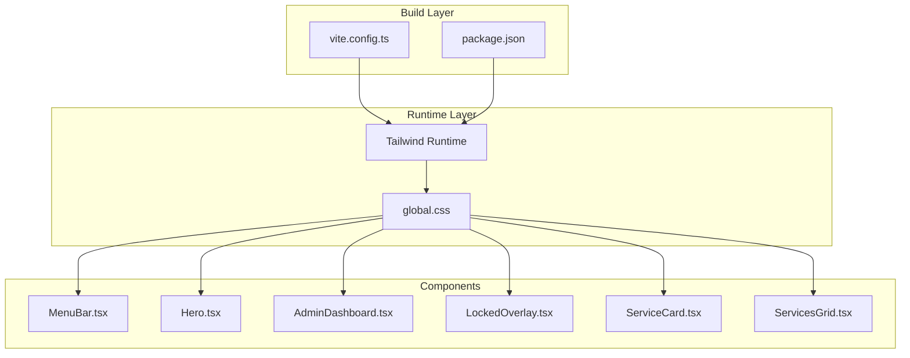

**Diagram sources**
- [vite.config.ts:1-22](file://vite.config.ts#L1-L22)
- [package.json:19-35](file://package.json#L19-L35)
- [global.css:1-22](file://src/styles/global.css#L1-L22)
- [MenuBar.tsx:28-44](file://src/components/layout/MenuBar.tsx#L28-L44)
- [Hero.tsx:16-24](file://src/components/home/Hero.tsx#L16-L24)
- [AdminDashboard.tsx:85-91](file://src/components/admin/AdminDashboard.tsx#L85-L91)
- [LockedOverlay.tsx:7-8](file://src/components/auth/LockedOverlay.tsx#L7-L8)
- [ServiceCard.tsx:31-35](file://src/components/home/ServiceCard.tsx#L31-L35)
- [ServicesGrid.tsx:119-127](file://src/components/home/ServicesGrid.tsx#L119-L127)

## Detailed Component Analysis

### Glass Morphism Pattern
Glass panels provide frosted, translucent surfaces with subtle borders and shadows. Two variants are defined:
- Standard glass panel with moderate blur and shadow.
- Strong glass panel with heavier blur and inset highlights.

Implementation pattern:
- Apply a background with low alpha, backdrop blur, border, rounded corners, and layered shadows.
- Hover states adjust background and border for interactivity.

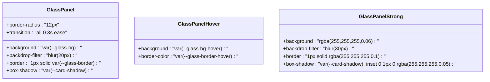

**Diagram sources**
- [global.css:92-115](file://src/styles/global.css#L92-L115)

**Section sources**
- [global.css:92-115](file://src/styles/global.css#L92-L115)
- [MenuBar.tsx:28-44](file://src/components/layout/MenuBar.tsx#L28-L44)
- [ServiceCard.tsx:37-43](file://src/components/home/ServiceCard.tsx#L37-L43)
- [ServiceCard.tsx:107-113](file://src/components/home/ServiceCard.tsx#L107-L113)
- [AdminDashboard.tsx:85-91](file://src/components/admin/AdminDashboard.tsx#L85-L91)

### Neon Glow Effects
Neon accents use custom color tokens with soft glows to highlight interactive elements and headings.

Patterns:
- Text glow classes for brand colors.
- Border glow utilities for focus and hover states.

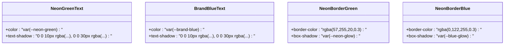

**Diagram sources**
- [global.css:117-136](file://src/styles/global.css#L117-L136)

**Section sources**
- [global.css:117-136](file://src/styles/global.css#L117-L136)
- [Hero.tsx:60-67](file://src/components/home/Hero.tsx#L60-L67)
- [MenuBar.tsx:48-68](file://src/components/layout/MenuBar.tsx#L48-L68)

### Buttons and Interactions
Primary and secondary button styles unify CTAs with consistent spacing, typography, transitions, and hover effects.

Patterns:
- Gradient primary buttons with elevated hover and glow.
- Transparent secondary buttons with border and hover background.
- Disabled states maintain visual hierarchy without clutter.

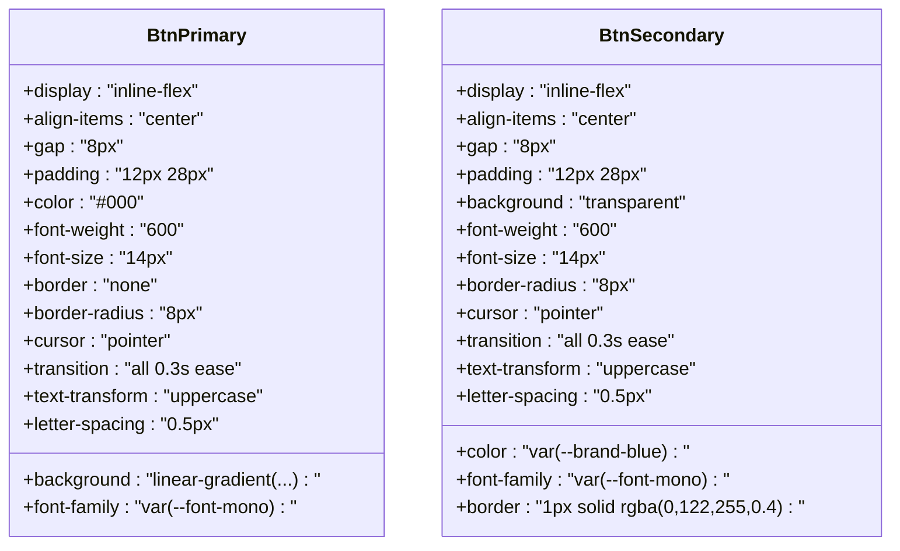

**Diagram sources**
- [global.css:205-265](file://src/styles/global.css#L205-L265)

**Section sources**
- [global.css:205-265](file://src/styles/global.css#L205-L265)
- [Hero.tsx:88-104](file://src/components/home/Hero.tsx#L88-L104)
- [LockedOverlay.tsx:50-56](file://src/components/auth/LockedOverlay.tsx#L50-L56)

### Locked/Blurred Overlay
Members-only content uses a blurred overlay to communicate access restrictions while preserving layout.

Pattern:
- Parent container marks content locked.
- Overlay applies backdrop blur and centered content with CTA.

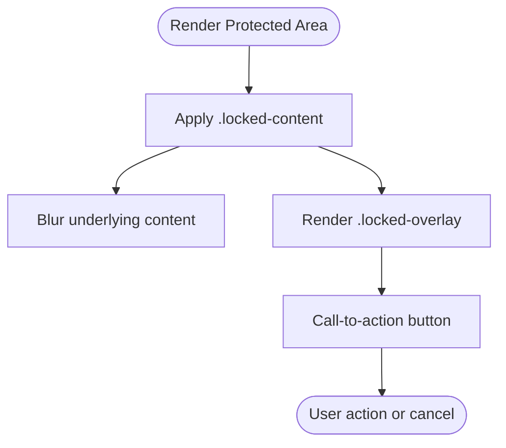

**Diagram sources**
- [global.css:267-289](file://src/styles/global.css#L267-L289)
- [LockedOverlay.tsx:3-59](file://src/components/auth/LockedOverlay.tsx#L3-L59)

**Section sources**
- [global.css:267-289](file://src/styles/global.css#L267-L289)
- [LockedOverlay.tsx:3-59](file://src/components/auth/LockedOverlay.tsx#L3-L59)

### macOS-Style Flippable Cards
Interactive cards flip to reveal details, styled with glass panels and macOS-style title bars.

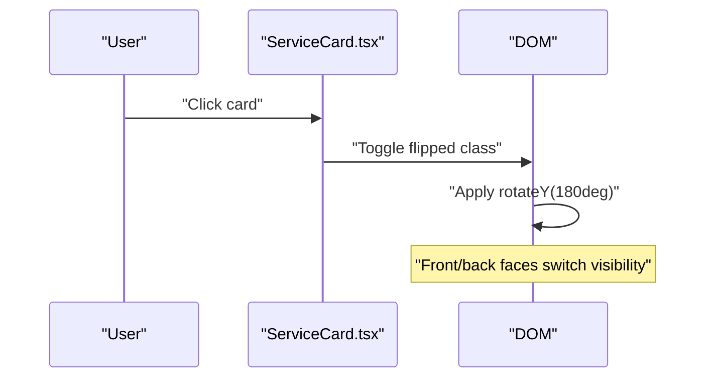

**Diagram sources**
- [global.css:138-171](file://src/styles/global.css#L138-L171)
- [ServiceCard.tsx:31-35](file://src/components/home/ServiceCard.tsx#L31-L35)
- [ServiceCard.tsx:107-113](file://src/components/home/ServiceCard.tsx#L107-L113)

**Section sources**
- [global.css:138-171](file://src/styles/global.css#L138-L171)
- [ServiceCard.tsx:31-35](file://src/components/home/ServiceCard.tsx#L31-L35)
- [ServiceCard.tsx:107-113](file://src/components/home/ServiceCard.tsx#L107-L113)

### Animations and Micro-interactions
A small set of reusable animations enhances motion design:
- Fade-in up for hero sections.
- Pulse glow for emphasis.
- Float for light elevation.
- Staggered delays for grouped items.

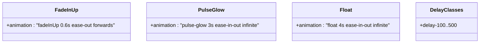

**Diagram sources**
- [global.css:323-376](file://src/styles/global.css#L323-L376)

**Section sources**
- [global.css:323-376](file://src/styles/global.css#L323-L376)
- [Hero.tsx:25](file://src/components/home/Hero.tsx#L25)
- [MenuBar.tsx:48-68](file://src/components/layout/MenuBar.tsx#L48-L68)

### Responsive Design and Mobile-First Strategy
- Global responsive rule adjusts card height on narrow screens.
- Components use clamp-based sizing and flexible grids.
- Typography scales with viewport width for optimal readability.

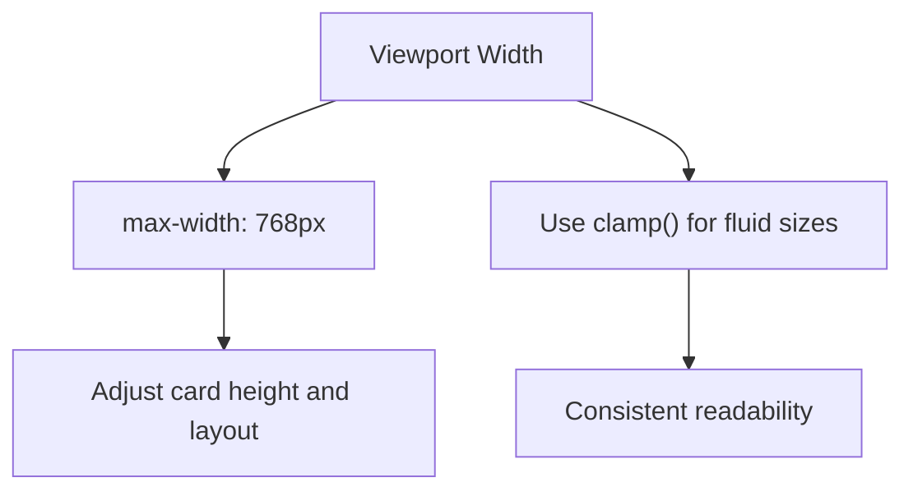

**Diagram sources**
- [global.css:377-383](file://src/styles/global.css#L377-L383)
- [Hero.tsx:60](file://src/components/home/Hero.tsx#L60)
- [ServicesGrid.tsx:150-154](file://src/components/home/ServicesGrid.tsx#L150-L154)

**Section sources**
- [global.css:377-383](file://src/styles/global.css#L377-L383)
- [Hero.tsx:60](file://src/components/home/Hero.tsx#L60)
- [ServicesGrid.tsx:150-154](file://src/components/home/ServicesGrid.tsx#L150-L154)

### Theme System Integration
- CSS custom properties define semantic tokens for colors, backgrounds, typography, and effects.
- Components reference tokens directly for consistent theming.
- Strong separation of concerns: tokens in global CSS, component styles in TSX.

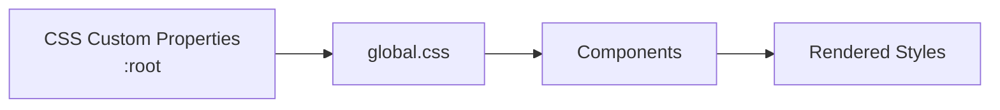

**Diagram sources**
- [global.css:3-22](file://src/styles/global.css#L3-L22)
- [MenuBar.tsx:48-68](file://src/components/layout/MenuBar.tsx#L48-L68)
- [Hero.tsx:60-67](file://src/components/home/Hero.tsx#L60-L67)

**Section sources**
- [global.css:3-22](file://src/styles/global.css#L3-L22)
- [MenuBar.tsx:48-68](file://src/components/layout/MenuBar.tsx#L48-L68)
- [Hero.tsx:60-67](file://src/components/home/Hero.tsx#L60-L67)

## Dependency Analysis
Tailwind is integrated via the Vite plugin and configured through package dependencies. The global stylesheet imports Tailwind utilities and defines brand-specific extensions.

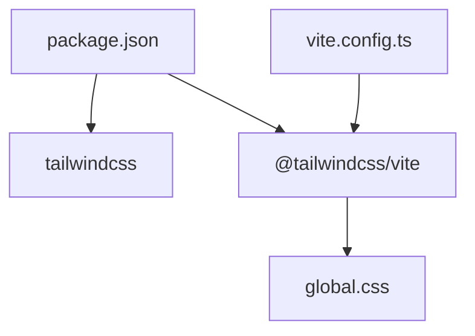

**Diagram sources**
- [package.json:19-35](file://package.json#L19-L35)
- [vite.config.ts:1-8](file://vite.config.ts#L1-L8)
- [global.css:1](file://src/styles/global.css#L1)

**Section sources**
- [package.json:19-35](file://package.json#L19-L35)
- [vite.config.ts:1-8](file://vite.config.ts#L1-L8)
- [global.css:1](file://src/styles/global.css#L1)

## Performance Considerations
- Keep global CSS minimal and scoped to avoid unnecessary repaints.
- Prefer CSS custom properties for dynamic theming to reduce reflows.
- Use Tailwind utilities for common patterns to leverage JIT compilation.
- Avoid excessive backdrop blur on low-power devices; consider media queries to tone down effects.
- Lazy-load heavy assets and defer non-critical animations until after initial render.
- Ensure critical CSS is inlined for faster first paint; Tailwind purging reduces bundle size.

## Troubleshooting Guide
Common issues and resolutions:
- Glass effect not visible: Verify backdrop-filter support and ensure parent has sufficient contrast.
- Animations stutter: Reduce number of animated elements on screen or throttle frame rate.
- Typography misalignment: Confirm font fallbacks and ensure custom fonts are loaded.
- Hover states inconsistent: Ensure hover variants are applied after base classes in the class chain.
- Responsive breakpoints: Confirm media queries are ordered mobile-first and not overridden unintentionally.

## Conclusion
DevForge’s design system centers on a cohesive set of tokens, glass morphism patterns, neon accents, and micro-animations. By leveraging Tailwind utilities and global CSS custom properties, components remain consistent, performant, and extensible. Following the conventions outlined here ensures visual continuity and a polished user experience across devices.

## Appendices

### A. Tailwind Integration Checklist
- Confirm Tailwind plugin is enabled in Vite configuration.
- Ensure global CSS imports Tailwind utilities.
- Keep Purge/Glob patterns aligned with component usage to minimize CSS size.
- Test on multiple devices to validate responsive behavior.

**Section sources**
- [vite.config.ts:1-8](file://vite.config.ts#L1-L8)
- [global.css:1](file://src/styles/global.css#L1)

### B. Extending the Design System
- Add new tokens to CSS custom properties for consistent reuse.
- Define new utility classes in global CSS for common patterns.
- Create component-level variants that map to shared tokens.
- Document new tokens and patterns in a style guide to maintain consistency.

**Section sources**
- [global.css:3-22](file://src/styles/global.css#L3-L22)
- [global.css:92-115](file://src/styles/global.css#L92-L115)
- [global.css:205-265](file://src/styles/global.css#L205-L265)

### C. Accessibility Considerations
- Maintain sufficient color contrast against glass backgrounds.
- Provide focus indicators for interactive elements.
- Avoid relying solely on color to convey meaning; pair with text or icons.
- Ensure animations can be reduced or disabled by users with vestibular disorders.

[No sources needed since this section provides general guidance]