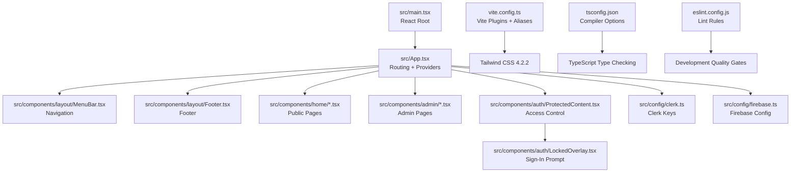
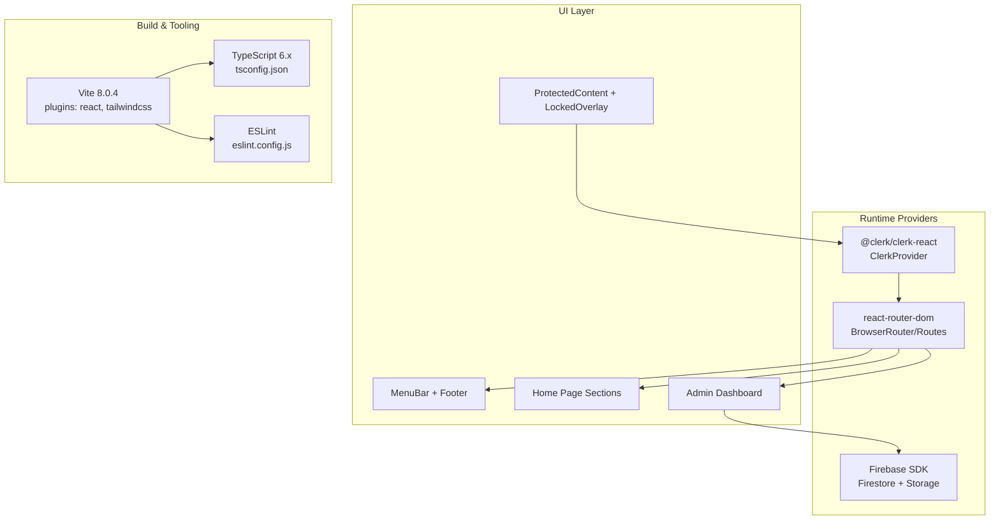
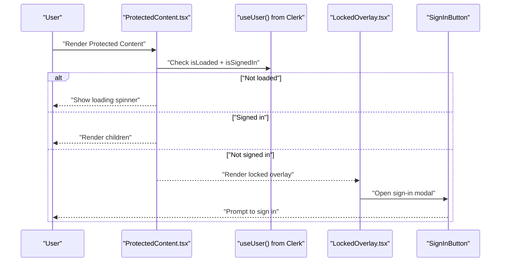
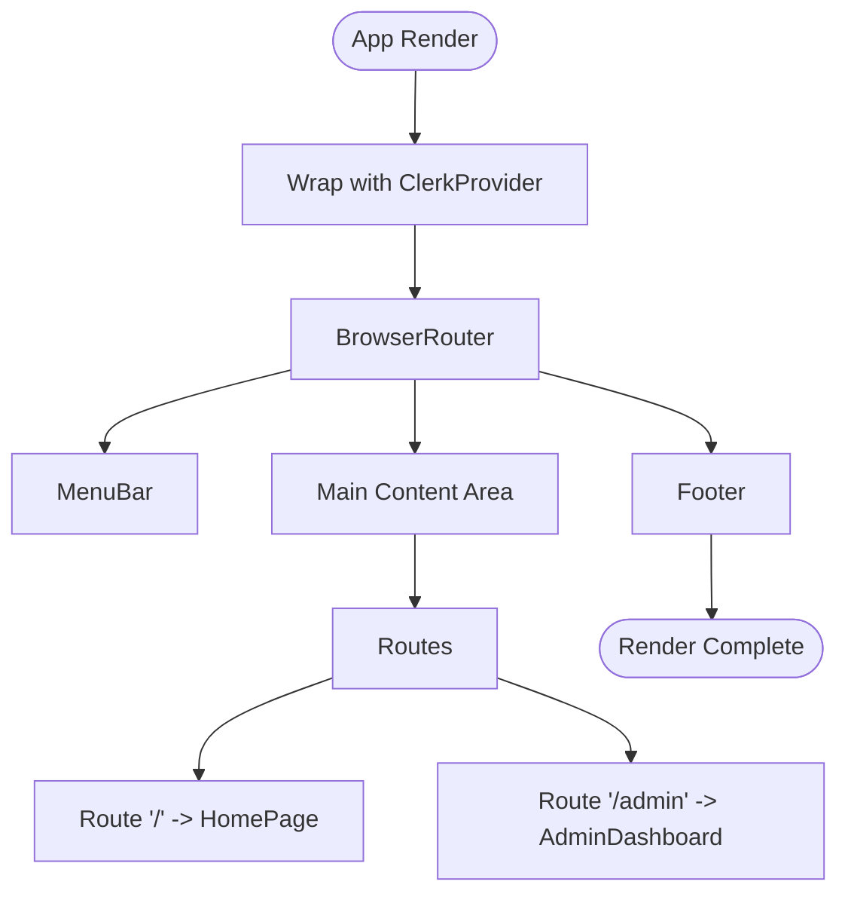
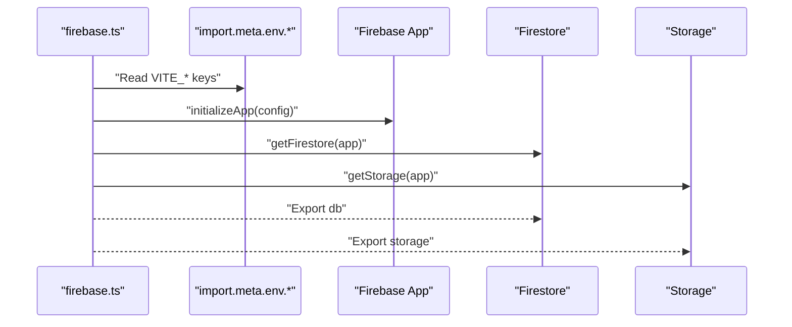
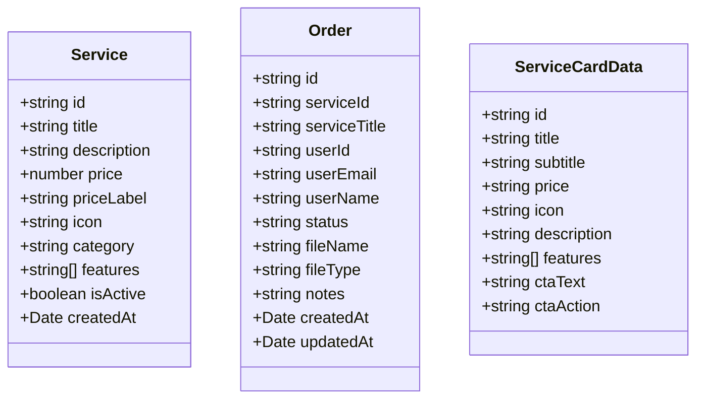
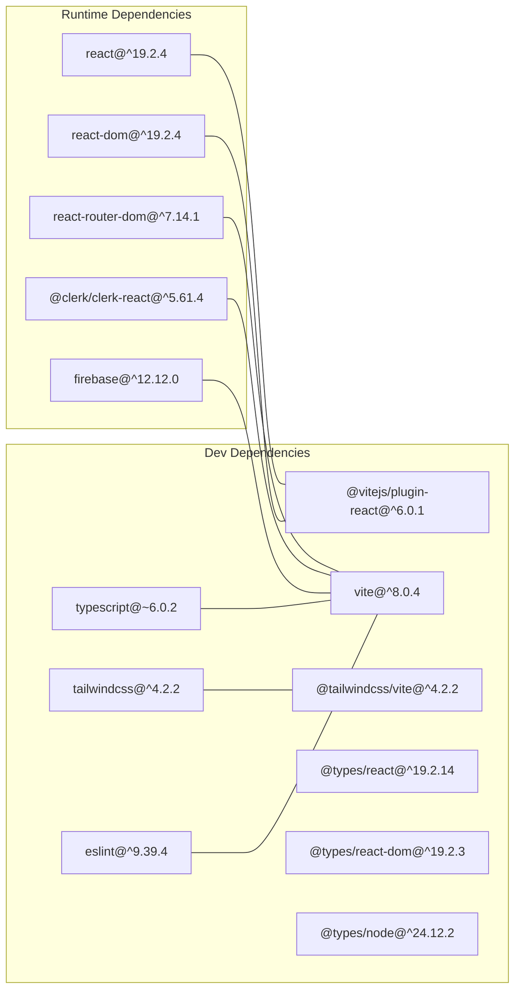

# Technology Stack & Dependencies

<cite>
**Referenced Files in This Document**
- [package.json](file://package.json)
- [vite.config.ts](file://vite.config.ts)
- [tsconfig.json](file://tsconfig.json)
- [tsconfig.app.json](file://tsconfig.app.json)
- [tsconfig.node.json](file://tsconfig.node.json)
- [eslint.config.js](file://eslint.config.js)
- [README.md](file://README.md)
- [src/main.tsx](file://src/main.tsx)
- [src/App.tsx](file://src/App.tsx)
- [src/config/clerk.ts](file://src/config/clerk.ts)
- [src/config/firebase.ts](file://src/config/firebase.ts)
- [src/components/auth/LockedOverlay.tsx](file://src/components/auth/LockedOverlay.tsx)
- [src/components/auth/ProtectedContent.tsx](file://src/components/auth/ProtectedContent.tsx)
- [src/hooks/useAdmin.ts](file://src/hooks/useAdmin.ts)
- [src/styles/global.css](file://src/styles/global.css)
- [src/types/index.ts](file://src/types/index.ts)
</cite>

## Table of Contents
1. [Introduction](#introduction)
2. [Project Structure](#project-structure)
3. [Core Components](#core-components)
4. [Architecture Overview](#architecture-overview)
5. [Detailed Component Analysis](#detailed-component-analysis)
6. [Dependency Analysis](#dependency-analysis)
7. [Performance Considerations](#performance-considerations)
8. [Troubleshooting Guide](#troubleshooting-guide)
9. [Conclusion](#conclusion)
10. [Appendices](#appendices)

## Introduction
This document provides comprehensive technology stack documentation for DevForge’s modern frontend architecture. It covers the primary frameworks and libraries, their roles, integration patterns, and architectural decisions. The focus areas include:
- React 19.2.4 as the UI framework
- TypeScript for type safety
- Vite 8.0.4 for the build toolchain
- Tailwind CSS 4.2.2 for styling
- Clerk React 5.61.4 for authentication
- Firebase 12.12.0 for real-time database and storage
- react-router-dom for client-side routing

It also documents build configuration specifics, TypeScript compilation settings, development tooling integration, version compatibility, upgrade paths, and performance implications.

## Project Structure
DevForge follows a conventional React + TypeScript + Vite project layout with modular components, centralized configuration, and a clear separation of concerns:
- Application entry point initializes React root and global styles
- App component composes routing and providers for authentication and navigation
- Feature modules under src/components encapsulate UI and business logic
- Configuration files centralize environment-driven settings for Clerk and Firebase
- Global styles leverage Tailwind CSS 4.2.2 via the official Vite plugin

**Diagram sources**
- [src/main.tsx:1-11](file://src/main.tsx#L1-L11)
- [src/App.tsx:1-39](file://src/App.tsx#L1-L39)
- [vite.config.ts:1-22](file://vite.config.ts#L1-L22)
- [tsconfig.json:1-24](file://tsconfig.json#L1-L24)
- [eslint.config.js:1-24](file://eslint.config.js#L1-L24)

**Section sources**
- [src/main.tsx:1-11](file://src/main.tsx#L1-L11)
- [src/App.tsx:1-39](file://src/App.tsx#L1-L39)
- [vite.config.ts:1-22](file://vite.config.ts#L1-L22)
- [tsconfig.json:1-24](file://tsconfig.json#L1-L24)
- [eslint.config.js:1-24](file://eslint.config.js#L1-L24)

## Core Components
This section outlines the core technologies and their roles in the application.

- React 19.2.4
  - Primary UI framework powering components and rendering lifecycle
  - Integrated with Vite’s fast refresh and TypeScript support
  - Used in conjunction with react-router-dom for declarative routing

- TypeScript 6.0.x
  - Enforced strict type checking for components, hooks, and configuration
  - Compiler options optimized for ESNext modules and bundler resolution
  - Path aliases configured for clean imports

- Vite 8.0.4
  - Lightning-fast dev server with HMR and optimized builds
  - React plugin for JSX transforms and SWC-based fast refresh
  - Tailwind CSS plugin for JIT-powered styling
  - Path aliasing for ergonomic imports

- Tailwind CSS 4.2.2
  - Utility-first CSS framework integrated via Vite plugin
  - Global CSS defines theme tokens and reusable utilities
  - Supports responsive design and animations

- Clerk React 5.61.4
  - Authentication provider wrapping the app
  - Environment-driven publishable key injection
  - Hooks for protected content gating and admin checks

- Firebase 12.12.0
  - Real-time Firestore and Cloud Storage integration
  - Centralized initialization and exports for db and storage

- react-router-dom 7.x
  - Client-side routing with BrowserRouter and declarative routes
  - Nested layout with shared header/footer and page-specific views

**Section sources**
- [package.json:12-36](file://package.json#L12-L36)
- [vite.config.ts:1-22](file://vite.config.ts#L1-L22)
- [tsconfig.json:1-24](file://tsconfig.json#L1-L24)
- [src/styles/global.css:1-383](file://src/styles/global.css#L1-L383)
- [src/App.tsx:1-39](file://src/App.tsx#L1-L39)
- [src/config/clerk.ts:1-4](file://src/config/clerk.ts#L1-L4)
- [src/config/firebase.ts:1-19](file://src/config/firebase.ts#L1-L19)

## Architecture Overview
The application architecture centers around a provider-based composition pattern:
- App wraps the entire application with ClerkProvider for authentication
- BrowserRouter manages routing for public and admin sections
- ProtectedContent composes Clerk’s user state to gate premium content
- Firebase is initialized once and exported for use across components
- Vite orchestrates development and build processes with Tailwind CSS JIT

**Diagram sources**
- [src/App.tsx:1-39](file://src/App.tsx#L1-L39)
- [src/components/auth/ProtectedContent.tsx:1-44](file://src/components/auth/ProtectedContent.tsx#L1-L44)
- [src/config/firebase.ts:1-19](file://src/config/firebase.ts#L1-L19)
- [vite.config.ts:1-22](file://vite.config.ts#L1-L22)
- [tsconfig.json:1-24](file://tsconfig.json#L1-L24)
- [eslint.config.js:1-24](file://eslint.config.js#L1-L24)

## Detailed Component Analysis

### Authentication Flow with Clerk
The authentication flow integrates Clerk’s provider and hooks to protect premium content. The ProtectedContent component conditionally renders either children or a locked overlay with a sign-in prompt. Admin privileges are derived from the current user’s email address against a configured admin email.

**Diagram sources**
- [src/components/auth/ProtectedContent.tsx:10-43](file://src/components/auth/ProtectedContent.tsx#L10-L43)
- [src/components/auth/LockedOverlay.tsx:1-57](file://src/components/auth/LockedOverlay.tsx#L1-L57)
- [src/hooks/useAdmin.ts:1-14](file://src/hooks/useAdmin.ts#L1-L14)

**Section sources**
- [src/components/auth/ProtectedContent.tsx:1-44](file://src/components/auth/ProtectedContent.tsx#L1-L44)
- [src/components/auth/LockedOverlay.tsx:1-57](file://src/components/auth/LockedOverlay.tsx#L1-L57)
- [src/hooks/useAdmin.ts:1-14](file://src/hooks/useAdmin.ts#L1-L14)
- [src/config/clerk.ts:1-4](file://src/config/clerk.ts#L1-L4)

### Routing and Navigation
The App component sets up BrowserRouter and defines routes for the home page and admin dashboard. The MenuBar and Footer are shared across pages, ensuring consistent navigation and branding.

**Diagram sources**
- [src/App.tsx:23-38](file://src/App.tsx#L23-L38)

**Section sources**
- [src/App.tsx:1-39](file://src/App.tsx#L1-L39)

### Firebase Integration
Firebase is initialized once using environment variables and exported for use across the application. Firestore and Storage are available for data persistence and media handling.

**Diagram sources**
- [src/config/firebase.ts:1-19](file://src/config/firebase.ts#L1-L19)

**Section sources**
- [src/config/firebase.ts:1-19](file://src/config/firebase.ts#L1-L19)

### Data Types and Contracts
TypeScript types define contracts for services, orders, and UI card data. These types guide component props and ensure consistency across modules.

**Diagram sources**
- [src/types/index.ts:1-40](file://src/types/index.ts#L1-L40)

**Section sources**
- [src/types/index.ts:1-40](file://src/types/index.ts#L1-L40)

## Dependency Analysis
This section maps the explicit runtime and dev dependencies and their roles.

**Diagram sources**
- [package.json:12-36](file://package.json#L12-L36)

**Section sources**
- [package.json:12-36](file://package.json#L12-L36)

## Performance Considerations
- Build and Dev Server
  - Vite provides fast cold starts and HMR. Keep plugins minimal to avoid overhead.
  - Source maps are enabled in builds for debugging; consider disabling for production if not needed.
  - Path aliases reduce bundle size by avoiding deep relative imports.

- React and TypeScript
  - Strict mode and isolated modules improve correctness but can slow down incremental builds slightly.
  - Prefer functional components and hooks to minimize re-renders; memoize expensive computations.

- Styling
  - Tailwind CSS 4.2.2 with Vite plugin enables JIT compilation. Keep purge/content globs focused to avoid scanning unnecessary files.
  - Use utility classes judiciously; extract repeated patterns into components to reduce CSS bloat.

- Authentication
  - Clerk’s hooks are lightweight; avoid unnecessary re-renders by gating premium content efficiently.
  - Defer heavy operations until after user is loaded.

- Firebase
  - Initialize once and reuse instances. Use Firestore queries and pagination to limit payload sizes.
  - Store images in Cloud Storage and reference URLs to minimize database load.

[No sources needed since this section provides general guidance]

## Troubleshooting Guide
- Environment Variables
  - Clerk publishable key and Firebase credentials must be set in the environment. Missing keys will prevent authentication or data operations.
  - Verify keys are prefixed with VITE_ for client-side exposure.

- Build Failures
  - Ensure TypeScript project references and compiler options match the current toolchain.
  - Confirm Vite plugins are installed and compatible with the configured versions.

- ESLint Issues
  - If type-aware linting is desired, update ESLint configuration to use recommendedTypeChecked or strictTypeChecked configurations and specify tsconfig paths.

- Clerk Access Control
  - ProtectedContent relies on Clerk’s user state. Ensure ClerkProvider is mounted at the root and the publishable key is correct.
  - useAdmin compares the current user’s primary email address to the configured admin email.

**Section sources**
- [src/config/clerk.ts:1-4](file://src/config/clerk.ts#L1-L4)
- [src/config/firebase.ts:1-19](file://src/config/firebase.ts#L1-L19)
- [eslint.config.js:1-24](file://eslint.config.js#L1-L24)
- [README.md:14-74](file://README.md#L14-L74)

## Conclusion
DevForge’s frontend stack combines modern tooling and best practices to deliver a fast, type-safe, and maintainable application. React 19.2.4 with TypeScript ensures robust component development, while Vite 8.0.4 streamlines the build process. Clerk React 5.61.4 and Firebase 12.12.0 provide secure authentication and scalable data services. The architecture emphasizes composability, clear separation of concerns, and developer ergonomics.

[No sources needed since this section summarizes without analyzing specific files]

## Appendices

### Version Compatibility Matrix
- React 19.2.4 ↔ Vite 8.0.4 ↔ @vitejs/plugin-react ^6.0.1
- TypeScript ~6.0.2 ↔ Vite bundler module resolution
- Tailwind CSS 4.2.2 ↔ @tailwindcss/vite 4.2.2
- Clerk React 5.61.4 ↔ React 19.x
- Firebase 12.12.0 ↔ Firestore + Storage APIs
- react-router-dom 7.x ↔ React 19.x

Upgrade Paths and Maintenance
- React: Upgrade to next minor patch; verify hooks and provider APIs remain stable.
- Vite: Keep aligned with React plugin; test HMR and build scripts after updates.
- TypeScript: Prefer incremental upgrades; validate tsconfig and path aliases.
- Tailwind CSS: Follow release notes for breaking changes; keep plugin version aligned.
- Clerk React: Review migration guides for provider and hook changes.
- Firebase: Monitor SDK deprecations; update imports and initialization patterns.
- react-router-dom: Check route and hook changes; test navigation thoroughly.

**Section sources**
- [package.json:12-36](file://package.json#L12-L36)
- [README.md:10-13](file://README.md#L10-L13)

### Build Configuration Highlights
- Vite
  - Plugins: @vitejs/plugin-react, @tailwindcss/vite
  - Aliases: @ → src
  - Dev server: port 5173, auto-open browser
  - Build: outDir dist, source maps enabled

- TypeScript
  - Target: ES2020
  - Module: ESNext
  - Resolution: bundler
  - JSX: react-jsx
  - Paths: @/*

- ESLint
  - Recommended base + TypeScript + React Hooks + React Refresh
  - Project references for type-aware linting (optional enhancement)

**Section sources**
- [vite.config.ts:1-22](file://vite.config.ts#L1-L22)
- [tsconfig.json:1-24](file://tsconfig.json#L1-L24)
- [eslint.config.js:1-24](file://eslint.config.js#L1-L24)
- [README.md:16-74](file://README.md#L16-L74)