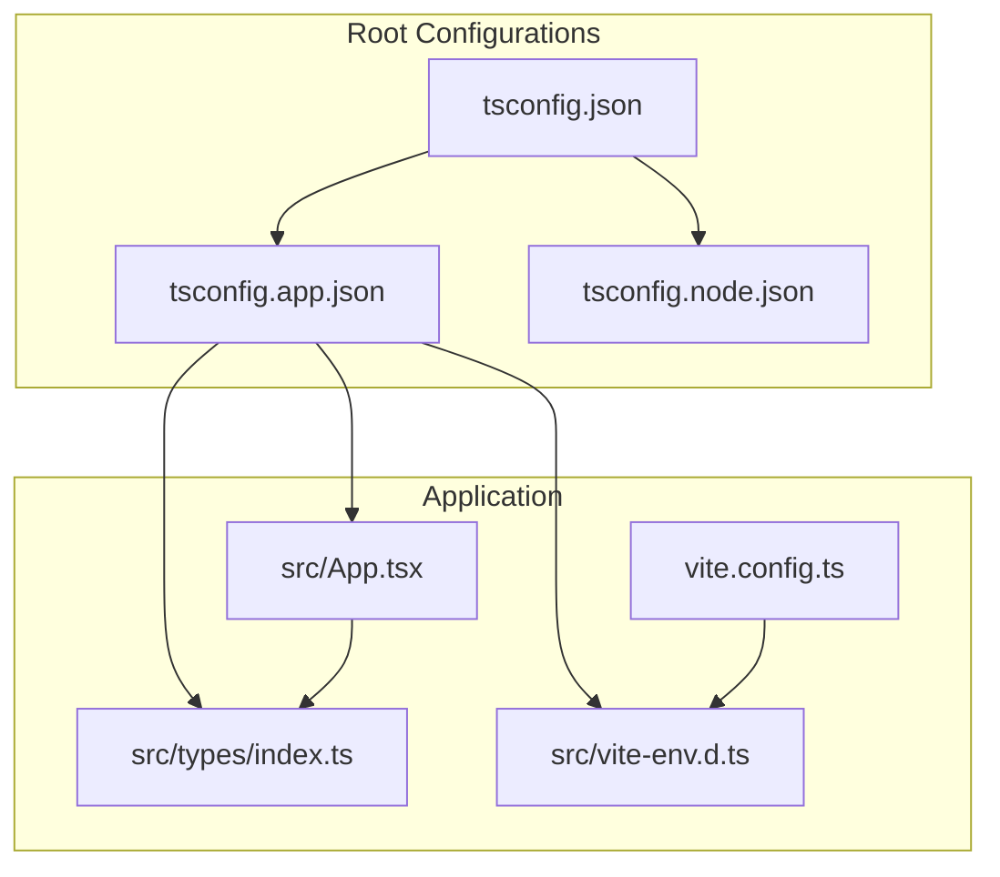
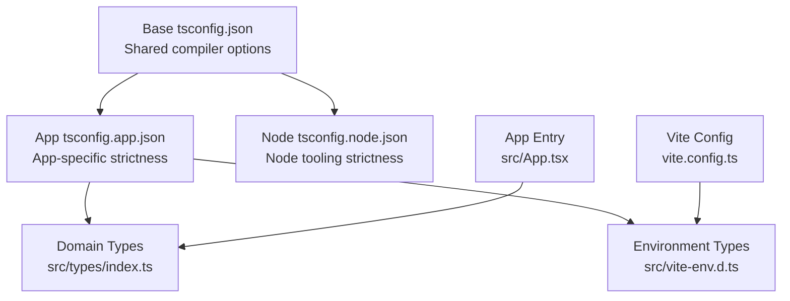
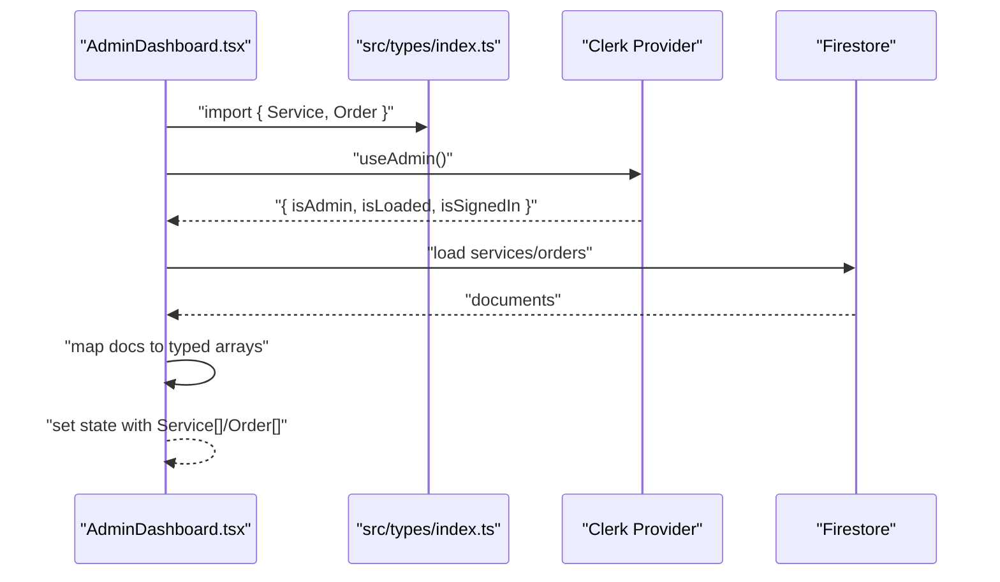
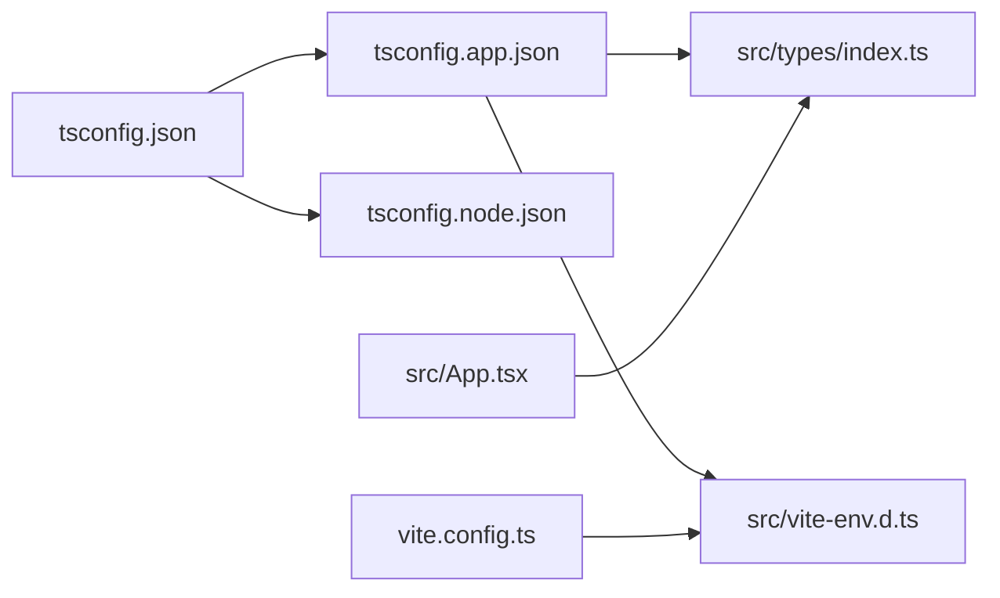

# TypeScript Configuration

<cite>
**Referenced Files in This Document**
- [tsconfig.json](file://tsconfig.json)
- [tsconfig.app.json](file://tsconfig.app.json)
- [tsconfig.node.json](file://tsconfig.node.json)
- [src/types/index.ts](file://src/types/index.ts)
- [src/vite-env.d.ts](file://src/vite-env.d.ts)
- [vite.config.ts](file://vite.config.ts)
- [package.json](file://package.json)
- [src/App.tsx](file://src/App.tsx)
- [src/components/admin/AdminDashboard.tsx](file://src/components/admin/AdminDashboard.tsx)
- [src/components/home/ServicesGrid.tsx](file://src/components/home/ServicesGrid.tsx)
- [src/hooks/useAdmin.ts](file://src/hooks/useAdmin.ts)
</cite>

## Table of Contents
1. [Introduction](#introduction)
2. [Project Structure](#project-structure)
3. [Core Components](#core-components)
4. [Architecture Overview](#architecture-overview)
5. [Detailed Component Analysis](#detailed-component-analysis)
6. [Dependency Analysis](#dependency-analysis)
7. [Performance Considerations](#performance-considerations)
8. [Troubleshooting Guide](#troubleshooting-guide)
9. [Conclusion](#conclusion)

## Introduction
This document explains DevForge’s TypeScript configuration and type safety implementation. It covers the compiler settings, multi-environment configurations (application and Node), environment variable typing via module augmentation, and practical type usage across components. It also provides guidance on extending types, maintaining type safety across component boundaries, avoiding common pitfalls, and optimizing performance for large type systems.

## Project Structure
DevForge uses a dual-configuration approach:
- A base configuration shared across environments
- Environment-specific configurations for the app and Node tooling
- A centralized types index for domain interfaces
- Vite environment declaration for build-time and runtime environment variables

**Diagram sources**
- [tsconfig.json:1-24](file://tsconfig.json#L1-L24)
- [tsconfig.app.json:1-26](file://tsconfig.app.json#L1-L26)
- [tsconfig.node.json:1-25](file://tsconfig.node.json#L1-L25)
- [src/types/index.ts:1-40](file://src/types/index.ts#L1-L40)
- [src/vite-env.d.ts:1-18](file://src/vite-env.d.ts#L1-L18)
- [vite.config.ts:1-22](file://vite.config.ts#L1-L22)
- [src/App.tsx:1-67](file://src/App.tsx#L1-L67)

**Section sources**
- [tsconfig.json:1-24](file://tsconfig.json#L1-L24)
- [tsconfig.app.json:1-26](file://tsconfig.app.json#L1-L26)
- [tsconfig.node.json:1-25](file://tsconfig.node.json#L1-L25)
- [src/types/index.ts:1-40](file://src/types/index.ts#L1-L40)
- [src/vite-env.d.ts:1-18](file://src/vite-env.d.ts#L1-L18)
- [vite.config.ts:1-22](file://vite.config.ts#L1-L22)
- [src/App.tsx:1-67](file://src/App.tsx#L1-L67)

## Core Components
- Compiler options and strictness:
  - Strict type checking is enabled globally.
  - Target environments differ per configuration: ESNext for the base, ES2023 for app and Node configs.
  - Module resolution uses bundler mode for compatibility with modern bundlers.
  - JSX is configured for React with react-jsx.
  - Path aliases are configured via compiler options and Vite.
- Multi-environment configurations:
  - Application config enables lint-like flags for unused locals/parameters and switch coverage checks.
  - Node config targets Node types and aligns with bundler module resolution.
- Centralized type definitions:
  - Domain interfaces for services, orders, and UI card data are defined in a single index file for reuse.
- Environment typing:
  - Vite environment declarations augment ImportMetaEnv with typed keys for Clerk and Firebase configuration.

**Section sources**
- [tsconfig.json:1-24](file://tsconfig.json#L1-L24)
- [tsconfig.app.json:1-26](file://tsconfig.app.json#L1-L26)
- [tsconfig.node.json:1-25](file://tsconfig.node.json#L1-L25)
- [src/types/index.ts:1-40](file://src/types/index.ts#L1-L40)
- [src/vite-env.d.ts:1-18](file://src/vite-env.d.ts#L1-L18)

## Architecture Overview
The TypeScript architecture separates concerns across environments while centralizing domain types and environment typings.

**Diagram sources**
- [tsconfig.json:1-24](file://tsconfig.json#L1-L24)
- [tsconfig.app.json:1-26](file://tsconfig.app.json#L1-L26)
- [tsconfig.node.json:1-25](file://tsconfig.node.json#L1-L25)
- [src/types/index.ts:1-40](file://src/types/index.ts#L1-L40)
- [src/vite-env.d.ts:1-18](file://src/vite-env.d.ts#L1-L18)
- [vite.config.ts:1-22](file://vite.config.ts#L1-L22)
- [src/App.tsx:1-67](file://src/App.tsx#L1-L67)

## Detailed Component Analysis

### TypeScript Compiler Configuration
- Shared base configuration:
  - Targets ES2020, uses DOM and DOM.Iterable libraries, and JSX set to react-jsx.
  - Strict mode is enabled with explicit flags for unused locals/parameters and switch coverage.
  - Path alias @ resolves to ./src for ergonomic imports.
- Application configuration:
  - Targets ES2023, enables bundler module resolution, and includes Vite client types.
  - Enforces stricter unused local/parameter checks and switch coverage.
- Node configuration:
  - Targets ES2023, includes Node types, and mirrors bundler module resolution.
  - Enforces strictness similar to the app config.

**Section sources**
- [tsconfig.json:1-24](file://tsconfig.json#L1-L24)
- [tsconfig.app.json:1-26](file://tsconfig.app.json#L1-L26)
- [tsconfig.node.json:1-25](file://tsconfig.node.json#L1-L25)

### Type Definitions Index
The centralized index defines:
- Service: product/service metadata with categorical and temporal fields.
- Order: order lifecycle with optional file metadata and timestamps.
- ServiceCardData: UI-focused representation of a service for rendering cards.

These types are imported by components and hooks to maintain consistency across the application.

**Section sources**
- [src/types/index.ts:1-40](file://src/types/index.ts#L1-L40)

### Vite Environment Declarations and Module Augmentation
- Environment augmentation:
  - src/vite-env.d.ts augments ImportMetaEnv with typed keys for Clerk and Firebase configuration.
  - This ensures compile-time safety for environment variables accessed via import.meta.env.
- Vite configuration:
  - Aliasing @ to src is declared in vite.config.ts and aligns with tsconfig paths for IDE support and build-time resolution.

**Section sources**
- [src/vite-env.d.ts:1-18](file://src/vite-env.d.ts#L1-L18)
- [vite.config.ts:1-22](file://vite.config.ts#L1-L22)

### Practical Type Usage Across Components
- AdminDashboard:
  - Uses typed imports for Service and Order to ensure Firestore data mapping remains type-safe.
  - Leverages mapped types and indexed access types (e.g., Order['status']) for precise updates.
- ServicesGrid:
  - Uses ServiceCardData to strongly type the static service catalog array and pass data to ServiceCard.
- useAdmin hook:
  - Uses typed user data from Clerk to compute administrative permissions.

**Diagram sources**
- [src/components/admin/AdminDashboard.tsx:1-186](file://src/components/admin/AdminDashboard.tsx#L1-L186)
- [src/types/index.ts:1-40](file://src/types/index.ts#L1-L40)
- [src/hooks/useAdmin.ts:1-14](file://src/hooks/useAdmin.ts#L1-L14)

**Section sources**
- [src/components/admin/AdminDashboard.tsx:1-186](file://src/components/admin/AdminDashboard.tsx#L1-L186)
- [src/components/home/ServicesGrid.tsx:1-167](file://src/components/home/ServicesGrid.tsx#L1-L167)
- [src/hooks/useAdmin.ts:1-14](file://src/hooks/useAdmin.ts#L1-L14)

### Type Inference Strategies and Utility Types
- Indexed access types:
  - Prefer Order['status'] for type-safe updates and enums derived from existing types.
- Mapped types:
  - Use Omit<Service, 'id' | 'createdAt'> to exclude auto-generated fields when creating new records.
- Literal unions:
  - Use 'digital' | 'local' | 'custom' for categories and status enums to constrain values.
- Utility patterns:
  - Define UI-specific data transfer objects (e.g., ServiceCardData) to decouple domain models from presentation.

**Section sources**
- [src/components/admin/AdminDashboard.tsx:54-72](file://src/components/admin/AdminDashboard.tsx#L54-L72)
- [src/types/index.ts:14-27](file://src/types/index.ts#L14-L27)
- [src/types/index.ts:29-39](file://src/types/index.ts#L29-L39)

### Extending Type Definitions and Maintaining Type Safety
- Adding a new domain interface:
  - Define the shape in src/types/index.ts and export it.
  - Import the new type in components that use it.
- Updating environment variables:
  - Add the key to src/vite-env.d.ts and keep the value names aligned with Vite’s import.meta.env usage.
- Component boundary safety:
  - Pass only the subset of fields required by child components (e.g., ServiceCardData) to avoid leaking internal domain details.
  - Use generics sparingly; prefer built-in utility types and mapped types for transformations.

**Section sources**
- [src/types/index.ts:1-40](file://src/types/index.ts#L1-L40)
- [src/vite-env.d.ts:1-18](file://src/vite-env.d.ts#L1-L18)
- [src/components/home/ServicesGrid.tsx:3-3](file://src/components/home/ServicesGrid.tsx#L3-L3)

## Dependency Analysis
The type system depends on:
- Compiler configurations to enable strictness and module resolution.
- Centralized types for domain modeling.
- Environment typings for build-time safety.
- Vite configuration for aliasing and environment exposure.

**Diagram sources**
- [tsconfig.json:1-24](file://tsconfig.json#L1-L24)
- [tsconfig.app.json:1-26](file://tsconfig.app.json#L1-L26)
- [tsconfig.node.json:1-25](file://tsconfig.node.json#L1-L25)
- [src/types/index.ts:1-40](file://src/types/index.ts#L1-L40)
- [src/vite-env.d.ts:1-18](file://src/vite-env.d.ts#L1-L18)
- [vite.config.ts:1-22](file://vite.config.ts#L1-L22)
- [src/App.tsx:1-67](file://src/App.tsx#L1-L67)

**Section sources**
- [tsconfig.json:1-24](file://tsconfig.json#L1-L24)
- [tsconfig.app.json:1-26](file://tsconfig.app.json#L1-L26)
- [tsconfig.node.json:1-25](file://tsconfig.node.json#L1-L25)
- [src/types/index.ts:1-40](file://src/types/index.ts#L1-L40)
- [src/vite-env.d.ts:1-18](file://src/vite-env.d.ts#L1-L18)
- [vite.config.ts:1-22](file://vite.config.ts#L1-L22)
- [src/App.tsx:1-67](file://src/App.tsx#L1-L67)

## Performance Considerations
- Keep type definitions cohesive and focused to reduce recompilation scope.
- Prefer literal unions and indexed access types to avoid bloated conditional types.
- Limit deep generic nesting; favor utility types and mapped types for readability and performance.
- Use verbatimModuleSyntax and bundler module resolution to improve incremental builds and tree-shaking.

## Troubleshooting Guide
- Environment variable access errors:
  - Ensure the key exists in src/vite-env.d.ts and matches the Vite environment variable naming convention.
- Import alias issues:
  - Verify that @ resolves to src in both tsconfig.json and vite.config.ts.
- Strict mode failures:
  - Address unused locals/parameters flagged by tsconfig.app.json and tsconfig.node.json.
- Switch coverage warnings:
  - Add default cases or exhaustive checks for enums and union types.

**Section sources**
- [src/vite-env.d.ts:1-18](file://src/vite-env.d.ts#L1-L18)
- [vite.config.ts:8-12](file://vite.config.ts#L8-L12)
- [tsconfig.app.json:19-22](file://tsconfig.app.json#L19-L22)
- [tsconfig.node.json:18-21](file://tsconfig.node.json#L18-L21)

## Conclusion
DevForge’s TypeScript setup emphasizes strictness, modularity, and environment safety. The base configuration establishes shared compiler options, while environment-specific configurations tailor strictness and module resolution. Centralized domain types and environment typings ensure consistent, safe development across components. Following the extension and maintenance strategies outlined here will help preserve type safety as the project evolves.